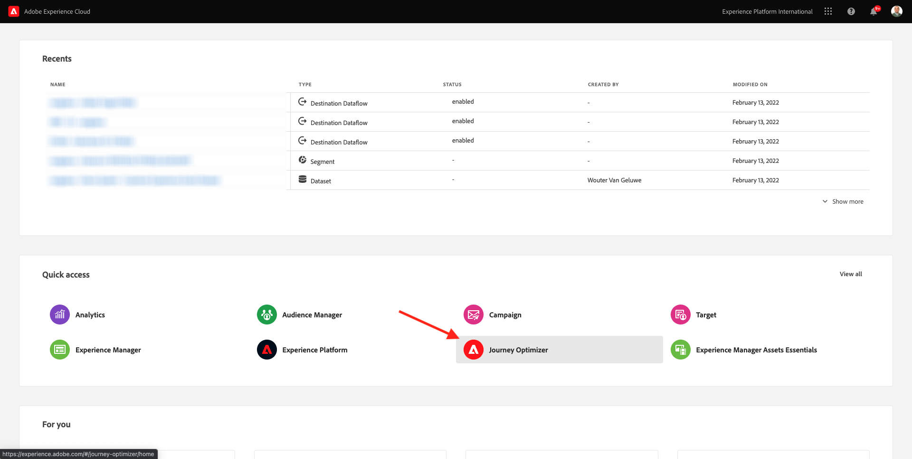
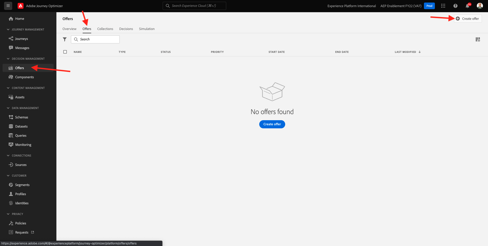
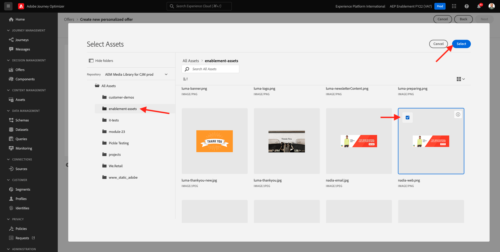
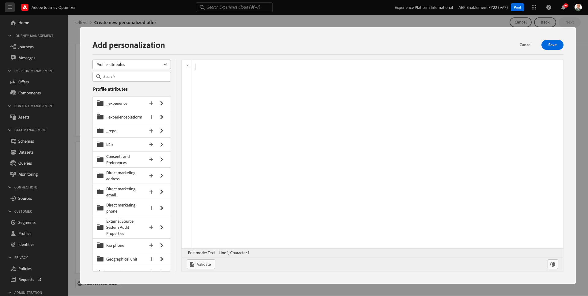
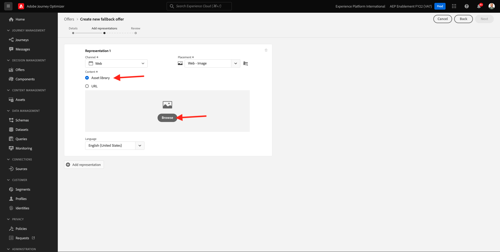
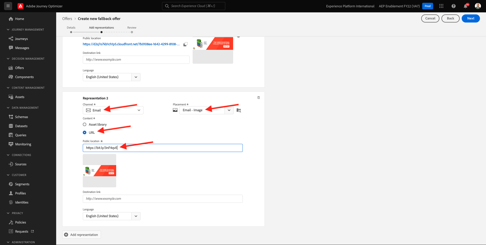
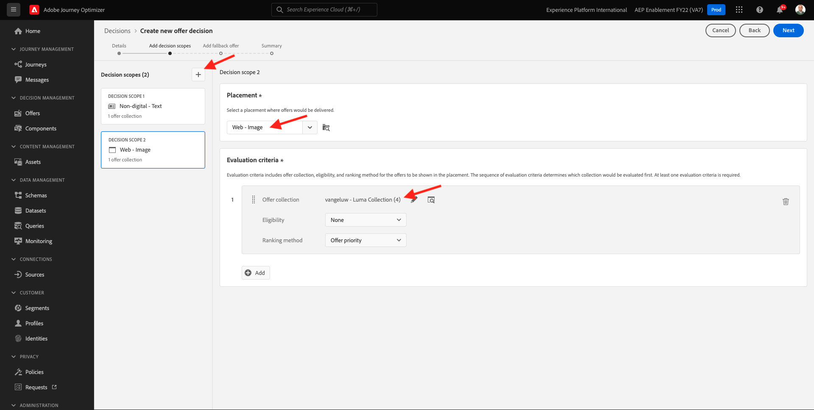
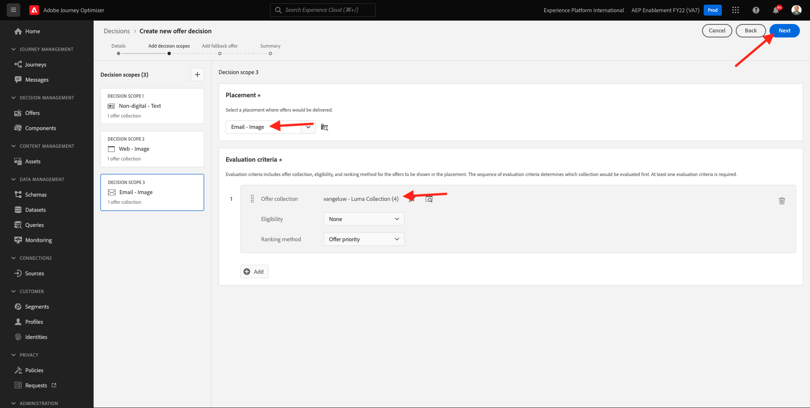
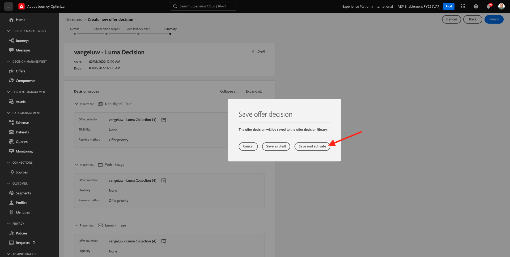
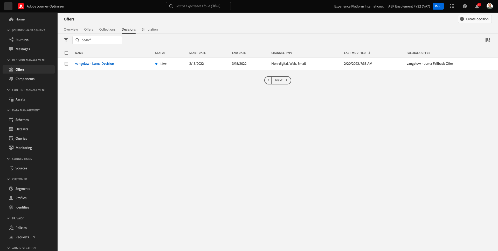

# 9.2 Configureer uw aanbiedingen en besluit

## 9.2.1 Je persoonlijke aanbiedingen maken

In deze oefening, zult u vier creëren **Persoonlijke aanbiedingen**. Hier volgen de details waarmee u rekening moet houden bij het maken van deze aanbiedingen:

| Naam | Datumbereik | Afbeeldingskoppeling voor e-mail | Afbeeldingskoppeling voor web | Tekst | Prioriteit | Subsidiabiliteit | Taal |
|-----|------------|----------------------|--------------------|------|:--------:|--------------|:-------:|
| `--demoProfileLdap-- - Nadia Elements Shell` | vandaag - 1 maand later | https://bit.ly/3nPiwdZ | https://bit.ly/2INwXjt | `{{ profile.person.name.firstName }}, 10% discount on Nadia Elements Shell` | 25 | all - Vrouwelijke klanten | Engels (Verenigde Staten) |
| `--demoProfileLdap-- - Radiant Tee` | vandaag - 1 maand later | https://bit.ly/2HfA17v | https://bit.ly/3pEIdzn | `{{ profile.person.name.firstName }}, 5% discount on Radiant Tee` | 15 | all - Vrouwelijke klanten | Engels (Verenigde Staten) |
| `--demoProfileLdap-- - Zeppelin Yoga Pant` | vandaag - 1 maand later | https://bit.ly/2IOaItW | https://bit.ly/2INZHZd | `{{ profile.person.name.firstName }}, 10% discount on Zeppelin Yoga Pant` | 25 | all - Mannelijke klanten | Engels (Verenigde Staten) |
| `--demoProfileLdap-- - Proteus Fitness Jackshirt` | vandaag - 1 maand later | https://bit.ly/330a43n | https://bit.ly/36USaQW | `{{ profile.person.name.firstName }}, 5% discount on Proteus Fitness Jackshirt` | 15 | all - Mannelijke klanten | Engels (Verenigde Staten) |

{style=&quot;table-layout:auto&quot;}

Aanmelden bij Adobe Journey Optimizer door naar [Adobe Experience Cloud](https://experience.adobe.com). Klikken **Journey Optimizer**.

U wordt omgeleid naar de **Home**  in Journey Optimizer. Eerst, zorg ervoor u de correcte zandbak gebruikt. De sandbox die moet worden gebruikt, wordt `--aepSandboxId--`. Als u van de ene naar de andere sandbox wilt gaan, klikt u op **PRODUCTIEVOORRAAD (VA7)** en selecteert u de sandbox in de lijst. In dit voorbeeld krijgt de sandbox een naam **AEP-activering FY22**. Dan ben je in de **Home** weergave van de sandbox `--aepSandboxId--`.

Klik in het linkermenu op **Aanbiedingen** en ga vervolgens naar **Aanbiedingen**. Klikken **+ Voorstel maken**.

Dan zie je deze popup. Selecteren **Persoonlijk aanbod** en klik op **Volgende**.

Je bent nu op de **Details** weergeven.

In dit geval, moet u de aanbieding vormen `--demoProfileLdap-- - Nadia Elements Shell`. Gebruik de informatie in de bovenstaande tabel om de velden in te vullen. In dit voorbeeld is de naam van de persoonlijke aanbieding **vangeluw - Nadia Elements Shell**. Stel ook de **Begindatum en -tijd** naar gisteren en stel de **Einddatum en -tijd** op een datum in een maand van nu.

Als je klaar bent, moet je dit hebben. Klik op **Next**.

U moet nu **Vertegenwoordigingen**. Vertegenwoordigingen zijn een combinatie van een **Plaatsing** en een echt goed.

Voor **Vertegenwoordiging 1**, selecteer:

- Kanaal: Web
- Plaatsing: Web - Afbeelding
- Inhoud: URL
- Openbare locatie: Kopieer de URL uit de kolom **Afbeeldingskoppeling voor web** in bovenstaande tabel

U kunt ook **Elementenbibliotheek** voor de inhoud en klik vervolgens op **Bladeren**.

Dan ziet u een pop-up van de Bibliotheek van Middelen, ga naar de omslag **vermogensbestanddelen** en selecteer het afbeeldingsbestand **nadia-web.png**. Klik vervolgens op **Selecteren**.

U zult dan dit zien:

Klikken **+ Weergave toevoegen**.

Voor **Vertegenwoordiging 2**, selecteer:

- Kanaal: E-mail
- Plaatsing: E-mail - Afbeelding
- Inhoud: URL
- Openbare locatie: Kopieer de URL uit de kolom **Afbeeldingskoppeling voor e-mail** in bovenstaande tabel

U kunt ook **Elementenbibliotheek** voor de inhoud en klik vervolgens op **Bladeren**.

Dan ziet u een pop-up van de Bibliotheek van Middelen, ga naar de omslag **vermogensbestanddelen** en selecteer het afbeeldingsbestand **nadia-email.png**. Klik vervolgens op **Selecteren**.

U zult dan dit zien:

Klik op Volgende **+ Weergave toevoegen**.

Voor **Vertegenwoordiging 3**, selecteer:

- Kanaal: Niet-digitaal
- Plaatsing: Niet-digitaal - tekst

Vervolgens moet u inhoud toevoegen. In dit geval betekent dit dat de tekst wordt toegevoegd die moet worden gebruikt als een oproep tot actie.

Klikken **Inhoud toevoegen**.

Dan zie je deze popup.

Selecteren **Aangepaste tekst** en vul de volgende velden in:

Kijk naar de **Tekst** in de bovenstaande tabel en voer die tekst hier in, in dit geval: `{{ profile.person.name.firstName }}, 10% discount on Nadia Elements Shell`.

U zult ook opmerken dat u om het even welk profielattribuut kunt selecteren en het als dynamisch gebied in de aanbiedingstekst opnemen. In dit voorbeeld wordt het veld `{{ profile.person.name.firstName }}` zal ervoor zorgen dat de voornaam van de klant die dit aanbod zal ontvangen in de aanbiedingstekst zal worden opgenomen.

Dan zie je dit. Klikken **Opslaan**.

U hebt dit nu. Klik op **Next**.

U zult dan dit zien:

Selecteren **Op regel met vaste beslissing** en klik op de knop **+** pictogram om de regel toe te voegen **all - Vrouwelijke klanten**.

Dan zie je dit. Vul de **Prioriteit** zoals aangegeven in bovenstaande tabel. Klik op **Next**.

U zult dan een overzicht van uw nieuw bekijken **Persoonlijk voorstel**.

Tot slot klikt u op **Opslaan en goedkeuren**.

Je ziet dan dat je nieuwe persoonlijke aanbieding beschikbaar komt in het Overzicht van aanbiedingen:

Herhaal de bovenstaande stappen om de drie andere persoonlijke aanbiedingen voor de producten Radiant Tee, Zeppelin Yoga Pant en Proteus Fitness Jackshirt te maken.

Als u klaar bent, kunt u **Overzichten van voorstellen** scherm voor **Persoonlijke aanbiedingen** moet al je voorstellen weergeven.

## 9.2.2 Je fallback-aanbieding maken

Nadat u vier persoonlijke aanbiedingen hebt gemaakt, moet u nu een **Herkansingsaanbod**.

Zorg ervoor dat je in de **Aanbiedingen** weergave:

Klikken **+ Voorstel maken**.

Dan zie je deze popup. Selecteren **Herkansingsaanbod** en klik op **Volgende**.

U zult dan dit zien:

Voer deze naam in voor je fallback-aanbieding: `--demoProfileLdap-- - Luma Fallback Offer`. Klik op **Next**.

U moet nu **Vertegenwoordigingen**. Vertegenwoordigingen zijn een combinatie van een **Plaatsing** en een echt goed.

Voor **Vertegenwoordiging 1**, selecteer:

- Kanaal: Web
- Plaatsing: Web - Afbeelding
- Inhoud: URL
- Openbare locatie: `https://bit.ly/3nBOt9h`

U kunt ook **Elementenbibliotheek** voor de inhoud en klik vervolgens op **Bladeren**.

Dan ziet u een pop-up van de Bibliotheek van Middelen, ga naar de omslag **vermogensbestanddelen** en selecteer het afbeeldingsbestand **spriteyogastraps-web.png**. Klik vervolgens op **Selecteren**.

U zult dan dit zien:

Voor **Vertegenwoordiging 2**, selecteer:

- Kanaal: E-mail
- Plaatsing: E-mail - Afbeelding
- Inhoud: URL
- Openbare locatie: `https://bit.ly/3nF4qvE`

U kunt ook **Elementenbibliotheek** voor de inhoud en klik vervolgens op **Bladeren**.

Dan ziet u een pop-up van de Bibliotheek van Middelen, ga naar de omslag **vermogensbestanddelen** en selecteer het afbeeldingsbestand **spriteyogastraps-email.png**. Klik vervolgens op **Selecteren**.

U zult dan dit zien:

Klik op Volgende **+ Weergave toevoegen**.

Voor **Vertegenwoordiging 3**, selecteer:

- Kanaal: Niet-digitaal
- Plaatsing: Niet-digitaal - tekst

Vervolgens moet u inhoud toevoegen. In dit geval betekent dat het toevoegen van de Verbinding van het Beeld.

Klikken **Inhoud toevoegen**.

Dan zie je deze popup.

Selecteren **Aangepaste tekst** en vul de volgende velden in:

Voer de tekst in `{{ profile.person.name.firstName }}, discover our Sprite Yoga Straps!` en klik op **Opslaan**.

Dan zie je dit. Klik op **Next**.

U zult dan een overzicht van uw nieuw bekijken **Herkansingsaanbod**. Klikken **Voltooien**.

Tot slot klikt u op **Opslaan en goedkeuren**.

In uw **Overzichten van voorstellen** scherm, zult u dit nu zien:

## 9.2.3 Uw verzameling maken

Een verzameling wordt gebruikt voor **filter** een deel van de aanbiedingen uit de lijst met gepersonaliseerde aanbiedingen en gebruik dat als onderdeel van een besluit om het besluitvormingsproces te versnellen.

Ga naar **Verzamelingen**. Klikken **+ Verzameling maken**.

Dan zie je deze popup. Configureer uw verzameling op deze manier. Klik op **Next**.

- Naam verzameling: gebruiken `--demoProfileLdap-- - Luma Collection`
- Selecteren **Statische verzameling maken**.

Selecteer in het volgende scherm de vier **Persoonlijke aanbiedingen** u in de vorige oefening creeerde. Klikken **Opslaan**.

U ziet nu het volgende:

## 9.2.4 Maak uw beslissing

In een besluit worden Plaatsingen, een collectie persoonlijke aanbiedingen en een terugvalaanbieding gecombineerd die uiteindelijk door de Offer decisioning-engine worden gebruikt om de beste aanbieding voor een specifiek profiel te vinden, op basis van elk van de individuele kenmerken van de gepersonaliseerde aanbieding, zoals prioriteit, geschiktheidsbeperking en totale/gebruikersbeperking.

Om uw te vormen **Besluit**, ga naar **Besluiten**. Klikken **+ Activiteit maken**.

U zult dan dit zien:

Vul de velden zo in. Klik op **Next**.

- Naam: `--demoProfileLdap-- - Luma Decision`
- Begindatum en -tijd: gisteren
- Einddatum en -tijd: vandaag + 1 maand

In het volgende scherm, moet u plaatsingen in besluitvormingswerkingsgebied toevoegen. U zult beslissingswerkingsgebieden voor de plaatsen moeten tot stand brengen **Web - Afbeelding**, **E-mail - Afbeelding** en **Niet-digitaal - tekst**.

Ten eerste moet de beslissingsruimte worden gecreëerd voor **Niet-digitaal - tekst** door die plaatsing in dropdown te selecteren. Klik vervolgens op de knop **Toevoegen** om evaluatiecriteria toe te voegen.

Selecteer uw verzameling `--demoProfileLdap-- - Luma Collection` en klik op **Toevoegen**.

Dan zie je dit. Klik op de knop **-** om een nieuw beslissingsbereik toe te voegen.

Selecteer de plaatsing **Web - Afbeelding** en voeg uw verzameling toe `--demoProfileLdap-- - Luma Collection` volgens evaluatiecriteria. Klik vervolgens op de knop **+** nogmaals om een nieuw beslissingsbereik toe te voegen.

Selecteer de plaatsing **E-mail - Afbeelding** en voeg uw verzameling toe `--demoProfileLdap-- - Luma Collection` volgens evaluatiecriteria. Klik vervolgens op **Volgende**.

U moet nu uw **Herkansingsaanbod**, die `--demoProfileLdap-- - Luma Fallback Offer`. Klik op **Next**.

Controleer uw beslissing. Klikken **Voltooien**.

Klik in de pop-up op **Opslaan en activeren**.

Tot slot zie je nu je beslissing in het overzicht:

U hebt nu met succes uw besluit gevormd. Uw besluit is nu live en kan worden gebruikt om uw klanten in real-time geoptimaliseerde en gepersonaliseerde aanbiedingen te bieden.

Volgende stap: [9.3 Bereid uw bezit van de Cliënt van de Inzameling van Gegevens en de opstelling van SDK van het Web voor Offer decisioning voor](./ex3.md)

[Ga terug naar module 9](./offer-decisioning.md)

[Terug naar alle modules](./../../overview.md)
