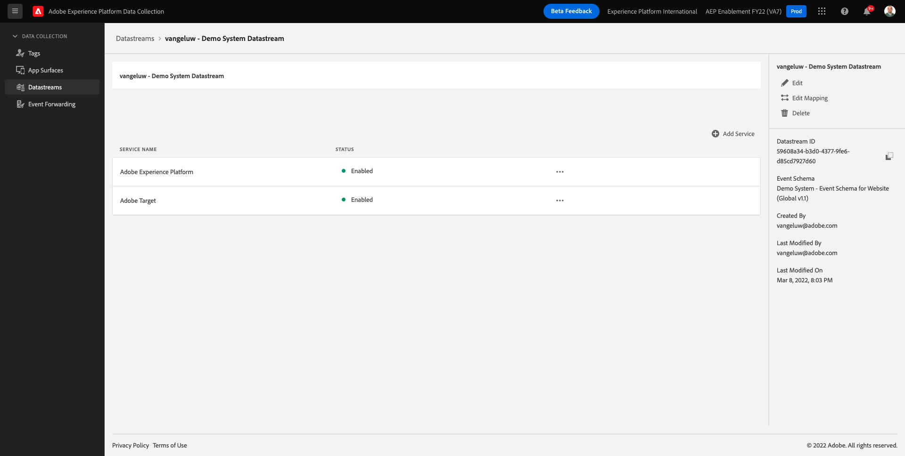
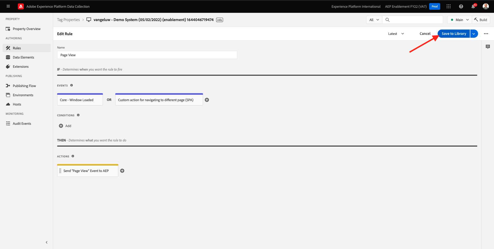
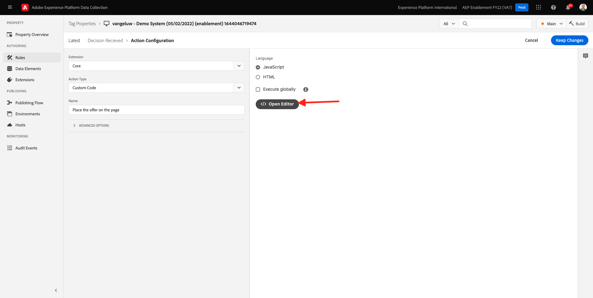

# 9.3 Bereid uw bezit van de Cliënt van de Gegevensverzameling van Adobe Experience Platform en de opstelling van SDK van het Web voor Offer decisioning voor

>[!NOTE]
>
>Het gebruik van Offer decisioning in de SDK van het Web van Adobe Experience Platform is momenteel beschikbaar in vroege toegang om gebruikers te selecteren. Deze functionaliteit is niet beschikbaar voor alle IMS-organisaties.

## 9.3.1 De gegevensstroom bijwerken

In [Oefening 0.2](./../../modules/module0/ex2.md), hebt u uw eigen **[!UICONTROL DataStream]**. Vervolgens hebt u de naam gebruikt `--demoProfileLdap-- - Demo System Datastream`.

In deze oefening, moet u dat vormen **[!UICONTROL DataStream]** werken met **[!DNL Offer Decisioning]**.

Ga om dat te doen naar [https://experience.adobe.com/#/data-collection/](https://experience.adobe.com/#/data-collection/). Dan zie je dit. Klikken **[!UICONTROL DataStreams]** of **[!UICONTROL Gegevensstromen (bèta)]**.

Selecteer in de rechterbovenhoek van het scherm de naam van de sandbox die u wilt instellen als `--aepSandboxId--`.


Zoeken naar uw **[!UICONTROL DataStream]**, die `--demoProfileLdap-- - Demo System Datastream`. Klik op **[!UICONTROL DataStream]** om het te openen.


Dan zie je dit. Klikken **...** naast **Adobe Experience Platform** en klik vervolgens op **Bewerken**.


Inschakelen **[!DNL Offer Decisioning]**, schakelt u het selectievakje in voor **[!DNL Offer Decisioning]**. Klikken **Opslaan**.


Uw **[!UICONTROL DataStream]** is nu klaar om mee te werken **[!DNL Offer Decisioning]**.



## 9.3.2 Configureer uw Adobe Experience Platform Data Collection Client-eigenschap om persoonlijke aanbiedingen aan te vragen

Ga naar [https://experience.adobe.com/#/data-collection/](https://experience.adobe.com/#/data-collection/), naar **[!UICONTROL Client]**. Zoek naar uw eigenschappen van de Inzameling van Gegevens, die worden genoemd `--demoProfileLdap-- - Demo System (DD/MM/YYYY)`. Open de de cliëntbezit van de Inzameling van Gegevens voor Web.


Ga in uw eigenschap naar **[!UICONTROL Regels]** en open de regel **[!UICONTROL Paginaweergave]**.


Klik om het dialoogvenster [!UICONTROL Handeling] **[!UICONTROL AEP Web SDK - Gebeurtenis verzenden]**.


Dan zie je dit. De menuoptie voor **[!UICONTROL Beslissingsgebieden]**.


Voor elke aanvraag die naar Edge en Adobe Experience Platform wordt verzonden, is het mogelijk een of meer **[!UICONTROL Beslissingsgebieden]**. A **[!UICONTROL Toepassingsgebied van besluit]** is een combinatie van twee elementen:

- [!UICONTROL Besluit-id]
- [!UICONTROL Plaatsing-id]

Laten we eerst eens kijken waar je die twee elementen kunt vinden.

### 9.3.2.1 Haal uw [!UICONTROL Plaatsing-id]

De [!UICONTROL Plaatsing-id] geeft de locatie en het type van het vereiste element aan. De hoofdafbeelding op de homepage van de Luma-website komt bijvoorbeeld overeen met de [!UICONTROL Plaatsing-id] for [!UICONTROL Web - Afbeelding].

>[!NOTE]
>
>Als onderdeel van module 6 hebt u al een Adobe Target Experience Targeting-activiteit geconfigureerd waarmee het beeld van de hoofdlocatie op de startpagina wordt gewijzigd, zoals u kunt zien in de schermafbeelding. Omwille van de oefening gaat u nu uw aanbiedingen op de afbeelding weergeven onder de hoofdafbeelding zoals die in de schermafbeelding is aangegeven.


Als u de [!UICONTROL Plaatsing-id] for [!UICONTROL Web - Afbeelding] Ga naar Adobe Journey Optimizer door naar [Adobe Experience Cloud](https://experience.adobe.com). Klikken **Journey Optimizer**.


U wordt omgeleid naar de **Home**  in Journey Optimizer. Eerst, zorg ervoor u de correcte zandbak gebruikt. De sandbox die moet worden gebruikt, wordt `--aepSandboxId--`. Als u van de ene naar de andere sandbox wilt gaan, klikt u op **PRODUCTIEVOORRAAD (VA7)** en selecteert u de sandbox in de lijst. In dit voorbeeld krijgt de sandbox een naam **AEP-activering FY22**. Dan ben je in de **Home** weergave van de sandbox `--aepSandboxId--`.


Ga vervolgens naar [!UICONTROL Componenten] en vervolgens naar [!UICONTROL Plaatsen]. Klik op de knop [!UICONTROL Web - Afbeelding] de plaatsing om zijn details te zien.


Zoals u in de bovenstaande afbeelding kunt zien, wordt in dit voorbeeld [!UICONTROL Plaatsing-id] is `xcore:offer-placement:14bf09dc4190ebba`. Schrijf de [!UICONTROL Plaatsing-id] voor uw plaatsing voor [!UICONTROL Web - Afbeelding] zoals u het in de volgende oefening zult nodig hebben.

### 9.3.2.2 Haal uw [!UICONTROL Besluit-id]

De [!UICONTROL Besluit-id] Hiermee kunt u aangeven welke combinatie van persoonlijke aanbiedingen en alternatieve aanbiedingen u wilt gebruiken. In de vorige oefening creeerde u uw eigen [!UICONTROL Besluit] en noemde het `--demoProfileLdap-- - Luma Decision`.

Als u de [!UICONTROL Besluit-id] voor uw `--demoProfileLdap-- - Luma Decision`, ga naar [https://platform.adobe.com](https://platform.adobe.com).

Ga vervolgens naar [!UICONTROL Aanbiedingen] en ga vervolgens naar [!UICONTROL Besluiten]. Klik om uw [!UICONTROL Besluit], die `--demoProfileLdap-- - Luma Decision`.


Zoals u in de bovenstaande afbeelding kunt zien, wordt in dit voorbeeld [!UICONTROL Besluit-id] is `xcore:offer-activity:14c052382e1b6505`. Schrijf de [!UICONTROL Besluit-id] voor uw beslissing `--demoProfileLdap-- - Luma Decision` zoals u het in de volgende oefening zult nodig hebben.

Nu u de twee elementen hebt teruggewonnen u moet creëren **[!UICONTROL Beslissingsgebieden]**, kunt u doorgaan met de volgende stap, waarbij het beslissingsbereik wordt gecodeerd.

### 9.3.2.3 BASE64-codering

De **[!UICONTROL Toepassingsgebied van besluit]** u moet ingaan is een BASE64-Gecodeerde koord. Deze BASE64-gecodeerde tekenreeks is een combinatie van de [!UICONTROL Plaatsing-id] en de [!UICONTROL Besluit-id], zoals hieronder te zien is.

```json
{
  "activityId":"xcore:offer-activity:14c052382e1b6505",
  "placementId":"xcore:offer-placement:14bf09dc4190ebba"
}
```

De **[!UICONTROL Toepassingsgebied van besluit]** kan op twee manieren worden gegenereerd:

- Een openbare dienst gebruiken als [https://www.base64encode.org/](https://www.base64encode.org/). Voer de JSON-code in zoals hierboven vermeld, klik op **[!UICONTROL Coderen]** en je krijgt hieronder je BASE64 gecodeerde string.

   

- Haal de met BASE64 gecodeerde tekenreeks op uit Adobe Experience Platform. Ga naar [!UICONTROL Besluiten] en klik om uw [!UICONTROL Besluit], die `--demoProfileLdap-- - Luma Decision`.

   

   Na openen `--demoProfileLdap-- - Luma Decision`Je zult dit zien. De plaatsing zoeken [!UICONTROL Web - Afbeelding] en klik op de knop **[!UICONTROL Kopiëren]** knop. Klik op Volgende **[!UICONTROL Gecodeerde beslissingsreikwijdte]**. De **[!UICONTROL Toepassingsgebied van besluit]** wordt nu gekopieerd naar het klembord.

   

Ga vervolgens terug naar Starten, naar uw handeling **[!UICONTROL AEP Web SDK - Gebeurtenis verzenden]**.


Plak het gecodeerde beslissingsbereik in het invoerveld.


Wijzigingen opslaan in de handeling **[!UICONTROL AEP Web SDK - Gebeurtenis verzenden]** door te klikken **[!UICONTROL Wijzigingen behouden]**.


Klik op Volgende **[!UICONTROL Opslaan]** of **[!UICONTROL Opslaan in bibliotheek]**



Ga in Adobe Experience Platform-gegevensverzameling naar **[!UICONTROL Publishing Flow]** en open uw **[!UICONTROL Ontwikkelingsbibliotheek]** met de naam **[!UICONTROL Hoofd]**. Klikken **[!UICONTROL + Alle gewijzigde bronnen toevoegen]** en klik vervolgens op **[!UICONTROL Opslaan en bouwen voor ontwikkeling]**. Uw wijzigingen worden nu gepubliceerd naar uw demo-website.


Elke keer dat u een **Algemene pagina** nu zal Offer decisioning , net als de homepage van de demo - website , beoordelen wat het aanbod van toepassing is en een reactie terugsturen naar de website met de details van het aanbod dat moet worden getoond . Als u het voorstel op de website wilt weergeven, hebt u een extra configuratie nodig, die u in de volgende stap uitvoert.

## 9.3.3 Configureer uw Adobe Experience Platform Data Collection Client-eigenschap om persoonlijke aanbiedingen te ontvangen en toe te passen

Ga naar [https://experience.adobe.com/#/data-collection/](https://experience.adobe.com/#/data-collection/), naar **[!UICONTROL Eigenschappen]**. Zoek naar uw eigenschappen van de Inzameling van Gegevens, die worden genoemd `--demoProfileLdap-- - Demo System (DD/MM/YYYY)`. Open de eigenschap Gegevensverzameling voor het web.


Ga in uw eigenschap naar **[!UICONTROL Regels]**.


De regel zoeken en openen **Beslissing ontvangen**.


Dan zie je dit. De handeling openen **Het voorstel op de pagina plaatsen**.


Klikken **[!UICONTROL Editor openen]**



Overschrijf de code door de onderstaande code in de editor te plakken.

```javascript
if(!Array.isArray(event.decisions)) {
  console.log('No decisions returned')
  return;
}
console.log("decision",event.decisions)

event.decisions.forEach(function(payload) {
  payload.items.forEach(function(item){
    console.log("Response from Offer Decisioning ", item.data.content);
   
    var element = document.querySelector("#root > div > div > div.app-content > div > section.feature_part.padding_top > div > div.row.align-items-center.justify-content-between > div.col-lg-7.col-sm-6.\\30  > div");
    if(!element){
      console.log("Offer Placement Area Selector not found")
      return;
    }
    if(!item.data){
      return
    }
    //check if offer already exists
    var offer = document.querySelector("#root > div > div > div.app-content > div > section.feature_part.padding_top > div > div.row.align-items-center.justify-content-between > div.col-lg-7.col-sm-6.\\30  > div");
    if(!offer){ 
      element.insertAdjacentHTML('afterbegin', item.data.content) 
    }
    else { 
      console.log("item.data.deliveryURL: " + item.data.deliveryURL)
      document.querySelector("#root > div > div > div.app-content > div > section.feature_part.padding_top > div > div.row.align-items-center.justify-content-between > div.col-lg-7.col-sm-6.\\30  > div").style.background="url('"+item.data.deliveryURL+"')";
      document.querySelector("#root > div > div > div.app-content > div > section.feature_part.padding_top > div > div.row.align-items-center.justify-content-between > div.col-lg-7.col-sm-6.\\30  > div").style.backgroundRepeat="no-repeat";
      document.querySelector("#root > div > div > div.app-content > div > section.feature_part.padding_top > div > div.row.align-items-center.justify-content-between > div.col-lg-7.col-sm-6.\\30  > div").style.backgroundPosition="center center";
      document.querySelector("#root > div > div > div.app-content > div > section.feature_part.padding_top > div > div.row.align-items-center.justify-content-between > div.col-lg-7.col-sm-6.\\30  > div").style.backgroundSize = "contain";
    }  
  })
});
```

Regels 26-27-28-29 passen de afbeelding die door de Offer decisioning wordt geretourneerd, toe op de website. Klikken **[!UICONTROL Opslaan]**.


Klikken **[!UICONTROL Wijzigingen behouden]**.


Klik op Volgende **[!UICONTROL Opslaan]** of **[!UICONTROL Opslaan in bibliotheek]**


Ga in Adobe Experience Platform-gegevensverzameling naar **[!UICONTROL Publishing Flow]** en open uw **[!UICONTROL Ontwikkelingsbibliotheek]** met de naam **[!UICONTROL Hoofd]**. Klikken **[!UICONTROL + Alle gewijzigde bronnen toevoegen]** en klik vervolgens op **[!UICONTROL Opslaan en bouwen voor ontwikkeling]**. Uw wijzigingen worden nu gepubliceerd naar uw demo-website.


Met deze verandering, zal deze regel in de Inzameling van Gegevens van Adobe Experience Platform nu naar de reactie van Offer decisioning luisteren die deel van de reactie van SDK van het Web uitmaakt, en wanneer de reactie wordt ontvangen, zal het beeld van de aanbieding op de homepage worden getoond.

Als u de demo-website bekijkt, ziet u dat deze afbeelding nu wordt vervangen:

>[!NOTE]
>
>Als onderdeel van module 6 hebt u al een Adobe Target Experience Targeting-activiteit geconfigureerd waarmee het beeld van de hoofdlocatie op de startpagina wordt gewijzigd, zoals u kunt zien in de schermafbeelding. Omwille van de oefening gaat u nu uw aanbiedingen op de afbeelding weergeven onder de hoofdafbeelding zoals die in de schermafbeelding is aangegeven.


En in plaats van de standaard Luma-websitemateriaal ziet u nu een aanbieding als deze. In dit geval wordt de fallback-aanbieding weergegeven.


U hebt nu twee soorten personalisatie geconfigureerd:

- 1 Ervaring gerichte activiteit met Adobe Target in Module 6
- 1 implementatie van de Offer decisioning die uw bezit van de Inzameling van Gegevens gebruikt

In de volgende oefening zult u zien hoe u uw aanbiedingen en besluiten kunt combineren die in Adobe Journey Optimizer met een de Ervaring van Adobe Target gerichte activiteit werden gecreeerd.

Volgende stap: [9.4 Combineer Adobe Target en Offer decisioning](./ex4.md)

[Ga terug naar module 9](./offer-decisioning.md)

[Terug naar alle modules](./../../overview.md)
