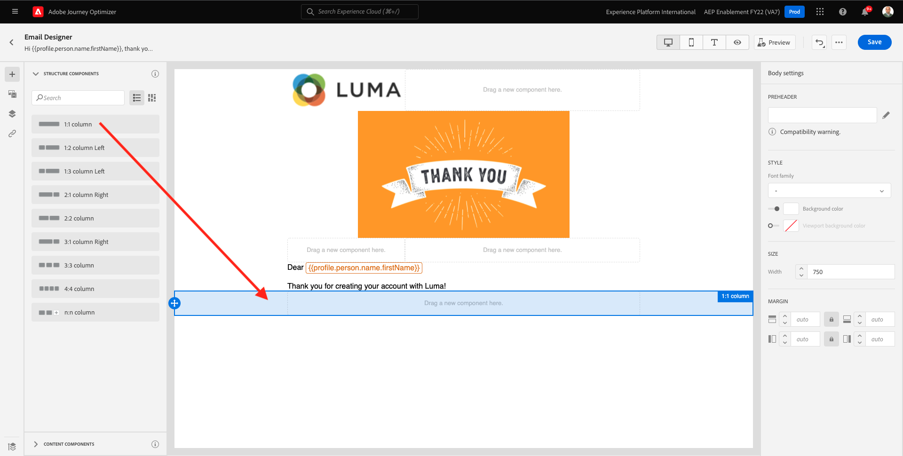
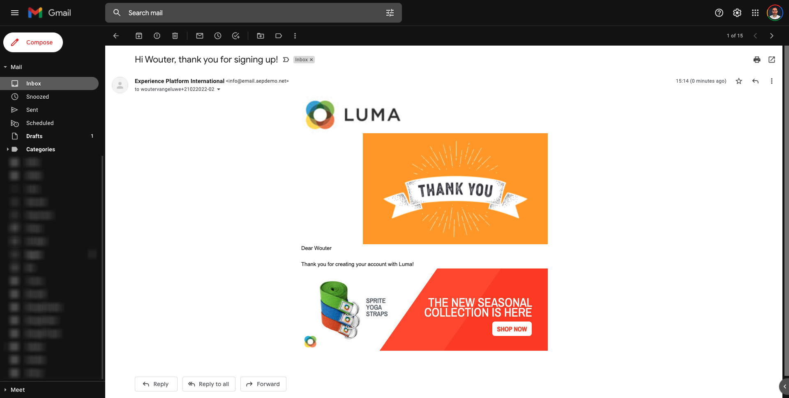

# 9.5 Gebruik uw beslissing in een e-mail

In deze oefening, zult u uw besluit gebruiken om de levering van e-mail en SMS te personaliseren.

Ga naar **Reizen**. Zoek de reis die u hebt gemaakt in oefening 7.2, die een naam heeft gekregen `--demoProfileLdap-- - Account Creation Journey`. Klik op uw reis om deze te openen.

Dan zie je dit. Klikken **Een nieuwe versie maken**.

Klikken **Een nieuwe versie maken**.

Klik op de knop **E-mail** handeling en klik vervolgens op **Inhoud bewerken**.

U zult dan het berichtdashboard zien. Klikken **E-mailontwerper**.

Dan zie je dit.

Dan zie je dit. Sleep een nieuwe **1:1, kolom** structuurcomponent op het canvas.

Ga in het menu naar **Inhoudscomponenten**. Selecteer **Offertebeslissing** en deze component naar de inhoud van de e-mail slepen en neerzetten, biedt plaatsaanduiding zoals aangegeven. Klik vervolgens op **Toevoegen**.

Selecteer het type plaatsing dat u in de e-mail wilt opnemen. In de **Plaatsen** vervolgkeuzemenu selecteren **E-mail - Afbeelding** selecteert u vervolgens uw beslissing `--demoProfileLdap-- - Luma Decision`. Klikken **Toevoegen**.

U ziet nu alle persoonlijke aanbiedingen en de fallback-aanbieding die in de e-mailontwerper worden weergegeven. Klikken  **Inhoud simuleren** om een voorbeeld van het e-mailbericht weer te geven met een echt klantprofiel.

Geef eerst aan welk profiel u voor de voorvertoning wilt gebruiken. Selecteer **email** naamruimte en voer het e-mailadres in van een klantprofiel dat u op de demo-website hebt gemaakt. Klik op Volgende **Voorvertoning**.

Klik op de knop **Sluiten** knop.

Tot slot klikt u op **Opslaan**.

Klik nu op de pijl om terug te gaan naar het vorige scherm.

Dan zie je dit. Klik op de pijl in de linkerbovenhoek om terug te gaan naar uw reis.

Klikken **OK** om uw **E-mail** handeling.

Klikken **Publiceren** om uw bijgewerkte reis te publiceren.

Bevestigen door te klikken **Publiceren** opnieuw.

Uw bericht is nu gepubliceerd.

Wanneer u een nieuwe account maakt op de demo-website, ontvangt u nu deze e-mail:

U hebt deze oefening voltooid.

Volgende stap: [9.6 Test uw besluit met behulp van de API](./ex6.md)

[Ga terug naar module 9](./offer-decisioning.md)

[Terug naar alle modules](./../../overview.md)
