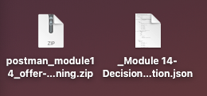
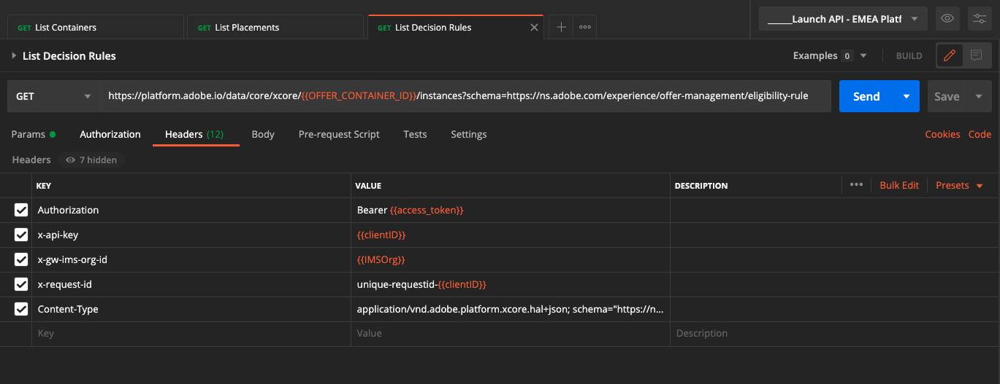
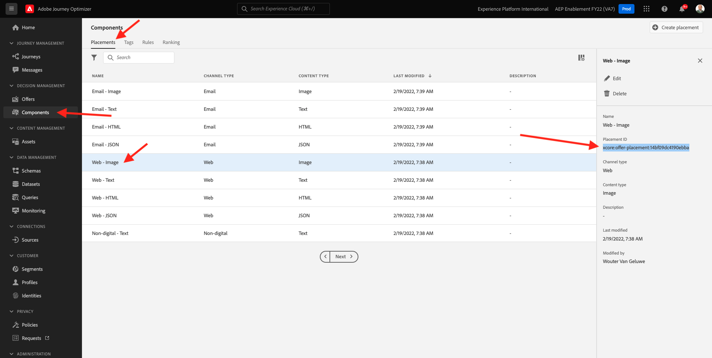

# 9.6 Test uw beslissing met behulp van de API

## 9.6.1 Werken met de Offer decisioning-API met Postman

Downloaden [deze Postman-verzameling voor Offer decisioning](./../../assets/postman/postman_offer-decisioning.zip) op uw bureaublad en decomprimeer het. Dan heb je het volgende:

Dit bestand staat nu op uw bureaublad:

- [!UICONTROL _Module 14 - De Beslissende Dienst.postman_collection.json]

In [Oefening 3.3.3 - Postman-verificatie aan Adobe I/O](./../../modules/module3/ex3.md) u hebt Postman geïnstalleerd. U moet Postman opnieuw gebruiken voor deze oefening.

Open Postman. Klikken **[!UICONTROL Importeren]**.

Klikken op **[!UICONTROL Bestanden uploaden]**.

Selecteer het bestand **[!UICONTROL _Module 14 - De Beslissende Dienst.postman_collection.json]** en klik op **[!UICONTROL Openen]**.

Deze verzameling is dan beschikbaar in Postman.

U hebt nu alles wat u nodig hebt in Postman om te gaan communiceren met Adobe Experience Platform via de API&#39;s.

### 9.6.1.1 Containers met lijst

Klik om het verzoek te openen **[!UICONTROL GET - Containers weergeven]**.

Onder **[!UICONTROL Params]** U ziet het volgende:

- eigenschap: `_instance.parentName==aepenablementfy22`

In die parameter **[!UICONTROL aepenablementfy22]** is de naam van de sandbox die in Adobe Experience Platform wordt gebruikt. De sandbox die u moet gebruiken, is `--aepSandboxId--`. De tekst vervangen **[!UICONTROL aepenablementfy22]** door `--aepSandboxId--`.

Nadat u de naam van de sandbox hebt vervangen, klikt u op **[!UICONTROL Verzenden]**.

Dit is de reactie, die de aanbiedingscontainer voor de zandbak toont die u specificeerde. Kopieer de **[!UICONTROL container instanceId]** zoals hieronder vermeld en noteer het in een tekstbestand op uw computer. U moet deze **[!UICONTROL container instanceId]** voor de volgende oefening!

### 9.6.1.2 Lijstplaatsen

Klik om het verzoek te openen **[!UICONTROL GET - Lijstplaatsen]**. Klikken **[!UICONTROL Verzenden]**.

U ziet nu alle beschikbare plaatsingen in uw aanbiedingscontainer. De plaatsingen die je ziet, zijn gedefinieerd in de gebruikersinterface van Adobe Experience Platform, zoals je kunt zien in [Oefening 9.1.3](./ex1.md).

### 9.6.1.3 Regels voor het lijstbesluit

Klik om het verzoek te openen **[!UICONTROL GET - Regels voor een besluit over een lijst]**. Klikken **[!UICONTROL Verzenden]**.

In de reactie, zult u de Regels van het Besluit zien die u in Adobe Experience Platform UI, zoals u kon zien in [Oefening 9.1.4](./ex1.md).

### 9.6.1.4 Aangepaste aanbiedingen aanbieden

Klik om het verzoek te openen **[!UICONTROL GET - Aangepaste voorstellen aanbieden]**. Klikken **[!UICONTROL Verzenden]**.

In het antwoord ziet u de persoonlijke aanbiedingen die u in de gebruikersinterface van Adobe Experience Platform hebt gedefinieerd in [Oefening 9.2.1](./ex2.md).

### 9.6.1.5 Aanbiedingen voor lijstalternatieven

Klik om het verzoek te openen **[!UICONTROL GET - voorstellen voor alternatieven aanbieden]**. Klikken **[!UICONTROL Verzenden]**.

In het antwoord ziet u de functie voor het terugvallen van bestanden die u in de gebruikersinterface van Adobe Experience Platform hebt gedefinieerd in [Oefening 9.2.2](./ex2.md).

### 9.6.1.6 Lijstverzamelingen

Klik om het verzoek te openen **[!UICONTROL GET - Verzamelingen weergeven]**.

In de reactie, zult u de Inzameling zien die u in Adobe Experience Platform UI binnen bepaalde [Oefening 9.2.3](./ex2.md).

### 9.6.1.7 Gedetailleerde aanbiedingen voor klantprofiel ophalen

Klik om het verzoek te openen **[!UICONTROL POST - Gedetailleerde aanbiedingen voor klantprofiel ophalen]**. Dit verzoek is vergelijkbaar met het vorige verzoek, maar retourneert details zoals afbeeldings-URL&#39;s, tekst enzovoort.

Voor dit verzoek, vergelijkbaar met de vorige oefening die gelijkaardige vereisten heeft, moet u de waarden verstrekken voor **[!UICONTROL xdm:placementId]** en **[!UICONTROL xdm:activityId]** om de specifieke aanbiedingsdetails voor een klant terug te winnen.

Het veld **[!UICONTROL xdm:activityId]** moet worden ingevuld. U kunt dat ophalen in de gebruikersinterface van Adobe Experience Platform, zoals hieronder aangegeven.

Het veld **[!UICONTROL xdm:placementId]** moet worden ingevuld. U kunt dat ophalen in de gebruikersinterface van Adobe Experience Platform, zoals hieronder aangegeven. In het onderstaande voorbeeld ziet u de placementId voor de plaatsing **[!UICONTROL Web - Afbeelding]**.

Ga naar **[!UICONTROL Lichaam]** en voer het e-mailadres in van de klant voor wie u een aanbieding wilt aanvragen. Klikken **[!UICONTROL Verzenden]**.

Tot slot zult u dan het resultaat zien van welk soort gepersonaliseerde aanbieding en welke activa aan deze klant moeten worden getoond.

Je hebt deze oefening nu voltooid.

Volgende stap: [Samenvatting en voordelen](./summary.md)

[Ga terug naar module 9](./offer-decisioning.md)

[Terug naar alle modules](./../../overview.md)
