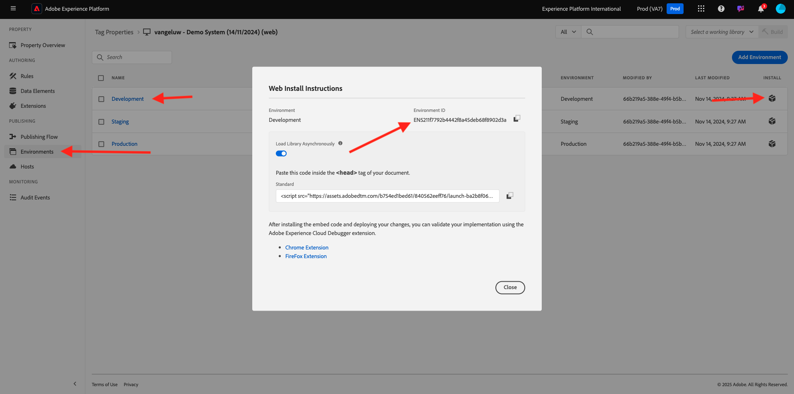
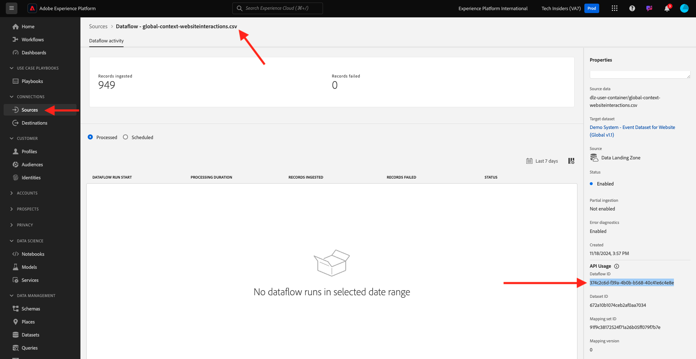
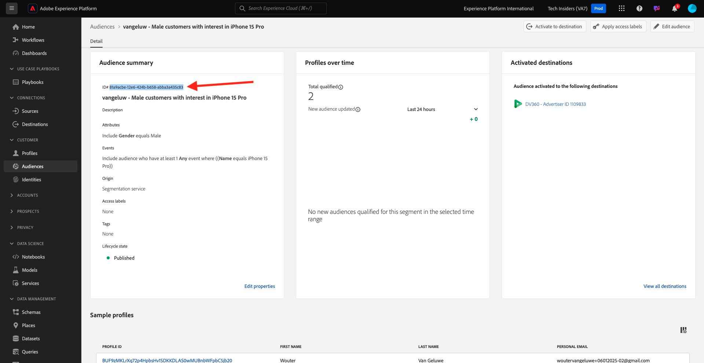
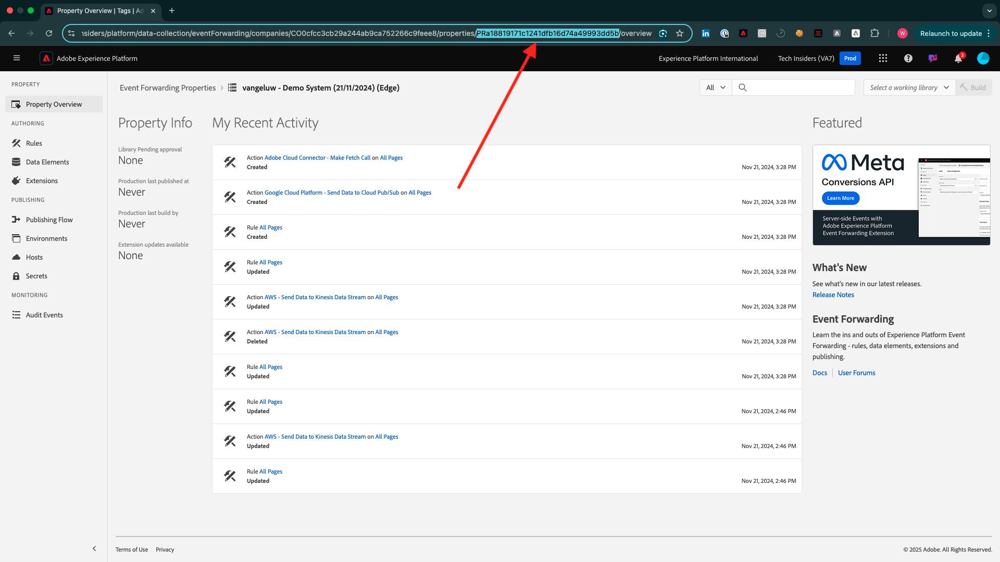

# Hoe wordt Voltooiing gemeten?

Ga naar [ https://certification.adobe.com ](https://certification.adobe.com) en navigeer aan de cursus **XXX**.

Als u een module wilt voltooien, moet u een bewijs van voltooiing leveren.

Hieronder ziet u de verwachte voltooiingsproeven voor elke module.

## Aan de slag

Het verwachte bewijs van voltooiing voor module **die** wordt begonnen is identiteitskaart van het project van het Systeem van de Demo voor Web dat u creeerde.

De id van het project Demo System for web format ziet er als volgt uit: `--demoProfileLdap-- - OCUC`.

## 1.1 Adobe Experience Platform-gegevensverzameling en de Web SDK-extensie

Het verwachte bewijs van voltooiing voor module **de Inzameling van Gegevens &amp; SDK van het Web** is de naam van het bezit van de Inzameling van Gegevens voor Web.

De naam van de eigenschap Gegevensverzameling voor de webindeling ziet er als volgt uit: `--demoProfileLdap-- - Demo System (05/02/2022) (enablement) 1644046719474`.

## 1.2 Gegevensinname

Het verwachte bewijs van voltooiing voor module **Ingestie van Gegevens** is identiteitskaart van de Dataset voor de 2 datasets die u creeerde.

Het formaat van identiteitskaart van de Dataset kijkt als dit: **5f069724723ef41916a8b5d2**.

`--demoProfileLdap-- - Demo System - Event Dataset for Website`

`--demoProfileLdap-- - Demo System - Profile Dataset for Website`

## 1.3 Federale Audience Composition

Het verwachte bewijs van voltooiing voor module **Federated de Samenstelling van het Publiek** is...

## 2.1 Klantprofiel in realtime

Het verwachte bewijs van voltooiing voor module **Real-Time Profiel van de Klant** is **identiteitskaart van het Segment** van het segment dat u door UI, `--demoProfileLdap-- - Male customers with interest in Montana Wind Jacket` creeerde.

Het formaat van identiteitskaart van het Segment kijkt als dit: **8cb7034d-d4ae-4d26-a61f-a7655c12457**.

## 2.2 Intelligente diensten

Het verwachte bewijs van voltooiing voor module **Intelligente Diensten** is identiteitskaart voor uw **Dienst van de Klant AI van de Eigenschap van de Aankoop van het Product**.

Het formaat kijkt als dit: **12729** en u kunt het van URL terugwinnen wanneer het openen van uw dienst.

## 2.3 Real-Time CDP: Bouw een publiek en doe actie!

Het verwachte bewijs van voltooiing voor module **Real-Time CDP** is identiteitskaart van uw **Activiteit van Adobe Target**.

Het formaat kijkt als dit: **111804**.

## 2.4 Real-Time CDP: Audience Activation naar Microsoft Azure Event Hub

Het verwachte bewijs van voltooiing voor module **RTCDP: EventHub** is identiteitskaart van uw **Microsoft Azure 3} bestemming van de Hub van de Gebeurtenis in Adobe Experience Platform.**

U kunt **identiteitskaart van de Bestemming van de Hub van de Gebeurtenis van Microsoft Azure** vinden, die als dit **fa3f7ce5-86fd-4096-bf7c-e586fdc096ba** kijkt, hier:

## 2.5 Real-Time CDP-verbindingen: gebeurtenissen doorsturen

Het verwachte bewijs van voltooiing voor module **RTCDP Verbindingen** is uw **Gebeurtenis door:sturen identiteitskaart van het Bezit**.

U kunt **Gebeurtenis vinden die identiteitskaart van het Bezit** door:sturen, die als dit **PR40f44184c88472e9c19d8d602aab0de** kijkt, hier:

## 2.6 Gegevens streamen van Apache Kafka naar Real-Time CDP

Het verwachte bewijs van voltooiing voor module **Apache Kafka** is identiteitskaart van uw bronschakelaar `--demoProfileLdap-- - Kafka`.

Identiteitskaart kijkt als dit **f843d50a-ee30-4ca8-a766-0e4f3d29a2f7**, en u kunt het hier vinden:

## 3.1 Adobe Journey Optimizer: Orchestratie

Het verwachte bewijs van voltooiing voor module **AJO: Orchestration** is eventID voor uw `--demoProfileLdap--AccountCreationEvent`.

De indeling ziet er als volgt uit: **227402c540eb8f8855c6b2333adf6d54d7153d9d7d56fa475a686081c 574736** .

## 3.2 Adobe Journey Optimizer: Externe gegevensbronnen en aangepaste acties

Het verwachte bewijs van voltooiing voor module **AJO: De Acties van de Douane** is eventID voor uw gebeurtenis `--demoProfileLdap--GeofenceEntry`.

De indeling ziet er als volgt uit: **fa42ab7982ba55f039eacec24c1e32e5c51b310c67f0fa559ab49b63f49 34**.

## 3.3 Adobe Journey Optimizer: Offer Decisioning

Het verwachte bewijs van voltooiing voor module **AJO: De aanbiedingen** is identiteitskaart van het **Besluit van de Aanbieding** dat u creeerde.

U kunt **identiteitskaart van het Besluit van de Aanbieding** vinden, die als dit **xcore :offer-activity: 1122fcc4603ea499** kijkt, hier:

## 3.4 Adobe Journey Optimizer: Reizen op basis van gebeurtenissen

Het verwachte bewijs van voltooiing voor module **AJO: Gebeurtenissen** is eventID voor uw `--demoProfileLdap--StoreEntryEvent`.

Het formaat kijkt als dit: **e3a8f0bdc0b609667cd96a72a6b1e5aafa0ddaf6ccf121c574e6a2030860a63**.

## 4.1 Customer Journey Analytics: een dashboard maken met Analysis Workspace

Het verwachte bewijs van voltooiing voor module **CJA** is identiteitskaart van uw project `--demoProfileLdap-- - Omnichannel Analysis`.

Het formaat kijkt als dit: **6217344f6249ac70c726db60**, kunt u het in URL vinden wanneer u uw project hebt geopend.

## 4.2 Customer Journey Analytics: Gegevens van Googles Analytics in Adobe Experience Platform verzamelen en analyseren met de BigQuery Source Connector

Het verwachte bewijs van voltooiing voor module **CJA: BigQuery** is identiteitskaart van uw **BigQuery** - verbinding.

U kunt **identiteitskaart van de Verbinding van BigQuery** vinden, die als dit **85a2394d-8b94-410c-a239-4d8b94b10c38** kijkt, hier:

## 5.1 Query-service

Het verwachte bewijs van voltooiing voor de dienst van de module **Vraag** is identiteitskaart van de Dataset voor uw `--demoProfileLdap--_callcenter_interaction_analysis` - dataset die u na de voltooiing van de module krijgt.

Het formaat kijkt als dit: **62076f68f14a9d194995d4e2**.

[Terug naar alle modules](./overview.md)
