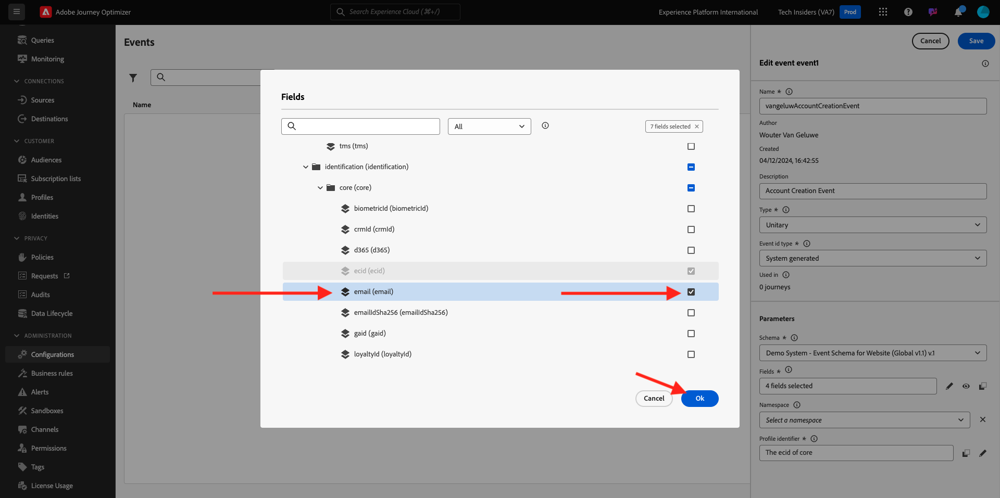

# 3.1.1 Een gebeurtenis maken

Login aan Adobe Journey Optimizer door naar [ Adobe Experience Cloud ](https://experience.adobe.com) te gaan. Klik **Journey Optimizer**.

U zult aan de **1} mening van het Huis {in Journey Optimizer worden opnieuw gericht.** Eerst, zorg ervoor u de correcte zandbak gebruikt. De sandbox die moet worden gebruikt, wordt `--aepSandboxName--` genoemd. Om van één zandbak in een andere te veranderen, klik op **Prod van de PRODUCTIE (VA7)** en selecteer de zandbak van de lijst. In dit voorbeeld, wordt de zandbak genoemd **AEP Enablement FY22**. U zult dan in de **1} mening van het Huis {van uw zandbak `--aepSandboxName--` zijn.**

In het linkermenu, scrol neer en klik **Configuraties**. Daarna, klik **leiden** knoop onder **Gebeurtenissen**.

Vervolgens ziet u een overzicht van alle beschikbare gebeurtenissen. Klik **creëren Gebeurtenis** beginnen uw eigen gebeurtenis te creëren.

Er verschijnt dan een nieuw, leeg gebeurtenisvenster.

Geef uw gebeurtenis eerst een naam zoals deze: `--aepUserLdap--AccountCreationEvent` .

Voeg vervolgens een beschrijving als deze toe `Account Creation Event` .

Daarna, zorg ervoor het **Type** aan **Eenheids** wordt geplaatst, en voor de **Verzamelde het Type van identiteitskaart van de Gebeurtenis** selectie, uitgezocht **Systeem**.

Nu de selectie van het schema. Hiervoor is een schema opgesteld. Gebruik het schema `Demo System - Event Schema for Website (Global v1.1) v.1` .

Na het selecteren van het Schema, zult u een aantal gebieden zien die in de **sectie van de Lading** worden geselecteerd. U zou nu over de **sectie van de Payload** moeten bewegen en u zult 3 pictogrammen popup zien. Klik op **uitgeven** pictogram.

U zult het venster van a **Gebieden** popup zien, waarin u enkele gebieden moet selecteren die wij e-mail moeten personaliseren.  We kiezen later andere profielkenmerken met de gegevens die al in Adobe Experience Platform staan.

In het voorwerp `--aepTenantId--.demoEnvironment`, zorg gelieve ervoor om de gebieden **brandLogo** en **brandName** te selecteren.

In het voorwerp `--aepTenantId--.identification.core`, gelieve ervoor te zorgen om het gebied **e-mail** te selecteren.

Klik **O.K.** om uw veranderingen te bewaren.

U zou dan dit moeten zien:

Klik **sparen** opnieuw om uw veranderingen te bewaren.

Uw gebeurtenis is nu geconfigureerd en opgeslagen.

Klik opnieuw uw gebeurtenis om **te openen geef het 1} scherm van de Gebeurtenis {opnieuw uit.** Beweeg over het **gebied van de Lading** opnieuw om de 3 pictogrammen opnieuw te zien. Klik op het **pictogram van de Payload van de Mening**.

U zult nu een voorbeeld van de verwachte nuttige lading zien.

Uw gebeurtenis heeft een unieke orchestration eventID, die u kunt vinden door neer in die lading te scrollen tot u `_experience.campaign.orchestration.eventID` ziet.

De gebeurtenis-id is wat naar Adobe Experience Platform moet worden verzonden om de Reis te activeren die u maakt in Oefening 7.2. Herinner deze eventID, aangezien u het in Oefening 7.3 zult nodig hebben.
`"eventID": "227402c540eb8f8855c6b2333adf6d54d7153d9d7d56fa475a6866081c574736"`

Klik **O.K.**, die door **wordt gevolgd annuleert**.

Je hebt deze oefening nu afgerond.

Volgende Stap: [ 3.1.2 Journey Optimizer: Creeer uw reis en e-mailbericht ](./ex2.md)

[Terug naar module 3.1](./journey-orchestration-create-account.md)

[Terug naar alle modules](../../../overview.md)
