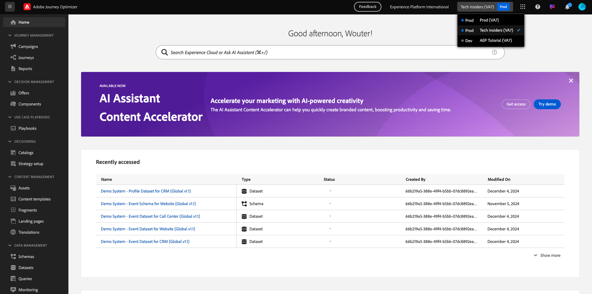
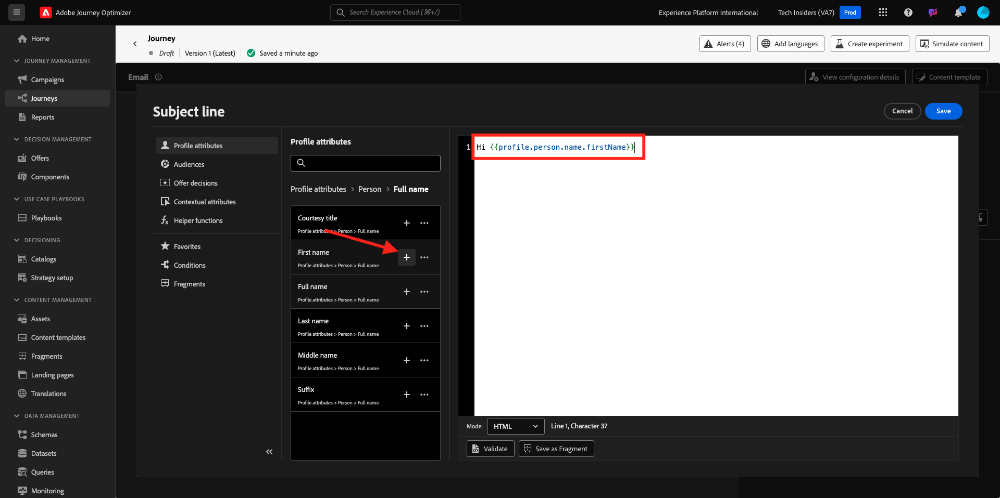

# 3.1.2 Uw reis- en e-mailbericht maken

In deze oefening, zult u de reis en het bericht vormen die moeten worden teweeggebracht wanneer iemand een rekening op de demowebsite creeert.

Login aan Adobe Journey Optimizer door naar [ Adobe Experience Cloud ](https://experience.adobe.com) te gaan. Klik **Journey Optimizer**.

U zult aan de **1} mening van het Huis {in Journey Optimizer worden opnieuw gericht.** Eerst, zorg ervoor u de correcte zandbak gebruikt. De sandbox die moet worden gebruikt, wordt `--aepSandboxId--` genoemd. Om van één zandbak in een andere te veranderen, klik op **Prod van de PRODUCTIE (VA7)** en selecteer de zandbak van de lijst. In dit voorbeeld, wordt de zandbak genoemd **AEP Enablement FY22**. U zult dan in de **1} mening van het Huis {van uw zandbak `--aepSandboxId--` zijn.**

## 3.1.2.1 Maak uw reis

In het linkermenu, klik **Reizen**. Daarna, klik **creeer Reis** om een nieuwe reis tot stand te brengen.

Dan zie je een leeg reisscherm.

In de vorige oefening, creeerde u een nieuwe **Gebeurtenis**. U noemde het als dit `ldapAccountCreationEvent` en vervangt `ldap` door uw ldap. Dit was het resultaat van het maken van de gebeurtenis:

U moet deze gebeurtenis nu als begin van deze reis nemen. U kunt dit doen door naar de linkerkant van het scherm te gaan en naar uw gebeurtenis in de lijst met gebeurtenissen te zoeken.

Selecteer de gebeurtenis, sleep deze naar het canvas Reis. Uw reis ziet er nu als volgt uit:

Als tweede stap in de reis, moet u een korte **toevoegen wacht** stap. Ga naar de linkerkant van uw scherm aan de **sectie van het Orchestration** om dit te vinden. U zult profielattributen gebruiken en moet ervoor zorgen zij in het Profiel van de Klant in real time worden bevolkt.

Je reis ziet er nu zo uit. Aan de rechterkant van het scherm moet u de wachttijd configureren. Stel dit in op 1 minuut. Dit geeft voldoende tijd om de profielkenmerken beschikbaar te maken nadat de gebeurtenis is gestart.

Klik **O.K.** om uw veranderingen te bewaren.

Als derde stap in de reis, moet u een **E-mail** actie toevoegen. Ga naar de linkerkant van uw scherm aan **Acties**, selecteer de **E-mail** actie, dan belemmering en laat vallen het op de tweede knoop in uw reis. U ziet dit nu.

Plaats de **Categorie** aan **Marketing** en selecteer een e-mailoppervlakte die u toelaat om e-mail te verzenden. In dit geval, is de e-mailoppervlakte om te selecteren **E-mail**. Zorg ervoor dat checkboxes voor **klikt op e-mail** en **e-mail opent** allebei worden toegelaten.

De volgende stap is uw bericht te creëren. Om dat te doen, klik **geef inhoud** uit.

## 3.1.2.2 Uw bericht maken

Om uw bericht tot stand te brengen, klik **geef inhoud** uit.

U ziet dit nu.

Klik het **Onderwerplijn** tekstgebied.

In het tekstgebied begin **te schrijven Hoog**

De onderwerpregel is nog niet gereed. Daarna moet u het verpersoonlijkingstoken voor het gebied **Eerste naam** brengen die onder `profile.person.name.firstName` wordt opgeslagen. In het linkermenu, scrol neer om het **element van de Persoon** te vinden en op de pijl te klikken om een niveau diepers te gaan.

Nu vind het **Volledige naam** element en klik op de pijl om een niveau dieper te gaan.

Tot slot vind het **Voornaam** gebied en klik op **+** teken naast het. Vervolgens ziet u het personalisatietoken in het tekstveld.

Voeg vervolgens de tekst **toe. Hartelijk dank voor uw aanmelding.**. Klik **sparen**.

Dan ben je hier weer. Klik **E-mail Designer** om de inhoud van e-mail tot stand te brengen.

In het volgende scherm krijgt u drie verschillende methoden om de inhoud van de e-mail te verschaffen:

- **Ontwerp van kras**: Begin met een leeg canvas en gebruik WYSIWYG-redacteur om structuur en inhoudscomponenten te slepen en neer te zetten om de inhoud van e-mail visueel op te bouwen.
- **Code uw eigen**: Creeer uw eigen e-mailmalplaatje door het te coderen gebruikend HTML
- **de HTML van de Invoer**: De invoer een bestaand malplaatje van HTML, dat u zult kunnen uitgeven.

Klik **Ontwerp van kras**.

In het linkermenu vindt u de structuurcomponenten die u kunt gebruiken om de structuur van de e-mail (rijen en kolommen) te definiëren.

De belemmering en laat vallen a **1:2 kolom links** van het menu in het canvas. Dit is de plaatsaanduiding voor de logoafbeelding.

De belemmering en laat vallen a **1:1 kolom** onder de vorige component. Dit wordt het bannerblok.

De belemmering en laat vallen a **1:2 linkerkolom** onder de vorige component. Dit is de werkelijke inhoud met een afbeelding aan de linkerkant en tekst aan de rechterkant.

Daarna, belemmering en laat vallen a **1:1 kolom** onder de vorige component. Dit wordt de voettekst van e-mail. Uw canvas moet er nu als volgt uitzien:

Vervolgens gebruiken we Inhoud-componenten om inhoud toe te voegen binnen deze blokken. Klik op het **menupunt van de Componenten van de Inhoud** {

De belemmering en laat vallen een **component van het Beeld** in de eerste cel op de eerste rij. Klik **doorbladeren**.

Dan zie je dit. Navigeer aan de omslag **enablement-activa** en selecteer het dossier **luma-logo.png**. Klik **Uitgezocht**.

U bent nu weer hier:

Ga naar **Componenten van de Inhoud** en sleep en laat vallen een **component van het Beeld** in de eerste cel op de eerste rij. Klik **doorbladeren**.

In **Assets** pop-up, ga naar de **enablement-activa** omslag. In deze map vindt u alle middelen die eerder door het creatieve team zijn voorbereid en geüpload. Selecteer **module23-thankyou-new.png** en klik **Uitgezocht**.

Dan heb je het volgende:

Selecteer uw beeld en in het juiste menu, scrol neer tot u de **component van de de breedteschuifregelaar van de Grootte** ziet. Gebruik de schuifregelaar om de breedte te wijzigen in f.i. **60%**.

Daarna, ga naar **Componenten van de Inhoud** en sleep en laat vallen a **** component van de Tekst in de structuurcomponent op de vierde rij.

Selecteer de standaardtekst **Gelieve te typen hier uw tekst.** zoals u met een teksteditor zou doen. Schrijf **Beste** in plaats daarvan. De werkbalk Tekst wordt weergegeven in de tekstmodus.

In de toolbar klikt **verpersoonlijking** pictogram toevoegen.

Daarna, moet u het **Voornaam** verpersoonlijkingstoken brengen dat onder `profile.person.name.firstName` wordt opgeslagen. In het menu, vind het **element van de Persoon**, boor neer aan het **Volledige element van de Naam**, en klik dan het **+** pictogram om het Eerste gebied van de Naam op uitdrukkingsredacteur toe te voegen.

Klik **sparen**.

U zult nu zien hoe het verpersoonlijkingsgebied aan uw tekst is toegevoegd.

Op het zelfde tekstgebied, ga **binnen** tweemaal om twee lijnen toe te voegen en **te schrijven Dank u voor het creëren van uw rekening met Luma!**.

De definitieve controle om uit te voeren om uw e-mail te verzekeren is klaar om het voor te vertonen, klik op de **Simuleer Inhoud** knoop.

Geef eerst aan welk profiel u voor de voorvertoning wilt gebruiken. Selecteer **e-mail** namespace door op het pictogram naast **te klikken ingaat identiteit namespace** gebied.

In de lijst van identiteit namespaces, selecteer **E-mail** namespace.

Op het **waarde van de Identiteit** gebied, ga het e-mailadres van een vorig demoprofiel in dat reeds in het Profiel van de Klant in real time wordt opgeslagen. Bijvoorbeeld **woutervangeluwe+06022022-01@gmail.com** en klik op de **knoop van het Profiel van de Test van de Vondst**

Zodra uw profiel in de lijst verschijnt, klik op het **lusje van de Voorproef** om tot het voorproefscherm toegang te hebben.

Wanneer de voorvertoning gereed is, controleert u of de personalisatie correct is in de onderwerpregel. De hoofdtekst en de koppeling voor het opzeggen van het abonnement worden dan gemarkeerd als een hyperlink.

Klik **dicht** om de voorproef te sluiten.

Klik **sparen** om uw bericht te bewaren.

Ga terug naar het berichtdashboard door de **pijl** naast de onderwerplijntekst in de top-left hoek te klikken.

Je hebt je registratiebericht nu gemaakt. Klik op de pijl in de linkerbovenhoek om terug te gaan naar uw reis.

Klik **OK**.

## 3.1.2.3 Publish uw reis

Je moet je reis nog steeds een naam geven. U kunt dat doen door het **pictogram van Eigenschappen** in de hoogste rechterkant van uw scherm te klikken.

Je kunt hier de naam van de reis invoeren. Gebruik `--demoProfileLdap-- - Account Creation Journey` . Klik **O.K.** om uw veranderingen te bewaren.

U kunt uw reis nu publiceren door **Publish** te klikken.

Klik **opnieuw Publish**.

Vervolgens ziet u een groene bevestigingsbalk met de mededeling dat uw reis nu is gepubliceerd.

Je hebt deze oefening nu afgerond.

Volgende Stap: [ 3.1.3 Werk uw bezit van de Inzameling van Gegevens bij en test uw reis ](./ex3.md)

[Terug naar module 3.1](./journey-orchestration-create-account.md)

[Terug naar alle modules](../../../overview.md)
