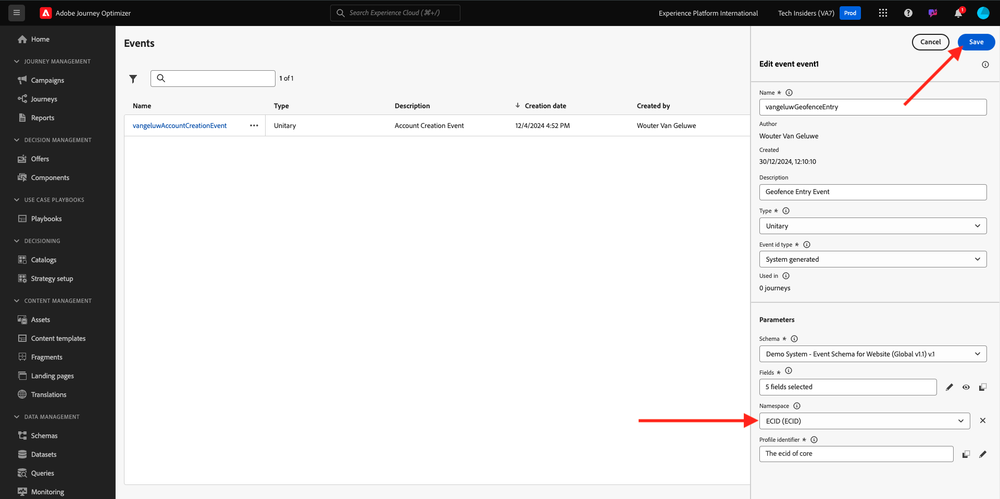

# 3.2.1 Een gebeurtenis definiëren

Login aan Adobe Journey Optimizer door naar [ Adobe Experience Cloud ](https://experience.adobe.com) te gaan. Klik **Journey Optimizer**.

U zult aan de **1} mening van het Huis {in Journey Optimizer worden opnieuw gericht.** Eerst, zorg ervoor u de correcte zandbak gebruikt. De sandbox die moet worden gebruikt, wordt `--aepSandboxId--` genoemd. Om van één zandbak in een andere te veranderen, klik op **Prod van de PRODUCTIE (VA7)** en selecteer de zandbak van de lijst. In dit voorbeeld, wordt de zandbak genoemd **AEP Enablement FY22**. U zult dan in de **1} mening van het Huis {van uw zandbak `--aepSandboxId--` zijn.**

In het linkermenu, scrol neer en klik **Configuraties**. Daarna, klik **leiden** knoop onder **Gebeurtenissen**.

Vervolgens ziet u een overzicht van alle beschikbare gebeurtenissen. Klik **creëren Gebeurtenis** beginnen uw eigen gebeurtenis te creëren.

Er verschijnt dan een nieuw, leeg gebeurtenisvenster.

Gebruik `--demoProfileLdap--GeofenceEntry` als naam voor de gebeurtenis. In dit voorbeeld is de naam van de gebeurtenis `vangeluwGeofenceEntry` .

Stel Beschrijving in op: `Geofence Entry Event` .

Daarna, zorg ervoor het **Type** aan **Eenheids** wordt geplaatst, en voor de **Verzamelde van het Type van identiteitskaart van de Gebeurtenis** selectie, selecteert **Systeem**

Vervolgens moet u een schema selecteren. Alle schema&#39;s die hier worden getoond, zijn Adobe Experience Platform Schemas.

U zult merken dat niet alle schema&#39;s worden getoond. Er zijn veel meer schema&#39;s beschikbaar in Adobe Experience Platform.
Om in deze lijst te tonen, moet een schema een zeer specifieke gebiedsgroep hebben met het verbonden. De veldgroep die hier moet worden weergegeven, wordt `Orchestration eventID` genoemd.

Laten we eens kijken hoe deze schema&#39;s in Adobe Experience Platform zijn gedefinieerd.

In het linkermenu, ga naar **Schema&#39;s** en open dit in een nieuwe browser tabel. In **Schema&#39;s**, ga **doorbladeren** om de lijst van beschikbare Schema&#39;s te zien.
Open het schema `Demo System - Event Schema for Website (Global v1.1)` .

Nadat u het schema hebt geopend, ziet u dat de veldgroep `Orchestration eventID` deel uitmaakt van het schema.
Deze veldgroep heeft slechts twee velden, `_experience.campaign.orchestration.eventID` en `originJourneyID` .

Zodra deze veldgroep en dit specifieke eventID gebied deel van een schema uitmaken, zal dat schema voor gebruik door Adobe Journey Optimizer beschikbaar zijn.

Ga terug naar uw gebeurtenisconfiguratie in Adobe Journey Optimizer.

In dit geval wilt u luisteren naar een Geofence-gebeurtenis om te begrijpen of een klant zich op een specifieke locatie bevindt. Selecteer nu het schema `Demo System - Event Schema for Website (Global v1.1)` als het schema voor uw gebeurtenis.

Adobe Journey Optimizer selecteert dan automatisch een aantal vereiste velden, maar u kunt de velden bewerken die beschikbaar zijn voor Adobe Journey Optimizer.

Klik het **potlood** pictogram om de gebieden uit te geven.

Vervolgens ziet u een pop-upvenster met een schemahiërarchie waarin u velden kunt selecteren.

Velden zoals de ECID en de Orchestration eventID zijn vereist en als zodanig vooraf geselecteerd.

Een marketeer moet echter flexibele toegang hebben tot alle gegevenspunten die context bieden aan een reis. Laten we dus ook de volgende velden als minimum selecteren (gevonden in het contextknooppunt Plaatsen):

- Plaats

Zodra dat wordt gedaan, klik O.K. ****.

Adobe Journey Optimizer heeft ook een id nodig om de klant te identificeren. Aangezien Adobe Journey Optimizer is gekoppeld aan Adobe Experience Platform, wordt de primaire id van een schema automatisch beschouwd als de id voor de reis.
De primaire id houdt ook automatisch rekening met de volledige identiteitsgrafiek van Adobe Experience Platform en koppelt al het gedrag in alle beschikbare identiteiten, apparaten en kanalen aan hetzelfde profiel, zodat Adobe Journey Optimizer contextueel, relevant en consistent is.

Klik **sparen** om uw douanegebeurtenis te bewaren.

Uw gebeurtenis maakt dan deel uit van de lijst met beschikbare gebeurtenissen.

Tot slot moet u de `Orchestration eventID` voor uw aangepaste gebeurtenis herstellen.

Open de gebeurtenis opnieuw door erop te klikken in de lijst met gebeurtenissen.
Voor uw Gebeurtenis, klik op het **pictogram van de Payload van de Mening** naast **Gebieden**.

Het klikken van het **pictogram van de Payload van de Mening** opent omhoog een steekproefXDM nuttige lading voor deze gebeurtenis.

De rol neer in de **nuttige lading** tot u de lijn `eventID` ziet.

Schrijf `eventID` neer aangezien u het in het laatste zult nodig hebben om uw configuratie te testen.

In dit voorbeeld is de waarde `eventID` `fa42ab7982ba55f039eacec24c1e32e5c51b310c67f0fa559ab49b89b63f4934` .

U hebt nu de gebeurtenis gedefinieerd die de reis zal activeren die we aan het bouwen zijn. Zodra de reis in werking wordt gesteld, zullen de geofence-gebieden zoals Stad, en anderen die u (zoals Land, Breedtegraad en Lengtegraad) kunt kiezen ter beschikking worden gesteld aan de reis.

Zoals besproken in de beschrijving van het gebruikscase, moeten we dan contextuele promoties bieden die afhankelijk zijn van het weer. Om weerinformatie te krijgen, zullen wij een externe gegevensbronnen moeten bepalen die ons van de weerinformatie voor die plaats zullen voorzien. U zult de **OpenWeather** dienst gebruiken om ons te verstrekken wat die informatie, als deel van 2.

Volgende Stap: [ 3.2.2 bepaalt een externe gegevensbron ](./ex2.md)

[Terug naar module 3.2](journey-orchestration-external-weather-api-sms.md)

[Terug naar alle modules](../../../overview.md)
