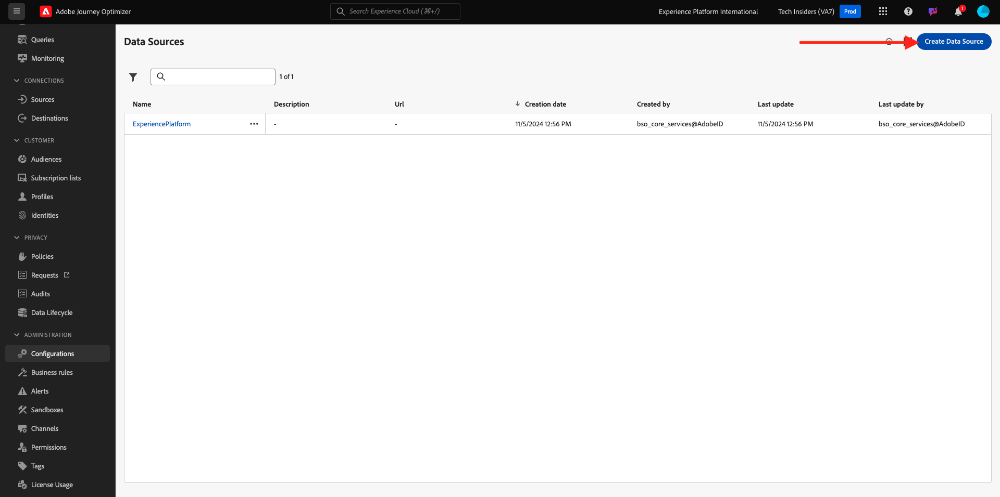
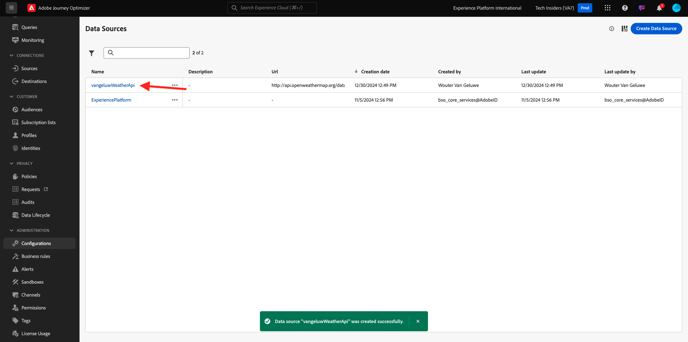

# 3.2.2 Een externe gegevensbron definiëren

In deze oefening, zult u een douane externe gegevensbron tot stand brengen door gebruik van Adobe Journey Optimizer te maken.

Login aan Adobe Journey Optimizer door naar [ Adobe Experience Cloud ](https://experience.adobe.com) te gaan. Klik **Journey Optimizer**.


U zult aan de **1} mening van het Huis {in Journey Optimizer worden opnieuw gericht.** Eerst, zorg ervoor u de correcte zandbak gebruikt. De sandbox die moet worden gebruikt, wordt `--aepSandboxId--` genoemd. Om van één zandbak in een andere te veranderen, klik op **Prod van de PRODUCTIE (VA7)** en selecteer de zandbak van de lijst. In dit voorbeeld, wordt de zandbak genoemd **AEP Enablement FY22**. U zult dan in de **1} mening van het Huis {van uw zandbak `--aepSandboxId--` zijn.**


In het linkermenu, scrol neer en klik **Configuraties**. Daarna, klik **leiden** knoop onder **Gegevensbronnen**.


U zult dan de **Bronnen van Gegevens** lijst zien.
Klik **creëren Gegevens Source** beginnen uw gegevensbron toe te voegen.



Er verschijnt een lege pop-up voor de gegevensbron.


Alvorens u kunt beginnen dit te vormen, zult u een rekening met de **Open Weather Kaart** dienst nodig hebben. Voer de volgende stappen uit om uw account te maken en uw API-sleutel op te halen.

Ga naar [ https://openweathermap.org/ ](https://openweathermap.org/). Voor de homepage, klik **Teken binnen**.


Klik **creeer een Rekening**.


Vul de details in.


Klik **creëren Rekening**.


U wordt vervolgens omgeleid naar uw accountpagina.


In het menu, klik **API Sleutels** om uw API Sleutel terug te winnen, die u uw douane externe gegevensbron zult moeten plaatsen.


Een **Sleutel van API** kijkt als dit: `b2c4c36b6bb59c3458d6686b05311dc3`.

U kunt de **API Documentatie** voor **Huidige Weer** [ hier ](https://openweathermap.org/current) vinden.

In ons gebruik-geval, zullen wij de verbinding met Open Kaart van het Weer uitvoeren die op de plaats wordt gebaseerd de klant in is.


Ga terug naar **Adobe Journey Optimizer**, aan uw lege **Externe Gegevens Source** popup.


Gebruik `--demoProfileLdap--WeatherApi` als naam voor de gegevensbron. In dit voorbeeld is de naam van de gegevensbron `vangeluwWeatherApi ` .

Stel Beschrijving in op: `Access to the Open Weather Map` .

URL voor Open Weather Kaart API is: **http://api.openweathermap.org/data/2.5/weather?units=metric**


Vervolgens moet u de verificatie selecteren die u wilt gebruiken.

Gebruik de volgende variabelen:

| Veld | Waarde |
|:-----------------------:| :-----------------------|
| Type | **API sleutel** |
| Naam | **APPID** |
| Waarde | **uw API Sleutel** |
| Locatie | **Parameter van de Vraag** |


Tot slot moet u a **FieldGroup** bepalen, die fundamenteel het verzoek is u naar het Weer API zult verzenden. In ons geval, willen wij de naam van de Stad gebruiken om het Huidige Weer voor die Stad te verzoeken.


Volgens de Weather API-documentatie moeten we een parameter `q=City` verzenden.


Configureer uw FieldGroup als volgt om de verwachte API-aanvraag af te stemmen:

>[!IMPORTANT]
>
>De naam van de veldgroep moet uniek zijn. Gebruik de volgende naamgevingsconventie: `--demoProfileLdap--WeatherByCity` in dit geval moet de naam `vangeluwWeatherByCity` zijn


Voor de Payload van de Reactie, moet u een voorbeeld van de Reactie kleven die door Weather API zal worden verzonden.

U kunt de verwachte Reactie van API JSON op de API documentatiepagina [ hier ](https://openweathermap.org/current) vinden.


Of u kunt de JSON-reactie hier kopiëren:

```json
{"coord": { "lon": 139,"lat": 35},
  "weather": [
    {
      "id": 800,
      "main": "Clear",
      "description": "clear sky",
      "icon": "01n"
    }
  ],
  "base": "stations",
  "main": {
    "temp": 281.52,
    "feels_like": 278.99,
    "temp_min": 280.15,
    "temp_max": 283.71,
    "pressure": 1016,
    "humidity": 93
  },
  "wind": {
    "speed": 0.47,
    "deg": 107.538
  },
  "clouds": {
    "all": 2
  },
  "dt": 1560350192,
  "sys": {
    "type": 3,
    "id": 2019346,
    "message": 0.0065,
    "country": "JP",
    "sunrise": 1560281377,
    "sunset": 1560333478
  },
  "timezone": 32400,
  "id": 1851632,
  "name": "Shuzenji",
  "cod": 200
}
```

Kopieer de bovenstaande JSON-reactie naar het klembord en ga vervolgens naar het configuratiescherm van de aangepaste gegevensbron.

Klik **uitgeven het pictogram van de Lading**.


U ziet een popup waar u nu de bovengenoemde Reactie van JSON moet kleven.


Plak uw JSON-reactie, waarna u dit ziet. Klik **sparen**.


De aangepaste configuratie van de gegevensbron is nu voltooid. De rol omhoog en klikt **sparen**.


Uw gegevensbron is nu met succes gecreeerd en maakt deel uit van de **Bronnen van Gegevens** lijst.



Volgende Stap: [ 3.2.3 bepaalt een douaneactie ](./ex3.md)

[Terug naar module 3.2](journey-orchestration-external-weather-api-sms.md)

[Terug naar alle modules](../../../overview.md)
