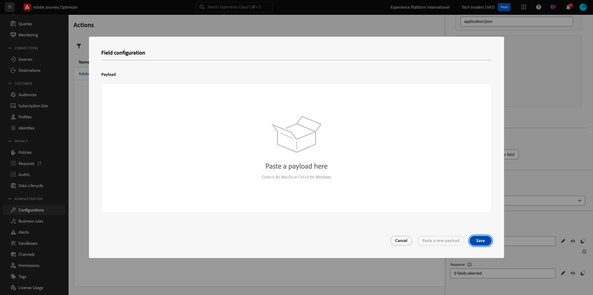

# 3.2.3 Een aangepaste handeling definiëren

In deze oefening, zult u twee douaneacties creëren door gebruik van Adobe Journey Optimizer in combinatie te maken.

Login aan Adobe Journey Optimizer door naar [ Adobe Experience Cloud ](https://experience.adobe.com) te gaan. Klik **Journey Optimizer**.


U zult aan de **1} mening van het Huis {in Journey Optimizer worden opnieuw gericht.** Eerst, zorg ervoor u de correcte zandbak gebruikt. De sandbox die moet worden gebruikt, wordt `--aepSandboxName--` genoemd. Om van één zandbak in een andere te veranderen, klik op **Prod van de PRODUCTIE (VA7)** en selecteer de zandbak van de lijst. In dit voorbeeld, wordt de zandbak genoemd **AEP Enablement FY22**. U zult dan in de **1} mening van het Huis {van uw zandbak `--aepSandboxName--` zijn.**


In het linkermenu, scrol neer en klik **Configuraties**. Daarna, klik **leiden** knoop onder **Acties**.


U zult dan de **lijst van Acties** zien.


U gaat één actie definiëren die een tekst naar een kanaal van de Slack verzendt.

## 3.2.3.1 Actie: Tekst naar kanaal van Slack verzenden

U zult nu een bestaand kanaal van de Slack gebruiken en berichten verzenden naar dat Kanaal van de Slack. Slack heeft een eenvoudig te gebruiken API en we gebruiken Adobe Journey Optimizer om de API van deze API te activeren.


Klik **creeer Actie** beginnen een nieuwe actie toe te voegen.


Er verschijnt een leeg actiepopup.


Gebruik `--aepUserLdap--TextSlack` als naam voor de handeling. In dit voorbeeld is de naam van de handeling `vangeluwTextSlack` .

Stel Beschrijving in op: `Send Text to Slack` .


Voor de **Configuratie URL**, gebruik dit:

- URL: `https://2mnbfjyrre.execute-api.us-west-2.amazonaws.com/prod`
- Methode: **POST**

>[!NOTE]
>
>De bovenstaande URL verwijst naar een AWS Lambda-functie die uw verzoek doorstuurt naar het Slack kanaal zoals hierboven vermeld. Dit wordt gedaan om toegang tot een Adobe-Bezit kanaal van de Slack te beschermen. Als u uw eigen kanaal van de Slack hebt, zou u een SlackApp door [ https://api.slack.com/ ](https://api.slack.com/) moeten tot stand brengen, dan moet u een Inkomende Webhaak in die SlackApp tot stand brengen, en dan bovengenoemde URL door uw Inkomende URL van Webhaak vervangen.

U hoeft de koptekstvelden niet te wijzigen.


**Authentificatie** zou aan **Geen Authentificatie** moeten worden geplaatst.


Voor de **Parameters van de Actie**, moet u bepalen welke gebieden naar Slack zouden moeten worden verzonden. Logischerwijze willen we dat Adobe Journey Optimizer en Adobe Experience Platform het brein van personalisatie zijn, dus de tekst die naar Slack moet worden gestuurd, moet door Adobe Journey Optimizer worden gedefinieerd en vervolgens naar de Slack worden gestuurd voor uitvoering.

Zo voor de **Parameters van de Actie**, klik **uitgeven het pictogram van de Lopende lading**.


Dan zie je een leeg popup-venster.



Kopieer de onderste tekst en plak deze in het lege pop-upvenster.

```json
{
 "text": {
  "toBeMapped": true,
  "dataType": "string",
  "label": "textToSlack"
 }
}
```

FYI: door de onderstaande velden op te geven, worden deze velden toegankelijk vanaf de reis van de klant en kunt u ze dynamisch vanuit de Reis vullen:

**&quot;toBeMapping&quot;: true,**

**&quot;dataType&quot;: &quot;string&quot;,**

**&quot;label&quot;: &quot;textToSlack&quot;**

U zult dan dit zien:


Klik **sparen**.


De rol omhoog en klikt **sparen** één meer tijd om uw douaneactie te bewaren.


Uw douaneactie is nu een deel van de **lijst van Acties**.


U hebt gebeurtenissen, externe gegevensbronnen en acties gedefinieerd. Laten we dat allemaal op één reis consolideren.

Volgende Stap: [ 3.2.4 leidt tot uw reis en berichten ](./ex4.md)

[Ga terug naar module 8](journey-orchestration-external-weather-api-sms.md)

[Terug naar alle modules](../../../overview.md)
