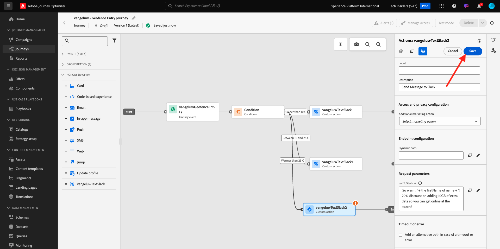

# 3.2.4 Maak uw reis en uw berichten

In deze oefening, zult u een reis en verscheidene tekstberichten creëren door Adobe Journey Optimizer te gebruiken.

Voor dit gebruiksgeval, is het doel verschillende sms- berichten te verzenden die op de weersomstandigheden van de plaats van uw klant worden gebaseerd. Er zijn drie scenario&#39;s vastgesteld:

- Kleiner dan 10° Celsius
- Tussen 10° en 25° Celsius
- Warmer dan 25° Celsius

Voor deze 3 voorwaarden moet je 3 SMS-berichten definiëren in Adobe Journey Optimizer.

## 3.2.4.1 Maak uw reis

Login aan Adobe Journey Optimizer door naar [ Adobe Experience Cloud ](https://experience.adobe.com) te gaan. Klik **Journey Optimizer**.


U zult aan de **1} mening van het Huis {in Journey Optimizer worden opnieuw gericht.** Eerst, zorg ervoor u de correcte zandbak gebruikt. De sandbox die moet worden gebruikt, wordt `--aepSandboxId--` genoemd. Om van één zandbak in een andere te veranderen, klik op **Prod van de PRODUCTIE (VA7)** en selecteer de zandbak van de lijst. In dit voorbeeld, wordt de zandbak genoemd **AEP Enablement FY22**. U zult dan in de **1} mening van het Huis {van uw zandbak `--aepSandboxId--` zijn.**


In het linkermenu, ga naar **Reizen** en klik **creeer Reis** beginnen uw Reis te creëren.


Je moet eerst je reis benoemen.

Gebruik `--demoProfileLdap-- - Geofence Entry Journey` als naam voor de rit. In dit voorbeeld is de naam van de rit `vangeluw - Geofence Entry Journey` . Er mogen op dit moment geen andere waarden worden ingesteld. Klik **OK**.


Op de linkerkant van uw scherm, heb een blik bij **Gebeurtenissen**. De eerder gemaakte gebeurtenis wordt in die lijst weergegeven. Selecteer het, sleep het en laat vallen het op het reiscanvas. Uw reis ziet er dan zo uit. Klik **OK**.


Daarna, klik op **Orchestration**. U ziet nu de beschikbare **mogelijkheden van 0} Orchestratie {.** Selecteer **Voorwaarde**, dan belemmering en laat vallen het op het Canvas van de Reis.


U moet nu drie voorwaarden definiëren:

- Het is kouder dan 10° Celsius
- Het ligt tussen 10° en 25° Celsius
- Het is warmer dan 25° Celsius

Laten we de eerste voorwaarde definiëren.

### Voorwaarde 1: van minder dan 10° Celsius

Klik op de **Voorwaarde**.  Klik op **Path1** en geef de naam van de weg aan **Kleur uit dan 10 C**. Klik op **uitgeven** pictogram voor de uitdrukking van Path1.


U zult dan een leeg **Eenvoudige** scherm van de Redacteur {zien. Uw vraag zal een beetje geavanceerder zijn, zodat zult u de **Geavanceerde Wijze** nodig hebben. Klik **Geavanceerde Wijze**.


U zult dan de **Geavanceerde Redacteur** zien die codeingang toestaat.


Selecteer de hieronder code en kleef het in de **Geavanceerde Redacteur**.

`#{--demoProfileLdap--WeatherApi.--demoProfileLdap--WeatherByCity.main.temp} <= 10`

Dan zie je dit.


Om de temperatuur als deel van deze voorwaarde terug te winnen, moet u de stad verstrekken waarin de klant momenteel is.
De **Stad** moet met de dynamische parameter `q` worden verbonden, enkel zoals wij eerder in de Open Weather API Documentatie zagen.

Klik het gebied **dynamische val: q** zoals die in het schermafbeelding wordt vermeld.


Dan moet u het gebied vinden dat de huidige plaats van de klant in één van de beschikbare Gegevensbronnen bevat.


U kunt het veld vinden door naar `--demoProfileLdap--GeofenceEntry.placeContext.geo.city` te navigeren.

Door op dat veld te klikken, wordt het toegevoegd als de dynamische waarde voor de parameter `q` . Dit veld wordt gevuld met bijvoorbeeld de geolocatieservice die u in uw mobiele app hebt geïmplementeerd. In ons geval simuleren we dit met de beheerconsole van de demo-website. Klik **OK**.


### Voorwaarde 2: tussen 10° en 25° Celsius

Nadat u de eerste voorwaarde hebt toegevoegd, ziet u dit scherm. Klik **toevoegen Weg**.


Dubbelklik op **Path1** en geef de wegnaam aan **tussen 10 en 25 C** uit. Klik **uitgeven** pictogram voor de uitdrukking dit weg.


U zult dan een leeg **Eenvoudige** scherm van de Redacteur {zien. Uw vraag zal een beetje geavanceerder zijn, zodat zult u de **Geavanceerde Wijze** nodig hebben. Klik **Geavanceerde Wijze**.


U zult dan de **Geavanceerde Redacteur** zien die codeingang toestaat.


Selecteer de hieronder code en kleef het in de **Geavanceerde Redacteur**.

`#{--demoProfileLdap--WeatherApi.--demoProfileLdap--WeatherByCity.main.temp} > 10 and #{--demoProfileLdap--WeatherApi.--demoProfileLdap--WeatherByCity.main.temp} <= 25`

Dan zie je dit.


Om de temperatuur als deel van deze Voorwaarde terug te winnen, moet u de stad verstrekken waarin de klant momenteel is.
De **Stad** moet met de dynamische parameter **q** worden verbonden, enkel als wij eerder in de Open Weather API Documentatie zagen.

Klik het gebied **dynamische val: q** zoals die in het schermafbeelding wordt vermeld.


Dan moet u het gebied vinden dat de huidige plaats van de klant in één van de beschikbare Gegevensbronnen bevat.


U kunt het veld vinden door naar `--demoProfileLdap--GeofenceEntry.placeContext.geo.city` te navigeren. Door dat gebied te klikken, zal het als dynamische waarde voor de parameter **q** worden toegevoegd. Dit veld wordt gevuld met bijvoorbeeld de geolocatieservice die u in uw mobiele app hebt geïmplementeerd. In ons geval simuleren we dit met de beheerconsole van de demo-website. Klik **OK**.


Vervolgens voegt u de derde voorwaarde toe.

### Voorwaarde 3: Warmer dan 25° Celsius

Nadat u de tweede voorwaarde hebt toegevoegd, ziet u dit scherm. Klik **toevoegen Weg**.


Dubbelklik op Path1 om de naam in **Warmer te veranderen dan 25 C**.
Dan klik op **uitgeven** pictogram voor de uitdrukking dit weg.


U zult dan een leeg **Eenvoudige** scherm van de Redacteur {zien. Uw vraag zal een beetje geavanceerder zijn, zodat zult u de **Geavanceerde Wijze** nodig hebben. Klik **Geavanceerde Wijze**.


U zult dan de **Geavanceerde Redacteur** zien die codeingang toestaat.


Selecteer de hieronder code en kleef het in de **Geavanceerde Redacteur**.

`#{--demoProfileLdap--WeatherApi.--demoProfileLdap--WeatherByCity.main.temp} > 25`

Dan zie je dit.


Om de temperatuur als deel van deze Voorwaarde terug te winnen, moet u de stad verstrekken waarin de klant momenteel is.
De **Stad** moet met de dynamische parameter **q** worden verbonden, enkel als wij eerder in de Open Weather API Documentatie zagen.

Klik het gebied **dynamische val: q** zoals die in het schermafbeelding wordt vermeld.


Dan moet u het gebied vinden dat de huidige plaats van de klant in één van de beschikbare Gegevensbronnen bevat.


U kunt het veld vinden door naar ```--demoProfileLdap--GeofenceEntry.placeContext.geo.city``` te navigeren. Door dat gebied te klikken, zal het als dynamische waarde voor de parameter **q** worden toegevoegd. Dit veld wordt gevuld met bijvoorbeeld de geolocatieservice die u in uw mobiele app hebt geïmplementeerd. In ons geval simuleren we dit met de beheerconsole van de demo-website. Klik **OK**.


U hebt nu drie geconfigureerde paden. Klik **OK**.


Aangezien dit een reis voor het leren doel is, zullen wij nu een paar acties vormen om de verscheidenheid van opties te tonen moeten de verkopers nu berichten leveren.

## 3.2.4.2 Berichten verzenden voor een pad: lager dan 10° Celsius

Voor elk van de temperatuurcontexten, zullen wij proberen om een tekstbericht naar onze klant te verzenden. Wij kunnen een tekstbericht slechts verzenden als wij een Mobiel Aantal beschikbaar voor een klant hebben, zodat zullen wij eerst moeten verifiëren dat wij.

Laten wij op **Kleur dan 10 C** concentreren.


Neem een ander **element van de Voorwaarde** en sleep het zoals hieronder vermeld in het schermschot. We gaan controleren of er voor deze klant een mobiel nummer beschikbaar is.


Aangezien dit slechts een voorbeeld is, vormen wij slechts de optie waar de klant een mobiel aantal beschikbaar heeft. Voeg een etiket van **toe heeft mobiel?**.

Klik op **uitgeven** pictogram voor de Uitdrukking voor de **weg Path1**.


In de Gegevensbronnen die op de linkerzijde worden getoond, navigeer aan **ExperiencePlatform.ProfileFieldGroup.profile.mobilePhone.number**. U leest het mobiele telefoonnummer nu rechtstreeks vanuit het Adobe Experience Platform Real-Time Klantprofiel.


Selecteer het gebied **Aantal**, dan belemmering en laat vallen het aan het Canvas van de Voorwaarde.

Selecteer de exploitant **is niet leeg**. Klik **OK**.


Dan zie je dit. Klik nogmaals **O.K.**.


Je reis zal er dan zo uitzien. Klik op **Acties** zoals die in het schermafbeelding worden vermeld.


Selecteer de actie **SMS**, dan belemmering en laat vallen het na de voorwaarde u enkel toevoegde.


Plaats de **Categorie** aan **Marketing** en selecteer een oppervlakte van SMS die u toelaat om SMS te verzenden. In dit geval, is de e-mailoppervlakte om te selecteren **SMS**.


De volgende stap is uw bericht te creëren. Om dat te doen, klik **geef inhoud** uit.


U ziet nu het berichtdashboard, waar u de tekst van uw SMS kunt vormen. Klik het **samenstellen bericht** gebied om uw bericht tot stand te brengen.


Voer de volgende tekst in: `Brrrr... {{profile.person.name.firstName}}, it's freezing. 20% discount on jackets today!`. Klik **sparen**.


Dan zie je dit. Klik op de pijl in de linkerbovenhoek om terug te gaan naar uw reis.


Dan ben je hier weer. Klik **OK**.


In het linkermenu, ga terug naar **Acties**, selecteer de Actie `--demoProfileLdap--TextSlack`, dan belemmering en laat vallen het na de **actie van het Bericht**.


Ga naar **Parameters van de Actie** en klik **uitgeven** pictogram voor de parameter `TEXTTOSLACK`.


In popup-venster, klik **Geavanceerde Wijze**.


Selecteer de hieronder code, kopieer het en kleef het in de **Geavanceerde Redacteur van de Wijze**. Klik **OK**.

`"Brrrr..." + #{ExperiencePlatform.ProfileFieldGroup.profile.person.name.firstName} + " It's freezing. 20% discount on Jackets today!"`


Je ziet de voltooide actie. Klik **OK**.


Deze weg van de reis is nu gereed.

## 3.2.4.3 Berichten verzenden voor een pad: tussen 10° en 25° Celsius

Voor elk van de temperatuurcontexten, zullen wij proberen om een tekstbericht naar onze klant te verzenden. Wij kunnen een tekstbericht slechts verzenden als wij een Mobiel Aantal beschikbaar voor een klant hebben, zodat zullen wij eerst moeten verifiëren dat wij.

Laten wij op **tussen 10 en 25 de weg van C** concentreren.


Neem een ander **element van de Voorwaarde** en sleep het zoals hieronder vermeld in het schermschot. We gaan controleren of er voor deze klant een mobiel nummer beschikbaar is.


Aangezien dit slechts een voorbeeld is, vormen wij slechts de optie waar de klant een mobiel aantal beschikbaar heeft. Voeg een etiket van **toe heeft mobiel?**.

Klik op **uitgeven** pictogram voor de Uitdrukking voor de **weg Path1**.


In de Gegevensbronnen die op de linkerzijde worden getoond, navigeer aan **ExperiencePlatform.ProfileFieldGroup.profile.mobilePhone.number**. U leest het mobiele telefoonnummer nu rechtstreeks vanuit het Adobe Experience Platform Real-Time Klantprofiel.


Selecteer het gebied **Aantal**, dan belemmering en laat vallen het aan het Canvas van de Voorwaarde.

Selecteer de exploitant **is niet leeg**. Klik **OK**.


Dan zie je dit. Klik **OK**.


Je reis zal er dan zo uitzien. Klik op **Acties** zoals die in het schermafbeelding worden vermeld.


Selecteer de actie **SMS**, dan belemmering en laat vallen het na de voorwaarde u enkel toevoegde.


Plaats de **Categorie** aan **Marketing** en selecteer een oppervlakte van SMS die u toelaat om SMS te verzenden. In dit geval, is de e-mailoppervlakte om te selecteren **SMS**.


De volgende stap is uw bericht te creëren. Om dat te doen, klik **geef inhoud** uit.


U ziet nu het berichtdashboard, waar u de tekst van uw SMS kunt vormen. Klik het **samenstellen bericht** gebied om uw bericht tot stand te brengen.


Voer de volgende tekst in: `What a nice weather for the time of year, {{profile.person.name.firstName}} - 20% discount on Sweaters today!`. Klik **sparen**.


Dan zie je dit. Klik op de pijl in de linkerbovenhoek om terug te gaan naar uw reis.


U ziet nu de voltooide actie. Klik **OK**.


In het linkermenu, ga terug naar **Acties**, selecteer de Actie `--demoProfileLdap--TextSlack`, dan belemmering en laat vallen het na de **actie van het Bericht**.


Ga naar **Parameters van de Actie** en klik **uitgeven** pictogram voor de parameter `TEXTTOSLACK`.


In popup-venster, klik **Geavanceerde Wijze**.


Selecteer de hieronder code, kopieer het en kleef het in de **Geavanceerde Redacteur van de Wijze**. Klik **OK**.

`"What nice weather for the time of year, " + #{ExperiencePlatform.ProfileFieldGroup.profile.person.name.firstName} + " 20% discount on Sweaters today!"`


Je ziet de voltooide actie. Klik **OK**.


Deze weg van de reis is nu gereed.

## 3.2.4.4 Berichten verzenden voor een pad: Warmer dan 25° Celsius

Voor elk van de temperatuurcontexten, zullen wij proberen om een tekstbericht naar onze klant te verzenden. Wij kunnen een tekstbericht slechts verzenden als wij een Mobiel Aantal beschikbaar voor een klant hebben, zodat zullen wij eerst moeten verifiëren dat wij.

Laten wij op **Warmer dan 25 weg van C** concentreren.


Neem een ander **element van de Voorwaarde** en sleep het zoals hieronder vermeld in het schermschot. U gaat controleren of er voor deze klant een mobiel nummer beschikbaar is.


Aangezien dit slechts een voorbeeld is, vormen wij slechts de optie waar de klant een mobiel aantal beschikbaar heeft. Voeg een etiket van **toe heeft mobiel?**.

Klik op **uitgeven** pictogram voor de Uitdrukking voor de **weg Path1**.


In de Gegevensbronnen die op de linkerzijde worden getoond, navigeer aan **ExperiencePlatform.ProfileFieldGroup.profile.mobilePhone.number**. U leest het mobiele telefoonnummer nu rechtstreeks vanuit het Adobe Experience Platform Real-Time Klantprofiel.


Selecteer het gebied **Aantal**, dan belemmering en laat vallen het aan het Canvas van de Voorwaarde.

Selecteer de exploitant **is niet leeg**. Klik **OK**.


Dan zie je dit. Klik **OK**.


Je reis zal er dan zo uitzien. Klik op **Acties** zoals die in het schermafbeelding worden vermeld.


Selecteer de actie **SMS**, dan belemmering en laat vallen het na de voorwaarde u enkel toevoegde.


Plaats de **Categorie** aan **Marketing** en selecteer een oppervlakte van SMS die u toelaat om SMS te verzenden. In dit geval, is de e-mailoppervlakte om te selecteren **SMS**.


De volgende stap is uw bericht te creëren. Om dat te doen, klik **geef inhoud** uit.


U ziet nu het berichtdashboard, waar u de tekst van uw SMS kunt vormen. Klik het **samenstellen bericht** gebied om uw bericht tot stand te brengen.


Voer de volgende tekst in: `So warm, {{profile.person.name.firstName}}! 20% discount on swimwear today!`. Klik **sparen**.


Dan zie je dit. Klik op de pijl in de linkerbovenhoek om terug te gaan naar uw reis.


U ziet nu de voltooide actie. Klik **OK**.


In het linkermenu, ga terug naar **Acties**, selecteer de Actie `--demoProfileLdap--TextSlack`, dan belemmering en laat vallen het na de **actie van Berichten**.


Ga naar **Parameters van de Actie** en klik **uitgeven** pictogram voor de parameter `TEXTTOSLACK`.


In popup-venster, klik **Geavanceerde Wijze**.


Selecteer de hieronder code, kopieer het en kleef het in de **Geavanceerde Redacteur van de Wijze**. Klik **OK**.

`"So warm, " + #{ExperiencePlatform.ProfileFieldGroup.profile.person.name.firstName} + "! 20% discount on swimwear today!"`


Je ziet de voltooide actie. Klik **OK**.



Deze weg van de reis is nu gereed.

## 3.2.4.5 Publish uw reis

Uw reis is nu volledig gevormd. Klik **Publish**.


Klik **opnieuw Publish**.


Uw reis is nu gepubliceerd.


Volgende Stap: [ 3.2.5 activeer uw reis ](./ex5.md)

[Terug naar module 3.2](journey-orchestration-external-weather-api-sms.md)

[Terug naar alle modules](../../../overview.md)
