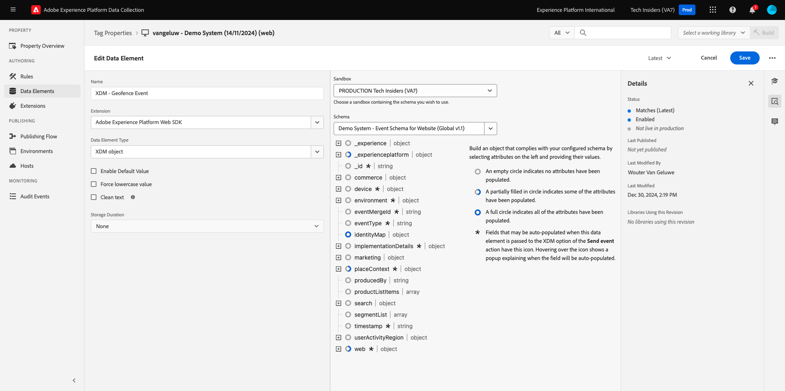
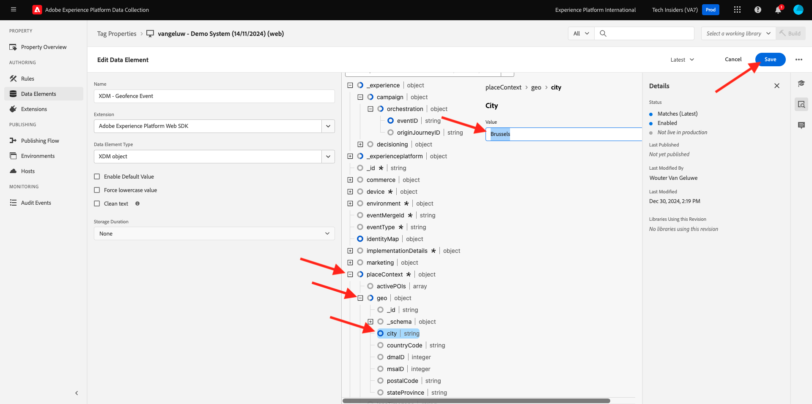
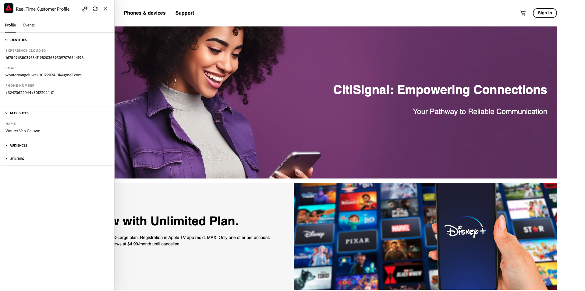

# 3.2.5 Trigger je reis

In deze oefening, zult u de reis testen en teweegbrengen u in deze module vormde.

## 3.2.5.1 De configuratie van uw geofence-gebeurtenis bijwerken

Ga naar [ de Inzameling van Gegevens van Adobe Experience Platform ](https://experience.adobe.com/launch/) en selecteer **Markeringen**.

Dit is de pagina Eigenschappen van Adobe Experience Platform-gegevensverzameling die u eerder hebt gezien.

In **Aan de slag**, leidde het Systeem van de Demo tot twee eigenschappen van de Cliënt voor u: voor de website en voor mobiele app. Zoek naar `--aepUserLdap--` in het vak **[!UICONTROL Search]** . Klik om het **bezit te openen 0} van het Web {.**

Dan zie je dit.

In het linkermenu, ga **Regels** en onderzoek naar de gebeurtenis van de regel **Geofence**. Klik de gebeurtenis van de regel **Geofence** om het te openen.

U zult dan de details van deze regel zien. Klik om de actie **SDK van het Web van Adobe Experience Platform te openen - verzend gebeurtenis**.

U zult dan zien dat wanneer deze actie wordt teweeggebracht, een specifiek gegevenselement wordt gebruikt om de XDM gegevensstructuur te bepalen. U moet dat gegevenselement bijwerken, en u moet **identiteitskaart van de Gebeurtenis** van de gebeurtenis bepalen die u in [ Uitoefening 3.2.1 ](./ex1.md) vormde.

U moet nu gaan het gegevenselement **XDM - de Gebeurtenis van het Geofence** bijwerken. Om dit te doen, ga naar **Elementen van Gegevens**. Onderzoek naar **XDM - de Gebeurtenis van het Geofence** en klik om dat gegevenselement te openen.

U zult dan dit zien:

Navigeer naar het veld `_experience.campaign.orchestration.eventID` . Verwijder de huidige waarde en plak de eventID daar.

Als herinnering, identiteitskaart van de Gebeurtenis kan in Adobe Journey Optimizer onder **Configuraties > Gebeurtenissen** worden gevonden en u zult gebeurtenistidentiteitskaart in de steekproeflading van uw even vinden, die als dit kijkt: `"eventID": "4df8dc10731eba7b0c37af83a9db38d4de7aa6aebcce38196d9d47929b9c598e"`.

Vervolgens moet u de plaats in dit gegevenselement definiëren. Ga naar **placeContext > geo > Plaats** en ga een stad van keus in. Daarna, klik **sparen** of **sparen aan Bibliotheek**.

Tot slot moet u uw wijzigingen publiceren. Ga naar **het Publiceren Stroom** in het linkermenu en klik **Man** om uw bibliotheek te openen.

Klik **toevoegen Alle Gewijzigde Middelen** en klik dan **sparen &amp; bouwen aan Ontwikkeling**.

## 3.2.5.2 Stem uw reis op

Ga naar [ https://dsn.adobe.com ](https://dsn.adobe.com). Nadat je je hebt aangemeld bij je Adobe ID, kun je dit zien. Klik de 3 punten **..** op uw websiteproject en klik dan **Looppas** om het te openen.

Vervolgens wordt uw demowebsite geopend. Selecteer de URL en kopieer deze naar het klembord.

Open een nieuw Incognito-browservenster.

Plak de URL van uw demowebsite, die u in de vorige stap hebt gekopieerd. Vervolgens wordt u gevraagd u aan te melden met uw Adobe ID.

Selecteer uw accounttype en voltooi het aanmeldingsproces.

Uw website wordt vervolgens geladen in een Incognito-browservenster. Voor elke oefening, zult u een vers, incognito browser venster moeten gebruiken om uw demowebsite URL te laden.

Klik op het Adobe-logopictogram in de linkerbovenhoek van het scherm om de Profile Viewer te openen.

Open het deelvenster Profielviewer en ga naar Klantprofiel in realtime. In het deelvenster Profielviewer worden al uw persoonlijke gegevens weergegeven, zoals de zojuist toegevoegde e-mail- en telefoon-id&#39;s.

Voor het paneel van de Kijker van het Profiel, klik **Hulpmiddelen**. Ga `geofenceevent` in en klik **verzenden**.

>[!NOTE]
>
>In het geval dat u niet de optie op het paneel van de Kijker van het Profiel hebt om een directe vraaggebeurtenis te verzenden, kunt u manueel verzenden door de Mening van de Ontwikkelaar van uw doorbladeren te openen en naar **Console** te gaan, en dan te kleven en dit bevel te verzenden: `_satellite.track('geofenceevent')`.

Een paar seconden later wordt het bericht van Adobe Journey Optimizer weergegeven in het kanaal van de Slack.

Volgende Stap: [ Samenvatting en voordelen ](./summary.md)

[Terug naar module 3.2](journey-orchestration-external-weather-api-sms.md)

[Terug naar alle modules](../../../overview.md)
