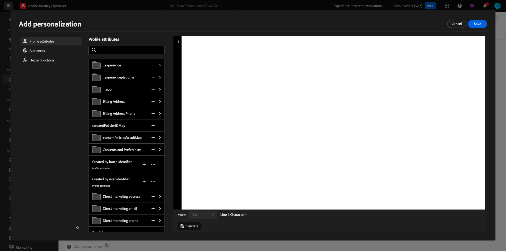
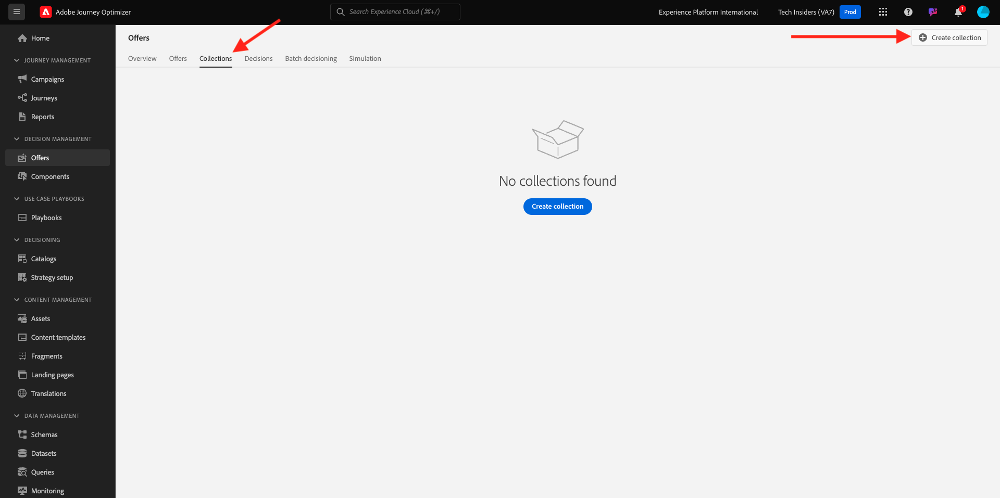

# 3.3.2 Uw aanbiedingen en beslissingen configureren

## 3.3.2.1 Maak je persoonlijke aanbiedingen

In deze oefening, zult u vier **Gepersonaliseerde Aanbiedingen** creëren. Hier volgen de details waarmee u rekening moet houden bij het maken van deze aanbiedingen:

| Naam | Datumbereik | Afbeeldingskoppeling voor e-mail | Afbeeldingskoppeling voor web | Tekst | Prioriteit | Subsidiabiliteit | Taal | Bijschriftfrequentie | Afbeeldingsnaam |
|-----|------------|----------------------|--------------------|------|:--------:|--------------|:-------:|:-------:|:-------:|
| `--aepUserLdap-- - AirPods Max` | vandaag - 1 maand later | https://bit.ly/4a9RJ5d | Kies uit Assets-bibliotheek | `{{ profile.person.name.firstName }}, 10% discount on AirPods Max` | 25 | all - Vrouwelijke klanten | Engels (Verenigde Staten) | 3 | Apple AirPods Max- Vrouwelijk.jpg |
| `--aepUserLdap-- - Galaxy S24` | vandaag - 1 maand later | https://bit.ly/3W8yuDv | Kies uit Assets-bibliotheek | `{{ profile.person.name.firstName }}, 5% discount on Galaxy S24` | 15 | all - Vrouwelijke klanten | Engels (Verenigde Staten) | 3 | Galaxy S24 - Female.jpg |
| `--aepUserLdap-- - Apple Watch` | vandaag - 1 maand later | https://bit.ly/4fGwfxX | https://bit.ly/4fGwfxX | `{{ profile.person.name.firstName }}, 10% discount on Apple Watch` | 25 | all - Mannelijke klanten | Engels (Verenigde Staten) | 3 | Apple Watch - Male.jpg |
| `--aepUserLdap-- - Galaxy Watch 7` | vandaag - 1 maand later | https://bit.ly/4gTrkeo | Kies uit Assets-bibliotheek | `{{ profile.person.name.firstName }}, 5% discount on Galaxy Watch 7` | 15 | all - Mannelijke klanten | Engels (Verenigde Staten) | 3 | Galaxy Watch7 - Male.jpg |

{style="table-layout:auto"}

Login aan Adobe Journey Optimizer door naar [ Adobe Experience Cloud ](https://experience.adobe.com) te gaan. Klik **Journey Optimizer**.

U zult aan de **1} mening van het Huis {in Journey Optimizer worden opnieuw gericht.** Eerst, zorg ervoor u de correcte zandbak gebruikt. De sandbox die moet worden gebruikt, wordt `--aepSandboxName--` genoemd. U zult dan in de **1} mening van het Huis {van uw zandbak `--aepSandboxName--` zijn.**

In het linkermenu, klik **Aanbiedingen** en ga dan naar **Aanbiedingen**. Klik op **+ Voorstel maken** .

Dan zie je deze popup. Selecteer **Gepersonaliseerde aanbieding** en klik **daarna**.

U bent nu op de **mening van Details**.

In dit geval moet u de aanbieding configureren `--aepUserLdap-- - AirPods Max` . Gebruik de informatie in de bovenstaande tabel om de velden in te vullen. In dit voorbeeld, is de naam van de Gepersonaliseerde Aanbieding **vangeluw - Max AirPods**. Ook, plaats de **datum en de tijd van het Begin** aan vandaag, en plaats de **datum en de tijd van het Eind** aan een datum in een maand van nu.

Als je klaar bent, moet je dit hebben. Klik **daarna**.

U zult dan dit zien:

Selecteer **door bepaalde besluitvormingsregel** en klik **+** pictogram om de regel **allen toe te voegen - Vrouwelijke Klanten**.

Vul de **Prioriteit** zoals vermeld in de bovengenoemde lijst uit. Klik vervolgens op **+ Afbeelding maken** om het aantal keren te definiëren dat deze aanbieding aan een klant kan worden getoond.

Selecteer de volgende opties voor de uitlijning:

- **kies het Bedekken gebeurtenis**: **gebeurtenis van het Besluit**
- **Afdekkend type**: **per profiel (pas GLB voor elk profiel toe)**
- **de gebeurtenistelling van de Aftapping**: **3**
- **Terugstellen die frequentie** begrenzen: **Dagelijks**
- **Elke**: **1 dag**

Dit zorgt ervoor dat dit voorstel niet meer dan drie keer per dag per klant wordt weergegeven.

Klik **creëren**.

Dan ben je hier weer. Klik **daarna**.

U moet nu **Vertegenwoordigingen** tot stand brengen. De vertegenwoordiging is een combinatie a **Plaatsing** en een echt middel.

Voor **Vertegenwoordiging 1**, selecteer:

- Kanaal: Web
- Plaatsing: Web - Afbeelding
- Inhoud: URL
- Openbare plaats: kopieer URL van de kolom **Verbinding van het Beeld voor Web** in de bovengenoemde lijst

Alternatief, kunt u **bibliotheek van Activa** voor de inhoud selecteren en dan **klikken doorbladert**.

U zult dan popup van de Bibliotheek van Assets zien, ga naar de omslag **enablement-activa** en selecteer het beelddossier **Max Apple AirPods - Female.jpg**. Dan, klik **Uitgezocht**.

Dan zie je dit. Klik op **+ Weergave toevoegen** .

Voor **Vertegenwoordiging 2**, selecteer:

- Kanaal: E-mail
- Plaatsing: E-mail - Afbeelding
- Inhoud: URL
- Openbare plaats: uitgezochte **bibliotheek van Activa**. Klik **doorbladeren**

U zult dan popup van de Bibliotheek van Assets zien, ga naar de omslag **enablement-activa** en selecteer het beelddossier **Max Apple AirPods - Female.jpg**. Dan, klik **Uitgezocht**.

Dan zie je dit. Klik vervolgens op **+ Voorstelling toevoegen** .

Voor **Vertegenwoordiging 3**, selecteer:

- Kanaal: niet-digitaal
- Plaatsing: niet-digitaal - tekst

Vervolgens moet u inhoud toevoegen. In dit geval betekent dit dat de tekst wordt toegevoegd die moet worden gebruikt als een oproep tot actie.

Selecteer **Douane** en klik **toevoegen Inhoud**.

Dan zie je deze popup.

Kijk naar het **1} gebied van de Tekst {van de bovengenoemde lijst en ga die tekst hier in, in dit geval: `{{ profile.person.name.firstName }}, 10% discount on AirPods Max`.**

U zult ook opmerken dat u om het even welk profielattribuut kunt selecteren en het als dynamisch gebied in de aanbiedingstekst opnemen. In dit voorbeeld zorgt het veld `{{ profile.person.name.firstName }}` ervoor dat de voornaam van de klant die dit aanbod ontvangt, wordt opgenomen in de aanbiedingstekst.

Dan zie je dit. Klik **sparen**.

U hebt dit nu. Klik **daarna**.

U zult dan een overzicht van uw nieuwe **Gepersonaliseerde Aanbieding** zien. Klik **Afwerking**.

Klik **sparen en keur** goed.

Je ziet dan dat je nieuwe persoonlijke aanbieding beschikbaar komt in het Overzicht van aanbiedingen:

Herhaal nu de bovenstaande stappen om de drie andere persoonlijke aanbiedingen te maken voor de producten die u in de bovenstaande tabel vindt.

Wanneer gedaan, zouden uw **Overzichten van de Aanbieding** scherm voor **Gepersonaliseerde Aanbiedingen** al uw aanbiedingen moeten tonen.

## 3.3.2.2 Maak je fallback-aanbieding

Na het creëren van vier Gepersonaliseerde Aanbiedingen, zou u a **Aanbieding van de Fallback** nu moeten vormen.

Zorg ervoor u in de **mening van Aanbiedingen** bent. Klik op **+ Voorstel maken** .

Dan zie je deze popup. Selecteer {de aanbieding van 0} Fallback **en klik** daarna **.**

Dan zie je dit. Voer deze naam in voor uw fallback-aanbieding: `--aepUserLdap-- - CitiSignal Fallback Offer` . Klik **daarna**.

U moet nu **Vertegenwoordigingen** tot stand brengen. De vertegenwoordiging is een combinatie a **Plaatsing** en een echt middel.

Voor **Vertegenwoordiging 1**, selecteer:

- **Kanaal**: **Web**
- **Plaatsing**: **Web - Beeld**
- **Inhoud**: **bibliotheek van Activa**

Klik **doorbladeren** om uw beeld te selecteren.

U zult dan popup van de Bibliotheek van Assets zien, naar de omslag **citi-signaal-beelden** gaan en het beelddossier **app-Banner-Ad.jpg** selecteren. Dan, klik **Uitgezocht**.

Dan zie je dit. Klik op **+ Voorstelling toevoegen** .

Voor **Vertegenwoordiging 2**, selecteer:

- **Kanaal**: **E-mail**
- **Plaatsing**: **E-mail - Beeld**
- **Inhoud**: **bibliotheek van Activa**

Klik **doorbladeren** om uw beeld te selecteren.

U zult dan popup van de Bibliotheek van Assets zien, naar de omslag **citi-signaal-beelden** gaan en het beelddossier **app-Banner-Ad.jpg** selecteren. Dan, klik **Uitgezocht**.

Dan zie je dit. Klik op **+ Voorstelling toevoegen** .

Voor **Vertegenwoordiging 3**, selecteer:

- **Kanaal**: **niet-digitaal**
- **Plaatsing**: **niet-digitaal - Tekst**
- **Inhoud**: **Douane**

Klik **toevoegen Inhoud**.

Dan zie je deze popup. Ga de tekst `{{ profile.person.name.firstName }}, download the CitiSignal app now!` in en klik **sparen**.

Dan zie je dit. Klik **daarna**.

U zult dan een overzicht van uw nieuwe **Aanbieding van de Fallback** zien. Klik **Afwerking**.

Tot slot klik **sparen en keur** goed.

In uw **Overzichten van de Aanbieding** scherm, zult u dit nu zien:

## 3.3.2.3 Maak uw collectie

Een inzameling wordt gebruikt aan **filter** uit een ondergroep aanbiedingen van de gepersonaliseerde lijst van de aanbieding en gebruik dat als deel van een Besluit om het besluitvormingsproces te versnellen.

Ga naar **Inzamelingen**. Klik op **+ Verzameling maken** .

Dan zie je deze popup. Configureer uw verzameling op deze manier. Klik **daarna**.

- Naam van verzameling: gebruik `--aepUserLdap-- - CitiSignal Collection`
- Selecteer **creeer statische inzameling**.

Klik **daarna**.

In het volgende scherm, selecteer de vier **Gepersonaliseerde Aanbiedingen** u in de vorige oefening creeerde. Klik **sparen**.

U ziet nu het volgende:

## 3.3.2.4 Maak uw beslissing

In een besluit worden Plaatsingen, een collectie persoonlijke aanbiedingen en een terugvalaanbieding gecombineerd die uiteindelijk door de Offer decisioning-engine worden gebruikt om de beste aanbieding voor een specifiek profiel te vinden, op basis van elk van de individuele kenmerken van de gepersonaliseerde aanbieding, zoals prioriteit, geschiktheidsbeperking en totale/gebruikersbeperking.

Om uw **Besluit** te vormen, ga **Besluiten**. Klik op **+ Beslissing maken** .

Dan zie je dit. Vul de velden zo in. Klik **daarna**.

- Naam: `--aepUserLdap-- - CitiSignal Decision`
- Begindatum en -tijd: vandaag
- Einddatum en -tijd: vandaag + 1 maand

In het volgende scherm, moet u plaatsingen in besluitvormingswerkingsgebied toevoegen. U zult besluitvormingswerkingsgebieden voor het Web van plaatsen **- Beeld**, **E-mail - Beeld** en **niet-digitaal - Tekst** moeten tot stand brengen.

Eerst, creeer het besluitvormingswerkingsgebied voor **niet-digitaal - Tekst** door die plaatsing in dropdown te selecteren. Dan, klik **toevoegen** knoop om evaluatiecriteria toe te voegen.

Selecteer uw inzameling `--aepUserLdap-- - CitiSignal Collection` en klik **toevoegen**.

Dan zie je dit. Klik op de knop **+** om een nieuw beslissingsbereik toe te voegen.

Selecteer het plaatsing **Web - Beeld** en voeg uw inzameling `--aepUserLdap-- - CitiSignal Collection` onder evaluatiecriteria toe. Klik vervolgens nogmaals op de knop **+** om een nieuw beslissingsbereik toe te voegen.

Selecteer de plaatsing **E-mail - Beeld** en voeg uw inzameling `--aepUserLdap-- - CitiSignal Collection` onder evaluatiecriteria toe. Dan, klik **daarna**.

U moet nu uw **Aanbieding van de Fallback** selecteren, die `--aepUserLdap-- - CitiSignal Fallback Offer` wordt genoemd. Klik **daarna**.

Controleer uw beslissing. Klik **Afwerking**.

In popup, klik **sparen en activeer**.

Tot slot zie je nu je beslissing in het overzicht:

U hebt nu met succes uw besluit gevormd. Uw besluit is nu live en kan worden gebruikt om uw klanten in real-time geoptimaliseerde en gepersonaliseerde aanbiedingen te bieden.

Volgende Stap: [ 3.3.3 bereidt uw bezit van de Cliënt van de Inzameling van Gegevens en de opstelling van SDK van het Web voor Offer decisioning voor ](./ex3.md)

[Terug naar module 3.3](./offer-decisioning.md)

[Terug naar alle modules](./../../../overview.md)
