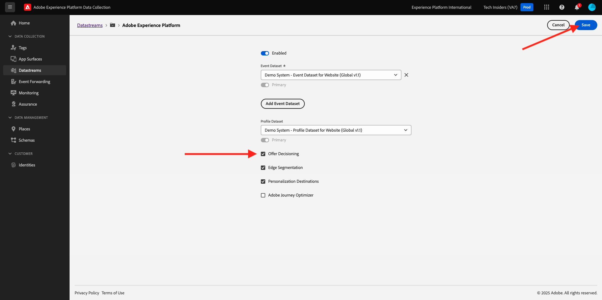
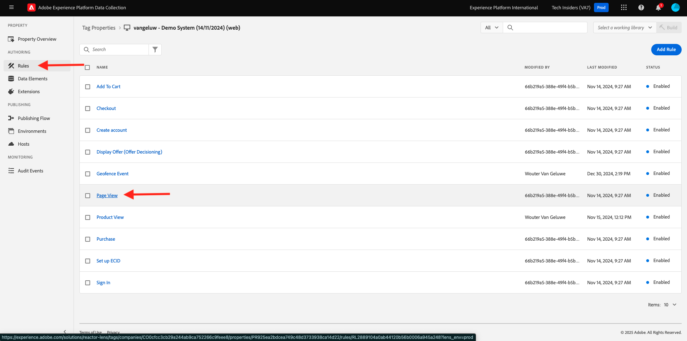
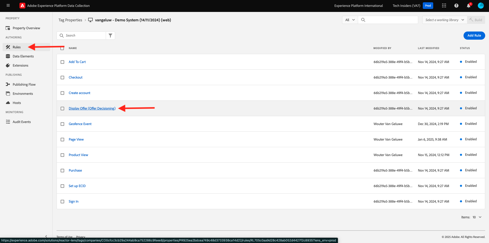

# 3.3.3 Bereid uw bezit van de Cliënt van de Gegevensverzameling van Adobe Experience Platform en de opstelling van het Web SDK voor Offer decisioning voor

## 3.3.3.1 De gegevensstroom bijwerken

In [ Begonnen het Worden ](./../../../modules/gettingstarted/gettingstarted/ex2.md), creeerde u uw eigen **Datastream**. Vervolgens hebt u de naam `--aepUserLdap-- - Demo System Datastream` gebruikt.

In deze oefening, moet u dat **Datastream** vormen om met **Offer decisioning** te werken.

Om dat te doen, ga naar [ https://experience.adobe.com/#/data-collection/ ](https://experience.adobe.com/#/data-collection/). Dan zie je dit. Klik **DataStream**.

Selecteer in de rechterbovenhoek van het scherm de naam van de sandbox, die `--aepSandboxName--` moet zijn.


Onderzoek naar uw **Datastream**, die `--aepUserLdap-- - Demo System Datastream` wordt genoemd. Klik uw **Datastream** om het te openen.


Dan zie je dit. Klik **...** naast **Adobe Experience Platform** en klik dan **uitgeven**.


Om **Offer decisioning** toe te laten, controleer de doos voor **Offer decisioning**. Klik **sparen**.



Uw **Datastream** is nu klaar om met **Offer decisioning** te werken.


## 3.3.3.2 Configureer uw Adobe Experience Platform Data Collection Client-eigenschap om persoonlijke aanbiedingen aan te vragen

Ga naar [ https://experience.adobe.com/#/data-collection/ ](https://experience.adobe.com/#/data-collection/), aan **Markeringen**. Zoek naar uw eigenschappen van de Inzameling van Gegevens, die `--aepUserLdap-- - Demo System (DD/MM/YYYY)` worden genoemd. Open de de cliëntbezit van de Inzameling van Gegevens voor Web.


In u bezit, ga naar **Regels** en open de mening van de regel **Pagina**.



Klik om de Actie **te openen verzend de Gebeurtenis van de Ervaring van de Mening van de Pagina**.


Dan zie je dit. Onder **Personalization**, zult u de optie voor **Scopes** opmerken.


Voor elk verzoek dat naar de rand en naar Adobe Experience Platform wordt verzonden, is het mogelijk om één of meerdere **Scopes van het Besluit** te verstrekken. A **het Reikwijdte van het Besluit** is een combinatie van twee elementen:

- Beslissings-id
- Plaatsing-id

Laten we eerst eens kijken waar je die twee elementen kunt vinden.

### 3.3.3.2.1 De plaatsings-id ophalen

De plaatsings-id identificeert de locatie en het type van het vereiste element. De hoofdafbeelding op de homepage van de CitiSignal-website komt bijvoorbeeld overeen met de Placement ID for Web - Image.

>[!NOTE]
>
>Als deel van oefening 2.3.5, vormde u reeds een Ervaring van Adobe Target richtend activiteit die het beeld van de heldenplaats op de homepage zal veranderen, zoals u in het schermafbeelding kunt zien. Voor deze oefening, zult u uw voorstellen nu op het beeld onder het heldenbeeld verschijnen zoals die in het het schermschot wordt vermeld.


Om identiteitskaart van de Plaatsing voor Web te vinden - Beeld gaat naar Adobe Journey Optimizer door [ Adobe Experience Cloud ](https://experience.adobe.com) te gaan. Klik **Journey Optimizer**.


U zult aan de **1} mening van het Huis {in Journey Optimizer worden opnieuw gericht.** Eerst, zorg ervoor u de correcte zandbak gebruikt. De sandbox die moet worden gebruikt, wordt `--aepSandboxName--` genoemd. U zult dan in de **1} mening van het Huis {van uw zandbak `--aepSandboxName--` zijn.**


Ga vervolgens naar Componenten en vervolgens naar Plaatsen. Klik het **Web - de plaatsing van het Beeld** om zijn details te zien.


Zoals u in de bovenstaande afbeelding ziet, is in dit voorbeeld de Plaatsing-id `dps:offer-placement:1a08a14ccfe533b6` . Schrijf de Plaatsing-id voor uw plaatsing voor Web - Afbeelding neer aangezien u het in de volgende oefening zult nodig hebben.

### 3.3.3.2.2 Je beslissing-ID van voorstel ophalen

De **identiteitskaart van het besluit van de Aanbieding van de Aanbieding** identificeert welke combinatie Gepersonaliseerde Aanbiedingen en Aanbieding van de Fallback u zou willen gebruiken. In de vorige oefening, creeerde u uw eigen Besluit en noemde het `--aepUserLdap-- - CitiSignal Decision`.

Ga naar Voorstel en ga naar Besluiten als je de keuze-id voor het voorstel voor je `--aepUserLdap-- - CitiSignal Decision` wilt vinden. Klik om uw besluit te selecteren, dat `--aepUserLdap-- - CitiSignal Decision` wordt genoemd.


Zoals u in de bovenstaande afbeelding kunt zien, is in dit voorbeeld de keuze-id `dps:offer-activity:1a08ba4b529b2fb2` . Noteer de keuze-id voor de biedingsbeslissing `--aepUserLdap-- - CitiSignal Decision` , net zoals u deze in de volgende exercitie nodig hebt.

Nu u de twee elementen hebt teruggewonnen u a **BeslissingsScopes** moet creëren, kunt u met de volgende stap verdergaan, die het besluitvormingswerkingsgebied impliceert coderen.

### 3.3.3.2.3 BASE64-codering

Het **Reikwijdte van het Besluit** u moet ingaan is een BASE64-Gecodeerde koord. Deze BASE64-gecodeerde tekenreeks is een combinatie van de Placement-id en de Besluit-id, zoals hieronder te zien is:

```json
{
  "xdm:activityId": "dps:offer-activity:1a08ba4b529b2fb2",
  "xdm:placementId": "dps:offer-placement:1a08a14ccfe533b6"
}
```

U kunt de met BASE64 gecodeerde tekenreeks ophalen uit Adobe Experience Platform. Ga naar Besluiten en klik om uw Besluit te openen, dat `--aepUserLdap-- - CitiSignal Decision` heet.


Na het openen van `--aepUserLdap-- - CitiSignal Decision`, zult u dit zien. Bepaal de plaats van het Web van de plaatsing - Beeld en klik de **knoop van het Exemplaar**. Daarna, klik **Gecodeerd besluitvormingswerkingsgebied**. Het **Reikwijdte van het Besluit** wordt nu gekopieerd aan uw klembord.


Daarna, ga terug naar Lancering, aan uw actie **AEP Web SDK - verzend Gebeurtenis**.


Plak het gecodeerde beslissingsbereik in het invoerveld. Sparen uw veranderingen in de actie **AEP Web SDK - verzend Gebeurtenis** door **[!UICONTROL Keep Changes]** te klikken.


Klik vervolgens op **[!UICONTROL Save]** .


Ga in Adobe Experience Platform Data Collection naar **[!UICONTROL Publishing Flow]** en open uw **[!UICONTROL Development Library]** met de naam **[!UICONTROL Main]** . Klik op **[!UICONTROL + Add All Changed Resources]** en vervolgens op **[!UICONTROL Save & Build for Development]** . Uw wijzigingen worden nu gepubliceerd naar uw demo-website.


Telkens als u a **Algemene Pagina** nu laadt, zoals bijvoorbeeld de homepage van de demowebsite, zal de Offer decisioning evalueren wat de toepasselijke aanbieding is en zal een reactie terug naar de website met de details van de te tonen aanbieding terugkeren. Als u het voorstel op de website wilt weergeven, hebt u een extra configuratie nodig, die u in de volgende stap uitvoert.

## 3.3.3.3 Configureer uw Adobe Experience Platform Data Collection Client-eigenschap om persoonlijke aanbiedingen te ontvangen en toe te passen

Ga naar [ https://experience.adobe.com/#/data-collection/ ](https://experience.adobe.com/#/data-collection/), aan **[!UICONTROL Properties]**. Zoek naar uw eigenschappen van de Inzameling van Gegevens, die `--aepUserLdap-- - Demo System (DD/MM/YYYY)` worden genoemd. Open de eigenschap Gegevensverzameling voor het web.


In uw bezit, ga naar **Regels**. Onderzoek en open de lijn **Aanbieding van de Vertoning (Offer decisioning)**.



Dan zie je dit. Open de actie **Vertoning de aanbieding op de pagina**.


Klikken **[!UICONTROL Open Editor]**


Overschrijf de code door de onderstaande code in de editor te plakken.

```javascript
if (!Array.isArray(event.decisions)) {
  console.log("No personalization decisions");
  return;
}

console.log("Received response from Offer Decisioning", event.decisions);

event.decisions.forEach(function (payload) {
  payload.items.forEach(function (item) {
    console.log("Offer", item.data.deliveryURL);

    if (!item.data || item.data?.deliveryURL==null) {
      return;
    }
    console.log("item.data.deliveryURL", item.data.deliveryURL)
    //document.querySelector(".TopRibbon").innerHTML = item.data.content;
    document.querySelector("#SpectrumProvider > div.App > div > div.Page.home > main > div:nth-child(2)").innerHTML = "";
    document.querySelector("#SpectrumProvider > div.App > div > div.Page.home > main > div:nth-child(2) > img").style.backgroundRepeat="no-repeat";
    document.querySelector("#SpectrumProvider > div.App > div > div.Page.home > main > div:nth-child(2) > img").style.backgroundPosition="center center";
    document.querySelector("#SpectrumProvider > div.App > div > div.Page.home > main > div:nth-child(2) > img").style.backgroundSize = "contain";
  });
});
```

Regels 17 passen de afbeelding die door de Offer decisioning wordt geretourneerd, toe op de website. Klik op **[!UICONTROL Save]**.


Klik op **[!UICONTROL Keep Changes]**.


Klik vervolgens op **[!UICONTROL Save]** .


Ga in Adobe Experience Platform Data Collection naar **[!UICONTROL Publishing Flow]** en open uw **[!UICONTROL Development Library]** met de naam **[!UICONTROL Main]** . Klik op **[!UICONTROL + Add All Changed Resources]** en vervolgens op **[!UICONTROL Save & Build for Development]** . Uw wijzigingen worden nu gepubliceerd naar uw demo-website.


Met deze verandering, zal deze regel in de Inzameling van Gegevens van Adobe Experience Platform nu naar de reactie van Offer decisioning luisteren die deel van de reactie van SDK van het Web uitmaakt, en wanneer de reactie wordt ontvangen, zal het beeld van de aanbieding op de homepage worden getoond.

Als u de demo-website bekijkt, ziet u dat deze afbeelding nu wordt vervangen. In plaats van de standaardafbeeldingen van de CitiSignal-website ziet u nu een aanbieding als deze. In dit geval wordt de fallback-aanbieding weergegeven.


U hebt nu twee soorten personalisatie geconfigureerd:

- 1 Ervaring Doelactiviteit met Adobe Target in oefening 2.3.5
- 1 implementatie van de Offer decisioning die uw bezit van de Inzameling van Gegevens gebruikt

In de volgende oefening zult u zien hoe u uw aanbiedingen en besluiten kunt combineren die in Adobe Journey Optimizer met een de Ervaring van Adobe Target gerichte activiteit werden gecreeerd.

Volgende Stap: [ 3.3.4 combineren Adobe Target en Offer decisioning ](./ex4.md)

[Terug naar module 3.3](./offer-decisioning.md)

[Terug naar alle modules](./../../../overview.md)
