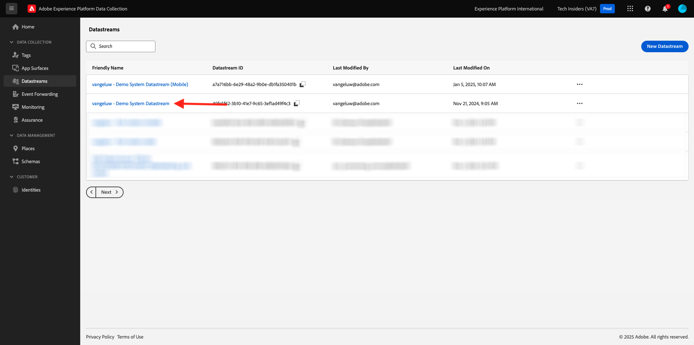
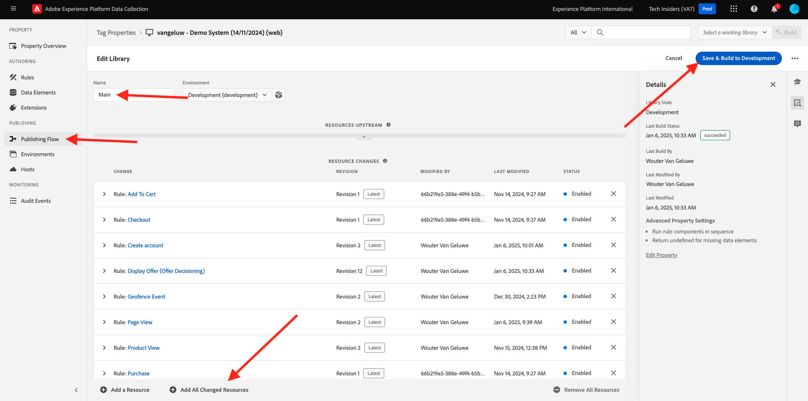

# 3.3.3 Bereid uw bezit van de Cliënt van de Gegevensverzameling van Adobe Experience Platform en de opstelling van SDK van het Web voor Offer decisioning voor

## 3.3.3.1 De gegevensstroom bijwerken

In [ Uitoefening 0.2 ](./../../../modules/gettingstarted/gettingstarted/ex2.md), creeerde u uw eigen **[!UICONTROL Datastream]**. Vervolgens hebt u de naam `--aepUserLdap-- - Demo System Datastream` gebruikt.

In deze oefening, moet u dat **[!UICONTROL Datastream]** vormen om met **[!DNL Offer Decisioning]** te werken.

Om dat te doen, ga naar [ https://experience.adobe.com/#/data-collection/ ](https://experience.adobe.com/#/data-collection/). Dan zie je dit. Klik op **[!UICONTROL Datastreams]** of **[!UICONTROL Datastreams (Beta)]** .

Selecteer in de rechterbovenhoek van het scherm de naam van de sandbox, die `--aepSandboxName--` moet zijn.


Zoek naar uw **[!UICONTROL Datastream]**, die `--aepUserLdap-- - Demo System Datastream` wordt genoemd. Klik op de **[!UICONTROL Datastream]** om deze te openen.



Dan zie je dit. Klik **...** naast **Adobe Experience Platform** en klik dan **uitgeven**.


Schakel het selectievakje voor **[!DNL Offer Decisioning]** in om **[!DNL Offer Decisioning]** in te schakelen. Klik **sparen**.


Uw **[!UICONTROL Datastream]** is nu klaar om te werken met **[!DNL Offer Decisioning]** .


## 3.3.3.2 Configureer uw Adobe Experience Platform Data Collection Client-eigenschap om persoonlijke aanbiedingen aan te vragen

Ga naar [ https://experience.adobe.com/#/data-collection/ ](https://experience.adobe.com/#/data-collection/), aan **[!UICONTROL Client]**. Zoek naar uw eigenschappen van de Inzameling van Gegevens, die `--aepUserLdap-- - Demo System (DD/MM/YYYY)` worden genoemd. Open de de cliëntbezit van de Inzameling van Gegevens voor Web.


Ga in uw eigenschap naar **[!UICONTROL Rules]** en open de regel **[!UICONTROL Page View]** .


Klik om [!UICONTROL Action] **[!UICONTROL AEP Web SDK - Send Event]** te openen.


Dan zie je dit. U zult de menuoptie voor **[!UICONTROL Decision Scopes]** opmerken.


Voor elke aanvraag die naar Edge en Adobe Experience Platform wordt verzonden, is het mogelijk een of meer **[!UICONTROL Decision Scopes]** -aanvragen op te geven. A **[!UICONTROL Decision Scope]** is een combinatie van twee elementen:

- [!UICONTROL Decision ID]
- [!UICONTROL Placement ID]

Laten we eerst eens kijken waar je die twee elementen kunt vinden.

### 3.3.3.2.1 Uw [!UICONTROL Placement ID] ophalen

In [!UICONTROL Placement ID] worden de locatie en het type element aangegeven die zijn vereist. De hoofdafbeelding op de homepage van de Luma-website komt bijvoorbeeld overeen met de [!UICONTROL Placement ID] for [!UICONTROL Web - Image] .

>[!NOTE]
>
>Als onderdeel van module 6 hebt u al een Adobe Target Experience Targeting-activiteit geconfigureerd waarmee het beeld van de hoofdlocatie op de startpagina wordt gewijzigd, zoals u kunt zien in de schermafbeelding. Omwille van de oefening gaat u nu uw aanbiedingen op de afbeelding weergeven onder de hoofdafbeelding zoals die in de schermafbeelding is aangegeven.


Om [!UICONTROL Placement ID] voor [!UICONTROL Web - Image] te vinden ga naar Adobe Journey Optimizer door [ Adobe Experience Cloud ](https://experience.adobe.com) te gaan. Klik **Journey Optimizer**.


U zult aan de **1} mening van het Huis {in Journey Optimizer worden opnieuw gericht.** Eerst, zorg ervoor u de correcte zandbak gebruikt. De sandbox die moet worden gebruikt, wordt `--aepSandboxName--` genoemd. Om van één zandbak in een andere te veranderen, klik op **Prod van de PRODUCTIE (VA7)** en selecteer de zandbak van de lijst. In dit voorbeeld, wordt de zandbak genoemd **AEP Enablement FY22**. U zult dan in de **1} mening van het Huis {van uw zandbak `--aepSandboxName--` zijn.**


Ga vervolgens naar [!UICONTROL Components] en [!UICONTROL Placements] . Klik op de plaatsing [!UICONTROL Web - Image] om de details weer te geven.


Zoals u in de bovenstaande afbeelding kunt zien, is in dit voorbeeld de waarde [!UICONTROL Placement ID] `xcore:offer-placement:14bf09dc4190ebba` . Schrijf de [!UICONTROL Placement ID] voor uw plaatsing voor [!UICONTROL Web - Image] neer aangezien u het in de volgende oefening zult nodig hebben.

### 3.3.3.2.2 Haal uw [!UICONTROL Decision ID] op

In [!UICONTROL Decision ID] wordt aangegeven welke combinatie van persoonlijke aanbiedingen en een terugvalaanbieding u wilt gebruiken. In de vorige oefening, creeerde u uw eigen [!UICONTROL Decision] en noemde het `--aepUserLdap-- - Luma Decision`.

Om [!UICONTROL Decision ID] voor uw `--aepUserLdap-- - Luma Decision` te vinden, ga [ https://platform.adobe.com ](https://platform.adobe.com).

Ga vervolgens naar [!UICONTROL Offers] en ga naar [!UICONTROL Decisions] . Klik om de [!UICONTROL Decision] te selecteren. Deze heeft de naam `--aepUserLdap-- - Luma Decision` .


Zoals u in de bovenstaande afbeelding kunt zien, is in dit voorbeeld de waarde [!UICONTROL Decision ID] `xcore:offer-activity:14c052382e1b6505` . Schrijf de [!UICONTROL Decision ID] voor uw beslissing `--aepUserLdap-- - Luma Decision` neer aangezien u het in de volgende oefening zult nodig hebben.

Nu u de twee elementen hebt teruggewonnen u moet creëren **[!UICONTROL Decision Scopes]**, kunt u met de volgende stap verdergaan, die het besluitvormingswerkingsgebied impliceert coderen.

### 3.3.3.2.3 BASE64-codering

**[!UICONTROL Decision Scope]** u moet ingaan is een BASE64-Gecodeerde koord. Deze BASE64-gecodeerde tekenreeks is een combinatie van de [!UICONTROL Placement ID] en de [!UICONTROL Decision ID] , zoals hieronder te zien is.

```json
{
  "activityId":"xcore:offer-activity:14c052382e1b6505",
  "placementId":"xcore:offer-placement:14bf09dc4190ebba"
}
```

**[!UICONTROL Decision Scope]** kan op twee manieren worden gegenereerd:

- Gebruik de openbare dienst als [ https://www.base64encode.org/ ](https://www.base64encode.org/). Voer de JSON-code in zoals hierboven vermeld, klik op **[!UICONTROL Encode]** en hieronder ziet u de tekenreeks die door BASE64 is gecodeerd.

  

- Haal de met BASE64 gecodeerde tekenreeks op uit Adobe Experience Platform. Ga naar [!UICONTROL Decisions] en klik om de [!UICONTROL Decision] , die `--aepUserLdap-- - Luma Decision` heet, te openen.

  

  Na het openen van `--aepUserLdap-- - Luma Decision`, zult u dit zien. Zoek de plaatsing [!UICONTROL Web - Image] en klik op de knop **[!UICONTROL Copy]** . Klik vervolgens op **[!UICONTROL Encoded decision scope]** . **[!UICONTROL Decision Scope]** wordt nu gekopieerd naar het klembord.

  

Ga vervolgens terug naar Starten, naar uw handeling **[!UICONTROL AEP Web SDK - Send Event]** .


Plak het gecodeerde beslissingsbereik in het invoerveld.


Sla de wijzigingen op in de handeling **[!UICONTROL AEP Web SDK - Send Event]** door op **[!UICONTROL Keep Changes]** te klikken.


Klik vervolgens op **[!UICONTROL Save]** of **[!UICONTROL Save to Library]**


Ga in Adobe Experience Platform Data Collection naar **[!UICONTROL Publishing Flow]** en open uw **[!UICONTROL Development Library]** met de naam **[!UICONTROL Main]** . Klik op **[!UICONTROL + Add All Changed Resources]** en vervolgens op **[!UICONTROL Save & Build for Development]** . Uw wijzigingen worden nu gepubliceerd naar uw demo-website.


Telkens als u a **Algemene Pagina** nu laadt, zoals bijvoorbeeld de homepage van de demowebsite, zal de Offer decisioning evalueren wat de toepasselijke aanbieding is en zal een reactie terug naar de website met de details van de te tonen aanbieding terugkeren. Als u het voorstel op de website wilt weergeven, hebt u een extra configuratie nodig, die u in de volgende stap uitvoert.

## 3.3.3.3 Configureer uw Adobe Experience Platform Data Collection Client-eigenschap om persoonlijke aanbiedingen te ontvangen en toe te passen

Ga naar [ https://experience.adobe.com/#/data-collection/ ](https://experience.adobe.com/#/data-collection/), aan **[!UICONTROL Properties]**. Zoek naar uw eigenschappen van de Inzameling van Gegevens, die `--aepUserLdap-- - Demo System (DD/MM/YYYY)` worden genoemd. Open de eigenschap Gegevensverzameling voor het web.


Ga in uw eigenschap naar **[!UICONTROL Rules]** .


Onderzoek en open het regel **Ontvangen Besluit**.


Dan zie je dit. Open de actie **Plaats de aanbieding op de pagina**.


Klikken **[!UICONTROL Open Editor]**


Overschrijf de code door de onderstaande code in de editor te plakken.

```javascript
if(!Array.isArray(event.decisions)) {
  console.log('No decisions returned')
  return;
}
console.log("decision",event.decisions)

event.decisions.forEach(function(payload) {
  payload.items.forEach(function(item){
    console.log("Response from Offer Decisioning ", item.data.content);
   
    var element = document.querySelector("#root > div > div > div.app-content > div > section.feature_part.padding_top > div > div.row.align-items-center.justify-content-between > div.col-lg-7.col-sm-6.\\30  > div");
    if(!element){
      console.log("Offer Placement Area Selector not found")
      return;
    }
    if(!item.data){
      return
    }
    //check if offer already exists
    var offer = document.querySelector("#root > div > div > div.app-content > div > section.feature_part.padding_top > div > div.row.align-items-center.justify-content-between > div.col-lg-7.col-sm-6.\\30  > div");
    if(!offer){ 
      element.insertAdjacentHTML('afterbegin', item.data.content) 
    }
    else { 
      console.log("item.data.deliveryURL: " + item.data.deliveryURL)
      document.querySelector("#root > div > div > div.app-content > div > section.feature_part.padding_top > div > div.row.align-items-center.justify-content-between > div.col-lg-7.col-sm-6.\\30  > div").style.background="url('"+item.data.deliveryURL+"')";
      document.querySelector("#root > div > div > div.app-content > div > section.feature_part.padding_top > div > div.row.align-items-center.justify-content-between > div.col-lg-7.col-sm-6.\\30  > div").style.backgroundRepeat="no-repeat";
      document.querySelector("#root > div > div > div.app-content > div > section.feature_part.padding_top > div > div.row.align-items-center.justify-content-between > div.col-lg-7.col-sm-6.\\30  > div").style.backgroundPosition="center center";
      document.querySelector("#root > div > div > div.app-content > div > section.feature_part.padding_top > div > div.row.align-items-center.justify-content-between > div.col-lg-7.col-sm-6.\\30  > div").style.backgroundSize = "contain";
    }  
  })
});
```

Regels 26-27-28-29 passen de afbeelding die door de Offer decisioning wordt geretourneerd, toe op de website. Klik op **[!UICONTROL Save]**.


Klik op **[!UICONTROL Keep Changes]**.


Klik vervolgens op **[!UICONTROL Save]** of **[!UICONTROL Save to Library]**


Ga in Adobe Experience Platform Data Collection naar **[!UICONTROL Publishing Flow]** en open uw **[!UICONTROL Development Library]** met de naam **[!UICONTROL Main]** . Klik op **[!UICONTROL + Add All Changed Resources]** en vervolgens op **[!UICONTROL Save & Build for Development]** . Uw wijzigingen worden nu gepubliceerd naar uw demo-website.



Met deze verandering, zal deze regel in de Inzameling van Gegevens van Adobe Experience Platform nu naar de reactie van Offer decisioning luisteren die deel van de reactie van SDK van het Web uitmaakt, en wanneer de reactie wordt ontvangen, zal het beeld van de aanbieding op de homepage worden getoond.

Als u de demo-website bekijkt, ziet u dat deze afbeelding nu wordt vervangen:

>[!NOTE]
>
>Als onderdeel van module 6 hebt u al een Adobe Target Experience Targeting-activiteit geconfigureerd waarmee het beeld van de hoofdlocatie op de startpagina wordt gewijzigd, zoals u kunt zien in de schermafbeelding. Omwille van de oefening gaat u nu uw aanbiedingen op de afbeelding weergeven onder de hoofdafbeelding zoals die in de schermafbeelding is aangegeven.


En in plaats van de standaard Luma-websitemateriaal ziet u nu een aanbieding als deze. In dit geval wordt de fallback-aanbieding weergegeven.


U hebt nu twee soorten personalisatie geconfigureerd:

- 1 Ervaring gerichte activiteit met Adobe Target in Module 6
- 1 implementatie van de Offer decisioning die uw bezit van de Inzameling van Gegevens gebruikt

In de volgende oefening zult u zien hoe u uw aanbiedingen en besluiten kunt combineren die in Adobe Journey Optimizer met een de Ervaring van Adobe Target gerichte activiteit werden gecreeerd.

Volgende Stap: [ 3.3.4 combineren Adobe Target en Offer decisioning ](./ex4.md)

[Terug naar module 3.3](./offer-decisioning.md)

[Terug naar alle modules](./../../../overview.md)
