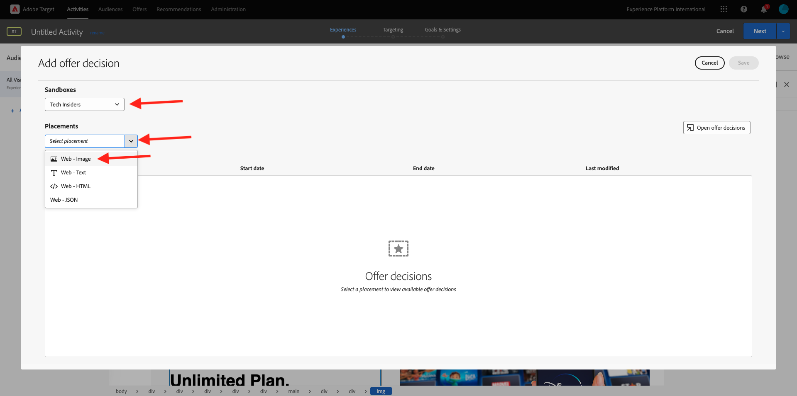

# 3.3.4 Combineer Adobe Target en Offer decisioning

## 3.3.4.1 Verzamel de shareable link van uw demo-project

Als u het demo-websiteproject in Adobe Target wilt laden, moet u eerst een speciale koppeling verzamelen waarmee Adobe Target uw demo-websiteproject kan laden.

Om dat te doen, ga naar [ https://builder.adobedemo.com/projects ](https://builder.adobedemo.com/projects). Nadat je je hebt aangemeld bij je Adobe ID, kun je dit zien. Klik op uw websiteproject om het te openen.

Dit zie je nu. Klik **Aandeel**.

Klik **produceer Verbinding** en kopieer dan de verbinding aan uw klembord.

Ga naar [ https://bitly.com ](https://bitly.com), kleef de verbinding u kopieerde en klik **korter**. U krijgt nu een verkorte koppeling, die er als volgt uitziet: `https://bit.ly/3JxN7aG` . Je hebt die link nodig in de volgende oefening.

## 3.3.4.2 Verzamelen

Ga nu naar de homepage van Adobe Experience Cloud door [ https://experiencecloud.adobe.com/ ](https://experiencecloud.adobe.com/) te gaan. Klik **Doel**.

Op **Adobe Target** homepage, zult u alle bestaande Activiteiten zien.

Klik op **+ Activiteit maken** om een nieuwe activiteit te maken.

Selecteer **Ervaring richtend**.

Nu uitgezochte **Visuele** en kleeft uw verkorte verbinding op het gebied **ga Activiteit URL** in. Klik **daarna**.

Vervolgens ziet u hoe uw demo-websiteproject wordt geladen in de Visuel Experience Composer.

Ga naar **doorbladeren** wijze om **te klikken allen** op popup van de koekjestoestemming toestaat.

Klik het gebied dat de tekst **Aanbevolen Categorieën** bevat. Klik **Tussenvoegsel vóór** en selecteer dan **Besluit van de Aanbieding**.

Dan zie je deze popup. Selecteer uw zandbak `--aepSandboxName--` en selecteer dan de plaatsing **Web - Beeld**.

Selecteer vervolgens uw beslissing `--aepUserLdap-- - Luma Decision` . Klik **sparen**.

Dan zie je dit. Zorg ervoor een extra malplaatjeregel **URL** **toevoegt** **uw-project-naam**. CLick **sparen**.

Dan zie je dit. Klik **daarna**.

Voer een naam in voor uw aanbieding. Gebruik deze naam: `--aepUserLdap-- - XT with Offers (VEC)` . Klik **daarna**.

Dan zie je dit. Bepaal uw **metrische Goal** zoals vermeld. Klik **sparen &amp; Sluiten**.

Je voorstel is nu gemaakt en wordt gepubliceerd.

Zodra je voorstel is gepubliceerd, kun je het inschakelen.

Volgende Stap: [ 3.3.5 gebruik uw besluit in e-mail en sms ](./ex5.md)

[Terug naar module 3.3](./offer-decisioning.md)

[Terug naar alle modules](./../../../overview.md)
