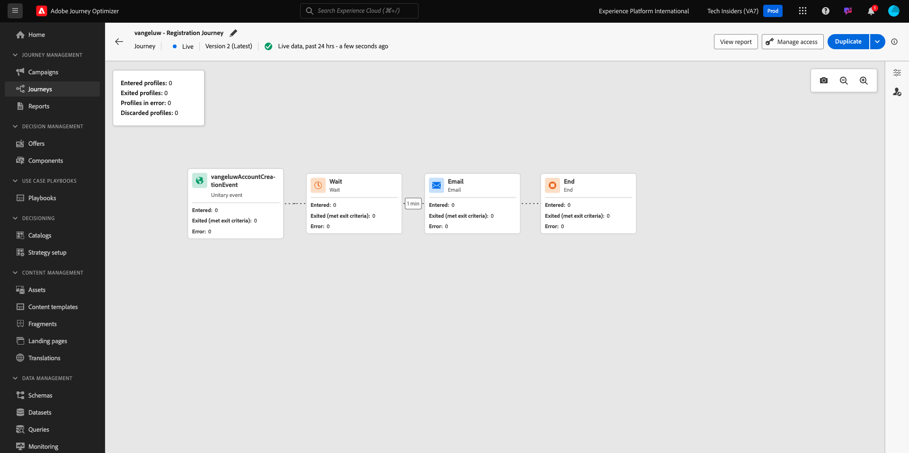

# 3.3.5 Gebruik uw beslissing in een e-mail

In deze oefening, zult u uw besluit gebruiken om de levering van e-mail en SMS te personaliseren.

Ga naar **Reizen**. Vind de reis u in oefening 7.2 creeerde, die `--demoProfileLdap-- - Account Creation Journey` wordt genoemd. Klik op uw reis om deze te openen.

Dan zie je dit. Klik **creeer een nieuwe versie**.

Klik **creeer een nieuwe versie**.

Klik de **E-mail** actie en klik dan **uitgeven inhoud**.

U zult dan het berichtdashboard zien. Klik **E-mail Designer**.

Dan zie je dit.

Dan zie je dit. Sleep een nieuwe **1:1 kolom** structuurcomponent op het canvas.

In het menu, ga naar **Componenten van de Inhoud**. Selecteer de **component van het besluit van de Aanbieding 0} {en sleep en laat vallen deze component in de inhoud van e-mail placeholder zoals vermeld aanbiedt.** Dan, klik **toevoegen**.

Selecteer het type plaatsing dat u in de e-mail wilt opnemen. In het **drop-down menu van Plaatsen** uitgezochte **E-mail - Beeld**, dan selecteer uw besluit `--demoProfileLdap-- - Luma Decision`. Klik **toevoegen**.

U ziet nu alle persoonlijke aanbiedingen en de fallback-aanbieding die in de e-mailontwerper worden weergegeven. Klik **Simuleren Inhoud** om het e-mailbericht met een echt klantenprofiel voor te vertonen.

Geef eerst aan welk profiel u voor de voorvertoning wilt gebruiken. Selecteer **e-mail** namespace en ga het e-mailadres van een klantenprofiel in u op de demowebsite hebt gecreeerd. Daarna, klik **Voorproef**.

Zodra e-mail is getoond en de aanbieding correct wordt getoond klik op de **Dichte** knoop.

Tot slot klik **sparen**.

Klik nu op de pijl om terug te gaan naar het vorige scherm.

Dan zie je dit. Klik op de pijl in de linkerbovenhoek om terug te gaan naar uw reis.

Klik **O.K.** om uw **E-mail** actie te sluiten.

Klik **Publish** om uw bijgewerkte reis te publiceren.

Bevestig door **Publish** opnieuw te klikken.

Uw bericht is nu gepubliceerd.

Wanneer u een nieuwe account maakt op de demo-website, ontvangt u nu deze e-mail:

U hebt deze oefening voltooid.

Volgende Stap: [ 3.3.6 test uw Besluit gebruikend API ](./ex6.md)

[Terug naar module 3.3](./offer-decisioning.md)

[Terug naar alle modules](./../../../overview.md)
