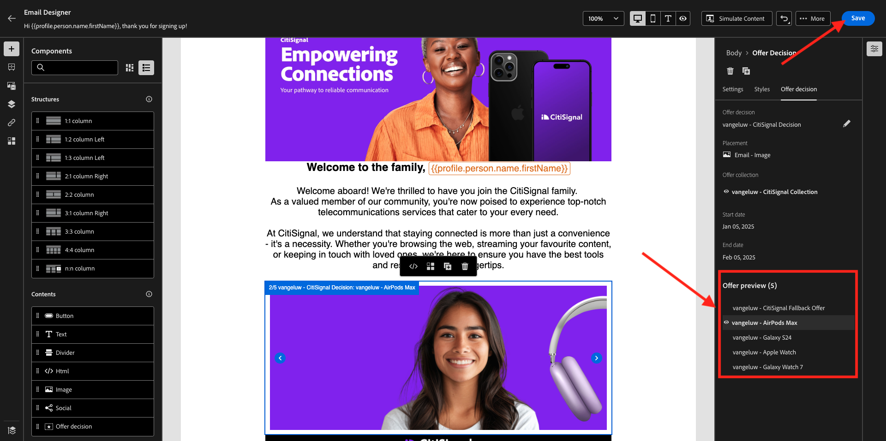
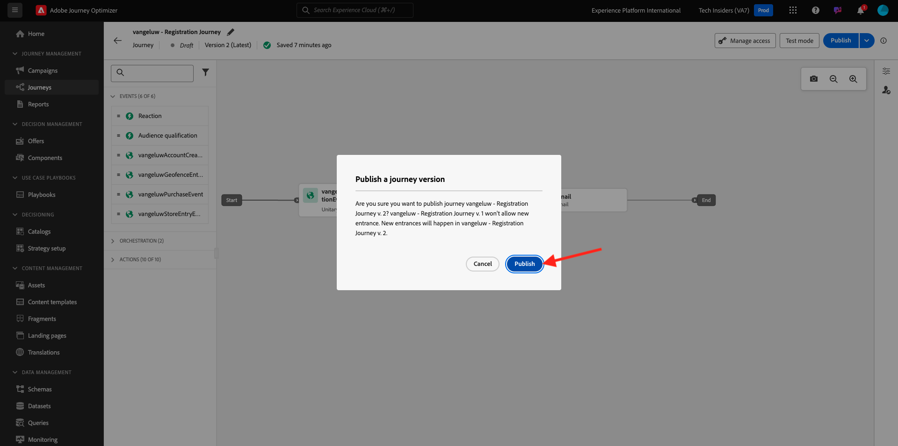

# 3.3.5 Gebruik uw beslissing in een e-mail

In deze oefening, zult u uw besluit gebruiken om de levering van e-mail en SMS te personaliseren.

Ga naar **Reizen**. Vind de reis u in oefening 3.1.3 creeerde, die `--aepUserLdap-- - Registration Journey` wordt genoemd. Klik op uw reis om deze te openen.

Dan zie je dit. Klik op **.. Meer** en klik dan **creeer een nieuwe versie**.

Klik **creeer een nieuwe versie**.

Klik de **E-mail** actie en klik dan **uitgeven inhoud**.

U zult dan het berichtdashboard zien. Klik **uitgeeft e-maillichaam**.

Dan zie je dit. Sleep een nieuwe **1:1 kolom** structuurcomponent op het canvas.

In het menu, ga naar **Inhoud**. Selecteer de **component van het besluit van de Aanbieding 0&rbrace; &lbrace;en sleep en laat vallen deze component in de inhoud van e-mail placeholder zoals vermeld aanbiedt.** Dan, klik **toevoegen**.

Selecteer het type plaatsing dat u in de e-mail wilt opnemen. In het **drop-down menu van Plaatsen** uitgezochte **E-mail - Beeld**, dan selecteer uw besluit `--aepUserLdap-- - CitiSignal Decision`. Klik **toevoegen**.

U kunt nu alle gepersonaliseerde aanbiedingen en de fallback-aanbieding doorlopen, die allemaal worden weergegeven in de e-mailontwerper. Klik **sparen**.

Klik nu op de pijl om terug te gaan naar het vorige scherm.

Klik op de pijl in de linkerbovenhoek om terug te gaan naar uw reis.

Klik **sparen** om uw **E-mail** actie te sluiten.

Klik **Publish** om uw bijgewerkte reis te publiceren.

Bevestig door **Publish** opnieuw te klikken.

Uw bericht is nu gepubliceerd.

Wanneer u een nieuwe account maakt op de demo-website, ontvangt u nu deze e-mail:

U hebt deze oefening voltooid.

Volgende Stap: [&#x200B; 3.3.6 test uw Besluit gebruikend API &#x200B;](./ex6.md)

[Terug naar module 3.3](./offer-decisioning.md)

[Terug naar alle modules](./../../../overview.md)
