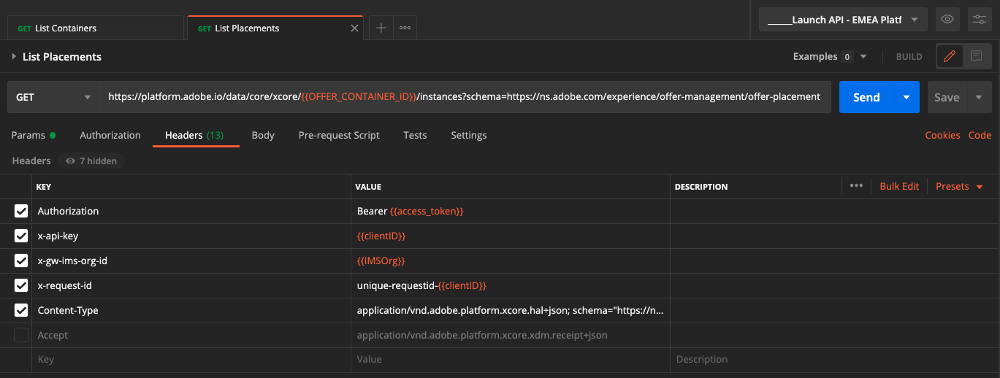

# 3.3.6 Test uw beslissing met de API

## 3.3.6.1 Werken met de Offer decisioning-API met Postman

Download [ deze Inzameling van Postman voor Offer decisioning ](./../../../assets/postman/postman_offer-decisioning.zip) aan uw Desktop en unzip het. Dan heb je het volgende:

Dit bestand staat nu op uw bureaublad:

- [!UICONTROL _Module 14- Decisioning Service.postman_collection.json]

In [ oefent 2.1.3 uit - de authentificatie van Postman aan Adobe I/O ](./../../../modules/rtcdp-b2c/module2.1/ex3.md) u Postman installeerde. U moet Postman opnieuw gebruiken voor deze oefening.

Open Postman. Klik op **[!UICONTROL Import]**.

Klik op **[!UICONTROL Upload files]** .

Selecteer het bestand **[!UICONTROL _Module 14- Decisioning Service.postman_collection.json]** en klik op **[!UICONTROL Open]** .

Deze verzameling is dan beschikbaar in Postman.

U hebt nu alles wat u nodig hebt in Postman om te gaan communiceren met Adobe Experience Platform via de API&#39;s.

### 3.3.6.1.1 Containers op lijst

Klik om de aanvraag te openen **[!UICONTROL GET - List Containers]** .

Onder **[!UICONTROL Params]** ziet u het volgende:

- eigenschap: `_instance.parentName==aepenablementfy22`

In die parameter is **[!UICONTROL aepenablementfy22]** de naam van de sandbox die in Adobe Experience Platform wordt gebruikt. De sandbox die u moet gebruiken, is `--aepSandboxName--` . Vervang de tekst **[!UICONTROL aepenablementfy22]** door `--aepSandboxName--` .

Klik op **[!UICONTROL Send]** nadat u de naam van de sandbox hebt vervangen.

Dit is de reactie, die de aanbiedingscontainer voor de zandbak toont die u specificeerde. Kopieer de **[!UICONTROL container instanceId]** zoals hieronder aangegeven en noteer deze in een tekstbestand op uw computer. U moet deze **[!UICONTROL container instanceId]** gebruiken voor de volgende oefening!

### 3.3.6.1.2 Lijstplaatsen

Klik om de aanvraag te openen **[!UICONTROL GET - List Placements]** . Klik op **[!UICONTROL Send]**.

U ziet nu alle beschikbare plaatsingen in uw aanbiedingscontainer. De plaatsen u ziet werden bepaald in Adobe Experience Platform UI, aangezien u in [ Uitoefening 3.3.1.3 ](./ex1.md) kon zien.

### 3.3.6.1.3 Regels voor het lijstbesluit

Klik om de aanvraag te openen **[!UICONTROL GET - List Decision Rules]** . Klik op **[!UICONTROL Send]**.

In de reactie, zult u de Regels zien van het Besluit die u in Adobe Experience Platform UI bepaalde, aangezien u in [ Uitoefening 3.3.1.4 ](./ex1.md) kon zien.

### 3.3.6.1.4 Aangepaste aanbiedingen aanbieden

Klik om de aanvraag te openen **[!UICONTROL GET - List Personalized Offers]** . Klik op **[!UICONTROL Send]**.

In de reactie, zult u de Gepersonaliseerde Aanbiedingen zien die u in Adobe Experience Platform UI in [ Uitoefening 3.3.2.1 ](./ex2.md) bepaalde.

### 3.3.6.1.5 Aanbiedingen voor lijstalternatieven

Klik om de aanvraag te openen **[!UICONTROL GET - List Fallback Offers]** . Klik op **[!UICONTROL Send]**.

In de reactie, zult u de Aanbieding zien van de Fallback die u in Adobe Experience Platform UI in [ Uitoefening 3.3.2.2 ](./ex2.md) bepaalde.

### 3.3.6.1.6 Lijstverzamelingen

Klik om de aanvraag te openen **[!UICONTROL GET - List Collections]** .

In de reactie, zult u de Inzameling zien die u in Adobe Experience Platform UI in [ Uitoefening 3.3.2.3 ](./ex2.md) bepaalde.

### 3.3.6.1.7 Gedetailleerde aanbiedingen voor klantprofiel ophalen

Klik om de aanvraag te openen **[!UICONTROL POST - Get Detailed Offers for Customer Profile]** . Dit verzoek is vergelijkbaar met het vorige verzoek, maar retourneert details zoals afbeeldings-URL&#39;s, tekst, enzovoort.

Voor dit verzoek, vergelijkbaar met de vorige oefening die gelijkaardige vereisten heeft, moet u de waarden voor **[!UICONTROL xdm:placementId]** en **[!UICONTROL xdm:activityId]** verstrekken om de specifieke aanbiedingsdetails voor een klant terug te winnen.

Het veld **[!UICONTROL xdm:activityId]** moet worden ingevuld. U kunt dat ophalen in de gebruikersinterface van Adobe Experience Platform, zoals hieronder aangegeven.

Het veld **[!UICONTROL xdm:placementId]** moet worden ingevuld. U kunt dat ophalen in de gebruikersinterface van Adobe Experience Platform, zoals hieronder aangegeven. In het onderstaande voorbeeld ziet u de placementId voor de plaatsing **[!UICONTROL Web - Image]** .

Ga naar **[!UICONTROL Body]** en ga het e-mailadres in van de klant voor wie u een voorstel wilt vragen. Klik op **[!UICONTROL Send]**.

Tot slot zult u dan het resultaat zien van welk soort gepersonaliseerde aanbieding en welke activa aan deze klant moeten worden getoond.

Je hebt deze oefening nu voltooid.

Volgende Stap: [ Samenvatting en voordelen ](./summary.md)

[Terug naar module 3.3](./offer-decisioning.md)

[Terug naar alle modules](./../../../overview.md)
