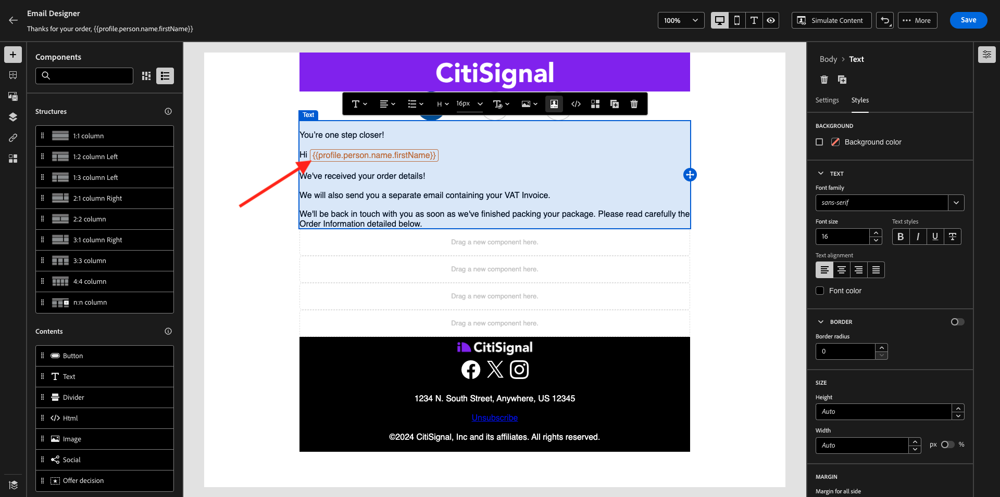
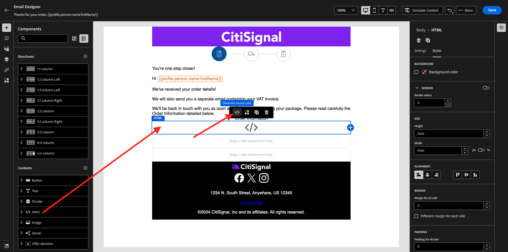
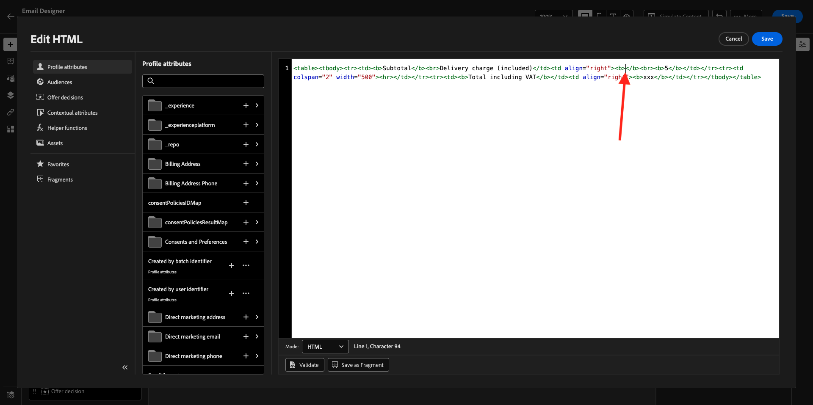
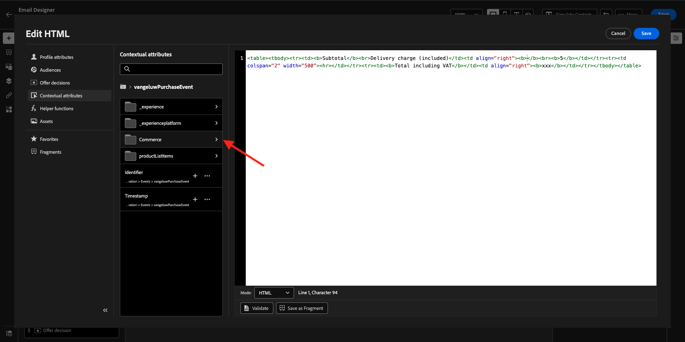
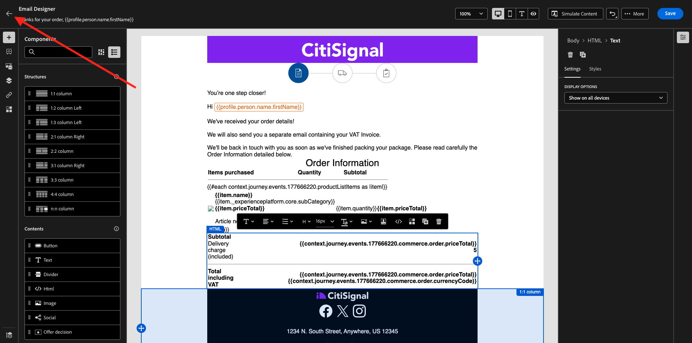
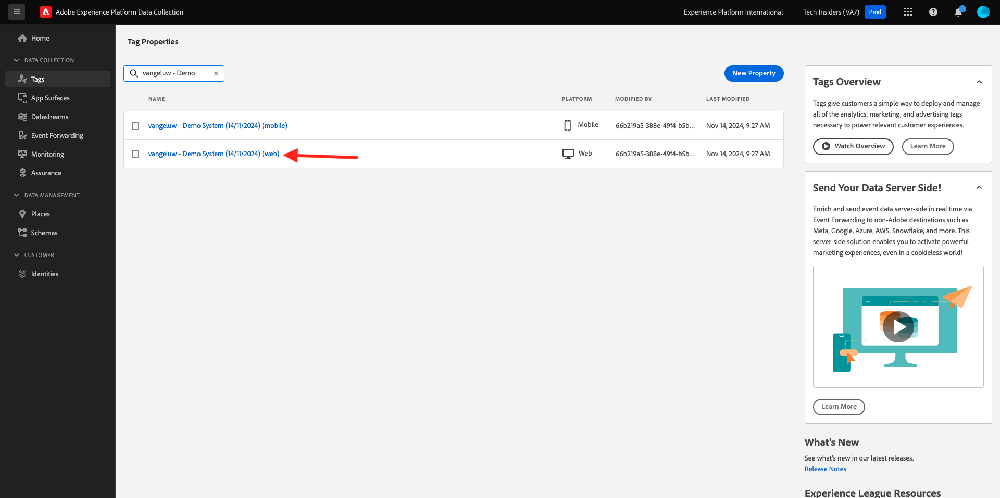

# 3.4.1 Een op een trigger gebaseerde reis configureren - Bestelbevestiging

Login aan Adobe Journey Optimizer door naar [&#x200B; Adobe Experience Cloud &#x200B;](https://experience.adobe.com) te gaan. Klik **Journey Optimizer**.


U zult aan de **1&rbrace; mening van het Huis {in Journey Optimizer worden opnieuw gericht.** Eerst, zorg ervoor u de correcte zandbak gebruikt. De sandbox die moet worden gebruikt, wordt `--aepSandboxName--` genoemd. U zult dan in de **1} mening van het Huis &lbrace;van uw zandbak `--aepSandboxName--` zijn.**


## 3.4.1.1 Uw gebeurtenis maken

In het menu, ga naar **Configuraties** en klik **leiden** onder **Gebeurtenissen**.


Op het **scherm van Gebeurtenissen**, zult u een mening gelijkend op dit zien. Klik **creëren Gebeurtenis**.


U ziet dan een lege gebeurtenisconfiguratie.

Geef uw gebeurtenis eerst een naam als deze: `--aepUserLdap--PurchaseEvent` en voeg een beschrijving als deze toe: `Purchase Event` .

Voor **Type**, uitgezochte **Eenheids**.
Voor **Type van identiteitskaart van de Gebeurtenis**, uitgezochte **Gegenereerd Systeem**.


Nu de selectie van het schema. Hiervoor is een schema opgesteld. Gebruik het schema `Demo System - Event Schema for Website (Global v1.1) v.1` .

Na het selecteren van het Schema, zult u een aantal gebieden zien die in de **sectie van de Lading** worden geselecteerd. Klik het **uitgeven/Potlood** pictogram om extra gebieden aan deze gebeurtenis toe te voegen.


Dan zie je deze popup. U moet nu extra selectievakjes inschakelen om toegang te krijgen tot aanvullende gegevens wanneer deze gebeurtenis wordt geactiveerd.


Schakel eerst het selectievakje op de regel `--aepTenantId--` in.


Blader vervolgens omlaag en schakel het selectievakje op de regel in `commerce` .


Blader vervolgens omlaag en schakel het selectievakje op de regel in `productListItems` . Klik **OK**.


Vervolgens ziet u dat er extra velden zijn toegevoegd aan de gebeurtenis. Klik **sparen**.


Uw nieuwe gebeurtenis wordt dan opgeslagen en u zult uw gebeurtenis in de lijst van beschikbare gebeurtenissen nu zien.

Klik opnieuw op uw gebeurtenis om **te openen geef het 1&rbrace; scherm van de Gebeurtenis &lbrace;opnieuw uit.**
Beweeg over het **gebied van de Lading** opnieuw om de 3 pictogrammen opnieuw te zien. Klik op het **pictogram van de Payload van de Mening**.


U zult nu een voorbeeld van de verwachte nuttige lading zien. Uw gebeurtenis heeft een unieke orchestration eventID, die u kunt vinden door neer in die lading te scrollen tot u `_experience.campaign.orchestration.eventID` ziet.


De gebeurtenis-id is wat naar Adobe Journey Optimizer moet worden verzonden om de reis te activeren die u in de volgende stap maakt. Schrijf deze eventID neer, aangezien u het in één van de volgende stappen zult nodig hebben.
`"eventID": "1c8148a8ab1993537d0ba4e6ac293dd4f2a88d80b2ca7be6293c3b28d4ff5ae6"`

Klik **O.K.**, die door **wordt gevolgd annuleert**.

Uw gebeurtenis is nu geconfigureerd en klaar om te worden gebruikt.

## 3.4.1.2 Maak uw reis

In het menu, ga naar **Reizen** en klik **creeer Reizen**.


Dan zie je dit. Geef je reis een naam. Gebruik `--aepUserLdap-- - Order Confirmation journey` . Klik **sparen**.


Eerst, moet u uw gebeurtenis toevoegen als uitgangspunt van uw reis. Zoek de gebeurtenis `--aepUserLdap--PurchaseEvent` en sleep deze naar het canvas. Klik **sparen**.


Daarna, onder **Acties**, onderzoek naar de **E-mail** actie en voeg het op het canvas toe.


Plaats de **Categorie** aan **Marketing** en selecteer een e-mailoppervlakte die u toelaat om e-mail te verzenden. In dit geval, is de e-mailoppervlakte om te selecteren **E-mail**. Zorg ervoor dat checkboxes voor **klikt op e-mail** en **e-mail opent** allebei worden toegelaten.


De volgende stap is uw bericht te creëren. Om dat te doen, klik **geef inhoud** uit.


U ziet dit nu. Klik het **Onderwerplijn** tekstgebied.


In het tekstgebied begint te schrijven **Dank voor uw orde,** en klik het **Personalization** pictogram.


De onderwerpregel is nog niet gereed. Daarna moet u het verpersoonlijkingstoken voor het gebied **Eerste naam** brengen die onder `profile.person.name.firstName` wordt opgeslagen. In het linkermenu, scrol neer om **Persoon** > **Volledige naam** > **Voornaam** gebied te vinden en op **+** pictogram te klikken om het verpersoonlijkingstoken in de onderwerpregel toe te voegen. Klik **sparen**.


Dan ben je hier weer. Klik **uitgeeft e-maillichaam** om de inhoud van e-mail tot stand te brengen.


In het volgende scherm, klik **Ontwerp van kras**.


In het linkermenu vindt u de structuurcomponenten die u kunt gebruiken om de structuur van de e-mail (rijen en kolommen) te definiëren.

De belemmering en laat vallen 8 keer a **1:1 kolom** op het canvas, dat u dit zou moeten geven:


In het linkermenu, ga naar **Fragments**. Sleep de kopbal u vroeger in [&#x200B; oefening 3.1.2.1 &#x200B;](./../module3.1/ex2.md) op de eerste component in het canvas creeerde. Sleep de footer u vroeger in [&#x200B; oefening 3.1.2.2 &#x200B;](./../module3.1/ex2.md) op de laatste component in het canvas creeerde.


Klik op het pictogram **+** in het linkermenu. Ga naar **Inhoud** beginnen inhoud op het canvas toe te voegen.


Ga naar **Inhoud** en sleep en laat vallen een **component van het Beeld** op de tweede rij. Klik **doorbladeren**.


Open de omslag **citi-signaal-beelden**, klik om het beeld **te selecteren burgerschap-preparing.png**, en klik **Uitgezocht**.


Onder **Stijlen**, verander de breedte in **40%**.


Daarna, ga naar **Inhoud** en sleep en laat vallen a **&#x200B;**&#x200B;component van de Tekst op de derde rij.


Selecteer de standaardtekst in die component **gelieve te typen hier uw tekst.** en vervang deze door de onderstaande tekst:

```javascript
You’re one step closer!

Hi 

We've received your order details!

We will also send you a separate email containing your VAT Invoice.

We'll be back in touch with you as soon as we've finished packing your package. Please read carefully the Order Information detailed below.
```


Plaats de curseur naast de tekst **Hi** en klik **toevoegen Personalization**.


Navigeer aan de **Persoon** > **Volledige naam** > **Voornaam** gebied en klik op **+** pictogram om het verpersoonlijkingstoken in de onderwerpregel toe te voegen. Klik **sparen**.


U zult dan dit zien:



Daarna, ga naar **Inhoud** en sleep en laat vallen a **&#x200B;**&#x200B;component van de Tekst op de vierde rij.


Selecteer de standaardtekst in die component **gelieve te typen hier uw tekst.** en vervang deze door de onderstaande tekst:

`Order Information`

Verander de doopvontgrootte in **26px** en centrum uw tekst in deze cel. Dan heb je het volgende:


Daarna, ga naar **Inhoud** en sleep en laat vallen een **HTML** component op de vijfde rij. Klik de component van de HTML en klik dan **tonen de broncode**.



In **geef HTML** popup uit, kleef deze HTML:

```<table><tbody><tr><td><b>Items purchased</b></td><td></td><td><b>Quantity</b></td><td><b>Subtotal</b></td></tr><tr><td colspan="4" width="500"><hr></td></tr></tbody></table>```

Klik **sparen**.


Dan heb je dit. Klik **sparen** om uw vooruitgang te bewaren.


Ga naar **Inhoud** en sleep en laat vallen een **HTML** component op de zesde rij. Klik de component van de HTML en klik dan **tonen de broncode**.


In **geef HTML** popup uit, kleef deze HTML:

```{{#each xxx as |item|}}<table width="500"><tbody><tr><td></td><td><table><tbody><tr><td><b>{{item.name}}</b><br>{{item.--aepTenantId--.core.subCategory}}<br><b>{{item.priceTotal}}</b><br>&nbsp;<br>Article no: {{item.SKU}}</td></tr></tbody></table></td><td>{{item.quantity}}</td><td><b>{{item.priceTotal}}</b></td></tr></tbody></table>{{/each}}```

Dan heb je het volgende:


U moet nu **xxx** door een verwijzing naar het productListItems voorwerp vervangen dat deel van de gebeurtenis uitmaakt die de reis teweegbrengt.


Eerst, schrap **xxx** in uw code van HTML eerst.


In het linkermenu, klik **Contextafhankelijke attributen**. Deze context wordt doorgegeven aan de boodschap van de reis.

Dan zie je dit. Klik de pijl naast **Journey Orchestration** om dieper te boren.


Klik de pijl naast **Gebeurtenissen** om dieper te boren.


Klik op de pijl naast `--aepUserLdap--PurchaseEvent` om dieper te boren.


Klik de pijl naast **productListItems** om dieper te boren.


Klik het **+** pictogram naast **Naam** om het aan het canvas toe te voegen. Dan heb je dit. U moet nu **.name** selecteren zoals die in hieronder het schermschot wordt vermeld, en dan zou u **moeten verwijderen.name**.


Dan heb je dit. Klik **sparen**.


Je bent nu weer in de e-mail-Designer. Klik **sparen** om uw vooruitgang te bewaren.


Daarna, ga naar **Inhoud** en sleep en laat vallen een **HTML** component op de zevende rij. Klik de component van de HTML en klik dan **tonen de broncode**.


In **geef HTML** popup uit, kleef deze HTML:

```<table><tbody><tr><td><b>Subtotal</b><br>Delivery charge (included)</td><td align="right"><b>xxx</b><br><b>5</b></td></tr><tr><td colspan="2" width="500"><hr></td></tr><tr><td><b>Total including VAT</b></td><td align="right"><b>xxx</b></td></tr></tbody></table>```

Er zijn 2 verwijzingen van **xxx** in deze code van HTML. U moet nu elk **xxx** door een verwijzing naar het productListItems voorwerp vervangen dat deel van de gebeurtenis uitmaakt die de reis teweegbrengt.


Eerst, schrap eerste **xxx** in uw code van HTML.



In het linkermenu, klik **Contextafhankelijke Attributen**.
Klik de pijl naast **Journey Orchestration** om dieper te boren.


Klik de pijl naast **Gebeurtenissen** om dieper te boren.


Klik op de pijl naast `--aepUserLdap--PurchaseEvent` om dieper te boren.


Klik de pijl naast **Commerce** om dieper te boren.



Klik de pijl naast **Orde** om dieper te boren.


Klik het **+** pictogram naast **Totaal van de Prijs** om dat aan het canvas toe te voegen.


Dan heb je dit. Nu schrap tweede **xxx** in uw code van HTML.


Klik opnieuw het **+** pictogram naast **Totaal van de Prijs** om dat aan het canvas toe te voegen.
U kunt het gebied **Valuta** van binnen het **voorwerp van de Orde** op het canvas ook toevoegen, aangezien u hier kunt zien.
Wanneer u wordt gedaan, klik **sparen** om uw veranderingen te bewaren.


Je bent dan terug in de e-mail Designer. Klik **sparen** opnieuw.


Ga terug naar het berichtdashboard door de **pijl** naast de onderwerplijntekst in de top-left hoek te klikken.



Klik op de pijl in de linkerbovenhoek om terug te gaan naar uw reis.


Klik **sparen** om uw e-mailactie te sluiten.


Klik **Publish** om uw reis te publiceren.


Klik **opnieuw Publish**.


Uw reis is nu gepubliceerd.


## 3.4.1.5 Werk uw Adobe Experience Platform Data Collection Client-eigenschap bij

Ga naar [&#x200B; de Inzameling van Gegevens van Adobe Experience Platform &#x200B;](https://experience.adobe.com/launch/) en selecteer **Markeringen**.

Dit is de pagina Eigenschappen van Adobe Experience Platform-gegevensverzameling die u eerder hebt gezien.


In **Aan de slag**, leidde het Systeem van de Demo tot twee eigenschappen van de Cliënt voor u: voor de website en voor mobiele app. Zoek naar `--aepUserLdap--` in het vak **[!UICONTROL Search]** . Klik om het **bezit te openen 0&rbrace; van het Web &lbrace;.**



Ga naar **Elementen van Gegevens**. Onderzoek en open het gegevenselement **XDM - Schaf** aan.


Dan zie je dit. Navigeer naar het veld **_experience.campagne.orchestration.eventID** en vul hier uw eventID in. EventID om hier te vullen, is eventID u als deel van oefening 3.4.1.1 creeerde klikt **sparen** of **sparen aan Bibliotheek**.


Sla de wijzigingen in de eigenschap op en publiceer de wijzigingen door de ontwikkelingsbibliotheek bij te werken.


Uw wijzigingen worden nu geïmplementeerd en kunnen worden getest.

## 3.4.1.6 Test het bevestigingsbericht voor uw bestelling via de demo-website

Laten we de bijgewerkte reis testen door een product te kopen op de demo-website.

Ga naar [&#x200B; https://dsn.adobe.com &#x200B;](https://dsn.adobe.com). Nadat je je hebt aangemeld bij je Adobe ID, kun je dit zien. Klik de 3 punten **..** op uw websiteproject en klik dan **Looppas** om het te openen.


Vervolgens wordt uw demowebsite geopend. Selecteer de URL en kopieer deze naar het klembord.


Open een nieuw Incognito-browservenster.


Plak de URL van uw demowebsite, die u in de vorige stap hebt gekopieerd. Vervolgens wordt u gevraagd u aan te melden met uw Adobe ID.


Selecteer uw accounttype en voltooi het aanmeldingsproces.


Uw website wordt vervolgens geladen in een Incognito-browservenster. Voor elke oefening, zult u een vers, incognito browser venster moeten gebruiken om uw demowebsite URL te laden.


Heb een blik bij het paneel van de Kijker van het Profiel en het Profiel van de Klant in real time met **identiteitskaart van het Experience Cloud** als primaire herkenningsteken voor deze momenteel onbekende klant.


Ga naar de pagina Registreren/Aanmelden. Klik **CREËREN EEN ACCOUNT**.


Vul uw details in en klik **Register** waarna u aan de vorige pagina opnieuw zult worden gericht.


Elk product aan uw winkelwagentje toevoegen


Ga naar de **Kar** pagina. Klik **Controle**.


Controleer vervolgens de velden en vul deze zo nodig in. Klik **ga** verder.


Klik **bevestigen Orde**.


Uw bestelling wordt nu bevestigd.


U ontvangt dan binnen enkele seconden een bevestigingsbericht voor uw bestelling.


U hebt deze oefening voltooid.

Volgende Stap: [&#x200B; 3.4.2 vormt een op partij-gebaseerde nieuwsbrief reis &#x200B;](./ex2.md)

[Terug naar module 3.4](./journeyoptimizer.md)

[Terug naar alle modules](../../../overview.md)
