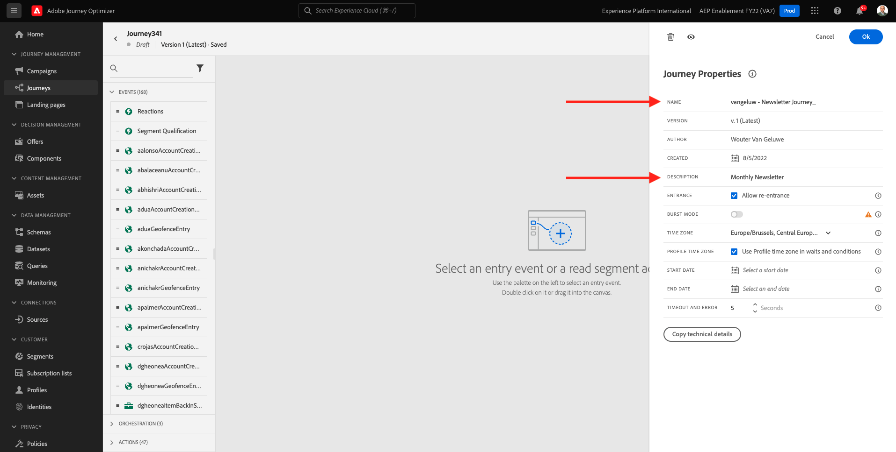

# 3.4.2 Een op batch gebaseerde nieuwsbrief-reis configureren

Login aan Adobe Journey Optimizer door naar [ Adobe Experience Cloud ](https://experience.adobe.com) te gaan. Klik **Journey Optimizer**.

U zult aan de **1} mening van het Huis {in Journey Optimizer worden opnieuw gericht.** Eerst, zorg ervoor u de correcte zandbak gebruikt. De sandbox die moet worden gebruikt, wordt `--aepSandboxName--` genoemd. Om van één zandbak in een andere te veranderen, klik op **Prod van de PRODUCTIE (VA7)** en selecteer de zandbak van de lijst. In dit voorbeeld, wordt de zandbak genoemd **AEP Enablement FY22**. U zult dan in de **1} mening van het Huis {van uw zandbak `--aepSandboxName--` zijn.**

## 3.4.2.1 Een nieuwsbrief maken

U zult nu een op partij-gebaseerde reis creëren. In tegenstelling tot de op gebeurtenissen gebaseerde reis van de vorige oefening die op inkomende ervaringsgebeurtenissen of publieksingangen of uitgang steunt om een reis voor één specifieke klant teweeg te brengen, richten de op partij-gebaseerde reizen één keer een heel publiek met unieke inhoud zoals nieuwsbrieven, eenmalige bevorderingen, of generische informatie of periodiek met gelijkaardige inhoud die op regelmatige basis wordt verzonden zoals bijvoorbeeld verjaardagscampagnes en herinneringen.

In het menu, ga naar **Reizen** en klik **creeer Reizen**.

Rechts ziet u een formulier waarin u de naam en de beschrijving van het transport moet vermelden. Voer de volgende waarden in:

- **Naam**: `--aepUserLdap-- - Newsletter Journey`. Bijvoorbeeld: **vangeluw - de Reizen van de Bulletin**.
- **Beschrijving**: Maandelijkse Nieuwsbrief

Klik **OK**.

Onder **Orchestratie**, belemmering en laat vallen **Gelezen Publiek** op het canvas. Dit betekent dat, zodra de reis gepubliceerd wordt, het hele publiek zal terugwinnen, dat dan het doelpubliek van de reis en de boodschap wordt. Klik **Uitgezocht een publiek**.

In **kies een publiek** popup, onderzoek naar uw ldap en selecteer het publiek u in [ Module 2.3 - In real time CDP creeerde - Bouw een publiek en neem actie ](./../../../modules/rtcdp-b2c/module2.3/real-time-cdp-build-a-segment-take-action.md) genoemd `--aepUserLdap-- - Interest in Galaxy S24`. Klik **sparen**.

Klik **OK**.

In het linkermenu, vind de **sectie van Acties** en sleep en laat vallen een **E-mail** actie op het canvas.

Plaats de **Categorie** aan **Marketing** en selecteer een e-mailoppervlakte die u toelaat om e-mail te verzenden. In dit geval, is de e-mailoppervlakte om te selecteren **E-mail**. Zorg ervoor dat checkboxes voor **klikt op e-mail** en **e-mail opent** allebei worden toegelaten.

De volgende stap is uw bericht te creëren. Om dat te doen, klik **geef inhoud** uit.

U ziet dit nu. Klik het **Onderwerplijn** tekstgebied.

Voer deze tekst voor de onderwerpregel in: `Luma Newsletter - your monthly update has arrived.`. Klik **sparen**.

Dan ben je hier weer. Klik **E-mail Designer** beginnen de e-mailinhoud tot stand te brengen.

Dan zie je dit. Klik **de HTML van de Invoer**.

In het pop-upscherm moet u het HTML-bestand van de e-mail slepen en neerzetten. U kunt het malplaatje van de HTML [ hier ](./../../../assets/html/ajo-newsletter.html.zip) vinden. Download het ZIP-bestand met de HTML-sjabloon naar uw lokale computer en pak het uit op uw bureaublad.

De belemmering en laat vallen het dossier **ajo-newsletter.html** om het in Journey Optimizer te uploaden. Klik **Invoer**.

Deze e-mailinhoud is klaar voor gebruik omdat deze alle verwachte personalisatie, afbeeldingen en tekst bevat. Alleen de tijdelijke aanduiding voor het aanbod blijft leeg.

U zou een foutenmelding kunnen krijgen: **Fout wanneer het proberen om activa** te halen. Dit is gekoppeld aan de afbeelding in de e-mail.

Als u deze fout krijgt, selecteer het beeld en klik **geef beeld** knoop uit.

Klik **Assets Essentials** om terug naar uw bibliotheek van de Hoofdzaak van AEM Assets te gaan.

Dan zie je deze popup. Navigeer aan de omslag **enablement-activa** en selecteer het beeld **luma-newsletterContent.png**. Klik **Uitgezocht**.

Je standaardnieuwsbrief is nu klaar. Klik **sparen**.

Ga terug naar het berichtdashboard door de **pijl** naast de onderwerplijntekst in de top-left hoek te klikken.

Klik op de pijl in de linkerbovenhoek om terug te gaan naar uw reis.

Klik **O.K.** om uw e-mailactie te sluiten.

Uw nieuwsbrief is nu klaar om te worden gepubliceerd. Alvorens u dit doet, zie de **sectie van het Programma** waar u deze reis van het zijn van één-off aan een terugkomende campagne kunt schakelen. Klik de **knoop van het Programma**.

Dan zie je dit. Selecteer **eens**.

Selecteer een datum en tijd binnen het volgende uur zodat u uw reis kunt testen. Klik **OK**.

>[!NOTE]
>
>De verzenddatum en -tijd van het bericht moeten binnen een uur liggen.

Klik **Publish**.

Klik **opnieuw Publish**.

Uw standaardnieuwsbrief is nu gepubliceerd. Uw e-mailbericht voor nieuwsbrieven wordt verzonden zoals u het in uw planning hebt gedefinieerd. Uw reis wordt beëindigd zodra het laatste e-mailbericht is verzonden.

U hebt deze oefening voltooid.

Volgende Stap: [ 3.4.3 is verpersoonlijking in een e-mailbericht ](./ex3.md) van toepassing

[Terug naar module 3.4](./journeyoptimizer.md)

[Terug naar alle modules](../../../overview.md)
