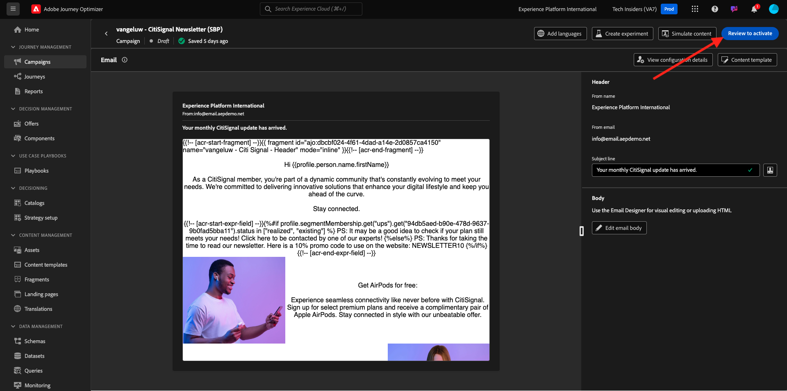

# 3.4.3 Verpersoonlijking toepassen in een e-mailbericht

Login aan Adobe Experience Cloud door naar [ Adobe Experience Cloud ](https://experience.adobe.com) te gaan. Klik **Adobe Journey Optimizer**.

U zult aan de **1} mening van het Huis {in Journey Optimizer worden opnieuw gericht.** Alvorens u verdergaat, moet u a **zandbak** selecteren. De te selecteren sandbox krijgt de naam ``--aepTenantId--`` . U kunt dit doen door op de tekst **[!UICONTROL Production Prod]** in de blauwe lijn boven op het scherm te klikken.

## 3.4.3.1 personalisatie op basis van segmenten

In deze exercitie zult u uw nieuwsbrief e-mailbericht met een gepersonaliseerde tekst verbeteren die op segmentlidmaatschap wordt gebaseerd.

Ga naar **Reizen**. Vind de nieuwsbrief die u in de vorige oefening hebt gecreeerd. Zoeken naar `--aepUserLdap-- - Newsletter` . Klik op uw reis om deze te openen.

Dan zie je dit. Klik **Dupliceren**.

Klik **Dupliceren**.

Selecteer uw **E-mail** actie en klik **uitgeven inhoud**.

Klik **E-mail Designer**.

Dan zie je dit.

Open {de Componenten van 0} Inhoud **en sleep de component van de a** Tekst **onder de huidige nieuwsbrief inhoud.**

Selecteer de volledige standaardtekst en verwijder deze. Dan klik op **verpersoonlijking** knoop in de toolbar toevoegen.

U zult dan dit zien:

In het linkermenu, klik **Lidmaatschappen van het Segment**.

>[!NOTE]
>
>Als u uw segment niet in deze lijst kunt vinden, scrol neer een beetje om instructies op te zoeken hoe te om segmentidentiteitskaart manueel terug te winnen.

Selecteer het segment `Luma - Women's Category Interest` en klik het **+** pictogram, dat als volgt zou moeten kijken:

Vervolgens laat u de eerste regel ongewijzigd en vervangt u regel 2 en 3 door de volgende code:

``
    Psssst... a private sale in the women category will launch soon, we will keep you posted

    Thanks for taking the time to read our newsletter. Here is a 10% promo code to use on the website: READER10

``

Dan heb je het volgende:

Klik **bevestigen** om ervoor te zorgen de code correct is. Klik **sparen**.

U kunt dit bericht nu bewaren door **te klikken sparen** knoop in de hoger-juiste hoek. Dan, klik **Simuleer Inhoud**.

Selecteer één van de profielen u als deel van dit leerprogramma creeerde en **Voorproef** klikt. U zult dan het resultaat van uw configuratie zien.

Dan zie je dit. Dan, klik **dicht**.

Ga terug naar het berichtdashboard door de **pijl** naast de onderwerplijntekst in de top-left hoek te klikken.

Klik op de pijl in de linkerbovenhoek om terug te gaan naar uw reis.

Klik **O.K.** om uw e-mailactie te sluiten.

Verander uw **Programma** aan **eens** en bepaal a **Datum/Tijd**. Klik **OK**.

>[!NOTE]
>
>De verzenddatum en -tijd van het bericht moeten binnen een uur liggen.

Klik op de **Publish** knoop in de reis.

In het pop-up venster, klik opnieuw **Publish**.

Uw standaardnieuwsbrief is nu gepubliceerd. Uw e-mailbericht voor nieuwsbrieven wordt op basis van uw planning verzonden en uw reis wordt beëindigd zodra het laatste e-mailbericht is verzonden.

U hebt deze oefening voltooid.

Volgende Stap: [ 3.4.4 Opstelling en de pushberichten van het gebruik voor iOS ](./ex4.md)

[Terug naar module 3.4](./journeyoptimizer.md)

[Terug naar alle modules](../../../overview.md)
