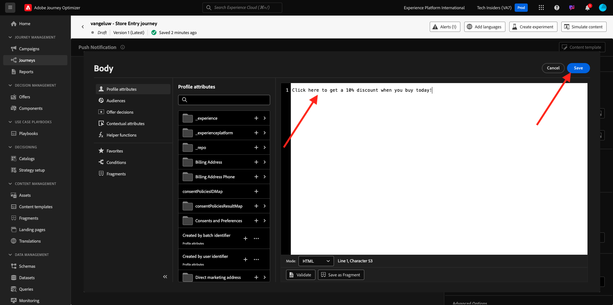
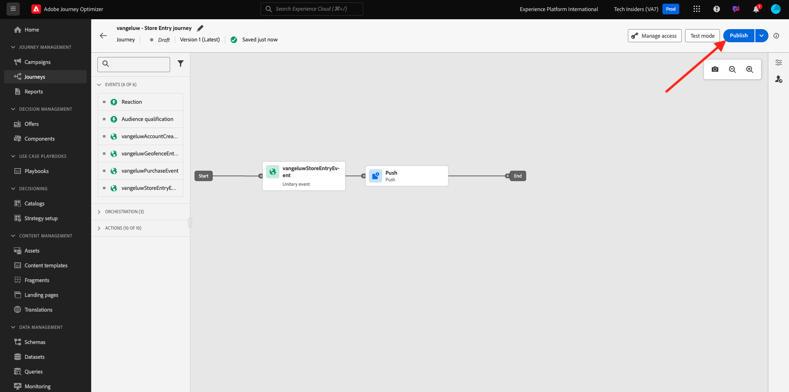

# 3.4.4 Pushmeldingen instellen en gebruiken voor iOS

Als u pushmeldingen wilt gebruiken met Adobe Journey Optimizer, moet u een aantal instellingen controleren en weten wat deze zijn.

Hier zijn alle instellingen die moeten worden gecontroleerd:

- Datasets en schema&#39;s in Adobe Experience Platform
- DataStream voor mobiele apparaten
- Eigenschappen voor gegevensverzameling voor mobiele apparaten
- App-oppervlak voor push-certificaten
- Test uw pushinstellingen met AEP Assurance

Laten we deze een voor een herzien.

Login aan Adobe Journey Optimizer door naar [ Adobe Experience Cloud ](https://experience.adobe.com) te gaan. Klik **Journey Optimizer**.

U zult aan de **1} mening van het Huis {in Journey Optimizer worden opnieuw gericht.** Eerst, zorg ervoor u de correcte zandbak gebruikt. De sandbox die moet worden gebruikt, wordt `--aepSandboxId--` genoemd. Om van één zandbak in een andere te veranderen, klik op **Prod van de PRODUCTIE (VA7)** en selecteer de zandbak van de lijst. In dit voorbeeld, wordt de zandbak genoemd **AEP Enablement FY22**. U zult dan in de **1} mening van het Huis {van uw zandbak `--aepSandboxId--` zijn.**

## 3.4.4.1 Gegevensverzameling

Adobe Journey Optimizer gebruikt datasets om dingen zoals de pushtokens van mobiele apparaten of interactie met pushberichten (zoals: bericht verzonden, bericht geopend, enz.) op te slaan in een dataset in Adobe Journey Optimizer.

U kunt deze datasets vinden door naar **[!UICONTROL Datasets]** in het menu op de linkerkant van het scherm te gaan. Om systeemdatasets te tonen, klik het filterpictogram.

Laat de optie **toe tonen systeemdatasets** en onderzoek naar **AJO**. U zult dan de datasets zien die voor dupberichten worden gebruikt.

## 3.4.4.2 Gegevensstroom voor mobiele apparaten

Ga naar [ https://experience.adobe.com/#/data-collection/ ](https://experience.adobe.com/#/data-collection/).

In het linkermenu, ga naar **[!UICONTROL Datastream]** en onderzoek naar uw gegevensstroom die u in [ Uitoefening 0.2 ](./../../../modules/gettingstarted/gettingstarted/ex2.md) creeerde, die `--demoProfileLdap-- - Demo System Datastream (Mobile)` wordt genoemd. Klik om het te openen.

Klik **uitgeven** op de **Adobe Experience Platform** dienst.

U zult dan de gegevensstroommontages zien die werden bepaald, en waarin datasets gebeurtenissen en profielattributen zullen worden opgeslagen.

Er zijn geen wijzigingen nodig. Uw gegevensstroom is nu klaar om te worden gebruikt in uw Client-eigenschap voor gegevensverzameling voor Mobile.

## 3.4.4.3 Herzie uw bezit van de Inzameling van Gegevens voor Mobiel

Ga naar [ https://experience.adobe.com/#/data-collection/ ](https://experience.adobe.com/#/data-collection/). Als deel van [ Uitoefening 0.1 ](./../../../modules/gettingstarted/gettingstarted/ex1.md), werden 2 eigenschappen van de Inzameling van Gegevens gecreeerd.
U hebt deze eigenschappen van de Cliënt van de Inzameling van Gegevens reeds als deel van vorige modules gebruikt.

Klik om de eigenschap Gegevensverzameling voor mobiel te openen.

In uw bezit van de Inzameling van Gegevens, ga naar **Uitbreidingen**. Vervolgens ziet u de verschillende extensies die nodig zijn voor de mobiele app. Klik om de Edge Network van extensie **Adobe Experience Platform** te openen.

U zult dan zien dat uw gegevensstroom voor mobiel hier verbonden is. Daarna, annuleert de klik **** om terug naar uw uitbreidingsoverzicht te gaan.

Dan ben je weer terug hier. U zult de uitbreiding voor **AEP Assurance** zien. Met AEP Assurance kunt u controleren, testen, simuleren en valideren hoe u gegevens verzamelt of ervaringen opdoet in uw mobiele app. U kunt meer over AEP Assurance en Project Griffon hier lezen [ https://aep-sdks.gitbook.io/docs/beta/project-griffon ](https://aep-sdks.gitbook.io/docs/beta/project-griffon).

Daarna, vormt de klik **** om de uitbreiding **Adobe Journey Optimizer** te openen.

U zult dan zien dat dit is waar de dataset voor het volgen van dupgebeurtenissen verbonden is.

U hoeft geen wijzigingen aan te brengen in de eigenschap Gegevensverzameling.

## 3.4.4.4 Controleer de installatie van uw toepassingsoppervlak

Ga naar [ https://experience.adobe.com/#/data-collection/ ](https://experience.adobe.com/#/data-collection/). In het linkermenu, ga naar **de Oppervlakken van de App** en open, de Oppervlakte van de App voor **DX demo App APNS**.

U zult dan de gevormde Oppervlakte van de App voor iOS en Android zien.

## 3.4.4.5 Test push notification setup using AEP Assurance.

Nadat de app is geïnstalleerd, vindt u deze op het beginscherm van uw apparaat. Klik op het pictogram om de app te openen.

Wanneer u de app de eerste keer gebruikt, wordt u gevraagd u aan te melden met uw Adobe ID. Voltooi het aanmeldingsproces.

Nadat u zich hebt aangemeld, wordt er een melding weergegeven waarin u wordt gevraagd om toestemming voor het verzenden van meldingen. Wij zullen berichten als deel van het leerprogramma verzenden, zo klik **toestaan**.

Vervolgens ziet u de startpagina van de app. Ga naar **Montages**.

In montages, zult u zien dat momenteel a **Openbaar Project** in app wordt geladen. Klik **Project van de Douane**.

U kunt nu een aangepast project laden. Klik de code QR om uw project gemakkelijk te laden.

Na oefening 0.1, had u dit resultaat. Klik om het **Mobiele Retail project** te openen dat voor u werd gecreeerd.

Voor het geval u per ongeluk uw browser venster, of voor toekomstige demo of enablement zittingen had gesloten, kunt u tot uw websiteproject ook toegang hebben door [ https://builder.adobedemo.com/projects ](https://builder.adobedemo.com/projects) te gaan. Nadat je je hebt aangemeld bij je Adobe ID, kun je dit zien. Klik op uw mobiele-toepassingsproject om het te openen.

Dan zie je dit. Klik **Integraties**.

U moet het bezit van de Inzameling van Gegevens voor mobiel selecteren dat in oefening 0.1 werd gecreeerd. Daarna, klik **Looppas**.

U zult dan deze popup zien, die een QR code bevat. Scan deze QR-code vanuit de mobiele app.

U zult dan uw projectidentiteitskaart tonen in app zien, waarna u **kunt klikken sparen**.

Nu, ga terug naar **Huis** in app. Uw app is nu klaar om te worden gebruikt.

U moet nu een QR-code scannen om uw mobiele apparaat aan te sluiten op uw AEP Assurance-sessie.

Om een zitting van AEP Assurance te beginnen, ga [ https://experience.adobe.com/#/@experienceplatform/griffon ](https://experience.adobe.com/#/@experienceplatform/griffon). Klik **creeer Zitting**.

Klik **Begin**.

Vul de waarden in:

- Naam van sessie: gebruik `--demoProfileLdap-- - push debugging` en vervang LDAP door uw LDAP
- Basis URL: gebruik **dxdemo://default**

Klik **daarna**.

Vervolgens ziet u een QR-code op uw scherm, die u moet scannen met uw iOS-apparaat.

Open de camera-app op uw mobiele apparaat en scan de QR-code die wordt weergegeven door AEP Assurance.

U zult dan een popup scherm zien, vragend u om de SPELD-code in te gaan. Kopieer de SPELD-code van uw scherm van AEP Assurance en klik **verbinden**.

Dan zie je dit.

In AEP Assurance zie je nu dat een apparaat naar de AEP Assurance-sessie gaat.

Ga naar **Push zuivert**. Je ziet iets dergelijks.

Enkele uitleg:

- De eerste kolom, **Cliënt**, toont de beschikbare herkenningstekens op uw apparaat van iOS. U ziet een ECID en een pushtoken.
- De tweede kolom toont **informatie van het Profiel**, met extra informatie over welk platform de Duw Symbolische levens in (APNS of APNSSandbox). Als u de **knoop van het Profiel van Inspect** klikt, zult u aan Adobe Experience Platform worden genomen en u zult het volledige Profiel van de Klant in real time zien.
- De 3de kolom toont de **Configuratie van de Toepassing**, die opstelling als deel van oefening **3.4.5.4 creeert de Configuratie van de App in Lancering**

Om uw opstelling van de Push configuratie te testen, klik **verzenden het Duwbericht** knoop.

U moet ervoor zorgen dat **DX demo** app niet open is op het ogenblik van het klikken van **verzendt het Duwbericht** knoop. Als de app geopend is, wordt het pushbericht mogelijk op de achtergrond ontvangen en is het niet zichtbaar.

Vervolgens verschijnt er een pushmelding zoals deze op uw mobiele apparaat.

Als u het pushbericht hebt ontvangen, betekent dit dat uw instelling juist is en prima werkt.

## 3.4.4.6 Een nieuwe gebeurtenis maken

In het menu, ga naar **Beleid van de Reis** en klik **leiden** onder **Gebeurtenissen**.

Op het **scherm van Gebeurtenissen**, zult u een mening gelijkend op dit zien. Klik **creëren Gebeurtenis**.

U ziet dan een lege gebeurtenisconfiguratie.

Geef uw gebeurtenis eerst een naam zoals deze: `--demoProfileLdap--StoreEntryEvent` en stel een beschrijving in op `Store Entry Event` .

Daarna is het **Type van Gebeurtenis** selectie. Selecteer **Eenheids**.

Daarna is het **selecteren van het Type van identiteitskaart van de Gebeurtenis 0}.** Selecteer **Gegenereerd Systeem**

Nu de selectie van het schema. Hiervoor is een schema opgesteld. Gebruik het schema `Demo System - Event Schema for Mobile App (Global v1.1) v.1` .

Na het selecteren van het Schema, zult u een aantal gebieden zien die in de **sectie van de Lading** worden geselecteerd. Uw gebeurtenis is nu volledig geconfigureerd.

Dan moet je dit zien. Klik **sparen**.

Uw gebeurtenis is nu geconfigureerd en opgeslagen. Klik opnieuw op uw gebeurtenis om **te openen geef het 1} scherm van de Gebeurtenis {opnieuw uit.**

Beweeg over het **gebied van de Payload** en klik op het **3} pictogram van de Payload van de Mening {.**

U zult nu een voorbeeld van de verwachte nuttige lading zien.

Uw gebeurtenis heeft een unieke orchestration eventID, die u kunt vinden door neer in die lading te scrollen tot u `_experience.campaign.orchestration.eventID` ziet.

De gebeurtenis-id is wat naar Adobe Experience Platform moet worden verzonden om de Reis te activeren die u in de volgende stap maakt. Schrijf deze eventID neer, aangezien u het in de volgende stap zult nodig hebben.
`"eventID": "e3a8f0bdc0b609667cd96a72a6b1e5aafa0ddaf6ccf121c574e6a2030860a633"`

Klik **O.K.**, die door **wordt gevolgd annuleert**.

## 3.4.4.7 Een reis maken

In het menu, ga naar **Reizen** en klik **creeer Reizen**.

Dan zie je dit. Geef je reis een naam. Gebruik `--demoProfileLdap-- - Store Entry journey` . Klik **OK**.

Eerst, moet u uw gebeurtenis toevoegen als uitgangspunt van uw reis. Zoek de gebeurtenis `--demoProfileLdap--StoreEntryEvent` en sleep deze naar het canvas. Klik **OK**.

Daarna, onder **Acties**, onderzoek naar de **Duw** actie.
De belemmering en laat vallen **duw** actie op het canvas.

Plaats de **Categorie** aan **Marketing** en selecteer een drukkend oppervlak dat u toelaat om pushberichten te verzenden. In dit geval, is de e-mailoppervlakte om te selecteren **duw-iOS-Android**.

De volgende stap is uw bericht te creëren. Om dat te doen, klik **geef inhoud** uit.

Dan zie je dit. Klik het **verpersoonlijkings** pictogram voor het **gebied van de Titel**.

Dan zie je dit. U kunt nu elk profiel rechtstreeks selecteren in het realtime profiel van de klant.

Onderzoek naar het gebied **Voornaam**, dan klik het **+** pictogram naast het gebied **Voornaam**. Vervolgens ziet u het personalisatietoken voor Voornaam die wordt toegevoegd: **{{profile.person.name.firstName}}** .

Voeg vervolgens de tekst **toe, welkom in onze winkel!** behind **{{profile.person.name.firstName}}** .

Klik **sparen**.

U hebt dit nu. Klik het **verpersoonlijkings** pictogram voor het **3} gebied van het Lichaam {.**

Ga deze tekst **in Klik hier om een 10% korting te krijgen wanneer u vandaag koopt!** en klik **sparen**.

Dan heb je dit. Klik op de pijl in de linkerbovenhoek om terug te gaan naar uw reis.

Klik **O.K.** om uw duwactie te sluiten.

Klik **Publish**.

Klik **opnieuw Publish**.

Uw reis is nu gepubliceerd.

## 3.4.4.8 Test uw reis en uw pushbericht

In uw DX demo 2.0 mobiele toepassing, ga naar het **scherm van Montages**. Klik de **knoop van de Ingang van de Opslag**.

>[!NOTE]
>
>De **knoop van de Ingang van de Opslag** wordt momenteel uitgevoerd. U vindt deze nog niet in de app.

Zorg ervoor om app onmiddellijk te sluiten na het klikken van het **pictogram van de Ingang van de Opslag**, anders zal het duwbericht niet worden getoond.

Na een paar seconden, zult u het bericht zien verschijnen.

U hebt deze oefening voltooid.

Volgende Stap: [ 3.4.5 leidt tot een zakengebeurtenisreis ](./ex5.md)

[Terug naar module 3.4](./journeyoptimizer.md)

[Terug naar alle modules](../../../overview.md)
