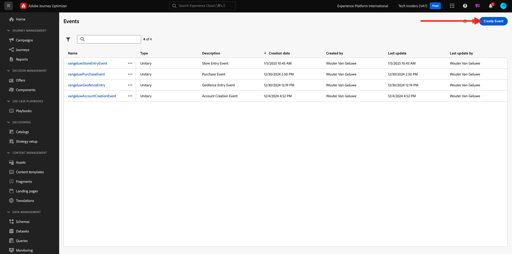
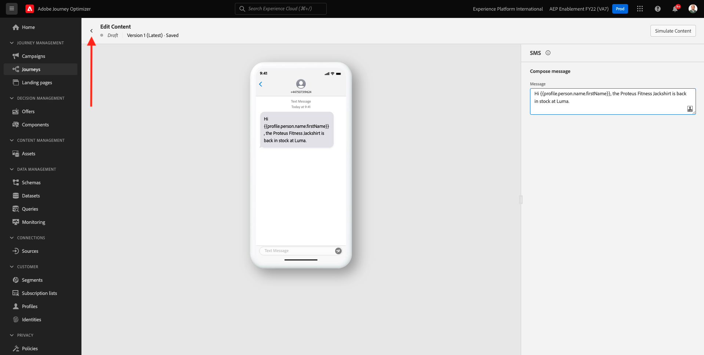
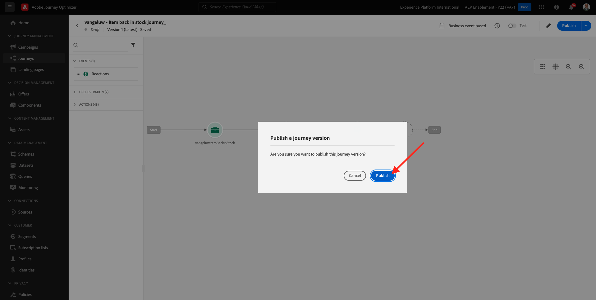

# 3.4.5 Een zakenreis maken

Login aan Adobe Journey Optimizer door naar [ Adobe Experience Cloud ](https://experience.adobe.com) te gaan. Klik **Journey Optimizer**.


U zult aan de **1} mening van het Huis {in Journey Optimizer worden opnieuw gericht.** Eerst, zorg ervoor u de correcte zandbak gebruikt. De sandbox die moet worden gebruikt, wordt `--aepSandboxName--` genoemd. U zult dan in de **1} mening van het Huis {van uw zandbak `--aepSandboxName--` zijn.**


## 3.4.5.1 Een zakelijke gebeurtenis maken

In het linkermenu, klik **Configuraties**. Klik op **leiden** knoop binnen de **** kaart van Gebeurtenissen.


Zakelijke gebeurtenissen zijn een nieuw type gebeurtenis dat u kunt maken in Journey Optimizer. In tegenstelling tot de **Eenheid** gebeurtenissen die u in vorige modules hebt gecreeerd, worden de bedrijfsgebeurtenissen niet teweeggebracht door de klant maar door de organisatie. U gaat nu uw bedrijfsgebeurtenis maken.

Klik **creëren Gebeurtenis**.



Voer de volgende waarden in het formulier voor het maken van gebeurtenissen in:

- **Naam**: `--aepUserLdap--ItemBackInStock`. Bijvoorbeeld: **vangeluwItemBackInStock**
- **Beschrijving**: Deze gebeurtenis wordt teweeggebracht wanneer een product terug in voorraad is
- **Type**: uitgezochte **Zaken** in de daling neer


Voor het Schema, uitgezochte **Systeem van de Demo - het Schema van de Gebeurtenis voor Van Bedrijfs JO Gebeurtenissen (Globale v1.1) v.1**. U moet nu de gebieden in het schema selecteren die u voor ons gebruiksgeval vereist.


Voer de volgende stappen uit:

Klik het **potlood** pictogram op het gebied waar het **1 geselecteerd gebied** zegt.


Selecteer alle beschikbare gebieden in het schema, dan klik O.K. ****.


Voor de voorwaarde: u moet specificeren welke verslagen in dit schema de bedrijfsgebeurtenis zullen teweegbrengen.

Voer de volgende stappen uit:

Klik het **potlood** pictogram op het gebied waar het **zegt voeg een voorwaarde** toe.


Op de linkerkant, breid het `--aepTenantId--` voorwerp uit, breid het voorwerp **joBusinessEvents** uit en sleep en laat vallen het gebied **eventName** op het canvas.


Voor het gebied **eventName**, ga de volgende waarde in: `--aepUserLdap--ItemBackInStock`. Bijvoorbeeld: vangeluwItemBackInStock.
Klik **OK**.


Klik **OK**.


Tot slot zou uw vorm van de gebeurtenisverwezenlijking als dit moeten kijken. Klik **sparen** om uw bedrijfsgebeurtenis te bewaren.


## 3.4.5.2 Een zakenreis maken

U kunt deze zakelijke gebeurtenis en het bericht nu gebruiken voor een reis. Ga naar **Reizen**. Klik **creëren Weg**.


Rechts ziet u een formulier waarin u de naam en de beschrijving van het transport moet vermelden. Voer de volgende waarden in:

- **Naam**: `--aepUserLdap-- - Item back in stock journey`. Bijvoorbeeld: vangeluw - Item terug in de aandelenreis
- **Beschrijving**: Deze reis verzendt SMS wanneer een punt terug in voorraad aan bezoeker is die een belang hebben getoond.

Klik **OK**.


In het linkermenu, onder **Gebeurtenissen**, onderzoek naar uw ldap. U vindt de eerder gemaakte bedrijfsgebeurtenis `--aepUserLdap--ItemBackInStock` . Sleep en zet deze gebeurtenis neer op het canvas, aangezien dit het uitgangspunt van de reis zal zijn.


Zoals u kunt zien, is de a **Gelezen activiteit van het Publiek** automatisch toegevoegd aan het canvas. Dit is omdat de bedrijfsgebeurtenissen slechts een trekker voor de reis verzenden om een specifiek publiek te lezen, dat dan de lijst van profielen voor die reis zal terugwinnen.

Klik de **Gelezen activiteit van het Publiek**.
De **Gelezen configuratie van het Publiek** verwacht u om het publiek te selecteren dat u van de bedrijfsgebeurtenis wilt op de hoogte brengen die enkel gebeurde. Klik **selecteren een publiek** gebied.


In **kies een publiek** popup, onderzoek naar uw ldap en selecteer het publiek u in [ Module 2.3 - In real time CDP creeerde - Bouw een publiek en neem actie ](./../../../modules/rtcdp-b2c/module2.3/real-time-cdp-build-a-segment-take-action.md) genoemd `--aepUserLdap-- - Interest in Galaxy S24`. Klik **sparen**.


Daarna, klik O.K. ****.


De volgende stap is het slepen en neerzetten van de actie die we op deze reis willen uitvoeren. Selecteer de actie **SMS**, dan belemmering en laat vallen het na de voorwaarde u enkel toevoegde.


Plaats de **Categorie** aan **Marketing** en selecteer een sms- oppervlakte die u toelaat om sms te verzenden. In dit geval, is de e-mailoppervlakte om te selecteren **SMS**.


De volgende stap is uw bericht te creëren. Om dat te doen, klik **geef inhoud** uit.


U zult nu het berichtdashboard zien, waar u de tekst van uw SMS kunt vormen. Klik het **samenstellen bericht** gebied om uw bericht tot stand te brengen.


Voer de volgende tekst in: `Hi {{profile.person.name.firstName}}, the Proteus Fitness Jackshirt is back in stock at Luma.`. Klik **sparen**.


Ga terug naar het berichtdashboard door de **pijl** naast de onderwerplijntekst in de top-left hoek te klikken.



Je ziet nu de voltooide SMS-actie. Klik **OK**.


Uw reis is nu klaar om te worden gepubliceerd. Klik **Publish**.


Klik **opnieuw Publish**.



Uw reis wordt nu gepubliceerd, u kunt het nu testen!


## 3.4.5.3 Test uw zakenreis

U zult nu de hervoorraad van een product simuleren door een nieuwe gebeurtenis tegen het **Systeem van de Demo in te voeren - het Schema van de Gebeurtenis voor Van Bedrijfs JO Gebeurtenissen (Globale v1.1) v.1** gebruikend Postman.

In het linkermenu, klik **Bronnen** en klik dan op de **Rekeningen** tabel.


Op het **lusje van Rekeningen**, zult u de genoemde rekening **Van Bedrijfs Journey Optimizer Gebeurtenissen** vinden. Klik erop om het te openen.


Deze account heeft slechts één gegevensstroom. Klik op de naam van de gegevensstroom om deze te selecteren.


Klik **het schemalading van het Exemplaar** in het juiste menu. Deze optie kopieert het volledige **curl** bevel om een verslag tegen het **Systeem van de Demo - het Schema van de Gebeurtenis voor Van Bedrijfs JO Gebeurtenissen (Globale v1.1) v.1** aan uw klembord op te nemen.


Plak de opdracht Curl in een teksteditor


Laten we dit verzoek nader bekijken.

- Het verzoek van de POST wordt verzonden naar DCS Inlet ID
- Het verzoek verwijst naar het schema, de dataset en identiteitskaart van de Organisatie.
- Tot slot bevat het de knoop xdmEntiteit die de gegevens vertegenwoordigt die wij binnen de dataset willen tot stand brengen.

U moet nu de volgende regel van `xdmEntity` vervangen...

```json
"xdmEntity": {
  "_experienceplatform": {
    "joBusinessEvents": {
      "eventDescription": "string",
      "eventName": "string",
      "stockEventId": "string"
    }
  },
  "_id": "/uri-reference",
  "eventType": "advertising.completes",
  "timestamp": "2018-11-12T20:20:39+00:00"
}
```

...door deze lijn, zorg ervoor om field eventName te verifiëren zoals het zou moeten zeggen `--aepUserLdap--ItemBackInStock`, die de voorwaarde vertegenwoordigt u in uw bedrijfsgebeurtenis hebt gespecificeerd om uw reis te teweegbrengen.

```json
"xdmEntity": {
  "_experienceplatform": {
    "joBusinessEvents": {
      "eventDescription": "Product Proteus Fitness Jackshirt is back in stock",
      "eventName": "--aepUserLdap--ItemBackInStock",
      "stockEventId": "1"
    }
  },
  "_id": "/uri-reference",
  "eventType": "productBackInStock",
  "timestamp": "2021-04-19T15:25:39+00:00"
}
```

Het bijgewerkte **curl** bevel zou als dit moeten kijken:


Selecteer alles en kopieer het naar uw klembord.

Open Postman. Op de linkerkant van Postman, klik **Invoer**.


Selecteer het **Ruwe tekst** lusje en kleef het bevel eerder hier gekopieerd. Klik **verdergaan**.


Klik **Invoer**.


Postman heeft automatisch het **krullende** bevel in een bevel van REST klaar om worden teweeggebracht omgezet, druk eenvoudig **verzenden** knoop om de verwezenlijking van dat verslag binnen de dataset te verzoeken.


Controleer of uw aanvraag is ontvangen. Zoek a **200 OK** status in postman.


Het SMS kan een paar minuten duren om op je mobiele telefoon aan te komen. Als het niet, kan uw **Interesse in het segment van het Jasje van de Fitness van Proteus** geen profiel met een correcte mobiele telefoon bevatten. Als zo, ga op de website van de Luma, bezoek het **product en register van het Jasje van de Hulpvaardigheid van de Proteus** terwijl het ervoor zorgen u het correcte mobiele telefoonaantal verstrekt.


U hebt deze oefening nu afgerond.

Volgende Stap: [ Samenvatting en voordelen ](./summary.md)

[Terug naar module 3.4](./journeyoptimizer.md)

[Terug naar alle modules](../../../overview.md)
