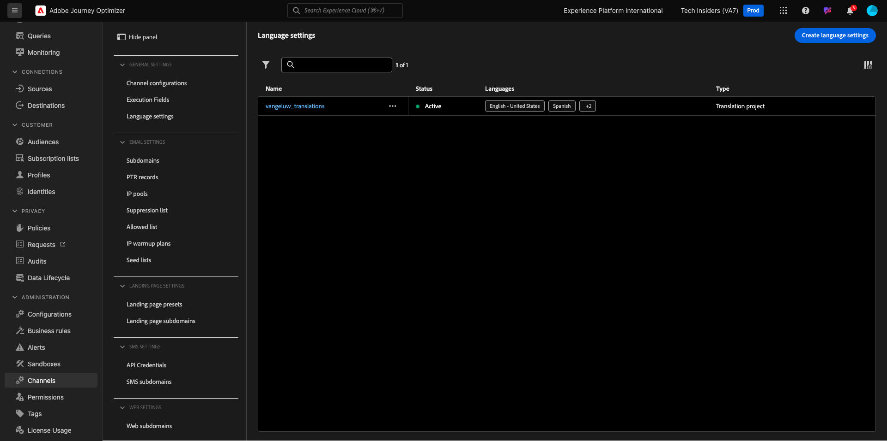

# 3.5.1 Vertaalbureau

## 3.5.1.1 Microsoft Azure Translator configureren

Ga naar [&#x200B; https://portal.azure.com/#home &#x200B;](https://portal.azure.com/#home).

Typ `translators` in de zoekbalk. Klik vervolgens op **+ Maken** .

Selecteer **creeer Vertaler**.

Kies uw **identiteitskaart van het Abonnement** en **groep van het Middel**.
Plaats **Gebied** aan **Globaal**.
Plaats **het Tarief Rij** aan **Vrije F0**.

Selecteer **Overzicht + creeer**.

Selecteer **creeer**.

Selecteer **gaan naar middel**.

In het linkermenu, ga naar **Beheer van het Middel** > **Sleutels en Eindpunt**. Klik om uw sleutel te kopiëren.

## 3.5.1.2 Landinstellingenwoordenboek

Ga naar [&#x200B; https://experience.adobe.com/ &#x200B;](https://experience.adobe.com/). Klik **Journey Optimizer**.

In het linkermenu, ga naar **Vertalingen** en ga dan naar **Woordenboek van de Plaats**. Als u dit bericht ziet, klik **toevoegen StandaardLandinstellingen**.

Dan moet je dit zien.

## 3.5.1.3 De aanbieder van vertalingen configureren in AJO

Ga naar [&#x200B; https://experience.adobe.com/ &#x200B;](https://experience.adobe.com/). Klik **Journey Optimizer**.

In het linkermenu, ga naar **Vertalingen** en ga dan naar **Leveranciers**. Klik **toevoegen Leverancier**.

Onder **Leveranciers**, uitgezochte **Vertaler van Microsoft**. Schakel het selectievakje in om het gebruik van de vertaalprovider in te schakelen. Plak de sleutel die u hebt gekopieerd van Microsoft Azure Translators. Dan, klik **Bevestig Geloofsbrieven**.

Uw referenties moeten dan worden gevalideerd. Als dat het geval is, schuift u omlaag om de talen voor vertaling te selecteren.

Selecteer `[en-US] English`, `[es] Spanish`, `[fr] French`, `[nl] Dutch` .

De rol omhoog en klikt **sparen**.

Uw **Vertaalleverancier** is nu klaar om te worden gebruikt.

## 3.5.1.4 Vertaalproject configureren

Ga naar [&#x200B; https://experience.adobe.com/ &#x200B;](https://experience.adobe.com/). Klik **Journey Optimizer**.

In het linkermenu, ga naar **Vertalingen** en ga dan naar **Woordenboek van de Plaats**. Als u dit bericht ziet, klik **leidt tot Project**.

Ga de naam `--aepUserLdap-- - Translations` in, plaats de **Landinstelling van Source** aan `[en-US] English - United States` en controleer checkboxes om zowel **toe te laten publiceren automatisch goedgekeurde vertalingen** en **toelaten overzichtswerkschema**. Klik vervolgens op **+ Een landinstelling toevoegen** .

Onderzoek naar `fr`, laat checkbox voor `[fr] French` toe en laat dan checkbox voor **Vertaler van Microsoft** toe. Klik op **+ Een landinstelling toevoegen** .

Onderzoek naar `es`, laat checkbox voor `[es] Spanish` toe en laat dan checkbox voor **Vertaler van Microsoft** toe. Klik op **+ Een landinstelling toevoegen** .

Onderzoek naar `nl`, laat checkbox voor `[nl] Spanish` toe en laat dan checkbox voor **Vertaler van Microsoft** toe. Klik op **+ Een landinstelling toevoegen** .

Klik **sparen**.

Uw **Vertalingen** project is nu klaar om worden gebruikt.

## 3.5.1.5 Taalinstellingen configureren

Ga naar **Kanalen** > **Algemene Montages** > **Montages van de Taal**. Klik **creeer taalmontages**.

Gebruik de naam `--aepUserLdap--_translations` . Selecteer **Vertaalproject**. Dan, klik **uitgeven** pictogram.

Selecteer het vertaalproject dat u in de vorige stap hebt gemaakt. Klik **Uitgezocht**.

Dan moet je dit zien. Plaats de **voorkeur van de Fallback** aan **Engels - Verenigde Staten**. Klik om **te selecteren Uitgezochte de aangewezen attribuut van de profieltaal**, die zal beslissen welk gebied van het klantenprofiel om de vertalingen te gebruiken te laden. Dan, klik **uitgeven** pictogram om te selecteren welk gebied zal worden gebruikt.

Ga **aangewezen taal** in de onderzoeksbar in, dan selecteer het gebied **Voorkeur taal**.

Klik **uitgeven** pictogram voor zowel **Engels - Verenigde Staten** en **Nederlands** om zijn configuratie te herzien.

Hier is de configuratie voor **Engels - Verenigde Staten**. Klik **annuleren**.

Klik om de configuratie voor **Nederlands** te bekijken. Klik **annuleren**.

De rol omhoog en klikt **voorleggen**.

Uw taalinstellingen zijn nu geconfigureerd.

U hebt deze oefening voltooid.

## Volgende stappen

Ga naar [&#x200B; 3.5.2 creeer uw Campagne &#x200B;](./ex2.md)

Ga terug naar [&#x200B; Module 3.5 &#x200B;](./ajotranslationsvcs.md){target="_blank"}

Ga terug naar [&#x200B; Alle modules &#x200B;](./../../../overview.md){target="_blank"}
