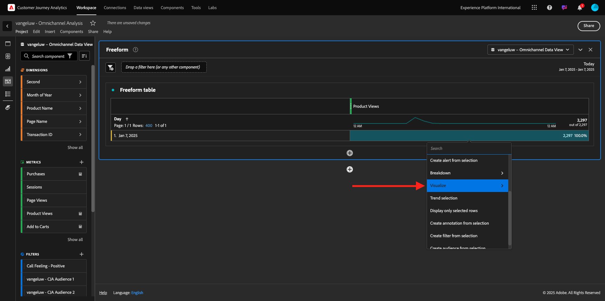
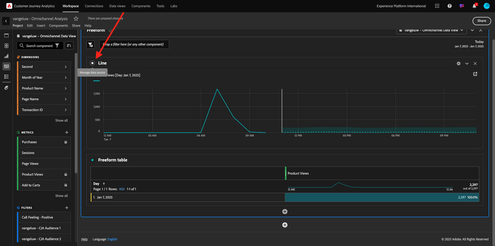
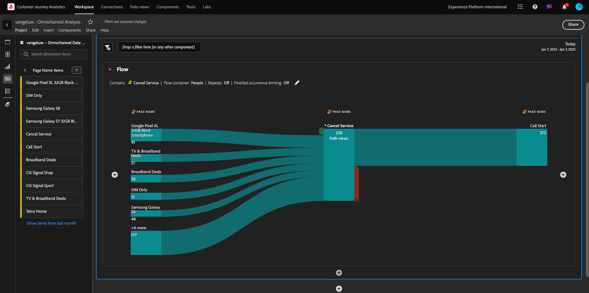
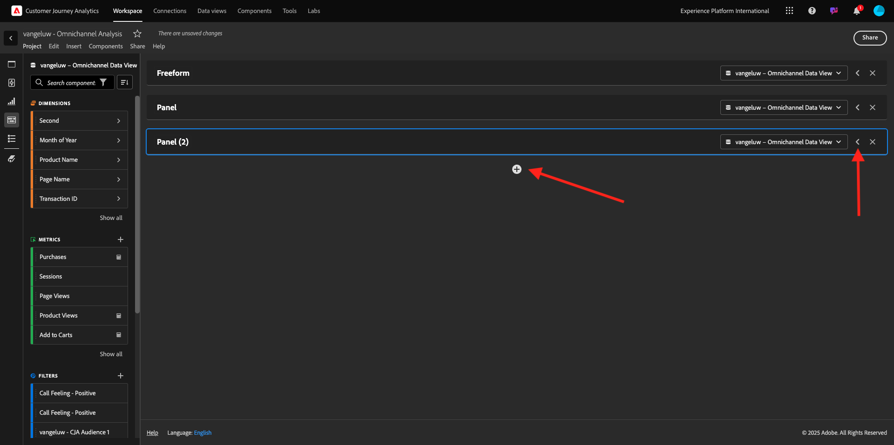
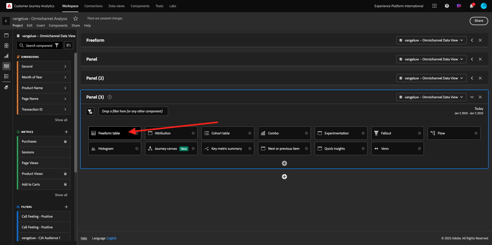

# 4.1.5 Visualisatie met Customer Journey Analytics

## Doelstellingen

- Analysis Workspace-gebruikersinterface begrijpen
- Leer een functie die Analysis Workspace zo verschillend maakt.
- Leer hoe u in CJA analyseert met Analysis Workspace

## Context

In deze oefeningen zult u Analysis Workspace binnen CJA gebruiken om productmeningen, producttrechters, kurn etc. te analyseren.

Wij zullen enkele vragen behandelen die in Module 7 - de Dienst van de Vraag worden gedaan zodat kunt u zien hoe gemakkelijk is om de zelfde vragen en meer in werking te stellen maar zonder SQL te gebruiken en slechts op de belemmering en dalingsfilosofie van Analysis Workspace te vertrouwen.

Laten wij het project gebruiken u in [ 4.1.4 Voorbereiding van Gegevens in Analysis Workspace ](./ex4.md) creeerde, zo ga [ https://analytics.adobe.com ](https://analytics.adobe.com).

Klik om uw project te openen `--aepUserLdap-- - Omnichannel Analysis`.

Als uw project is geopend en de gegevensweergave `--aepUserLdap-- - Omnichannel Analysis` is geselecteerd, kunt u uw eerste visualisaties gaan maken.

## Hoeveel productweergaven hebben we dagelijks

Allereerst moet u de juiste datums selecteren om de gegevens te analyseren. Ga naar de kalenderdropdown op de rechterkant van het canvas. Klik erop en selecteer het toepasselijke datumbereik.

In het linkerzijmenu (componentengebied), vind de Berekende Metrische **Kijken van het Product**. Selecteer het en sleep het en laat vallen het binnen aan het canvas, op het hoogste recht binnen de vrije vormlijst.

Automatisch zal de afmeting **Dag** worden toegevoegd om uw eerste lijst tot stand te brengen. Nu kunt u zien hoe uw vraag direct wordt beantwoord.

Klik vervolgens met de rechtermuisknop op het metrische overzicht. Klik **visualiseren**.

Klik **Lijn**.

Uw producten worden per uur weergegeven.

U kunt het tijdwerkingsgebied in dag veranderen door op **Montages** binnen visualisatie te klikken.

Klik op de punt naast **Lijn** om **de Gegevens Source** te beheren.

Daarna, klik **de Selectie van het Slot** en selecteer **Geselecteerde Punten** om deze visualisatie te sluiten zodat het altijd een chronologie van de Mening van het Product toont.

## Vijf meest bekeken producten

Wat zijn de vijf belangrijkste producten die worden weergegeven?

Vergeet niet om het project nu en dan op te slaan.

| OS | Korte snede |
| ----------------- |-------------| 
| Windows | Control + S |
| Mac | Command + S |

Laten we de beste 5 bekeken producten vinden. In het linkerzijmenu, vind de **Naam van het Product** - Dimension.

Nu belemmering en laat vallen {de Naam van het 0} Product **om de** 3&rbrace; dimensie van de Dag te vervangen:**&#x200B;**

Dat zal het resultaat zijn. Selecteer de vier productnamen en u zult de vizualization update zien.

Probeer vervolgens een van de producten te splitsen op merknaam. Onderzoek naar **brandName** en sleep het onder de eerste productnaam.

Daarna, doe een verdeling gebruikend de Agent van de Gebruiker. Onderzoek naar **Agent van de Gebruiker** en sleep het onder de merknaam.

U zult dan dit zien:

Tot slot kunt u meer visualisaties toevoegen. Zoek links onder visualisatie naar `Donut` . Neem `Donut`, belemmering-en-daling het op het canvas onder de **visualisatie van de Lijn**.

Daarna, in de Lijst, selecteer de eerste 5 **rijen van de Agent van de Gebruiker** van de onderbreking wij onder **het Pixel XL 32GB Zwarte Smartphone van Google** > **Citi Signaal** deden. Terwijl het selecteren van de 3 rijen, houd **CTRL** knoop (op Vensters) of **Bevel** knoop (op Mac). U zult de donutgrafiek zien bijwerken.

U kunt zelfs het ontwerp aanpassen om beter leesbaar te zijn, door zowel de **grafiek van de Lijn** als de **grafiek van de Donut** kleiner te maken zodat kunnen zij naast elkaar passen:

Klik op de punt naast **Donut** om **de Gegevens Source** te beheren.
Daarna, klik **de Selectie van het Slot** om deze visualisatie te sluiten zodat het altijd een chronologie van de Mening van het Product toont.

Meer informatie over visualisaties met Analysis Workspace vindt u hier:

- [ https://experienceleague.adobe.com/docs/analytics/analyze/analysis-workspace/visualizations/freeform-analysis-visualizations.html?lang=nl-NL](https://experienceleague.adobe.com/docs/analytics/analyze/analysis-workspace/visualizations/freeform-analysis-visualizations.html?lang=nl-NL)
- [ https://experienceleague.adobe.com/docs/analytics/analyze/analysis-workspace/visualizations/t-sync-visualization.html?lang=nl-NL](https://experienceleague.adobe.com/docs/analytics/analyze/analysis-workspace/visualizations/t-sync-visualization.html?lang=nl-NL)

## Trechter met productinteracties, van weergave tot aankoop

Er zijn veel manieren om deze kwestie op te lossen. Één van hen moet het Type van Interactie van het Product gebruiken en het op een vrije vormlijst gebruiken. Een andere manier is de Visualisatie van de a **Vallout** te gebruiken. Laten we de laatste gebruiken die we tegelijkertijd willen visualiseren en analyseren.

Sluit het huidige deelvenster door hier te klikken:

Voeg nu een nieuw leeg paneel toe door op **+ te klikken voegt Leeg Comité toe**.

Klik de visualisatie **Vallout**.

Selecteer hetzelfde datumbereik als in de vorige exercitie.

Dan zie je dit.

Vind het Type van de afmeting **Gebeurtenis** onder de componenten op de linkerkant. Klik op de pijl om de dimensie te openen.

Alle beschikbare gebeurtenistypen worden weergegeven.

Selecteer het punt **commerce.productViews** en sleep en laat vallen het op **toevoegen Touchpoint** gebied binnen de **Visualisatie van de Vallout**.

Doe het zelfde met **commerce.productListAdds** en **commerce.purchase** en laat vallen hen op **toevoegen Aanraakpunt** gebied binnen de **Visualisatie van de Vallout**. Uw visualisatie ziet er nu als volgt uit:

Je kunt hier veel doen. Sommige voorbeelden: vergelijk in de loop der tijd elke stap per apparaat of vergelijk elke stap per loyaliteit. Als u echter interessante zaken wilt analyseren, zoals waarom klanten geen artikelen kopen nadat ze een artikel aan hun winkelwagentje hebben toegevoegd, kunnen we het beste hulpmiddel in CJA gebruiken: klik met de rechtermuisknop.

Klik met de rechtermuisknop op het aanraakpunt **commerce.productListAdds**. Dan klik op **val van de Onderbreking op dit aanraakpunt**.

Er wordt een nieuwe vrije-vormtabel gemaakt om te analyseren wat de mensen deden als ze niets hadden aangeschaft.

Verander het **Type van Gebeurtenis** door **Naam van de Pagina**, in de nieuwe vrije lijst, om te zien welke pagina&#39;s zij in plaats van de Pagina van de Bevestiging van de Aankoop gaan.

## Wat doen de mensen op de plaats alvorens de Cancel pagina van de Dienst te bereiken?

Nogmaals, er zijn vele manieren om deze analyse uit te voeren. Laten we de flowanalyse gebruiken om het detectieonderdeel te starten.

Sluit het huidige paneel door hier te klikken en dan een nieuw leeg paneel toe te voegen door op **+ te klikken voegt het Lege Comité toe**.

Klik de visualisatie **Stroom**.

Dan zie je dit. Selecteer hetzelfde datumbereik als in de vorige exercitie. Klik **toepassen**.

Vind de afmeting **Naam van de Pagina** onder de componenten op de linkerkant en klik de pijl om de afmeting te openen.

Alle weergegeven pagina&#39;s worden gevonden. Vind de paginanaam: **annuleert Dienst**.
De belemmering en laat vallen **annuleert Dienst** in de Visualisatie van de Stroom op het middelste gebied. Klik **bouwen**.

U zult dan dit zien:

Laten wij nu analyseren als de klanten die **hebben bezocht annuleer de pagina van de Dienst** op de website ook callcenter riepen, en wat het resultaat was.

Onder de afmetingen, ga terug en vind dan **het Type van Interactie van de Vraag**.
De belemmering en laat vallen **Type van Interactie van de Vraag** om de eerste interactie op het recht binnen de **Visualisatie van de Stroom** te vervangen.

U ziet nu het steunkaartje van de klanten die het vraagcentrum na het bezoeken van **roepen annuleert de pagina van de Dienst**.

Daarna, onder de dimensies, onderzoek naar **het Etiketteren van de Vraag**.  De belemmering en laat vallen het om de eerste interactie op het recht binnen de **Visualisatie van de Stroom** te vervangen.

U zult dan dit zien:

Zoals u kunt zien, hebben wij een omnichannel analyse in werking gesteld gebruikend de Visualisatie van de Stroom. Daardoor hebben we ontdekt dat sommige klanten die van plan waren hun service te annuleren, een positief gevoel hadden nadat ze het callcenter hadden gebeld. Hebben we misschien hun gedachten veranderd met een promotie?

## Hoe presteert de klanten met een Positief contact Callcenter tegen belangrijkste KPIs?

Laten wij eerst de gegevens segmenteren om slechts gebruikers met **positieve** vraag te krijgen. In CJA, worden de Segmenten genoemd Filters. Ga naar filters binnen het componentengebied (op de linkerkant) en klik **+**.

Geef binnen de filterconstructor een naam op voor het filter

| Naam | Beschrijving |
| ----------------- |-------------| 
| Bellen - Positief | Bellen - Positief |

Onder de componenten (binnen de Bouwer van de Filter), vind **het Keren van de Vraag** en sleep en laat vallen het in de Definitie van de Bouwer van de Filter.

Nu uitgezochte **positief** als waarde voor de filter.

Verander het werkingsgebied om **Persoonlijk** niveau te zijn. Klik **sparen**.

Dan ben je hier weer. Sluit het vorige deelvenster en voeg een nieuw leeg deelvenster toe door op **+ Lege deelvenster toevoegen** te klikken.

Selecteer hetzelfde datumbereik als in de vorige exercitie. Klik **toepassen**.

Klik **Vrije lijst van de Vorm**.

Sleep nu het filter dat u zojuist hebt gemaakt.

Tijd voor het toevoegen van cijfers. Begin met **Weergaven van het Product**. Sleep en zet het neer in de vrije-vormlijst. U kunt ook de **metrische Gebeurtenissen** schrappen.

Doe het zelfde met **Mensen**, **toevoegen aan Kaart** en **Aankopen**. Je komt dan met zo&#39;n tafel.

Dankzij de eerste stroomanalyse kwam er een nieuwe vraag op. Dus besloten we deze tabel te maken en een aantal KPI&#39;s te controleren op een segment om die vraag te beantwoorden. Zoals u kunt zien, is tijd aan inzicht veel sneller dan het gebruiken van SQL of het gebruiken van andere oplossingen van BI.

## Customer Journey Analytics- en Analysis Workspace-opbergplaats

Zoals u in dit laboratorium hebt geleerd, hecht Analysis Workspace gegevens van alle kanalen samen om de volledige klantenreis te analyseren. Vergeet ook niet dat u gegevens naar dezelfde werkruimte kunt brengen die niet aan de reis is gekoppeld.
Het kan echt nuttig zijn om losgekoppelde gegevens in uw analyse te brengen om context aan de reis te geven. Voorbeelden zijn onder andere NPS-gegevens, enquêtes, Facebook Ads-gebeurtenissen of offline-interacties (niet geïdentificeerd).

Volgende Stap: [ Samenvatting &amp; voordelen ](./summary.md)

[Terug naar module 4.1](./customer-journey-analytics-build-a-dashboard.md)

[Terug naar alle modules](./../../../overview.md)
