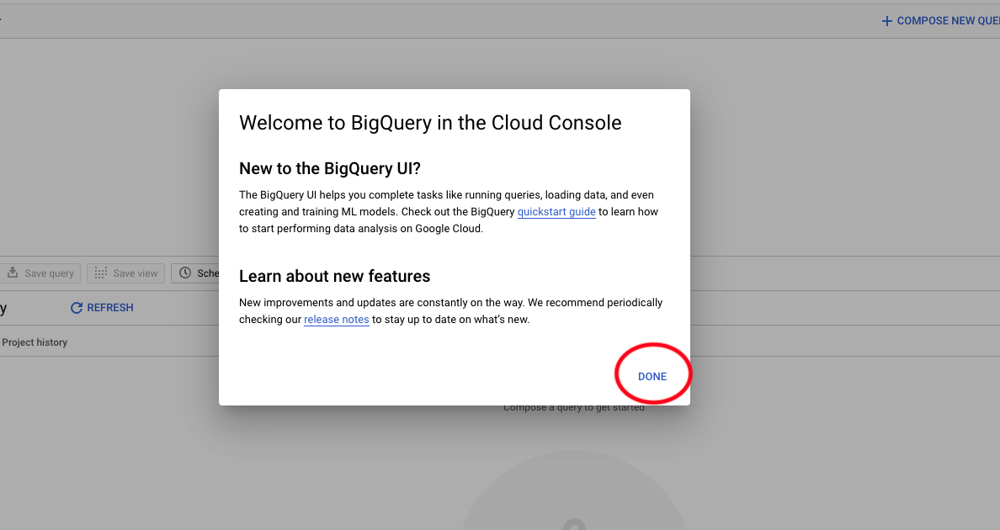

# 4.2.1 Uw Google Cloud Platform-account maken

## Doelstellingen

- Uw Google Cloud Platform-account maken
- Bekend worden met Google Cloud Platform Console
- Uw BigQuery-project maken en voorbereiden

## 4.2.1.1 Waarom maakt u verbinding met Google BigQuery met Adobe Experience Platform om gegevens van Googles Analytics op te halen

Google Cloud Platform (GCP) is een pakket openbare cloudcomputingdiensten die door Google worden aangeboden. Het Google Cloud Platform bevat een reeks gehoste services voor computer-, opslag- en toepassingsontwikkeling die op Google-hardware worden uitgevoerd.

BigQuery is één van deze diensten en het is altijd inbegrepen met Googles Analytics 360. Gegevens van Googles Analytics worden vaak gesampled wanneer we proberen gegevens er direct van te krijgen (bijvoorbeeld API). Daarom bevat Google BigQuery om niet-gesamplede gegevens te verkrijgen, zodat merken geavanceerde analyses kunnen uitvoeren met SQL en kunnen profiteren van de kracht van GCP.

Gegevens van Googles Analytics worden dagelijks in BigQuery geladen via een batchmechanisme. Daarom heeft het geen zin om deze integratie van GCP/BigQuery te gebruiken voor realtime personalisatie en activeringsgebruiksgevallen.

Als een merk gebruiksgevallen voor realtime personalisatie wil aanbieden op basis van gegevens van Googles Analytics, kan het die gegevens verzamelen op de website met Google Tag Manager en deze vervolgens in real-time naar Adobe Experience Platform streamen.

De connector GCP/BigQuery Source moet worden gebruikt voor...

- Volg al klantengedrag op de website en laad die gegevens in Adobe Experience Platform voor analyse, gegevenswetenschap en verpersoonlijking gebruiksgevallen die geen activering in real time vereisen.
- historische gegevens van Googles Analytics naar Adobe Experience Platform laden, ook voor gebruik in analysen en gegevenswetenschappen

## 4.2.1.2 Een Google-account maken

Voor een Google Cloud Platform-account hebt u een Google-account nodig.

## 4.2.1.3 Uw Google Cloud Platform-account activeren

Nu u een Google-account hebt, kunt u een Google Cloud Platform-omgeving maken. Om dat te doen, ga naar [ https://console.cloud.google.com/ ](https://console.cloud.google.com/).

Accepteer de Algemene voorwaarden op de volgende pagina.

Daarna, klik op **Selecteer een project**.

Klik op **NIEUW PROJECT**.

Geef uw project een naam volgens deze naamgevingsconventie:

| Conventie | Voorbeeld |
| ----------------- |-------------| 
| `--demoProfileLdap---googlecloud` | delaigle-googlecloud |

Klik **creëren**.

Wacht tot het bericht in de rechterbovenhoek van het scherm u vertelt dat het maken is voltooid. Dan, klik op **project van de Mening**.

Daarna, ga naar de onderzoeksbar bovenop het scherm en type **BigQuery**. Selecteer het eerste resultaat.

U wordt vervolgens omgeleid naar de BigQuery Console en er wordt een pop-upbericht weergegeven.

**klik Gedaan**.

Het doel van deze module is om gegevens van Googles Analytics in Adobe Experience Platform te krijgen. Om dat te doen, hebben we dummygegevens nodig in een dataset van Googles Analytics om mee te beginnen.

Klik op **voeg Gegevens** op het linkerzijmenu toe, dat door te klikken **wordt gevolgd openbare datasets** ontdekken.

U ziet dan dit venster:

Ga de steekproef van de Googles Analytics van de onderzoekstermijn **** in de onderzoeksbar in en selecteer het eerste resultaat.

U zult het volgende scherm met een beschrijving van de dataset zien. Klik op **DATASET VAN DE MENING**.

U zult dan aan BigQuery opnieuw worden gericht waar u dit **bigquery-public-data** dataset onder **Ontdekkingsreiziger** zult zien.

In **Ontdekkingsreiziger**, zou u een aantal lijsten nu moeten zien. Voel je vrij om ze te verkennen. Ga naar `google_analytics_sample` .

Klik om de tabel te openen `ga_sessions` .

Voordat u verdergaat met de volgende oefening, noteer gelieve de volgende dingen in een afzonderlijk tekstdossier op uw computer:

| Credentials | Naamgeving | Voorbeeld |
| ----------------- |-------------| -------------|
| Projectnaam | `--demoProfileLdap---googlecloud` | vangeluw-googlecloud |
| Project-id | random | composiet-task-306413 |

U kunt uw Naam van het Project en identiteitskaart van het Project vinden door op uw **Naam van het Project** in de hoogste menubar te klikken:

U ziet dan uw project-id aan de rechterkant:

U kunt nu naar oefening 12.2 gaan waar u uw handen vuil maakt door de gegevens van Googles Analytics te vragen.

Volgende Stap: [ 4.2.2 leidt tot uw eerste vraag in BigQuery ](./ex2.md)

[Terug naar module 4.2](./customer-journey-analytics-bigquery-gcp.md)

[Terug naar alle modules](./../../../overview.md)
