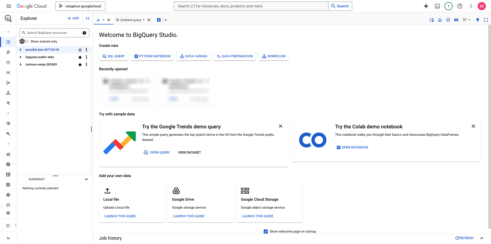

# 4.2.2 Maak uw eerste query in BigQuery

## Doelstellingen

- De gebruikersinterface van BigQuery verkennen
- Een SQL-query maken in BigQuery
- Sparen de resultaten van uw SQL vraag in een dataset binnen BigQuery

## Context

Wanneer de gegevens van Googles Analytics in BigQuery zijn, zijn de dimensies, metriek en andere variabelen allen genesteld. Bovendien worden de gegevens van Googles Analytics dagelijks in verschillende lijsten geladen. Dit betekent dat het rechtstreeks proberen om Googles Analytics lijsten binnen BigQuery aan Adobe Experience Platform te verbinden zeer moeilijk en geen goed idee is.

De oplossing voor dit probleem is de gegevens van Googles Analytics om te zetten in een leesbare indeling, zodat de opname in Adobe Experience Platform eenvoudiger wordt.

## 4.2.2.1 creeer een dataset om nieuwe Lijsten te bewaren BigQuery

Ga naar de [ Console BigQuery ](https://console.cloud.google.com/bigquery).



In **Ontdekkingsreiziger**, zult u uw identiteitskaart van het Project zien. Klik uw identiteitskaart van het Project (klik niet **bigquery-public-data** dataset).


Je kunt zien dat er nog geen dataset is, dus laten we er nu een maken.
Klik 3 **...** en klik dan **CREEER DATASET**.


Op de rechterkant van uw scherm, zult u **zien leiden dataset** menu.


Voor **identiteitskaart van de Dataset**, gebruik de hieronder noemende overeenkomst. Voor de andere velden laat u de standaardinstellingen ongewijzigd.

| Naamgeving | Voorbeeld |
| ----------------- | ------------- | 
| `--aepUserLdap--_BigQueryDataSet` | vangeluw_BigQueryDataSet |

Klik **CREEER GEGEVENSSET**.


U zult dan terug in de Console BigQuery met uw gemaakte dataset zijn.


## 4.2.2.2 Maak uw eerste SQL BigQuery

Daarna, zult u uw eerste vraag in BigQuery creëren. Het doel van deze query is om de voorbeeldgegevens van de Googles Analytics te nemen en te transformeren zodat deze in Adobe Experience Platform kunnen worden opgenomen. Ga naar de **Naamloze vraag** tabel.


Kopieer de volgende SQL-query en plak deze in die Query Editor. Voel vrij om de vraag te lezen en de syntaxis van Googles Analytics te begrijpen BigQuery.


```sql
SELECT
  CONCAT(fullVisitorId, CAST(hitTime AS String), '-', hitNumber) AS _id,
  TIMESTAMP(DATETIME(Year_Current, Month_Current, Day_Current, Hour, Minutes, Seconds)) AS timeStamp,
  fullVisitorId as GA_ID,
  -- Fake CUSTOMER ID
  CONCAT('3E-D4-',fullVisitorId, '-1W-93F' ) as customerID,
  Page,
  Landing_Page,
  Exit_Page,
  Device,
  Browser,
  MarketingChannel,
  TrafficSource,
  TrafficMedium,
  -- Enhanced Ecommerce
  TransactionID,
  CASE
      WHEN EcommerceActionType = '2' THEN 'Product_Detail_Views'
      WHEN EcommerceActionType = '3' THEN 'Adds_To_Cart'
      WHEN EcommerceActionType = '4' THEN 'Product_Removes_From_Cart'
      WHEN EcommerceActionType = '5' THEN 'Product_Checkouts'
      WHEN EcommerceActionType = '6' THEN 'Product_Refunds'
    ELSE
    NULL
  END
     AS Ecommerce_Action_Type,
  -- Entrances (metric)
  SUM(CASE
      WHEN isEntrance = TRUE THEN 1
    ELSE
    0
  END
    ) AS Entries,
    
--Pageviews (metric)
    COUNT(*) AS Pageviews,
    
 -- Exits 
    SUM(
    IF
      (isExit IS NOT NULL,
        1,
        0)) AS Exits,
        
 --Bounces
   SUM(CASE
      WHEN isExit = TRUE AND isEntrance = TRUE THEN 1
    ELSE
    0
  END
    ) AS Bounces,
        
  -- Unique Purchases (metric)
  COUNT(DISTINCT TransactionID) AS Unique_Purchases,
  -- Product Detail Views (metric)
  COUNT(CASE
      WHEN EcommerceActionType = '2' THEN fullVisitorId
    ELSE
    NULL
  END
    ) AS Product_Detail_Views,
  -- Product Adds To Cart (metric)
  COUNT(CASE
      WHEN EcommerceActionType = '3' THEN fullVisitorId
    ELSE
    NULL
  END
    ) AS Adds_To_Cart,
  -- Product Removes From Cart (metric)
  COUNT(CASE
      WHEN EcommerceActionType = '4' THEN fullVisitorId
    ELSE
    NULL
  END
    ) AS Product_Removes_From_Cart,
  -- Product Checkouts (metric)
  COUNT(CASE
      WHEN EcommerceActionType = '5' THEN fullVisitorId
    ELSE
    NULL
  END
    ) AS Product_Checkouts,
  -- Product Refunds (metric)
  COUNT(CASE
      WHEN EcommerceActionType = '7' THEN fullVisitorId
    ELSE
    NULL
  END
    ) AS Product_Refunds
  FROM (
  SELECT
    -- Landing Page (dimension)
    CASE
      WHEN hits.isEntrance = TRUE THEN hits.page.pageTitle
    ELSE NULL
  END
    AS Landing_page,
    
        -- Exit Page (dimension)
    CASE
      WHEN hits.isExit = TRUE THEN hits.page.pageTitle
    ELSE
    NULL
  END
    AS Exit_page,
    
    hits.page.pageTitle AS Page,
    hits.isEntrance,
    hits.isExit,
    hits.hitNumber as hitNumber,
    hits.time as hitTime,
    date as Fecha,
    fullVisitorId,
    visitStartTime,
    device.deviceCategory AS Device,
    device.browser AS Browser,
    channelGrouping AS MarketingChannel,
    trafficSource.source AS TrafficSource,
    trafficSource.medium AS TrafficMedium,
    hits.transaction.transactionId AS TransactionID,
    CAST(EXTRACT(YEAR FROM CURRENT_DATE()) AS INT64) AS Year_Current,
    CAST(EXTRACT(MONTH FROM CURRENT_DATE()) AS INT64) AS Month_Current,
     CAST(EXTRACT(DAY FROM CURRENT_DATE()) AS INT64) AS Day_Current,
    CAST(EXTRACT(DAY FROM DATE_SUB(CURRENT_DATE(),INTERVAL 1 DAY)) AS INT64) AS Day_Current_Before,
    CAST(FORMAT_DATE('%Y', PARSE_DATE("%Y%m%d", date)) AS INT64) AS Year,
  CAST(FORMAT_DATE('%m', PARSE_DATE("%Y%m%d",date)) AS INT64) AS Month,
  CAST(FORMAT_DATE('%d', PARSE_DATE("%Y%m%d",date)) AS INT64) AS Day,
    CAST(EXTRACT (hour FROM TIMESTAMP_SECONDS(hits.time)) AS INT64) AS Hour,
  CAST(EXTRACT (minute FROM TIMESTAMP_SECONDS(hits.time)) AS INT64) AS Minutes,
  CAST(EXTRACT (second FROM TIMESTAMP_SECONDS(hits.time)) AS INT64) AS SecondS,
    hits.eCommerceAction.action_type AS EcommerceActionType
  
  FROM
    `bigquery-public-data.google_analytics_sample.ga_sessions_*`,
     UNNEST(hits) AS hits
  WHERE
    _table_suffix BETWEEN '20170101'
    AND '20170331'
    AND totals.visits = 1
    AND hits.type = 'PAGE'
    )
    
GROUP BY
  1,
  2,
  3,
  4,
  5,
  6,
  7,
  8,
  9,
  10,
  11,
  12,
  13,
  14
    
  ORDER BY 2 DESC
```

Wanneer u klaar bent, klik **Looppas** om de vraag in werking te stellen:


Het uitvoeren van de query kan een paar minuten duren.

Zodra de vraag het lopen gebeëindigd heeft, zult u de hieronder output in de **resultaten van de Vraag** zien.


## 4.2.2.3 Sla de resultaten van uw BigQuery SQL-query op

De volgende stap moet de output van uw vraag bewaren door **te klikken SLEEPT RESULTATEN** knoop.


Als plaats voor uw output, uitgezochte **Lijst BigQuery**.


U zult dan een nieuwe popup zien, waar uw **Naam van het Project** en **Naam van de Dataset** pre-bevolkt zijn. De naam van de dataset zou de dataset moeten zijn die u in het begin van deze oefening, met deze noemende overeenkomst creeerde:

| Naamgeving | Voorbeeld |
| ----------------- | ------------- | 
| `--aepUserLdap--_BigQueryDataSet` | `vangeluw_BigQueryDataSet` |

U moet nu een tabelnaam invoeren. Gebruik deze naamgevingsconventie:

| Naamgeving | Voorbeeld |
| ----------------- |------------- | 
| `--aepUserLdap--_GAdataTableBigQuery` | `vangeluw_GAdataTableBigQuery` |

Klik **OPSLAAN**.


Het kan enige tijd duren tot de gegevens klaar zijn in de tabel die u hebt gemaakt. Vernieuw na een paar minuten de browser. U zou dan binnen uw dataset de `--aepUserLdap--_GAdataTableBigquery` lijst onder **Ontdekkingsreiziger** binnen uw project BigQuery moeten zien.


U gaat nu verder met de volgende oefening, waar u deze lijst aan Adobe Experience Platform zult verbinden.

Volgende Stap: [ 4.2.3 verbindt GCP &amp; BigQuery aan Adobe Experience Platform ](./ex3.md)

[Terug naar module 4.2](./customer-journey-analytics-bigquery-gcp.md)

[Terug naar alle modules](./../../../overview.md)
