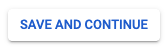
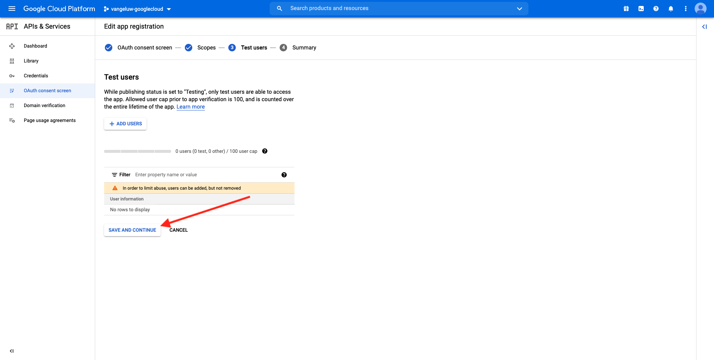
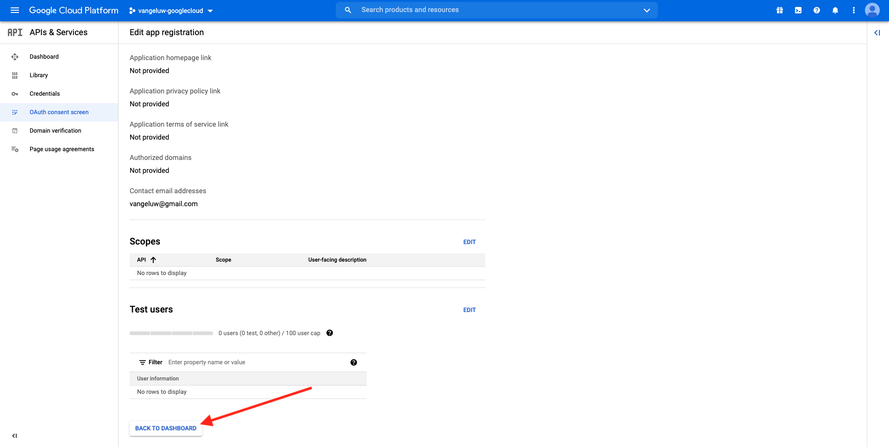
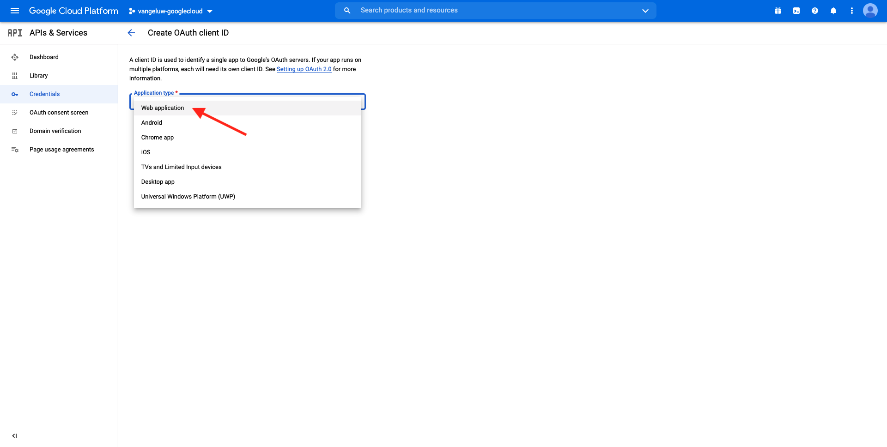
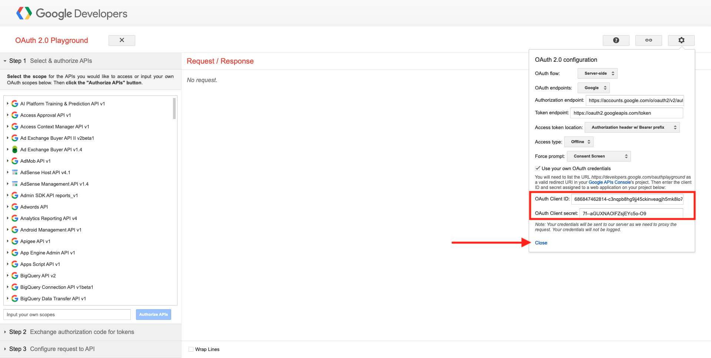

# 4.2.3 GCP en BigQuery aansluiten op Adobe Experience Platform

## Doelstellingen

- De API en services verkennen in het Google Cloud Platform
- Ben vertrouwd met OAuth Playground voor het testen van Google APIs
- Uw eerste BigQuery-verbinding maken in Adobe Experience Platform

## Context

Adobe Experience Platform verstrekt een schakelaar binnen **Bronnen** die u zal helpen datasets BigQuery in Adobe Experience Platform brengen. Deze gegevensconnector is gebaseerd op de Google BigQuery API. Daarom is het belangrijk om uw Google Cloud Platform en uw BigQuery-omgeving goed voor te bereiden voor het ontvangen van API-aanroepen van Adobe Experience Platform.

Voor het configureren van de BigQuery Source-connector in Adobe Experience Platform hebt u de volgende vier waarden nodig:

- project
- clientId
- clientSecret
- refreshToken

Tot dusverre hebt u slechts eerste, **identiteitskaart van het Project**. Deze **waarde van identiteitskaart van 0} Project is een willekeurige identiteitskaart die door Google werd geproduceerd toen u uw project BigQuery tijdens oefening 12.1 creeerde.**

Kopieer de project-id in een gescheiden tekstbestand.

| Credentials | Naamgeving | Voorbeeld |
| ----------------- |-------------| -------------|
| Project-id | random | composiet-task-306413 |

U kunt uw identiteitskaart van het Project op elk ogenblik controleren door op uw **Naam van het Project** in de hoogste menubar te klikken:

U ziet uw project-id aan de rechterkant:

In deze oefening zult u leren hoe te om de andere 3 vereiste gebieden te krijgen:

- clientId
- clientSecret
- refreshToken

## 4.2.3.1 Google Cloud API &amp; Services

Ga om te beginnen terug naar de startpagina van het Google Cloud Platform. Klik hiertoe in de linkerbovenhoek van het scherm op het logo.

Zodra u op de homepage bent, ga naar linkermenu en klik **APIs &amp; de Diensten**, dan klik op **Dashboard**.

U zult nu **APIs &amp; de homepage van de Diensten** zien.

Op deze pagina kunt u het gebruik van uw verschillende Google API-verbindingen zien. Als u een API-verbinding wilt instellen zodat Adobe Experience Platform gegevens kan lezen van BigQuery, moet u de volgende stappen uitvoeren:

- Eerst, moet u een OAuth toestemmingsscherm tot stand brengen om toekomstige authentificatie toe te laten. De veiligheidsredenen van Google vereisen ook een mens om de eerste authentificatie te maken, alvorens een programmatic toegang wordt toegestaan.
- Ten tweede hebt u API Credentials (clientId en clientSecret) nodig die worden gebruikt voor API-verificatie en toegang tot uw BigQuery-connector.

## 4.2.3.2 Scherm met acceptatie

Laten we beginnen met het maken van het scherm OAuth-instemming. In het linkermenu op de **homepage 0} APIs &amp; van de Diensten, klik** OAuth toestemmingsscherm **.**

U zult dan dit zien:

Selecteer het Type van Gebruiker: **Extern**. Daarna, klik **CREËREN**.

U zult dan op het **OAuth de configuratie van het Scherm van de Toestemming** venster zijn.

Het enige ding om hier te doen is de naam van het toestemmingsscherm op het **gebied in te gaan van de naam van de Toepassing** en de **e-mail van de gebruikerssteun** te selecteren. Gebruik voor de toepassingsnaam de volgende naamgevingsconventie:

| Naamgeving | Voorbeeld |
| ----------------- |-------------| 
| `--demoProfileLdap-- - AEP BigQuery Connector` | vangeluw - AEP BigQuery Connector |

Daarna, scrol neer tot u **de contactinformatie van de Ontwikkelaar** ziet en een e-mailadres invult.

Klik **OPSLAAN EN DOORGAAN**.

Dan zie je dit. Klik **OPSLAAN EN DOORGAAN**.

Dan zie je dit. Klik **OPSLAAN EN DOORGAAN**.

Dan zie je dit. Klik **TERUG AAN DASHBOARD**.

Dan zie je dit. Klik **APP van PUBLISH**.

Klik **BEVESTIGEN**.

Dan zie je dit.

In de volgende stap gaat u de API-instelling voltooien en uw API-referenties ophalen.

## 4.2.3.3 Google API-referenties: clientgeheim en client-id

In het linkermenu, klik **Geloofsbrieven**. U zult dan dit zien:

Klik op de knop **+ CREATE CREDENTIALS** .

U ziet drie opties. Klik **OAuth cliëntidentiteitskaart**:

In het volgende scherm, uitgezochte **toepassing van het Web**.

Er verschijnen meerdere nieuwe velden. U moet nu de **Naam** van identiteitskaart OAuth van de Cliënt ingaan en ook ingaan **Gemachtigde redirect URIs**.

Volg deze naamgevingsconventie:

| Veld | Waarde | Voorbeeld |
| ----------------- |-------------| -------------| 
| Naam | ldap - AEP BigQuery Connector | vangeluw - Platform BigQuery Connector |
| Toegestane omleiding van URI&#39;s | https://developers.google.com/oauthplayground | https://developers.google.com/oauthplayground |

Het **Gemachtigde opnieuw richten URIs** gebied is een zeer belangrijk gebied omdat u het later zult nodig hebben om RefreshToken te krijgen u de opstelling van de Schakelaar van BigQuery Source in Adobe Experience Platform moet beëindigen.

Alvorens u verdergaat, moet u **ingaan** knoop na het ingaan van URL fysisch duwen om de waarde in het **Gemachtigde redirect URIs** gebied op te slaan. Als u niet **klikt ga** knoop binnen, zult u in kwesties in een recenter stadium, in **OAuth 2.0 Playground** lopen.

Daarna, klik **creëren**:

U zult nu uw identiteitskaart van de Cliënt en uw Geheim van de Cliënt zien.

Kopieer deze twee velden en plak ze in een tekstbestand op uw bureaublad. U kunt deze geloofsbrieven altijd tot een later stadium toegang hebben, maar het is gemakkelijker als u hen in een tekstdossier naast uw identiteitskaart van het Project BigQuery opslaat.

Als recap voor de configuratie van de BigQuery Source Connector in Adobe Experience Platform, hebt u nu al de volgende waarden beschikbaar:

| Credentials voor BigQuery Connector | Waarde |
| ----------------- |-------------| 
| Project-id | uw eigen project-id (bijvoorbeeld: compositie-task-306413) |
| clientid | uzelf |
| kindergeheim | uw clientgeheim |

U mist nog **refreshToken**. refreshToken is een vereiste wegens veiligheidsredenen. In de wereld van APIs, verlopen de tekenen typisch om de 24 uur. Zo **refreshToken** is nodig om het veiligheidstoken om de 24 uur te verfrissen, zodat uw opstelling van de Verbinding van Source het verbinden met het Platform van de Wolk van Google en BigQuery kan houden.

## 4.2.3.4 BigQuery API en refreshToken

Er zijn verschillende manieren om een refreshToken te verkrijgen voor toegang tot API&#39;s van het Google Cloud-platform. Een van deze opties is bijvoorbeeld het gebruik van Postman.
Nochtans, heeft Google iets gemakkelijker gebouwd om met hun APIs te testen en te spelen, een hulpmiddel genoemd **OAuth 2.0 Playground**.

Om tot **OAuth 2.0 Playground** toegang te hebben, ga [ https://developers.google.com/oauthplayground ](https://developers.google.com/oauthplayground).

U zult dan **OAuth 2.0 de homepage van de Playground** zien.

Klik op het **versnelling** pictogram in de hoogste rechterkant van uw scherm:

Zorg ervoor dat de instellingen overeenkomen met de instellingen in de bovenstaande afbeelding.

Controleer de instellingen om 100% zeker te zijn.

Zodra u wordt gedaan, controleer de doos van **Gebruik uw eigen geloofsbrieven OAuth**

Er moeten twee velden worden weergegeven, waarvoor u de waarde hebt.

Vul de velden volgende op deze tabel in:

| API-instellingen voor afspelen | Uw Google API-gebruikersgegevens |
| ----------------- |-------------| 
| OAuth-client-id | uw eigen client-id (in het tekstbestand op uw bureaublad) |
| OAuth Client Secret | uw eigen clientgeheim (in het tekstbestand op uw bureaublad) |

Kopieer **identiteitskaart van de Cliënt** en **Geheime Cliënt** van het tekstdossier u op uw Desktop creeerde.

Zodra u uw geloofsbrieven hebt ingevuld, te klikken gelieve **Sluiten**

In het linkermenu ziet u alle beschikbare Google API&#39;s. Onderzoek naar **BigQuery API v2**.

Selecteer vervolgens het bereik dat wordt aangegeven in de onderstaande afbeelding:

Zodra u hen hebt geselecteerd, zou u een blauwe knoop moeten zien die **toestaat APIs**. Klik erop.

Selecteer de Google-account die u hebt gebruikt voor het instellen van GCP en BigQuery.

U zou een grote waarschuwing kunnen zien: **Deze app wordt niet geverifieerd**. Dit gebeurt omdat uw Platform BigQuery Connector nog niet formeel is gecontroleerd, zodat Google niet weet of het een authentieke app is of niet. U moet deze melding negeren.

Klik **Geavanceerd**.

Vervolgens klikt u op **Ga naar LDAP - AEP BigQuery Connector (onveilig)** .

U wordt omgeleid naar het scherm voor toestemming van OAuth dat u hebt gemaakt.

Als u 2-Factor Authentificatie (2FA) gebruikt, ga de verificatiecode in die naar u wordt verzonden.

Google zal u acht verschillende **herinneringen van de Toestemming {nu tonen 1}.** Klik **toestaan** voor alle acht toestemming-verzoeken. (Dit is een procedure die één keer moet worden gevolgd en bevestigd door een echt menselijk wezen, voordat de API programmatische verzoeken toestaat)

Nogmaals, **acht verschillende popup-vensters** zullen niet worden getoond, moet u **** voor elk van hen klikken toestaan.

Na de acht machtigingsaanvragen ziet u dit overzicht. Klik **toestaan** om het proces te beëindigen.

Na laatste **sta** toe - klik, zult u terug naar OAuth 2.0 Playground worden verzonden en u zult dit zien:

Klik **de vergunningscode van de Uitwisseling voor tokens**.

Na een paar seconden, zal de **Stap 2 - de vergunningscode van de Uitwisseling voor tokens** mening automatisch sluiten, en u zult **Stap 3 zien - verzoek aan API** vormen.

U moet terug naar **Stap 2 de vergunningscode van de Uitwisseling voor tokens** gaan, zodat klik op **Stap 2 de vergunningscode van de Uitwisseling voor tokens** opnieuw om **te visualiseren verfrissen teken**.

U zult nu **het verfrissen teken** zien.

Kopieer het **verfrissen teken** en kleef het in het tekstdossier op uw Desktop samen met andere Referenties van de Verbinding van BigQuery Source:

| Credentials voor BigQuery Source Connector | Waarde |
| ----------------- |-------------| 
| Project-id | uw eigen willekeurige project-id (bijvoorbeeld: apt-zomer-273608) |
| clientid | uzelf |
| kindergeheim | uw clientgeheim |
| vernieuwingstoken | uzelf vernieuwen |

Stel vervolgens uw Source-connector in Adobe Experience Platform in.

## 4.2.3.5 - Verbind Platform met uw eigen Lijst BigQuery

Login aan Adobe Experience Platform door naar dit URL te gaan: [ https://experience.adobe.com/platform ](https://experience.adobe.com/platform).

Na het aanmelden landt je op de homepage van Adobe Experience Platform.

Alvorens u verdergaat, moet u a **zandbak** selecteren. De te selecteren sandbox krijgt de naam ``--aepSandboxId--`` . U kunt dit doen door op de tekst **[!UICONTROL Production Prod]** in de blauwe lijn boven op het scherm te klikken. Na het selecteren van de aangewezen zandbak, zult u de het schermverandering zien en nu bent u in uw specifieke zandbak.

Ga in het linkermenu naar Bronnen. U zult dan de **Bronnen** homepage zien. In het **Bronnen** menu, klik op **Gegevensbestanden**. Klik de **kaart van Google BigQuery**. Daarna, klik **Opstelling** of **+ vormen**.

Maak nu een nieuwe verbinding.

Klik op **Nieuwe rekening**. U moet nu alle hieronder gebieden invullen, die op de opstelling worden gebaseerd u in GCP en BigQuery deed.

Laten we beginnen met de naam van de verbinding:

Gebruik deze naamgevingsconventie:

| Credentials voor BigQuery Connector | Waarde | Voorbeeld |
| ----------------- |-------------| -------------| 
| Accountnaam | `--demoProfileLdap-- - BigQuery Connection` | vangeluw - BigQuery Connection |
| Beschrijving | `--demoProfileLdap-- - BigQuery Connection` | vangeluw - BigQuery Connection |

Dat zou je iets als dit moeten geven:

Daarna, vul GCP en BigQuery API **de Authentificatie van de Rekening** - details in die u in een tekst-dossier op uw Desktop opsloeg:

| Credentials voor BigQuery Connector | Waarde |
| ----------------- |-------------| 
| Project-id | uw eigen willekeurige project-id (bijvoorbeeld: apt-zomer-273608) |
| clientId | ... |
| clientSecret | ... |
| refreshToken | ... |

Uw **Authentificatie van de Rekening** - details zouden nu als dit moeten kijken:

Na het invullen van al deze gebieden, klik **verbinden met bron**.

Als uw **details van de Authentificatie van de 0} Rekening correct werden ingevuld, zou u nu een visuele bevestiging moeten zien dat de verbinding behoorlijk werkt, door de** Verbonden **bevestiging te zien.**

Nu uw verbinding wordt gecreeerd, gelieve **daarna** te klikken:

U zult nu de dataset zien BigQuery u tijdens oefening 12.2 creeerde.

Goed gedaan! In de volgende oefening, zult u gegevens van die lijst laden en het tegen een schema en dataset in Adobe Experience Platform in kaart brengen.

Volgende Stap: [ 4.2.4 de gegevens van de Lading van BigQuery in Adobe Experience Platform ](./ex4.md)

[Terug naar module 4.2](./customer-journey-analytics-bigquery-gcp.md)

[Terug naar alle modules](./../../../overview.md)
