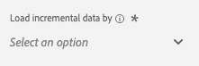

# 4.2.4 Gegevens laden van BigQuery naar Adobe Experience Platform

## Doelstellingen

- BigQuery-gegevens toewijzen aan een XDM-schema
- BigQuery-gegevens in Adobe Experience Platform laden
- Word vertrouwd met de BigQuery Source Connector UI

## Voordat u begint

Na oefening 12.3, zou u deze pagina in Adobe Experience Platform moeten open hebben:

**als u het open hebt, ga met oefening 12.4.1 voort.**

**als u het niet open hebt, ga naar [ Adobe Experience Platform ](https://experience.adobe.com/platform/home).**

Ga in het linkermenu naar Bronnen. U zult dan de **Bronnen** homepage zien. In het **Bronnen** menu, klik op **Gegevensbestanden**.

Selecteer de **Schakelaar van Google BigQuery** Source en klik op **+ vormen**.

U ziet dan het selectiescherm voor Google BigQuery-accounts.

Selecteer uw rekening en klik **daarna**.

U zult dan **gegevens** bekijken toevoegen mening.

## 4.2.4.1 Selectie van BigQuery-tabel

In **voeg gegevens** mening toe, selecteer uw dataset BigQuery.

U kunt nu een voorbeeld van voorbeeldgegevens van de gegevens van Googles Analytics in BigQuery zien.

Klik **daarna**.

## 4.2.4.2 XDM-toewijzing

U ziet nu het volgende:

U moet nu of een nieuwe dataset creëren of een bestaande dataset selecteren om de gegevens van Googles Analytics in te laden. Voor deze oefening, zijn een dataset en een schema reeds gecreeerd. U hoeft geen nieuw schema of nieuwe gegevensset te maken.

Selecteer **Bestaande dataset**. Open het vervolgkeuzemenu om een dataset te selecteren. Zoek naar de dataset genoemd `Demo System - Event Dataset for BigQuery (Global v1.1)` en selecteer het. Klik **daarna**.

Omlaag schuiven. U moet nu elk **Gebied van Source** van Googles Analytics/BigQuery aan een XDM **Gebied van het Doel** in kaart brengen, gebied door gebied.

Gebruik de onderstaande toewijzingstabel voor deze oefening.

| Source-veld | Doelveld |
| ----------------- |-------------| 
| **_id** | _id |
| **_id** | kanaal._id |
| timeStamp | tijdstempel |
| GA_ID | ``--aepTenantId--``.identification.core.gaid |
| customerID | ``--aepTenantId--``.identification.core.loyaltyId |
| Pagina | web.webPageDetails.name |
| Apparaat | device.type |
| Browser | environment.browserDetails.vendor |
| MarketingChannel | marketing.trackingCode |
| TrafficSource | channel.typeAtSource |
| TrafficMedium | channel.mediaType |
| TransactionID | commerce.order.payments.transactionID |
| Ecommerce_Action_Type | eventType |
| Pageviews | web.webPageDetails.pageViews.value |
| Unique_Purchases | commerce.purchases.value |
| Product_Details_Weergaven | commerce.productViews.value |
| Adds_To_Cart | commerce.productListAdds.value |
| Product_Verwijderen_Uit_winkelwagentje | commerce.productListRemovals.value |
| Product_kassa&#39;s | commerce.checkouts.value |

Nadat u de bovenstaande toewijzing naar de gebruikersinterface van Adobe Experience Platform hebt gekopieerd en geplakt, controleert u of er geen fouten optreden die te wijten zijn aan typos of leading/trailing spaties.

U hebt nu a **Afbeelding** als dit:

De brongebieden **GA_ID** en **customerID** worden in kaart gebracht aan een Herkenningsteken in dit Schema XDM. Hierdoor kunt u gegevens van Googles Analytics (web/app-gedragsgegevens) verrijken met andere gegevenssets, zoals Loyalty of Call Center-data.

Klik **daarna**.

## 4.2.4.3 Verbinding en planning van gegevensinvoer

U zult nu **het plannen** tabel {zien:

In het **Plannend** lusje, kunt u een frequentie voor het proces van gegevensopname voor dit **Afbeelding** en gegevens bepalen.

Aangezien u demo gegevens in Google BigQuery gebruikt die niet zullen worden verfrist, is er geen echte behoefte om een programma in deze oefening te plaatsen. U moet wel iets selecteren en om te veel nutteloze processen voor het opnemen van gegevens te voorkomen, moet u de frequentie als volgt instellen:

- Frequentie: **Week**
- Interval: **200**

**Belangrijk**: ben zeker u de **Achtergrond** schakelaar activeert.

Last but not least, moet u a **delta** gebied bepalen.

Het **delta** gebied wordt gebruikt om de verbinding te plannen en slechts nieuwe rijen te uploaden die in uw dataset BigQuery komen. Een deltaveld is doorgaans altijd een tijdstempelkolom. Voor toekomstige geplande gegevensinvoer worden dus alleen de rijen met een nieuwe, recentere tijdstempel opgenomen.

Selecteer **timeStamp** als deltagebied.

U hebt dit nu.

Klik **daarna**.

## 4.2.4.4 Verbinding controleren en starten

In de **mening van het de stroomdetail van de Dataset**. U moet uw verbinding noemen, die u zal helpen om het later te vinden.

Gebruik deze naamgevingsconventie:

| Veld | Naamgeving | Voorbeeld |
| ----------------- |-------------| -------------|
| Naam gegevensstroom | DataFlow - LDAP - BigQuery Website Interaction | DataFlow - vangeluw - BigQuery Website Interaction |
| Beschrijving | DataFlow - LDAP - BigQuery Website Interaction | DataFlow - vangeluw - BigQuery Website Interaction |

Klik **daarna**.

U ziet nu een gedetailleerd overzicht van uw verbinding. Zorg ervoor dat alles juist is voordat u verdergaat, aangezien sommige instellingen achteraf niet meer kunnen worden gewijzigd, zoals bijvoorbeeld de XDM-toewijzing.

Klik **Afwerking**.

Het instellen van de verbinding kan enige tijd in beslag nemen, dus maak u geen zorgen als u dit ziet:

Zodra de verbinding is gecreeerd, zult u dit zien:

U bent nu klaar om met de volgende oefening verder te gaan, waarin u Customer Journey Analytics zult gebruiken om krachtige visualisaties bovenop de gegevens van Googles Analytics te bouwen.

Volgende Stap: [ 4.2.5 analyseert de Gegevens van Googles Analytics gebruikend Customer Journey Analytics ](./ex5.md)

[Terug naar module 4.2](./customer-journey-analytics-bigquery-gcp.md)

[Terug naar alle modules](./../../../overview.md)
