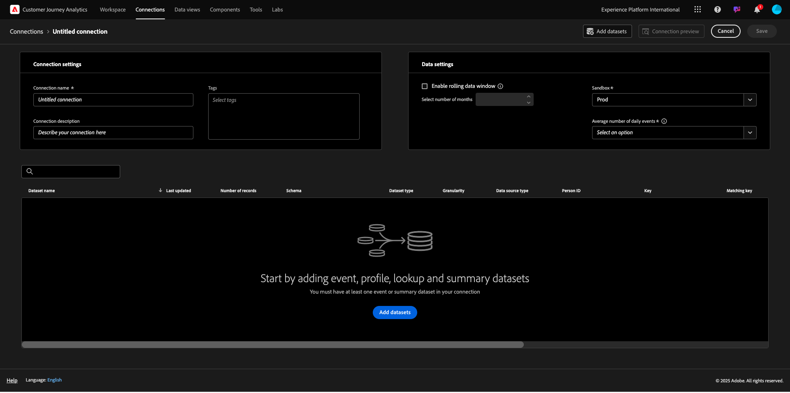
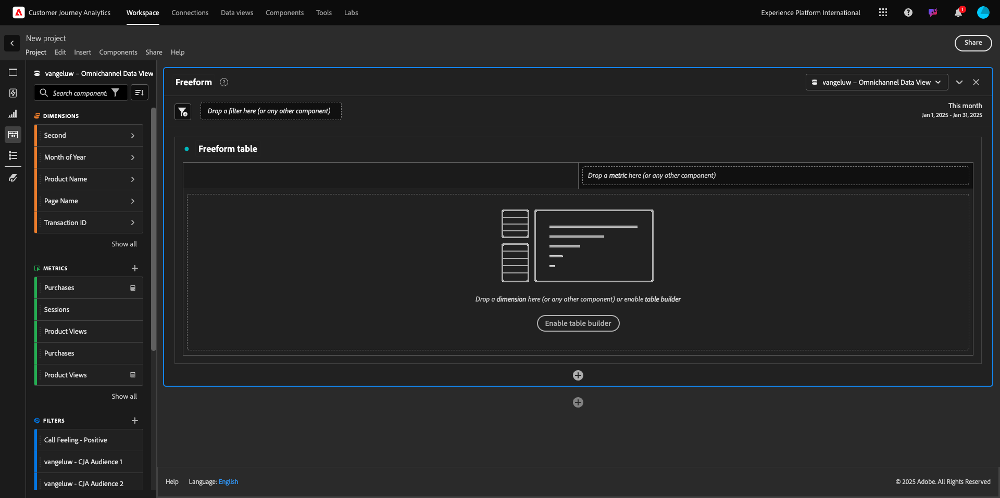
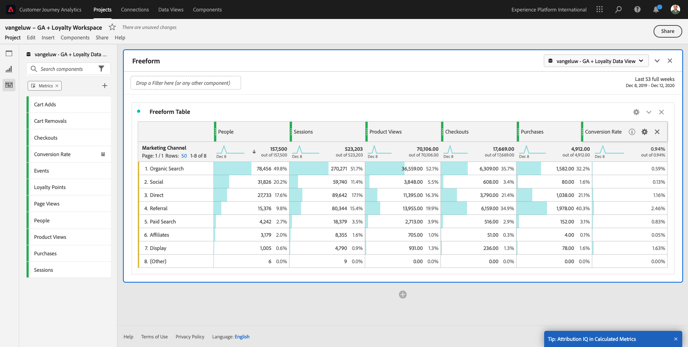
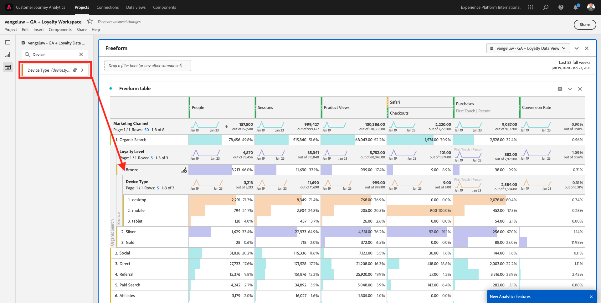
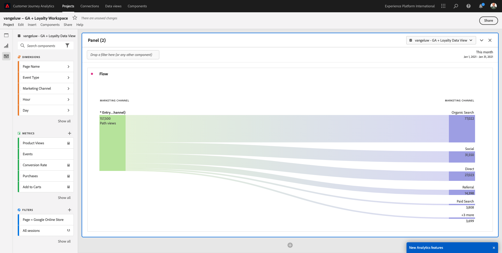
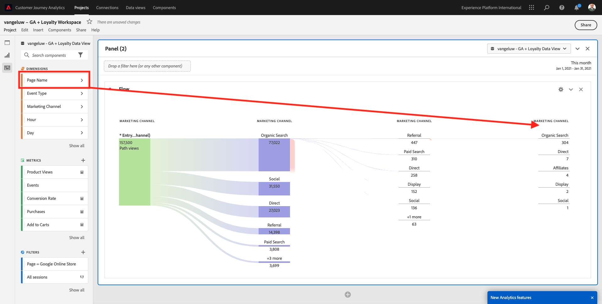

# 4.2.5 Gegevens van Googles Analytics analyseren met behulp van Customer Journey Analytics

## Doelstellingen

- Verbind onze Dataset BigQuery aan Customer Journey Analytics (CJA)
- Verbind en sluit zich aan bij Googles Analytics met Loyalty Gegevens.
- Bekend worden met de gebruikersinterface van CJA

## 4.2.5.1 Verbinding maken

Ga naar [&#x200B; analytics.adobe.com &#x200B;](https://analytics.adobe.com) om tot Customer Journey Analytics toegang te hebben.

Op de homepage van de Customer Journey Analytics, ga naar **Verbindingen**.

Hier kunt u alle verschillende verbindingen zien die tussen CJA en Platform worden gemaakt. Deze verbindingen hebben hetzelfde doel als rapportsuites in Adobe Analytics. De gegevensverzameling is echter totaal anders. Alle gegevens komen uit de datasets van Adobe Experience Platform.

Klik **creëren nieuwe verbinding**.

U zult dan **&#x200B;**&#x200B;UI zien creëren Verbinding.

Gebruik voor de naam: `--aepUserLdap-- - GA + Loyalty Data Connection` .

U moet de juiste sandbox selecteren om te gebruiken. Selecteer de sandbox in het menu van de sandbox, die `--aepSandboxName--` moet zijn. In dit voorbeeld, is de zandbak aan gebruik **de Instanties van de Tech**.

Plaats het **Gemiddelde aantal dagelijkse gebeurtenissen** aan **minder dan 1 miljoen**.

In het datastemenu, kunt u beginnen datasets toe te voegen. Klik **toevoegen datasets**.

De gegevenssets die moeten worden toegevoegd zijn:
- `Demo System - Profile Dataset for CRM (Global v1.1)`
- `Demo System - Event Dataset for BigQuery (Global v1.1)`

Onderzoek naar beide datasets, controleer hun checkbox en klik dan **daarna**.

U zult dan dit zien:

Voor de dataset `Demo System - Event Dataset for BigQuery (Global v1.1)`, verander **identiteitskaart van de Persoon** in **loyaltyId** en plaats het **Van de Gegevensbron type** aan **Gegevens van het Web**. Laat beide opties voor **invoer toe alle nieuwe gegevens** en **Achtergrond alle bestaande gegevens**.

Voor de dataset `Demo System - Event Dataset for BigQuery (Global v1.1)`, verifieer dat **identiteitskaart van de Persoon** aan **crmId** wordt geplaatst en het **Van de Gegevensbron type** plaatst aan **Gegevens van het Web**. Laat beide opties voor **invoer toe alle nieuwe gegevens** en **Achtergrond alle bestaande gegevens**. Klik **toevoegen datasets**.

Dan ben je hier. Klik **sparen**.

Na het creëren van uw **Verbinding** kan het een paar uren nemen alvorens uw gegevens in CJA beschikbaar zijn.

U zult dan uw verbinding in de lijst van beschikbare verbindingen zien.

## 4.2.5.2 Een gegevensweergave maken

Als de verbinding tot stand is gebracht, kunt u nu de visualisatie beïnvloeden. Een verschil tussen Adobe Analytics en CJA is dat CJA een gegevensweergave nodig heeft om de gegevens vóór visualisatie te kunnen opschonen en voorbereiden.

Een gegevensmening is gelijkaardig aan het concept virtuele rapportsuites in Adobe Analytics, waar u context-bewuste bezoekdefinities bepaalt, filtrerend en ook, hoe de componenten worden geroepen.

U hebt minimaal één gegevensweergave per verbinding nodig. Nochtans, voor sommige gebruik-gevallen, is het groot om veelvoudige gegevensmeningen voor de zelfde verbinding te hebben, met het doel om verschillende inzichten aan verschillende teams te geven.

Als u uw bedrijf gegevensgedreven wilt worden, zou u moeten aanpassen hoe de gegevens in elk team worden bekeken. Enkele voorbeelden:

- UX-meetgegevens alleen voor het UX-ontwerpteam
- Gebruik dezelfde namen voor KPI&#39;s en Metriek voor Googles Analytics als voor Customers Journey Analytics, zodat het digitale analyseteam slechts één taal kan spreken.
- gegevensweergave gefilterd om bijvoorbeeld gegevens weer te geven voor 1 markt, of 1 merk, of alleen voor mobiele apparaten.

Voor het **scherm van Verbindingen**, controleer checkbox voor de verbinding u enkel creeerde. Klik **creëren gegevensmening**.

U zult aan **worden opnieuw gericht creeer het werkschema van de Mening van Gegevens**.

U kunt de basisdefinities voor uw gegevensmening nu vormen. Dingen zoals Tijdzone, Sessietime-out of het filteren van de gegevensweergave (het segmenteringsonderdeel dat lijkt op Virtuele rapportsets in Adobe Analytics).

De **Verbinding** u in de vorige oefening creeerde is reeds geselecteerd. Uw verbinding heeft de naam `--aepUserLdap-- - GA + Loyalty Data Connection` .

Geef de gegevensweergave vervolgens een naam die volgt op de naamgevingsconventie: `--aepUserLdap-- - GA + Loyalty Data View` .

Voer dezelfde waarde in voor de beschrijving: `--aepUserLdap-- - GA + Loyalty Data View` .

Voordat we een analyse of visualisatie kunnen uitvoeren, moeten we een gegevensweergave maken met alle velden, afmetingen en metriek en hun attributie-instellingen.

| Veld | Naamgevingsconventie |
| ----------------- |-------------|  
| Naam van verbinding | `--aepUserLdap-- - GA + Loyalty Data View` | vangeluw - GA + Loyalty Data View |
| Beschrijving | `--aepUserLdap-- - GA + Loyalty Data View` |
| Externe id | `--aepUserLdap--GA` |

Klik **sparen en ga** verder.

Klik **sparen**.

U kunt nu componenten toevoegen aan uw gegevensweergave. Zoals u kunt zien, worden sommige metriek en afmetingen automatisch toegevoegd.

Voeg de onderstaande componenten toe aan de gegevensweergave. Zorg er ook voor dat u de veldnamen bijwerkt naar vriendelijke namen. Om dat te doen, selecteer metrisch of afmeting en werk het **gebied van de 1&rbrace; naam van de Component** in het juiste menu bij.

| Componenttype | Oorspronkelijke naam component | Weergavenaam | Componentpad |
| -----------------| -----------------|-----------------|-----------------|
| Metrisch | commerce.checkouts.value | Afbeeldingen | `commerce.checkouts.value` |
| Metrisch | commerce.productListRemovals.value | Winkelwagentjes | `commerce.productListRemovals.value` |
| Metrisch | commerce.productListAdds | Extra winkelwagentjes | `commerce.productListAdds` |
| Metrisch | commerce.productViews.value | Productweergaven | `commerce.productViews.value` |
| Metrisch | commerce.purchases.value | Aankopen | `commerce.purchases.value` |
| Metrisch | web.webPageDetails.pageViews | Paginaweergaven | `web.webPageDetails.pageViews` |
| Metrisch | punten | Loyalty-punten | `_experienceplatform.loyaltyDetails.points` |
| Dimension | niveau | Loyaliteitsniveau | `_experienceplatform.loyaltyDetails.level` |
| Dimension | channel.mediaType | Traffic Medium | `channel.mediaType` |
| Dimension | channel.typeAtSource | Traffic Source | `channel.typeAtSource` |
| Dimension | Code bijhouden | Marketingkanaal | `marketing.trackingCode` |
| Dimension | onbeschaamd | Googles Analytics-id | `_experienceplatform.identification.core.gaid` |
| Dimension | web.webPageDetails.name | Paginatitel | `web.webPageDetails.name` |
| Dimension | Leverancier | Browser | `environment.browserDetails.vendor` |
| Dimension | Type | Apparaattype | `device.type` |
| Dimension | loyaltyId | Loyalty-id | `_experienceplatform.identification.core.loyaltyId` |
| Dimension | commerce.order.payments.transactionID | Transactie-id | `commerce.order.payments.transactionID` |
| Dimension | eventType | Type gebeurtenis | `eventType` |
| Dimension | tijdstempel | Tijdstempel | `timestamp` |
| Dimension | `_id` | Id | `_id` |

Dan heb je iets als dit:

Daarna, moet u sommige veranderingen in de Persoon en context van de Zitting voor sommige van deze componenten aanbrengen door de **Montages van de Attributie of van de Persistentie** te veranderen.

Gelieve te veranderen de **Montages van de Attributie** voor de hieronder componenten:

| Component |
| -----------------|
| Traffic Source |
| Marketingkanaal |
| Browser |
| Traffic Medium |
| Apparaattype |
| Googles Analytics-id |

Om dat te doen, selecteer de component, klik **model van de douaneattributie van het Gebruik** en plaats het **Model** aan **Recentste**, en de **Vervalsing** aan **Persoon die Venster** meldt. Herhaal dit voor alle bovengenoemde componenten.

Na het aanbrengen van de veranderingen in attributie montages voor alle bovengenoemde componenten, zou u deze mening moeten hebben. Klik **sparen en ga** verder.

Op het **scherm van Montages**, worden geen veranderingen vereist. Klik **sparen en beëindigen**.

U kunt nu de gegevens van Googles Analytics analyseren in Adobe Analytics Analysis Workspace. Laten we naar de volgende oefening gaan.

## 4.2.5.3 Uw project maken

In Customer Journey Analytics, ga naar **Workspace**. Klik **creëren Project**

Selecteer **Leeg Project van Workspace** en klik **creëren**.

U hebt nu een leeg project:

Sla eerst het project op en geef het een naam. U kunt de volgende opdracht gebruiken om op te slaan:

| OS | Korte snede |
| ----------------- |-------------| 
| Windows | Control + S |
| Mac | Command + S |

Je ziet deze popup. Gebruik deze naamgevingsconventie:

| Naam | Beschrijving |
| ----------------- |-------------| 
| `--aepUserLdap-- – GA + Loyalty Workspace` | `--aepUserLdap-- – GA + Loyalty Workspace` |

Daarna, klik **sparen**.

Selecteer vervolgens de juiste gegevensweergave in de rechterbovenhoek van het scherm. Dit is de gegevensweergave die u in de vorige exercitie hebt gemaakt, met de naamgevingsconventie `--aepUserLdap-- - GA + Loyalty Data View` .

### 4.2.5.3.1 Vrije-vormtabellen

Vrije-vormtabellen werken min of meer als draaitabellen in Excel. U kiest iets van de linkerbar en u sleept en laat vallen het in de Vrije vorm en u zult een lijstrapport krijgen.

Vrije-vormtabellen zijn bijna oneindig. U kunt (bijna) om het even wat doen en dit brengt zoveel waarde in vergelijking met Googles Analytics (aangezien dit hulpmiddel sommige analysebeperkingen heeft). Dit is een van de redenen om gegevens van Googles Analytics in een ander analysehulpmiddel te laden.

Laat twee voorbeelden zien waar u SQL, BigQuery en wat tijd moet gebruiken om eenvoudige vragen te beantwoorden die niet mogelijk zijn om binnen de Googles Analytics UI of de Studio van Gegevens van Google te doen:

- Hoeveel mensen komen aan de controle van Safari Browser die door marketing kanaal wordt verdeeld? Gelieve te zien dat metrische checkout door Browser Safari wordt gefiltreerd. We hebben net de variabele Browser = Safari gesleept en neergezet boven op de uitcheckkolom.

- Als analist kan ik zien dat het Social Marketing Channel lage omzettingen heeft. Ik gebruik de kenmerk Last Touch standaard, maar hoe zit het met First Touch? De metrische instellingen worden weergegeven wanneer u de muis boven metrische instellingen houdt. Daar kan ik het gewenste attributiemodel selecteren. U kunt Attribution in GA (niet in gegevensstudio) als standalone activiteit doen, maar u kunt geen andere metriek of dimensies hebben die niet aan attributieanalyse binnen de zelfde lijst verwant zijn.

Laten we deze vragen en nog wat meer beantwoorden met Analysis Workspace in CJA.

Eerst, selecteer de juiste datumwaaier (**vandaag**) op de rechterkant van het paneel. CLick **is van toepassing**.

>[!NOTE]
>
>Als u enkel de **verbinding van Gegevens** creeerde en **mening van Gegevens** u een paar uren zou kunnen moeten wachten. CJA heeft wat tijd nodig om historische gegevens terug te vullen wanneer er een grote hoeveelheid gegevensverslagen is.

Laten wij wat dimensies en metriek slepen en laten vallen om de kanalen van de Marketing te analyseren. Eerst gebruik het afmetings **In de handel brengen Kanaal** en sleep en laat vallen het aan het canvas van de **Vrije lijst van de Vorm**. (Klik op **tonen allen** in het geval u metrisch onmiddellijk in het menu van Metriek niet ziet)

U zult dan dit zien:

Vervolgens moet u de metriek toevoegen aan de tabel Vrije vorm. U zou deze Metriek moeten toevoegen: **Mensen**, **Sessies**, **de Kijken van het Product**, **Controles**, **Aankopen**, **Tarief van de Omzetting** (Berekend Metrisch).

Alvorens u dat kunt doen, moet u het Berekende Metrische **Tarief van de Omzetting** tot stand brengen. Klik hiertoe op het pictogram **+** naast Metrisch:

Als naam voor Berekend Metrisch, gebruik **Tarief van de Omzetting** en gebruik **conversionRate** voor **Externe identiteitskaart**. Dan sleep de metrieke **aankoop** en **Zittingen** op het canvas. Plaats **Formaat** aan **Percentage** en **Decimale Plaatsen** aan **2**. Tot slot klik **sparen**.

Klik **sparen**.

Daarna, om al deze Metriek in de **Vrije Lijst** te gebruiken, sleep en laat vallen hen één voor één op de **Vrije Lijst van de Vorm**. Zie het onderstaande voorbeeld.

U zult eindigen met een tabel als deze:

Zoals hierboven vermeld, **de lijsten van de Vrije vorm** geven u de vrijheid u diepe duikanalyse moet uitvoeren. U kunt bijvoorbeeld elk ander Dimension kiezen om een specifieke metrische waarde in de tabel op te splitsen.

Als voorbeeld, ga naar afmetingen en onderzoek en selecteer de **Browser** variabele.

Vervolgens ziet u een overzicht van de beschikbare waarden voor dit Dimension.

Kies het Dimension **Safari** en sleep en laat vallen het bovenop een Metrisch, bijvoorbeeld **Controles**. U zult dan dit zien:

Als u dit doet, hebt u zojuist een potentiële vraag beantwoord die u had: hoeveel mensen komen bij de kassa met Safari, gesplitst naar Marketing Channel?

Laten we nu de Attribution-vraag beantwoorden.

Vind de **metrisch van de Aankoop** in de lijst.

Beweeg over metrisch en a **pictogram van Montages** zal verschijnen. Klik erop.

Er wordt een contextueel menu weergegeven. Controleer checkbox voor **niet-gebrek attributiemodel**.

In popup zult u zien, kunt u de attributiemodellen en het raadplegingsvenster gemakkelijk veranderen (dat vrij complex is om met SQL te bereiken).

Selecteer **Eerste Aanraak** als uw attributiemodel.

Kies **Persoon** voor het Venster van de Lookback.

Klik nu **toepassen**.

U kunt nu zien dat het attributiemodel voor die bepaalde metrische waarde nu First Touch is.

U kunt net zo veel uitsplitsen als u wilt, zonder beperkingen van typen variabelen, segmenten, dimensies of datumbereiken.

Nog iets bijzonders is de mogelijkheid om zich bij elke dataset van Adobe Experience Platform aan te sluiten om de digitale gedragsgegevens van Googles Analytics te verrijken. Bijvoorbeeld, off-line, vraag centrum, loyaliteit of CRM gegevens.

Om die functionaliteit te tonen, vormen wij uw eerste uitsplitsing die off-line gegevens met online gegevens combineert. Kies het afmetings **Niveau van de Loyalty** en sleep en laat vallen het op om het even welk **Marketing Kanaal**, bijvoorbeeld, **Organic Onderzoek**:

Daarna, analyseren welk **Type van Apparaat** door klanten wordt gebruikt die aan de plaats gebruikend **biologisch Onderzoek** met a **Niveau van de Loyaliteit** kwamen dat **&#x200B;**&#x200B;Bronze is. Neem het Type van Apparaat van het Dimension **&#x200B;**&#x200B;en sleep en laat vallen het op **Bronze**. U zult dan dit zien:

Je ziet dat voor je eerste uitsplitsing Loyalty Level wordt gebruikt. Deze afmeting komt uit een verschillende dataset en verschillend schema dan die u voor de schakelaar BigQuery gebruikte. Identiteitskaart van de Persoon **loyaltyID** (Systeem van de Manifestatie - het Schema van de Gebeurtenis voor BigQuery (Globale v1.1)) en **loyaltyID** (het Systeem van de Manifest - het Schema van het Profiel voor Loyalty (Globale v1.1)) passen met elkaar aan. Daarom kunt u de Gebeurtenissen van de Ervaring van Googles Analytics met de Gegevens van het Profiel van het Schema van de Loyaliteit combineren.

We kunnen de rijen blijven splitsen met segmenten of specifieke datumbereiken (misschien om bepaalde tv-campagnes te weerspiegelen) om vragen te stellen aan de Customer Journey Analytics en de antwoorden onderweg te krijgen.

Het bereiken van het zelfde eindresultaat met SQL en dan een derdevisualisatiehulpmiddel is vrij een uitdaging. Vooral als je vragen stelt en probeert de antwoorden direct te krijgen. De Customer Journey Analytics heeft deze uitdaging niet en staat de Analysten van Gegevens toe om de gegevens flexibel en in real time te vragen.

## 4.2.5.3.2 Trechter- of valutanotanalyse

De trechters zijn een groot mechanisme om de belangrijkste stappen in een klantenreis te begrijpen. Deze stappen kunnen ook afkomstig zijn van offline interacties (bijvoorbeeld vanuit het callcenter) en vervolgens kunt u ze combineren met digitale aanraakpunten in dezelfde trechter.

Met Customer Journey Analytics kun je dat doen en nog veel meer. Als u Module 13 herinnert, wij waar het mogelijk is om met de rechtermuisknop aan te klikken en dingen te doen zoals:

- Analyseren waar de gebruikers naar toe gaan na een uitvalstap
- Een segment maken van een willekeurig punt in de trechter
- Zie Trend in om het even welk stadium in een Grafiek van de Lijn visualisatie

Laten we nog iets zien wat je kunt doen: Hoe is mijn reis van de Klant deze maand in vergelijking met de vorige maand? Hoe zit het met mobiel versus desktop?

Onder u zult twee panelen creëren:

- Kanaalanalyse (januari)
- Kanaalanalyse (februari)

U zult zien dat wij een trechter over verschillende tijdsperiodes (Januari en Februari) vergelijken die door het Type van Apparaat worden verdeeld.

Dit soort analyse is niet mogelijk binnen de gebruikersinterface van de Googles Analytics of is zeer beperkt. Dus CJA voegt weer veel waarde toe aan de gegevens die door Googles Analytics worden vastgelegd.

Om uw eerste fallout visualisatie te maken. Sluit het huidige deelvenster om te beginnen met een nieuw deelvenster.

Kijk naar de rechterkant van het deelvenster en klik op de pijl om het te sluiten.

Klik vervolgens op **+** om een nieuw deelvenster te maken.

Nu selecteer de **Vallout** Visualisatie.

Als analist stelt u zich voor dat u wilt begrijpen wat er gebeurt met uw belangrijkste e-commercetrechter: Home > Intern zoeken > Productdetails > Afhandeling > Aanschaffen.

Laten we beginnen met het toevoegen van nieuwe stappen aan de trechter. Om dat te doen, open de **dimensie van de Naam van de 0&rbrace; Pagina.**

U zult dan alle beschikbare pagina&#39;s zien die zijn bezocht.

De belemmering en laat vallen **Huis** aan de eerste stap.

Als tweede stap, gebruik de **onderzoeksresultaten van de Opslag**

Nu moet u wat e-commerce acties toevoegen. In de Dimensionen, onderzoek naar de dimensie van het Type van de Gebeurtenis van het Dimension **&#x200B;**. Klik om de dimensie te openen.

Selecteer **Product_Detail_Views** en sleep en laat vallen het in de volgende stap.

Selecteer **Product_Checkouts** en sleep en laat vallen het in de volgende stap.

Pas de grootte van uw uitvalweergave aan.

Uw uitvalvisualisatie is nu gereed.

Beginnen de inzichten te analyseren en te documenteren, is het altijd een goed idee aan a **Tekst** visualisatie. Om a **Tekst** visualisatie toe te voegen, klik op het **Grafiek** pictogram in het linkermenu om alle beschikbare visualisaties te zien. Dan belemmering en laat vallen de **Tekst** visualisatie op het canvas. Wijzig het formaat en verplaats het zodat het lijkt op de afbeelding onder.

En opnieuw, resize het om het dashboard te passen:

Bij valutamatievisualisaties zijn ook uitsplitsingen mogelijk. Gebruik de **dimensie van het Type van Apparaat** door het te openen en sommige waarden op één voor één op visualisatie te slepen:

U krijgt dan een geavanceerdere visualisatie:

Met Customer Journey Analytics kun je dat doen en nog veel meer. Door met de rechtermuisknop ergens in de fallout te klikken, kunt u...

- Analyseren waar de gebruikers van een reservestap gaan
- Een segment maken van een willekeurig punt in de trechter
- Teken om het even welke stap in een Lijnvisualisatie
- Vergelijk een trechter visueel met verschillende tijdsperiodes.

Als voorbeeld, doe een met de rechtermuisknop aan klik in om het even welke stap van de reserve om sommige van deze analyseopties te zien.

## 4.2.5.3.3 Stroomanalyse en visualisatie

Als u geavanceerde stroomanalyse wilt doen gebruikend Googles Analytics, moet u SQL gebruiken om de gegevens te halen en dan een derdeoplossing voor het visualisatiedeel te gebruiken. Customer Journey Analytics zal daarbij helpen.

In deze stap, zult u een stroomanalyse vormen om deze vraag te beantwoorden: wat zijn de belangrijkste bijdragende kanalen vóór een specifieke het Bestanden Pagina.  Als analist kunt u met twee slepen en neerzetten en met één muisklik de richting van de landingspagina van de gebruiker vaststellen met de twee laatste aanrakingen van de marketingkanalen.

Andere vragen die de Customer Journey Analytics u kan helpen beantwoorden:

- Wat is de belangrijkste combinatie kanalen vóór een specifieke het Bestaan Pagina?
- Wat veroorzaakt een gebruiker om de zitting weg te gaan wanneer hij/zij aan Product_Checkout aankomt? Waar de vorige stappen?

Laten we opnieuw met een leeg deelvenster beginnen om deze vragen te beantwoorden. Sluit het huidige paneel en klik **+**.

Nu selecteer de **Stroom** visualisatie.

Stel nu een Meerwegs Analyse van de Stroom van het Kanaal van de Marketing. De belemmering en laat vallen de **dimensie van het Kanaal van de Marketing** op het **gebied van de Dimensionen van de Ingang**.

U kunt nu de eerste toegangspaden zien:

Klik op het eerste pad om er omlaag over te boren.

U kunt nu het volgende pad zien (Marketingkanaal).

Laten we een derde boor-down doen. Klik op de eerste optie binnen de nieuwe weg, **Verwijzing**.

Nu moet je de visualisatie als volgt zien:

Laten we dingen compliceren. Stel dat u wilt analyseren wat de landingspagina was na twee marketingpaden? Hiervoor kunt u een secundaire dimensie gebruiken om het laatste pad te wijzigen. Vind de **dimensie van de Naam van de 0&rbrace; Pagina &lbrace;en sleep en laat vallen het als dit:**

U ziet nu het volgende:

Laten we nog een flowanalyse uitvoeren. Deze keer zult u analyseren wat na een specifiek uitgangspunt gebeurde. Andere analytische oplossingen vereisen het gebruik van SQL/ETL en opnieuw, een derdevisualisatiehulpmiddel om het zelfde ding te bereiken.

Breng een nieuwe **Visualisatie van de Stroom** aan het paneel.

Dan heb je het volgende:

Vind het Type van de Gebeurtenis van het Dimension **&#x200B;**&#x200B;en sleep en laat vallen het aan het **afmeting van de Uitgang** gebied.

Nu kunt u zien welk **Type van Gebeurtenis** - wegen klanten aan de uitgang dreden.

Laten we onderzoeken wat er is gebeurd voordat de kassa-actie is afgesloten. Klik op de **Product_Checkouts** weg:

Er wordt een nieuw actiepad weergegeven met gegevens die niet begrijpelijk zijn.

Laten we verder analyseren! Onderzoek de Naam van de Dimension **Pagina** en sleep en laat vallen het aan de nieuwe geproduceerde weg.

U hebt nu een geavanceerde flowanalyse uitgevoerd in minuten. U kunt op de verschillende paden klikken om te zien hoe ze een verbinding tot stand brengen vanaf het einde tot aan de vorige stappen.

U beschikt nu over een krachtige kit om trechters te analyseren en wegen van klantengedrag over digitaal maar ook, off-line aanraakpunten te verkennen.

Vergeet niet uw wijzigingen op te slaan!

## 4.2.5.4 Het project delen

>[!IMPORTANT]
>
>De hieronder inhoud is bedoeld als FYI - u **NIET** moet uw project met iedereen anders delen.

FYI - U kunt dit project met collega&#39;s delen om samen te werken of bedrijfsvragen samen te analyseren.

Volgende Stap: [&#x200B; Samenvatting &amp; voordelen &#x200B;](./summary.md)

[Terug naar module 4.2](./customer-journey-analytics-bigquery-gcp.md)

[Terug naar alle modules](./../../../overview.md)
