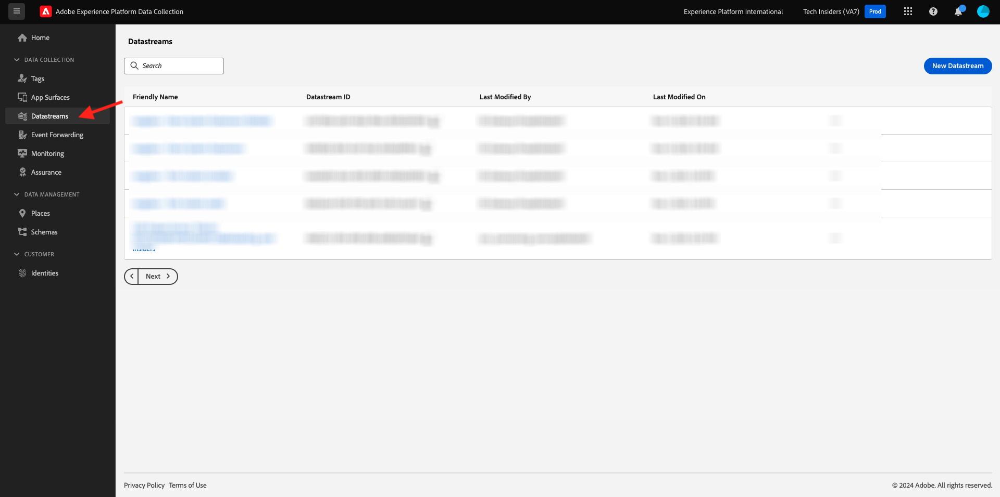
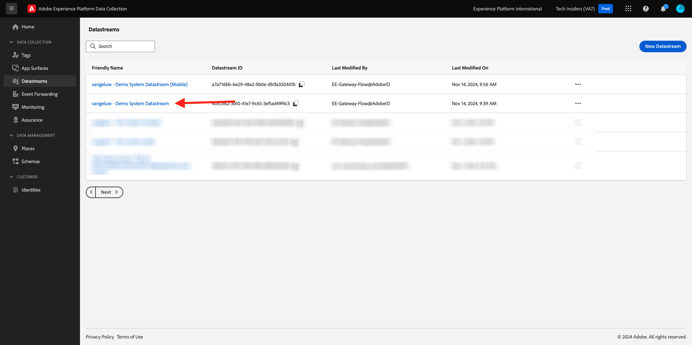

# 1.1.2 Edge Network, gegevensstreams en gegevensverzameling op de server

## Context

In deze oefening zult u a **datastream** creëren. A **datastream** vertelt de servers van het Netwerk van Adobe Edge waar te om de gegevens te verzenden nadat het door Web SDK wordt verzameld. Wilt u de gegevens bijvoorbeeld naar Adobe Experience Platform verzenden? Adobe Analytics? Adobe Audience Manager? Adobe Target?

De stromen van gegevens worden altijd geleid in het gebruikersinterface van de Inzameling van de Gegevens van het Experience Platform en zijn kritiek aan de gegevensinzameling van het Experience Platform met [ SDK van het Web ](https://experienceleague.adobe.com/en/docs/experience-platform/web-sdk/home). Zelfs wanneer u SDK van het Web met een niet-Adobe oplossing van het markeringsbeheer uitvoert, moet u nog een gegevensstroom tot stand brengen.

U zult het Web SDK op browser in de volgende oefening uitvoeren. Het zal u dan duidelijker zijn hoe de gegevens die worden verzameld eruit zien. Vooralsnog vertellen we alleen maar aan de datastream waar we de gegevens moeten doorsturen.

## Een gegevensstroom maken

In [ Begonnen ](./../../../modules/gettingstarted/gettingstarted/ex2.md) u creeerde reeds een datastream, maar wij bespraken niet de achtergrond en de reden waarvoor u het creeerde.

A [ datastream ](https://experienceleague.adobe.com/en/docs/experience-platform/datastreams/overview) vertelt de servers van de Edge Network waar te om de gegevens te verzenden nadat het door het Web SDK wordt verzameld. Zie de documentatie voor [ toevoegend de diensten aan een datastream ](https://experienceleague.adobe.com/en/docs/experience-platform/datastreams/configure#add-services) voor volledige details over waar u uw gegevens door de datastream kunt verzenden.

De stromen van gegevens worden beheerd in het gebruikersinterface van de Inzameling van Gegevens van het Experience Platform en zijn kritiek aan gegevensinzameling met Web SDK, ongeacht of u het Web SDK via de Inzameling van Gegevens van Adobe Experience Platform uitvoert.

Controleer uw **[!UICONTROL datastream]** :

Ga naar [ https://experience.adobe.com/launch/ ](https://experience.adobe.com/launch/).

Klik op **[!UICONTROL Datastreams]** in het linkermenu.

Open de gegevensstroom met de naam `--aepUserLdap-- - Demo System Datastream` .

U zult dan de details van uw gegevensstroom zien.

Klik **...** naast **Adobe Experience Platform** en klik **uitgeven**.

Dan zie je dit. Op dit moment heb je alleen Adobe Experience Platform ingeschakeld. Uw configuratie zal gelijkaardig aan de hieronder configuratie kijken. (Afhankelijk van uw omgeving en Adobe Experience Platform-instantie kan de naam van de sandbox anders zijn.)

U moet de onderstaande velden als volgt interpreteren:

Voor deze gegevensstroom...

- Alle verzamelde gegevens worden opgeslagen in de `--aepSandboxName--` -sandbox in Adobe Experience Platform
- Alle gegevens van de Gebeurtenis van de Ervaring worden verzameld door gebrek in het dataset **Systeem van de Demo - de Dataset van de Gebeurtenis voor Website (Globale v1.1)**
- Alle gegevens van het Profiel zullen door gebrek in het dataset **Systeem van de Manifestatie - de Dataset van het Profiel voor Website (Globale v1.1) worden verzameld** (het opnemen van profielgegevens nefend met Web SDK wordt momenteel niet gesteund door Web SDK)
- Als u de **de toepassingsdienst van de Offer decisioning** voor deze gegevensstroom wilt gebruiken, moet u de doos voor Offer decisioning controleren. (Dit zal deel van [ Module 3.3 ](./../../../modules/ajo-b2c/module3.3/offer-decisioning.md) zijn)
- **de Segmentatie van Edge** wordt toegelaten door gebrek, zo betekent het dat het gekwalificeerde publiek bij de rand, bij opname van inkomend verkeer zal worden geëvalueerd
- Als u [ verpersoonlijkingsbestemmingen ](https://experienceleague.adobe.com/en/docs/experience-platform/destinations/catalog/personalization/overview) wilt gebruiken, controleer de doos voor **Doelen van Personalization**.
- Als u **mogelijkheden van Adobe Journey Optimizer** in deze datastream wilt gebruiken, moet u de doos voor **Adobe Journey Optimizer** controleren.

Voor nu, is geen andere configuratie nodig voor uw gegevensstroom.

Volgende Stap: [ 1.1.3 Inleiding aan de Inzameling van Gegevens van Adobe Experience Platform ](./ex3.md)

[Terug naar module 1.1](./data-ingestion-launch-web-sdk.md)

[Terug naar alle modules](./../../../overview.md)
