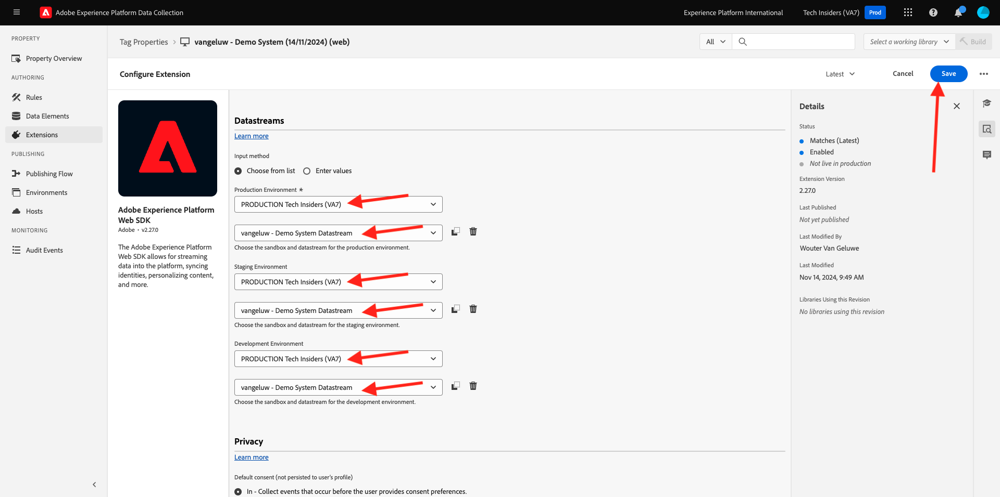
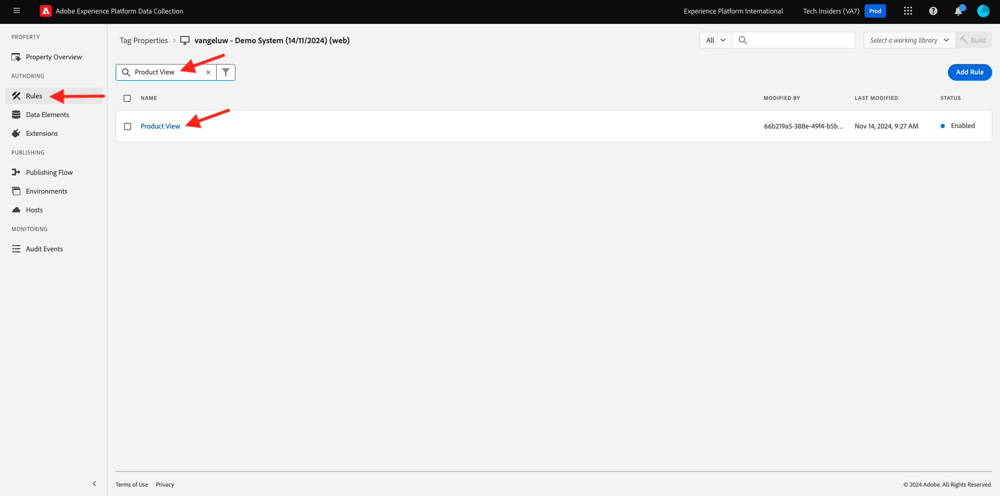

# 1.1.3 - Inleiding tot Adobe Experience Platform-gegevensverzameling

## Context

Laten we nu dieper kijken naar de bouwstenen van Adobe Experience Platform Data Collection, om te begrijpen wat er op uw demo-website is geïnstalleerd. U zult een dichtere blik bij de Uitbreiding van SDK van het Web van Adobe Experience Platform hebben, zult u een gegevenselement en een regel vormen en u zult leren hoe te om een bibliotheek te publiceren.

## 1.1.3.1 - Adobe Experience Platform Web SDK Extension

Een extensie is een set verpakte code waarmee de interface van Adobe Experience Platform Data Collection en de bibliotheekfunctionaliteit worden uitgebreid. Adobe Experience Platform Data Collection is het platform en extensies zijn vergelijkbaar met apps die op het platform worden uitgevoerd. Alle extensies die in de zelfstudie worden gebruikt, worden gemaakt en beheerd door Adobe, maar derden kunnen hun eigen extensies maken om de hoeveelheid aangepaste code te beperken die Adobe Experience Platform-gebruikers moeten beheren.

Ga naar [ de Inzameling van Gegevens van Adobe Experience Platform ](https://experience.adobe.com/launch/) en selecteer **Markeringen**.

Dit is de pagina Eigenschappen van Adobe Experience Platform-gegevensverzameling die u eerder hebt gezien.

In module 0 heeft het demosysteem twee Client-eigenschappen voor u gemaakt: een voor de website en een voor de mobiele app. Zoek naar `--demoProfileLdap--` in het vak **[!UICONTROL Search]** .

Open het **bezit 0} van het Web {.**

U zult dan de pagina van het Overzicht van het Bezit zien. Klik op **[!UICONTROL Extensions]** in de linkertrack. Klik op de knop **[!UICONTROL Configure]** onder Adobe Experience Platform Web SDK Extension.

Welkom bij de Adobe Experience Platform Web SDK! Hier kunt u de uitbreiding met DataStream vormen u in [ Uitoefening 0.2 ](./../../../modules/gettingstarted/gettingstarted/ex2.md) evenals één of andere geavanceerdere configuratie creeerde. U gaat slechts twee montages voor deze oefening vormen.

Het standaardDomein van Edge is altijd **edge.adobedc.net**. Als u een CNAME-configuratie hebt geïmplementeerd in uw Adobe Experience Cloud- of Adobe Experience Platform-omgeving, moet u de **[!UICONTROL Edge Domain]** bijwerken. Uw Adobe Experience Platform-instantie gebruikt dit Edge-domein: `--webSdkEdgeDomain--` .

Als het Edge-domein van uw instantie afwijkt van het standaard domein, moet u het Edge-domein bijwerken. Een domein van Edge maakt het mogelijk om een 1st partij het volgen server te vormen, die dan een configuratie CNAME in het achterste eind gebruikt om ervoor te zorgen dat het gegeven in Adobe wordt verzameld.

Zorg er nu voor dat het keuzerondje **[!UICONTROL Choose from list]** is geselecteerd onder de kop **[!UICONTROL Datastreams]** en selecteer in de lijst in het vak **[!UICONTROL Datastream]** de gegevensstroom met de naam `--demoProfileLdap-- - Demo System Datastream` .

Klik op **[!UICONTROL Save]** om terug te gaan naar de weergave Extensies.

## 1.1.3.2 Gegevenselementen

Gegevenselementen zijn de bouwstenen voor uw gegevenswoordenboek (of gegevenskaart). Gebruik gegevenselementen om gegevens te verzamelen, te organiseren en te leveren over marketing- en advertentietechnologie.

Eén gegevenselement is een variabele waarvan de waarde kan worden toegewezen aan querytekenreeksen, URL&#39;s, cookie-waarden, JavaScript-variabelen enzovoort. U kunt naar deze waarde verwijzen met de variabelenaam in de hele Adobe Experience Platform-gegevensverzameling. Deze verzameling gegevenselementen wordt het woordenboek met gedefinieerde gegevens dat u kunt gebruiken om uw regels (gebeurtenissen, voorwaarden en handelingen) samen te stellen. Dit gegevenswoordenboek wordt door alle Adobe Experience Platform-gegevensverzameling gedeeld voor gebruik met extensies die u aan uw eigenschap hebt toegevoegd.

U gaat nu een reeds bestaand gegevenselement in een vriendschappelijk formaat van SDK van het Web uitgeven.

Klik op Data Elements in de linkertrack die naar de pagina Data Elements moet worden verplaatst.

>[!NOTE]
>
>U bewerkt alleen een gegevenselement in deze oefening, maar u kunt de knop **[!UICONTROL Add Data Element]** op deze pagina zien, die wordt gebruikt om een nieuwe variabele toe te voegen aan het gegevenswoordenboek. Dit kan vervolgens worden gebruikt in de hele gegevensverzameling van Adobe Experience Platform. U kunt naar sommige andere reeds bestaande gegevenselementen kijken, meestal met lokale opslag als gegevensbron.

In de onderzoeksbar, type **XDM - de Mening van het Product** en klik op het Element van Gegevens het terugkeert.

Dit scherm toont het XDM Voorwerp u zult uitgeven. Het model van de Gegevens van de Ervaring (XDM) is een concept dat veel verder door dit Technische Leerprogramma zal worden onderzocht, maar voor nu is het genoeg om het als formaat te begrijpen dat Adobe Experience Platform Web SDK vereist. U voegt wat meer informatie toe aan de gegevens die op artikelpagina&#39;s van de demo-website worden verzameld.

Klik plus knoop naast **Web** bij de bodem van de boom.

Klik plus knoop naast **webPageDetails**.

Klik op **siteSection**. U ziet nu dat **siteSection** nog niet met om het even welk gegevenselement verbonden is. Laten we dat veranderen.

Schuif omhoog en voer de tekst in `%Product Category%` . Klik op **[!UICONTROL Save]**.

Op dit punt, is de Uitbreiding van SDK van het Web van Adobe Experience Platform geïnstalleerd en u hebt een gegevenselement bijgewerkt om gegevens tegen een structuur te verzamelen XDM. Daarna, controleren de regels die gegevens op de correcte tijd zullen verzenden.

## 1.1.3.3 Regels

Adobe Experience Platform Data Collection is een op regel gebaseerd systeem. Er wordt gezocht naar gebruikersinteractie en bijbehorende gegevens. Wanneer aan de criteria die in uw regels worden geschetst wordt voldaan, teweegbrengt de regel de uitbreiding, het manuscript, of cliënt-zijcode in werking u identificeerde.

Bouw regels om de gegevens en de functionaliteit van marketing en advertentietechnologie te integreren die ongelijksoortige producten in één enkele oplossing verenigt.

Laten we de regel die gegevens verzendt op artikelpagina&#39;s opsplitsen.

Klik op **[!UICONTROL Rules]** in de linkertrack.

**[!UICONTROL Search]** for `Product View` .

Klik op de regel die is teruggekeerd.

Laten we eens kijken naar de afzonderlijke elementen waaruit deze regel bestaat. Voor alle regels Als een opgegeven **[!UICONTROL Event]** voorkomt, wordt de instructie **[!UICONTROL Conditions]** geëvalueerd en vindt de opgegeven **[!UICONTROL Actions]** plaats, indien nodig.

Klik op de Gebeurtenis van de Douane van de Gebeurtenis **- de Mening van het Product**. Dit is de weergave die wordt geladen.

Klik op het **Type van Gebeurtenis** drop down.

Dit maakt een lijst van sommige standaardinteractie u kunt gebruiken om de Inzameling van Gegevens van Adobe Experience Platform te signaleren om de acties in werking te stellen, als de voorwaarden waar zijn.

Klik op **[!UICONTROL Cancel]** om terug te gaan naar de regel.

Klik op de Actie **verzendt &quot;Gebeurtenis van de Mening van het Product aan AEP**.

Hier kunt u de gegevens zien die door de SDK van het Web van Adobe Experience Platform naar de Adobe Edge worden verzonden. Specifieker, gebruikt dit de **legering** **[!UICONTROL Instance]** van het Web SDK. Als u een andere **[!UICONTROL Instance]** instelt, kunnen onder andere verschillende gegevensstromen worden gebruikt. U hebt de gebeurtenis **[!UICONTROL Type]** als **commerce.productViews** gespecificeerd en de Gegevens XDM u verzendt is **XDM - het de gegevenselement van de Mening van het Product** u vroeger veranderde.

Nu u naar de Regel hebt gekeken, kunt u al uw veranderingen in de Inzameling van Gegevens van Adobe Experience Platform publiceren.

## 1.1.3.4 Publish in een bibliotheek

Tot slot om de regel en het gegevenselement te bevestigen u enkel hebt bijgewerkt, moet u een bibliotheek publiceren die de uitgegeven punten in ons bezit bevatten. In de sectie **[!UICONTROL Publishing]** van de Adobe Experience Platform-gegevensverzameling moeten enkele snelle stappen worden uitgevoerd.

Klik op **[!UICONTROL Publishing Flow]** in de linkernavigatie

Klik op de bestaande bibliotheek, genoemd **Hoofd**.

Klik **toevoegen Alle Gewijzigde Middelen** knoop.

De rol neer om de meeste middelen te zien zal als **Herziening 1 (Latest) blijven**, maar twee wij hebben veranderd - **het Element van Gegevens: ruleArticlePages** en **Uitbreiding: SDK van het Web van Adobe Experience Platform** zal met enkel **Latest** worden gemerkt.

Klik **sparen &amp; bouwt voor Ontwikkeling** knoop.

Het kan enkele minuten duren voordat de bibliotheek is gemaakt. Als de bibliotheek is voltooid, wordt links van de naam van de bibliotheek een groene stip weergegeven.

Zoals u op het het Publiceren scherm van de Stroom kunt zien, is er veel meer aan het het publiceren proces in de Inzameling van Gegevens van Adobe Experience Platform die buiten het werkingsgebied van dit leerprogramma is. We gaan gewoon één bibliotheek gebruiken in onze ontwikkelomgeving.

Volgende Stap: [ 1.1.4 Cliënt-zij de Inzameling van de Gegevens van het Web ](./ex4.md)

[Terug naar module 1.1](./data-ingestion-launch-web-sdk.md)

[Terug naar alle modules](./../../../overview.md)
