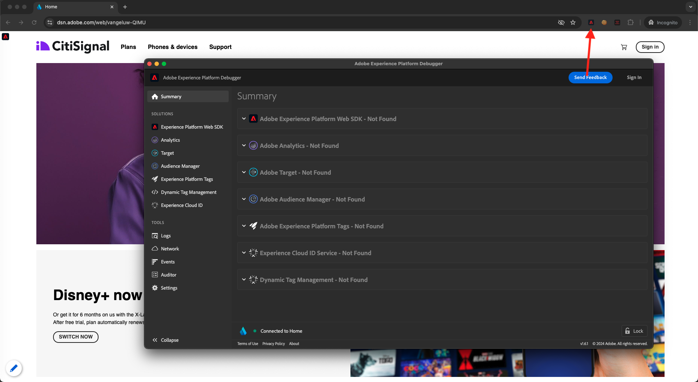

# 1.1.4 Clientside Web Data Collection

## 1.1.4.1 De gegevens in het verzoek valideren

### Het Adobe Experience Platform Debugger installeren

Foutopsporing voor Experience Platforms is een extensie die beschikbaar is voor Chrome- en Firefox-browsers en waarmee u de Adobe-technologie kunt bekijken die in uw webpagina&#39;s is geïmplementeerd. Download de versie voor uw voorkeursbrowser:

- [ uitbreiding Firefox ](https://addons.mozilla.org/nl/firefox/addon/adobe-experience-platform-dbg/)

- [ de uitbreiding van Chrome ](https://chrome.google.com/webstore/detail/adobe-experience-platform/bfnnokhpnncpkdmbokanobigaccjkpob)

Als u de foutopsporing nog nooit eerder hebt gebruikt - en deze is anders dan de vorige Adobe Experience Cloud Debugger - kunt u deze overzichtsvideo van vijf minuten bekijken:

>[!VIDEO](https://video.tv.adobe.com/v/32156?quality=12&learn=on)

Aangezien u de demo-website in de incognitomodus gaat laden, moet u ervoor zorgen dat Foutopsporing voor Experience Platform ook beschikbaar is in de incognitomodus. Om dit te doen, ga **chrome://extensions** in uw browser en open de Debugger van het Experience Platform uitbreiding.

Controleer of deze twee instellingen zijn ingeschakeld:

- Modus voor ontwikkelaars
- Toestaan in incognito

### De demo-website openen

Ga naar [ https://builder.adobedemo.com/projects ](https://builder.adobedemo.com/projects). Nadat je je hebt aangemeld bij je Adobe ID, kun je dit zien. Klik op uw websiteproject om het te openen.

Op de **Screens** pagina, klik **Looppas**.

Vervolgens wordt uw demowebsite geopend. Selecteer de URL en kopieer deze naar het klembord.

Open een nieuw Incognito-browservenster.

Plak de URL van uw demowebsite, die u in de vorige stap hebt gekopieerd. Vervolgens wordt u gevraagd u aan te melden met uw Adobe ID.

Selecteer uw accounttype en voltooi het aanmeldingsproces.

Uw website wordt vervolgens geladen in een Incognito-browservenster. Voor elke demonstratie, zult u een vers, incognito browser venster moeten gebruiken om uw demowebsite URL te laden.

### Gebruik Debugger van het Experience Platform om de vraag te zien die naar Edge gaat

Zorg ervoor dat de demo-website is geopend en klik op het extensiepictogram Foutopsporing Experience Platform.

Foutopsporing opent en toont de details van de implementatie die in uw bezit van de Inzameling van Gegevens van Adobe Experience Platform wordt gecreeerd. Herinner dat u de Uitbreiding en de regels zuivert die u enkel hebt uitgeeft.

Klik op de knop **[!UICONTROL Sign In]** rechtsboven om te verifiëren. Als u al een browsertabblad hebt geopend met de interface van Adobe Experience Platform Data Collection, wordt de verificatiestap automatisch uitgevoerd en hoeft u uw gebruikersnaam en wachtwoord niet meer in te voeren.

Druk op de knop Opnieuw laden op uw demowebsite om de foutopsporing te verbinden met dat specifieke tabblad.

Controleer of Foutopsporing **[!UICONTROL Connected to Home]** de bovenstaande afbeelding heeft en klik op het pictogram **[!UICONTROL lock]** om Foutopsporing te vergrendelen op de demowebsite. Als u dit niet doet, zal Debugger blijven overschakelen om de implementatiedetails van om het even welk browser lusje in nadruk bloot te stellen, wat verwarrend kan zijn.

Daarna, ga naar om het even welke pagina op de demowebsite als bijvoorbeeld, de **Mannen** categoriepagina.

Klik nu op **[!UICONTROL Experience Platform Web SDK]** in de linkernavigatie om de **[!UICONTROL Network Requests]** weer te geven.

Elke aanvraag bevat een **[!UICONTROL events]** rij.

Klik om de rij **[!UICONTROL events]** te openen. Merk op hoe u de {**gebeurtenis 0} web.webpagedetails.pageViews, evenals andere, uit-van-de-doos variabelen ziet die aan het** XDM van SDK van het Web **formaat vasthangen.**

Deze types van verzoekdetails zijn ook zichtbaar in het Netwerk tabel. Filter voor verzoeken met **wisselt** in om van de verzoeken de plaats te bepalen die door Web SDK worden verzonden. U kunt alle details van de XDM nuttige lading in de Kopballen van de Payload van het Verzoek vinden:

Volgende stap: [ 1.1.5 voert Adobe Analytics en Adobe Audience Manager uit ](./ex5.md)

[Terug naar module 1.1](./data-ingestion-launch-web-sdk.md)

[Terug naar alle modules](./../../../overview.md)
