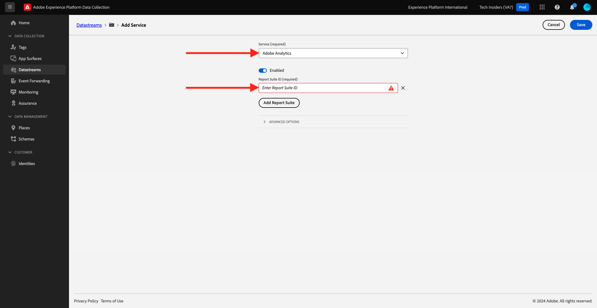

# 1.1.5 Adobe Analytics en Adobe Audience Manager implementeren

## Context

U weet nu dat XDM-gegevens naar een platform stromen. U zult meer over onderzoeken wat XDM in [&#x200B; Module 1.2 &#x200B;](./../module1.2/data-ingestion.md) is, evenals hoe te om uw eigen schema te bouwen om douanevariabelen te volgen. Voor nu gaat u bekijken wat gebeurt wanneer u uw Datasstream plaatst om gegevens aan Analytics en Audience Manager door:sturen.

## Variabelen toewijzen in Analytics

De Adobe Experience Platform [!DNL Web SDK] wijst bepaalde waarden automatisch toe, waardoor een nieuwe implementatie van Analytics via het Web SDK zo snel mogelijk wordt uitgevoerd. De automatisch in kaart gebrachte variabelen zijn vermeld [&#x200B; hier &#x200B;](https://experienceleague.adobe.com/docs/experience-platform/edge/data-collection/adobe-analytics/automatically-mapped-vars.html?lang=nl-NL#data-collection).

Voor XDM gegevens die niet automatisch aan Adobe Analytics in kaart worden gebracht, kunt u [&#x200B; contextgegevens &#x200B;](https://experienceleague.adobe.com/docs/analytics/implementation/vars/page-vars/contextdata.html?lang=nl) gebruiken om uw [&#x200B; schema &#x200B;](https://experienceleague.adobe.com/docs/experience-platform/xdm/schema/composition.html?lang=nl-NL) aan te passen. Dan kan het in Analytics worden in kaart gebracht gebruikend [&#x200B; verwerkingsregels &#x200B;](https://experienceleague.adobe.com/docs/analytics/admin/admin-tools/processing-rules/processing-rules-configuration/t-processing-rules.html?lang=nl-NL) om de variabelen van de Analyse te bevolken. De Regels van de Gegevens van de context en van de Verwerking zullen concepten vertrouwd aan die zijn geweest met Analytics in het verleden, maar maak zich geen zorgen over de details voor nu als zij nieuwe concepten zijn.

U kunt ook een standaardset handelingen en productlijsten gebruiken om gegevens te verzenden of op te halen met AEP Web SDK. Om dit te doen, zie [&#x200B; Producten &#x200B;](https://experienceleague.adobe.com/docs/experience-platform/edge/data-collection/collect-commerce-data.html?lang=nl-NL#data-collection).

### Contextgegevens

Voor gebruik door Analytics worden XDM-gegevens afgevlakt met puntnotatie en beschikbaar gemaakt als `contextData` . In de volgende lijst met waardeparen ziet u een voorbeeld van `context data` :

```javascript
{
    "bh": "900",
    "bw": "1680",
    "c": "24",
    "c.a.d.key.[0]": "value1",
    "c.a.d.key.[1]": "value2",
    "c.a.d.object.key1": "value1",
    "c.a.d.object.key2.[0]": "value2",
    "c.a.x.environment.browserdetails.javascriptenabled": "true",
    "c.a.x.environment.type": "browser",
    "cust_hit_time_gmt": "1579781427",
    "g": "http://example.com/home",
    "gn": "home",
    "j": "1.8.5",
    "k": "Y",
    "s": "1680x1050",
    "tnta": "218287:1:0|0,218287:1:0|2,218287:1:0|1,218287:1:0|32767,218287:1:01,218287:1:0|0,218287:1:0|1,218287:1:0|0,218287:1:0|1",
    "user_agent": "Mozilla/5.0 AppleWebKit/537.36 Safari/537.36",
    "v": "Y"
}
```

### Verwerkingsregels

Alle gegevens die door het randnetwerk worden verzameld kunnen via [&#x200B; verwerkingsregels &#x200B;](https://experienceleague.adobe.com/docs/analytics/admin/admin-tools/processing-rules/processing-rules-configuration/t-processing-rules.html?lang=nl-NL) worden betreden. In Analytics, kunt u verwerkingsregels gebruiken om contextgegevens in de variabelen van de Analyse op te nemen.

## Audience Manager op de Edge Network van het Experience Platform

Server-kant door:sturen is geen nieuw concept voor Audience Manager, en het zelfde proces zoals vroeger van toepassing is. U kunt identiteiten ook synchroniseren.

## Controleer uw gegevensstroom om gegevens naar Adobe Analytics te verzenden

Voer de volgende stappen uit als u gegevens die door Web SDK zijn verzameld, wilt verzenden naar Adobe Analytics en Adobe Audience Manager.

Ga naar [&#x200B; https://experience.adobe.com/launch/ &#x200B;](https://experience.adobe.com/launch/) en ga naar **Datastreams**.

Selecteer in de rechterbovenhoek van het scherm de naam van de sandbox, die `--aepSandboxName--` moet zijn. Open uw specifieke gegevensstroom, die `--aepUserLdap-- - Demo System Datastream` wordt genoemd.


Dan zie je dit. Om Adobe Analytics toe te laten, klik **de Dienst** toevoegen.


Dan zie je dit. Selecteer de dienst **Adobe Analytics**, waarna u de rapportreeks in Adobe Analytics moet toevoegen om gegevens naar te verzenden. In deze zelfstudie is dit buiten bereik. Klik **annuleren**.



## Controleer uw gegevensstroom om gegevens naar Adobe Audience Manager te verzenden

Dan zie je dit. Om Adobe Audience Manager toe te laten, klik **de Dienst** toevoegen.


Dan zie je dit. Selecteer de dienst **Adobe Audience Manager** waarna u kunt besluiten om de koekjesbestemmingen van Adobe Audience Manager en/of bestemmingen URL toe te laten of onbruikbaar te maken. In dit leerprogramma, is deze configuratie buiten werkingsgebied. Klik **annuleren**.


Volgende stap: [&#x200B; 1.1.6 voert Adobe Target &#x200B;](./ex6.md) uit

[Terug naar module 1.1](./data-ingestion-launch-web-sdk.md)

[Terug naar alle modules](./../../../overview.md)
