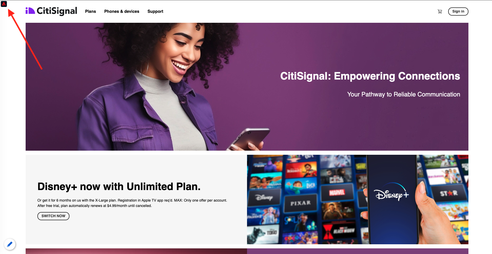
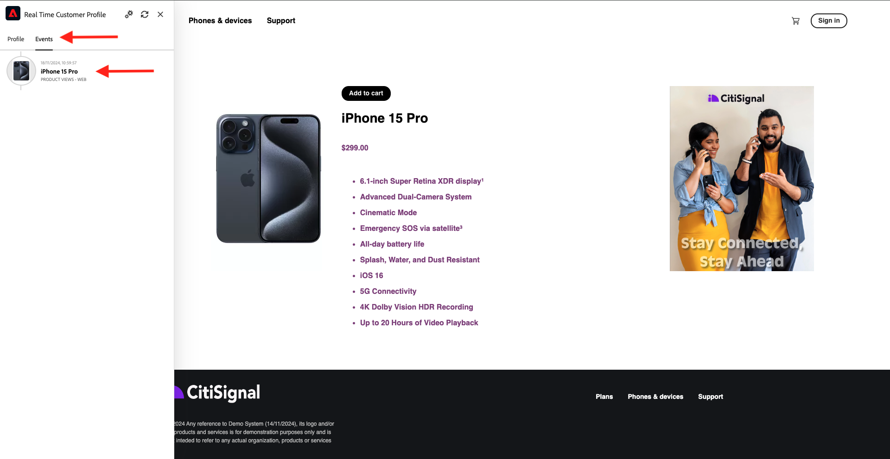
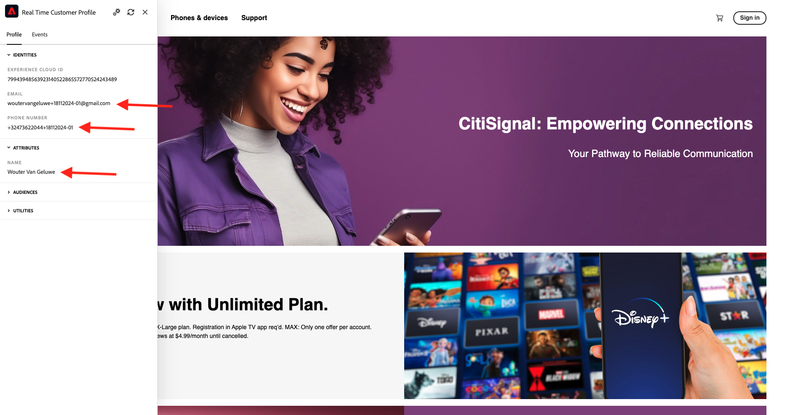

# 1.2.1 Van onbekend naar bekend op de website

## Context

De reis van onbekend naar bekend is tegenwoordig een van de belangrijkste onderwerpen onder merken, evenals de reis van de klant van aankoop naar bewaring.

Adobe Experience Platform speelt een enorme rol in deze reis. Platform is de breinen voor communicatie, het ervaringssysteem van verslag.

Het platform is een milieu waarin het woord **klant** breder is dan enkel de **gekende** - klanten. Dit is een zeer belangrijk punt om te vermelden wanneer het spreken aan merken: een onbekende bezoeker op de website is ook een klant vanuit het perspectief van Platform en als zodanig wordt al het gedrag als onbekende bezoeker ook verzonden naar Platform. Dankzij deze aanpak, wanneer deze klant uiteindelijk een bekende klant wordt, kan een merk ook visualiseren wat er voor dat moment gebeurde. Dit helpt vanuit een attributie- en ervaringsperspectief.

## Wat gaat u doen?

U gaat nu gegevens in Adobe Experience Platform invoeren en die gegevens worden gekoppeld aan id&#39;s zoals ECID&#39;s en e-mailadressen. Het doel van dit is de bedrijfscontext te begrijpen van wat u van een configuratieperspectief op het punt staat te doen. In de volgende oefening, zult u beginnen alles te vormen u nodig hebt om al die gegevensinvoer in uw eigen zandbakmilieu mogelijk te maken.

### Reisstroom van klant

Ga naar [ https://dsn.adobe.com ](https://dsn.adobe.com). Nadat je je hebt aangemeld bij je Adobe ID, kun je dit zien. Klik de 3 punten **..** op uw websiteproject en klik dan **Looppas** om het te openen.

Vervolgens wordt uw demowebsite geopend. Selecteer de URL en kopieer deze naar het klembord.

Open een nieuw Incognito-browservenster.

Plak de URL van uw demowebsite, die u in de vorige stap hebt gekopieerd. Vervolgens wordt u gevraagd u aan te melden met uw Adobe ID.

Selecteer uw accounttype en voltooi het aanmeldingsproces.

Uw website wordt vervolgens geladen in een Incognito-browservenster. Voor elke demonstratie, zult u een vers, incognito browser venster moeten gebruiken om uw demowebsite URL te laden.

Klik op het Adobe-logopictogram in de linkerbovenhoek van het scherm om de Profile Viewer te openen.

Heb een blik bij het paneel van de Kijker van het Profiel en het Profiel van de Klant in real time met **identiteitskaart van het Experience Cloud** als primaire herkenningsteken voor deze momenteel onbekende klant.

U kunt ook alle Experience Events zien die zijn verzameld op basis van het gedrag van de klant. De lijst is momenteel leeg, maar dat zal binnenkort veranderen.

Ga naar de **Telefoons &amp; apparaten** productcategorie. Daarna, klik op het product **iPhone 15 Pro**.

Vervolgens ziet u de pagina met productdetails. Een Gebeurtenis van de Ervaring van type **Mening van het Product** is nu verzonden naar Adobe Experience Platform gebruikend de implementatie van SDK van het Web die u in de vorige module herzien.

Open het paneel van de Kijker van het Profiel en heb een blik bij uw **Gebeurtenissen van de Ervaring**.

Ga terug naar de **Telefoons &amp; apparaten** categoriepagina, en klik een ander product. Er is een andere Experience Event verzonden naar Adobe Experience Platform.

Open het deelvenster Profielviewer. U zult nu 2 Gebeurtenissen van de Ervaring van type **Mening van het Product** zien. Terwijl het gedrag anoniem is, met de juiste toestemming op zijn plaats, kunnen wij elke klik volgen en het opslaan in Adobe Experience Platform. Zodra de anonieme klant wordt gekend, zullen wij al anoniem gedrag automatisch aan het knowhowprofiel kunnen samenvoegen.

Klik **Teken binnen** om naar de Register/Login pagina te gaan.

Klik **creeer een rekening**.

Vul uw details in en klik **Register** waarna u aan de vorige pagina opnieuw zult worden gericht.

Open het deelvenster Profielviewer en ga naar Klantprofiel in realtime. In het deelvenster Profielviewer worden al uw persoonlijke gegevens weergegeven, zoals de zojuist toegevoegde e-mail- en telefoon-id&#39;s.

Ga in het deelvenster Profile Viewer naar Experience Events. De twee producten die u eerder hebt bekeken, worden weergegeven in het deelvenster Profielviewer. Beide gebeurtenissen zijn nu ook verbonden met uw &#39;gekende&#39; profiel.

U hebt nu gegevens in Adobe Experience Platform ingevoerd en u hebt die gegevens gekoppeld aan id&#39;s zoals ECID&#39;s en e-mailadressen. Het doel hiervan is om de zakelijke context te begrijpen van wat je gaat doen. In de volgende oefening, zult u beginnen alles te vormen u nodig hebt om al die gegevensopname mogelijk te maken.

Volgende Stap: [ 1.2.2 vormt Schema&#39;s en vastgestelde Herkenningstekens ](./ex2.md)

[Terug naar module 1.2](./data-ingestion.md)

[Terug naar alle modules](../../../overview.md)
