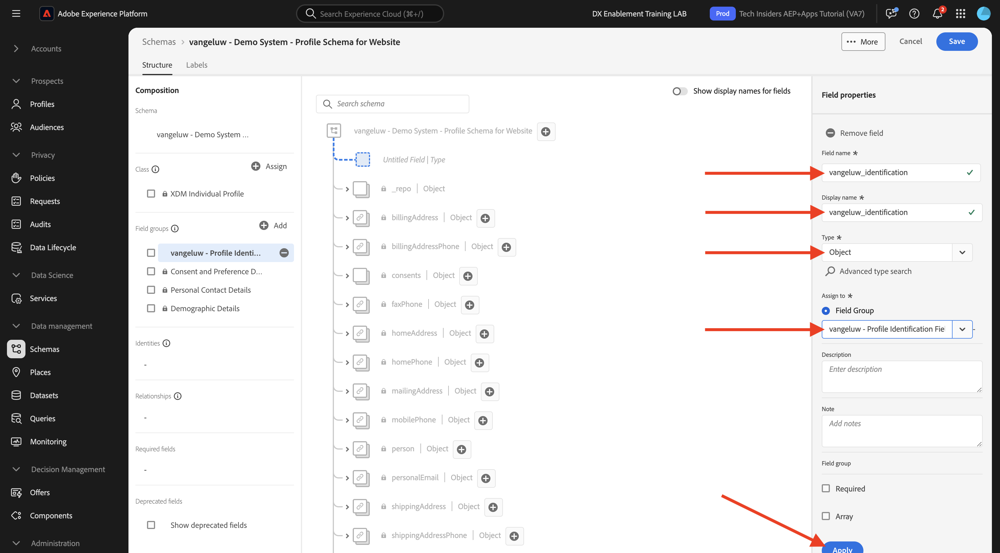
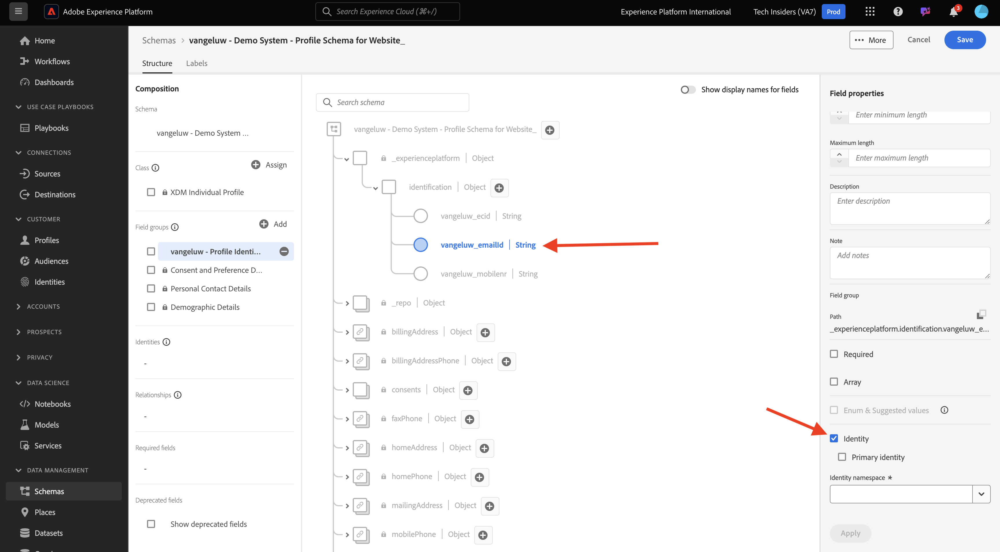
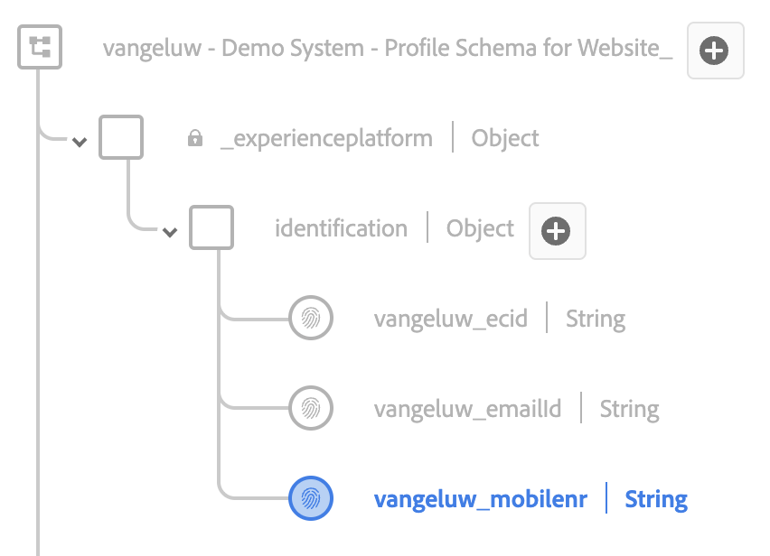
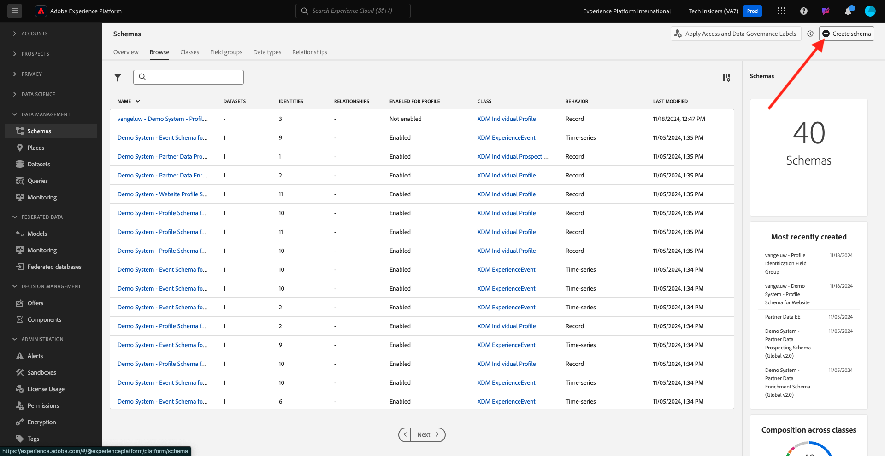
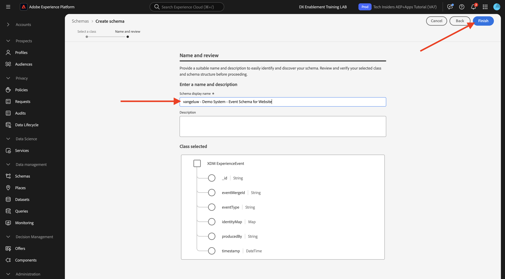

# 1.2.2 Schema&#39;s configureren en id&#39;s instellen

In deze oefening, zult u de vereiste schema&#39;s XDM vormen om profielinformatie en klantengedrag te classificeren. In elk schema XDM, zult u ook een primaire herkenningsteken moeten vormen om alle informatie te verbinden met.

## Artikel

Voordat u begint met het configureren van XDM-schema&#39;s en het instellen van primaire id&#39;s, moeten we nadenken over de zakelijke context van wat we proberen te doen:

- U wilt gegevens
- U wilt gegevens koppelen aan een klant
- U wilt een progressief, Real-time Profiel van de Klant bouwen

Er zijn twee soorten gegevens die we willen vastleggen:

- Wie is deze klant?
- Wat doet deze klant?

Nochtans, de vraag **Who is deze klant?** is een zeer open vraag die vele antwoorden heeft. Wanneer uw bedrijf deze vraag wil zien beantwoord, zoekt u demografische informatie zoals Voornaam, Achternaam en Adres. Maar ook voor contactgegevens zoals een e-mailadres of een mobiel telefoonnummer. En ook voor informatie met betrekking tot Taal, OptIn/OptOut en misschien zelfs Profielbeelden. Tot slot, wat u echt moet weten, is hoe wij deze klant in de diverse systemen identificeren die uw bedrijf gebruikt.

Het zelfde ding gaat voor de vraag **wat deze klant doet?**. Het is een zeer open vraag met veel antwoorden. Wanneer uw bedrijf deze vraag wil zien beantwoord, zoekt u om het even welke interactie een klant met om het even welk van uw online en off-line eigenschappen heeft gehad. Welke pagina&#39;s of producten zijn bezocht? Heeft deze klant een product aan zijn winkelwagen toegevoegd of zelfs een object gekocht? Welk apparaat en browser zijn gebruikt om door de website te bladeren? Welk soort informatie zoekt deze klant en hoe kunnen wij dat gebruiken om een heerlijke ervaring aan deze klant te vormen en te leveren? En tot slot, wat wij echt moeten weten, is hoe wij deze klant in de diverse systemen identificeren die uw bedrijf zal gebruiken.

## 1.2.1.1 - Wie is deze klant?

Vang het antwoord aan **Who is deze klant?** voor uw bedrijf wordt gedaan door login/Registratie-pagina.

Van een perspectief van het Schema, bekijken wij dit als a **Klasse**. De vraag: **Wie is deze klant?** is iets dat we definiëren in de klasse **[!UICONTROL XDM Individual Profile]** .

Zo wanneer u een Schema XDM creeert om het antwoord aan **te vangen wie deze klant is?** , eerst, zult u 1 schema moeten creëren en bepalen dat verwijzingen de klasse **[!UICONTROL XDM Individual Profile]**.

Als u wilt opgeven welk soort antwoorden aan die vraag kan worden gegeven, moet u [!UICONTROL Field Groups] definiëren. [!UICONTROL Field Groups] zijn extensies van de klasse Profile en hebben zeer specifieke configuraties. Demografische informatie zoals Voornaam, Achternaam, Geslacht en Verjaardag maakt bijvoorbeeld deel uit van de instructie [!UICONTROL Field Group]: **[!UICONTROL Demographic Details]** .

Ten tweede, moet uw bedrijf beslissen hoe te om deze klant te identificeren. In het geval van uw bedrijf, zou het belangrijkste herkenningsteken voor een bekende klant identiteitskaart, zoals bijvoorbeeld een e-mailadres kunnen zijn. Maar technisch gezien zijn er andere manieren om een klant bij uw bedrijf te identificeren, zoals het gebruiken van een mobiel telefoonaantal.
In dit laboratorium, zullen wij het e-mailadres als primair herkenningsteken en het telefoonaantal als secundair herkenningsteken bepalen.

Tot slot is het belangrijk om het kanaal te onderscheiden waarop de gegevens werden gevangen. In dit geval, zullen wij over Registraties van de Website en het schema spreken dat moet worden bepaald moet op **wijzen waar** de registratiegegevens werden gevangen. Het kanaal zal ook een belangrijke rol spelen bij het beïnvloeden van welke gegevens worden gevangen. Als dusdanig, is het beste praktijken om schema&#39;s voor elke combinatie kanaal, primaire herkenningsteken en type van verzamelde gegevens te bepalen.

Gebaseerd op het bovenstaande, zult u een Schema in Adobe Experience Platform moeten vormen.

Login aan Adobe Experience Platform door naar dit URL te gaan: [ https://experience.adobe.com/platform ](https://experience.adobe.com/platform).

Na het aanmelden landt je op de homepage van Adobe Experience Platform.

Alvorens u verdergaat, moet u a **zandbak** selecteren. De te selecteren sandbox krijgt de naam ``--module2sandbox--`` . U kunt dit doen door op de tekst **[!UICONTROL Production Prod]** in de blauwe lijn boven op het scherm te klikken. Na het selecteren van de aangewezen zandbak, zult u de het schermverandering zien en nu bent u in uw specifieke zandbak.

Klik in Adobe Experience Platform op **[!UICONTROL Schemas]** in het menu aan de linkerkant van het scherm. De lijst met beschikbare [!UICONTROL Schemas] wordt weergegeven.

Maak een nieuw schema. Klik op de knop **[!UICONTROL + Create Schema]** en selecteer **[!UICONTROL XDM Individual Profile]** om een nieuw schema te maken.

Na het klikken van de **[!UICONTROL + Create Schema]** knoop, wordt een nieuw schema gecreeerd en u zal worden ertoe aangezet om **gebiedsgroepen** te selecteren of te creëren.

Nu moet u bepalen wat een antwoord op de vraag **is wie deze klant is?** moet er zo uitzien.
In de inleiding van dit laboratorium, merkten wij op de behoefte aan volgende attributen om een klant te bepalen:

- Demografische informatie zoals voornaam, achternaam en adres
- Contactgegevens zoals een adres, e-mailadres of telefoonnummer
- Andere informatie met betrekking tot Taal, OptIn/OptOut en misschien zelfs profielfoto&#39;s.
- Primaire id voor een klant

Als u die informatie wilt opnemen in uw schema, moet u het volgende [!UICONTROL Field Groups] toevoegen aan uw schema:

- Demografische gegevens (demografische informatie)
- Persoonlijke contactgegevens (contactgegevens)
- Details voorkeuren (andere informatie)
- de aangepaste profielidentificatie van uw bedrijf (primaire en secundaire id&#39;s)

Selecteer in het **[!UICONTROL Add Field Group]** -scherm de [!UICONTROL Field Group] **[!UICONTROL Demographic Details]** , **[!UICONTROL Personal Contact Details]** en **[!UICONTROL Preference Details]** .

Klik op de knop **[!UICONTROL Add Field Groups]** om de [!UICONTROL Field Group] aan het schema toe te voegen.

U hebt nu het volgende:

Vervolgens hebt u een nieuwe [!UICONTROL Field Group] nodig om de **[!UICONTROL Identifier]** vast te leggen die wordt gebruikt voor gegevensverzameling. Zoals u in de vorige oefening hebt gezien, is er een concept van Primaire en Secundaire Herkenningstekens. Een primaire id is de belangrijkste, aangezien alle verzamelde gegevens aan deze Identifier zullen worden gekoppeld.

U gaat nu uw eigen aangepaste [!UICONTROL Field Group] maken en daarom breidt u [!UICONTROL XDM Schema] uit om aan de vereisten van uw eigen bedrijf te voldoen.

Klik op de knop **[!UICONTROL + Add]** om een [!UICONTROL Field Group] toe te voegen.

In plaats van een bestaande [!UICONTROL Field Group] opnieuw te gebruiken, maakt u nu uw eigen [!UICONTROL Field Group] . U kunt dat doen door **[!UICONTROL Create New Field Group]** te selecteren.

U moet nu een **[!UICONTROL Display Name]** en **[!UICONTROL Description]** opgeven voor uw nieuwe [!UICONTROL Field Group] .

Als naam voor ons schema, zullen wij dit gebruiken:
`--demoProfileLdap-- - Profile Identification Field Group`

Voor LDAP **[!UICONTROL vangeluw]** moet dit bijvoorbeeld de naam van het schema zijn:

**[!UICONTROL vangeluw - Profile Identification Field Group]**

Dat zou je iets dergelijks moeten geven:

Klik op de knop **[!UICONTROL Add Field Groups]** om het zojuist gemaakte [!UICONTROL Field Group] aan het schema toe te voegen.

Deze schemastructuur moet nu zijn ingesteld.

Uw nieuwe [!UICONTROL Field Group] is nog steeds leeg, dus u moet nu velden aan die [!UICONTROL Field Group] toevoegen.
Klik in de lijst [!UICONTROL Field Group] op uw aangepaste [!UICONTROL Field Group] .

Er worden nu een aantal nieuwe knoppen weergegeven.

Klik op het bovenste niveau van het schema op de knop **[!UICONTROL + Add Field]** .

Nadat u op de knop **[!UICONTROL + Add Field]** hebt geklikt, ziet u nu een nieuwe **[!UICONTROL object]** in uw schema. Dit object vertegenwoordigt een aangepaste **[!UICONTROL object]** in uw schema en krijgt de naam van uw Adobe Experience Platform Tenant-id. Je Adobe Experience Platform-huurder-id is `--aepTenantId--` .

U voegt nu een nieuw object toe onder die huurder. Om dat te doen, klik het gebied **[!UICONTROL New Field]** onder huurder-voorwerp.

Gebruik de volgende objectdefinities:

- Veldnaam: **[!UICONTROL identification]**
- Weergavenaam: **[!UICONTROL identification]**
- Type: **[!UICONTROL Object]**

Klik op **[!UICONTROL Apply]** om de wijzigingen op te slaan.

Nadat u op **[!UICONTROL Apply]** hebt geklikt, ziet u nu het **[!UICONTROL identification]** -object in het schema.

Nu voegt u 3 nieuwe velden toe onder het object **[!UICONTROL identification]** :

- ecid:
   - Veldnaam: **[!UICONTROL ecid]**
   - Weergavenaam: **[!UICONTROL ecid]**
   - Type: **[!UICONTROL String]**

- emailId
   - Veldnaam: **[!UICONTROL emailId]**
   - Weergavenaam: **[!UICONTROL emailId]**
   - Type: **[!UICONTROL String]**

- mobilist
   - Veldnaam: **[!UICONTROL mobilenr]**
   - Weergavenaam: **[!UICONTROL mobilenr]**
   - Type: **[!UICONTROL String]**

Elk veld wordt gedefinieerd als type **[!UICONTROL String]** en deze velden worden geconfigureerd als **[!UICONTROL Identities]** . Voor het schema **[!UICONTROL Website Registration Schema]** gaan we ervan uit dat een klant altijd wordt geïdentificeerd aan de hand van zijn e-mailadres. Dit betekent dat u het veld **[!UICONTROL emailId]** als een **[!UICONTROL primary]** -id moet configureren en de andere velden als **[!UICONTROL secondary]** -id.

Als u de velden wilt toevoegen, klikt u op de knop **[!UICONTROL +]** naast het object **[!UICONTROL identification]** .

U hebt nu een leeg veld. U moet de bovenstaande 3 velden configureren zoals aangegeven.

Dit is hoe elk gebied voor uw aanvankelijke gebiedsconfiguratie zou moeten kijken.

Klik op de knop **[!UICONTROL +]** naast het **[!UICONTROL identification]** -object om een nieuw veld te maken en de velden in te vullen zoals aangegeven.

- ecid

Als u het veld wilt opslaan, schuift u omlaag in de **[!UICONTROL Field Properties]** totdat u de knop **[!UICONTROL Apply]** ziet. Klik op de knop **[!UICONTROL Apply]**.

Klik op de knop **[!UICONTROL +]** naast het **[!UICONTROL identification]** -object om een nieuw veld te maken en de velden in te vullen zoals aangegeven.

- emailId

Als u het veld wilt opslaan, schuift u omlaag in de **[!UICONTROL Field Properties]** totdat u de knop **[!UICONTROL Apply]** ziet. Klik op de knop **[!UICONTROL Apply]**.

Klik op de knop **[!UICONTROL +]** naast het **[!UICONTROL identification]** -object om een nieuw veld te maken en de velden in te vullen zoals aangegeven.

- mobilist

Als u het veld wilt opslaan, schuift u omlaag in de **[!UICONTROL Field Properties]** totdat u de knop **[!UICONTROL Apply]** ziet. Klik op de knop **[!UICONTROL Apply]**.

U hebt nu 3 velden, maar deze velden zijn nog niet gedefinieerd als **[!UICONTROL Identity]** velden.

Voer de volgende stappen uit om deze velden als **[!UICONTROL Identity]** -velden te definiëren:

- Selecteer het veld **[!UICONTROL emailId]** .
- Schuif in de veldeigenschappen aan de rechterkant omlaag totdat u **[!UICONTROL Identity]** ziet. Schakel het selectievakje **[!UICONTROL Identity]** in.

  

- Schakel nu het selectievakje **[!UICONTROL Primary Identity]** in.

  

- Selecteer ten slotte de naamruimte **[!UICONTROL Email]** in de lijst met **[!UICONTROL Namespaces]** . Een naamruimte wordt gebruikt door de identiteitsgrafiek in Adobe Experience Platform om id&#39;s in naamruimten te classificeren en de relatie tussen die naamruimten te definiëren.

  

- Klik tot slot **[!UICONTROL Apply]** om uw veranderingen te bewaren.

  

Vervolgens moet u de andere velden voor **[!UICONTROL ecid]** en **[!UICONTROL mobilenr]** definiëren als secundaire id&#39;s.

- Selecteer het veld **[!UICONTROL ecid]** .
- Schuif in de veldeigenschappen aan de rechterkant omlaag totdat u **[!UICONTROL Identity]** ziet. Schakel het selectievakje **[!UICONTROL Identity]** in.

  

- Selecteer vervolgens de naamruimte **[!UICONTROL ECID]** in de lijst met **[!UICONTROL Namespaces]** . Een [!UICONTROL Namespace] wordt gebruikt door de identiteitsgrafiek in Adobe Experience Platform om id&#39;s in naamruimten te classificeren en de relatie tussen die naamruimten te definiëren.

  

- Klik op **[!UICONTROL Apply]** om de wijzigingen op te slaan.

  

- Selecteer het veld **[!UICONTROL mobilenr]** .
- Schuif in de veldeigenschappen aan de rechterkant omlaag totdat u **[!UICONTROL Identity]** ziet. Schakel het selectievakje **[!UICONTROL Identity]** in.

  

- Selecteer de naamruimte **[!UICONTROL Phone]** in de lijst met **[!UICONTROL Namespaces]** . Een naamruimte wordt gebruikt door de identiteitsgrafiek in Adobe Experience Platform om id&#39;s in naamruimten te classificeren en de relatie tussen die naamruimten te definiëren.

  

- Klik op **[!UICONTROL Apply]** om de wijzigingen op te slaan.

  

Het **[!UICONTROL identification]** -object moet er nu als volgt uitzien, waarbij de drie id-velden nu ook een **[!UICONTROL fingerprint]** -pictogram tonen om aan te geven dat ze zijn gedefinieerd als id&#39;s.

Geef nu uw schema een naam. Selecteer het gebied **Naamloos schema**.

Als naam voor ons schema, zult u dit gebruiken:

`--demoProfileLdap-- - Demo System - Profile Schema for Website`

Vervang **[!UICONTROL ldap]** door uw specifieke label. Voor LDAP **[!UICONTROL vangeluw]** moet dit bijvoorbeeld de naam van het schema zijn:

**[!UICONTROL vangeluw - Demo System - Profile Schema for Website]**

Dat zou je iets dergelijks moeten geven:

U hebt nu een schema gedefinieerd, bestaande en nieuwe gekoppelde [!UICONTROL Field Groups] en gedefinieerde id&#39;s.

Klik op **[!UICONTROL Save]** om de wijzigingen op te slaan.

Het laatste wat u hier moet doen, is het schema activeren en koppelen aan de **[!UICONTROL Profile]** .
Door uw schema voor Profiel toe te laten, zorgt u ervoor dat alle gegevens die naar Adobe Experience Platform op dit schema worden verzonden deel van het milieu van het Profiel van de Klant in real time zullen uitmaken, dat ervoor zorgt dat al die gegevens in real time voor het vragen, segmentatie en activering kunnen worden gebruikt.

Om dit te doen, selecteren wij de naam van uw schema.

Op het rechtertabblad van uw schema ziet u een **[!UICONTROL Profile toggle]** , dat momenteel is gedeactiveerd.

Activeer [!UICONTROL Profile] - schakelaar door het te klikken.

Dit bericht wordt weergegeven:

Klik op **[!UICONTROL Enable]** om dit schema in te schakelen voor Profiel.

Uw schema is nu geconfigureerd als onderdeel van de [!UICONTROL Real-time Customer Profile] .

Klik ten slotte op **[!UICONTROL Save]** om uw schema op te slaan.

### 1.2.1.2 - Wat doet deze klant?

Vang het antwoord op de vraag **wat deze klant doet?** voor uw bedrijf wordt uitgevoerd via bijvoorbeeld een productweergave op een productpagina.

Vanuit schemaperspectief bekijken we dit als een **[!UICONTROL Class]** . De vraag: **wat doet deze klant?** is iets dat we in de klasse **[!UICONTROL ExperienceEvent]** hebben gedefinieerd.

Dus wanneer u [!UICONTROL XDM Schema] creeert om het antwoord aan **te vangen wat doet deze klant?** , eerst, zult u 1 schema moeten creëren en bepalen dat verwijzingen de klasse **[!UICONTROL ExperienceEvent]**.

Als u wilt opgeven welk soort antwoorden aan die vraag kan worden gegeven, moet u [!UICONTROL Field Group] definiëren. [!UICONTROL Field Groups] zijn uitbreidingen van de [!UICONTROL ExperienceEvent] -klasse en hebben zeer specifieke configuraties. Bijvoorbeeld, maakt de informatie over welk soort producten een klant bekeken of toegevoegd aan hun kar deel uit van [!UICONTROL Field Group] **Commerce Details**.

Ten tweede, moet uw bedrijf beslissen hoe u het gedrag van deze klant zult identificeren. Omdat we het hebben over interacties op een website, is het mogelijk dat uw bedrijf de klant kent, maar het is evenzeer mogelijk dat een onbekende, anonieme bezoeker actief is op de website. We kunnen dus geen id gebruiken zoals een e-mailadres. In dit geval zal uw bedrijf waarschijnlijk besluiten [!UICONTROL Experience Cloud ID (ECID)] als primaire id te gebruiken.

Tot slot is het belangrijk om het kanaal te onderscheiden waarop de gegevens werden gevangen. In dit geval, zullen wij over de Interacties van de Website en het schema spreken dat moet worden bepaald moet op **wijzen waar** de interactiegegevens werden gevangen. Het kanaal zal ook een belangrijke rol spelen bij het beïnvloeden van welke gegevens worden gevangen. Als dusdanig, is het beste praktijken om schema&#39;s voor elke combinatie kanaal, primaire herkenningsteken en type van verzamelde gegevens te bepalen.

Gebaseerd op het bovenstaande, zult u een schema in Adobe Experience Platform moeten vormen.

Na het aanmelden landt je op de homepage van Adobe Experience Platform.

Selecteer een **[!UICONTROL sandbox]** voordat u verdergaat. De naam van [!UICONTROL sandbox] die moet worden geselecteerd, is ``--module2sandbox--`` . U kunt dit doen door op de tekst **[!UICONTROL Production Prod]** in de blauwe lijn boven op het scherm te klikken. Na het selecteren van de aangewezen zandbak, zult u de het schermverandering zien en nu bent u in uw specifieke zandbak.

Klik in Adobe Experience Platform op **[!UICONTROL Schemas]** in het menu aan de linkerkant van het scherm.

In [!UICONTROL Schemas] ziet u alle bestaande schema&#39;s.

Maak een nieuw schema. Klik op de knop **[!UICONTROL + Create Schema]** en selecteer **[!UICONTROL XDM ExperienceEvent]** om een nieuw schema te maken.

Na het klikken van de **[!UICONTROL + Create Schema]** knoop, wordt een nieuw schema gecreeerd en u zal worden ertoe aangezet om **gebiedsgroepen** te selecteren of te creëren.

Nu moet u bepalen wat een antwoord op de vraag **wat deze klant doet?** moet er zo uitzien.
In de inleiding van dit laboratorium, merkten wij op de behoefte aan volgende attributen om te bepalen wat een klant doet:

- Welke pagina&#39;s of producten zijn bezocht?
- Heeft deze klant een product aan zijn winkelwagen toegevoegd of zelfs een object gekocht?
- Welk apparaat en browser zijn gebruikt om door de website te bladeren?
- Welk soort informatie zoekt deze klant en hoe kunnen wij dat gebruiken om een heerlijke ervaring aan deze klant te vormen en te leveren?
- Primaire id voor een klant

Als u die informatie wilt opnemen in uw schema, moet u het volgende [!UICONTROL Field Group] toevoegen aan uw schema:

- Webdetails
- Commerce-gegevens
- Omgevingsdetails
- de aangepaste profielidentificatie van uw bedrijf [!UICONTROL Field Group] (primaire en secundaire id&#39;s)

Selecteer in het **[!UICONTROL Add Field Group]** -scherm de [!UICONTROL Field Groups] **[!UICONTROL Web Details]** , **[!UICONTROL Commerce Details]** en **[!UICONTROL Environment Details]** .

Klik op de knop **[!UICONTROL Add Field Groups]** om de veldgroep aan het schema toe te voegen.

Dan heb je het volgende:

Vervolgens moet u een nieuwe [!UICONTROL Field Group] maken om de **[!UICONTROL Identifier]** vast te leggen die wordt gebruikt voor gegevensverzameling. Zoals u in de vorige oefening hebt gezien, is er een concept van Primaire en Secundaire Herkenningstekens. Een primaire id is de belangrijkste, aangezien alle verzamelde gegevens aan deze Identifier zullen worden gekoppeld.

U gaat nu uw eigen aangepaste [!UICONTROL Field Group] maken en daarom breidt u [!UICONTROL XDM Schema] uit om aan de vereisten van uw eigen bedrijf te voldoen.

Een [!UICONTROL Field Group] is gekoppeld aan een [!UICONTROL Class] , zodat u het eerder gemaakte [!UICONTROL Field Group] niet gewoon opnieuw kunt gebruiken.

Klik op de knop **[!UICONTROL + Add]** om een [!UICONTROL Field Group] toe te voegen.

In plaats van een bestaande [!UICONTROL Field Group] opnieuw te gebruiken, maakt u nu uw eigen [!UICONTROL Field Group] . U kunt dat doen door **[!UICONTROL Create New Field Group]** te selecteren.

U moet nu een **[!UICONTROL Display Name]** en **[!UICONTROL Description]** opgeven voor uw nieuwe veldgroep.

Gebruik deze naam als naam voor uw veldgroep:

`--demoProfileLdap-- - ExperienceEvent Identification Field Group`

Voor LDAP **[!UICONTROL vangeluw]** moet dit bijvoorbeeld de naam van het schema zijn:

**[!UICONTROL vangeluw - ExperienceEvent Identification Field Group]**

Dat zou je iets dergelijks moeten geven:

Klik op de knop **[!UICONTROL Add Field Group]** om het zojuist gemaakte [!UICONTROL Field Group] aan het schema toe te voegen.

Deze [!UICONTROL Schema] -structuur moet nu zijn ingesteld.

Uw nieuwe [!UICONTROL Field Group] is nog steeds leeg, dus u moet nu velden toevoegen aan die veldgroep.
Klik in de lijst [!UICONTROL Field Group] op uw aangepaste [!UICONTROL Field Group] .

Er worden nu een aantal nieuwe knoppen weergegeven.

Klik op het bovenste niveau van het schema naast uw schema, naam, op de knop **[!UICONTROL +]** .

Nadat u op de knop **[!UICONTROL +]** hebt geklikt, ziet u nu een nieuwe **[!UICONTROL object]** in uw schema. Dit object vertegenwoordigt een aangepaste **[!UICONTROL object]** in uw [!UICONTROL Schema] en krijgt de naam van uw Adobe Experience Platform Tenant-id. Je Adobe Experience Platform-huurder-id is `--aepTenantId--` .

U voegt nu een nieuw object toe onder die huurder. Om dat te doen, klik het gebied **[!UICONTROL New Field]** onder huurder-voorwerp.

Gebruik de volgende objectdefinities:

- Veldnaam: **[!UICONTROL identification]**
- Weergavenaam: **[!UICONTROL identification]**
- Type: **[!UICONTROL Object]**

Schuif omlaag en klik op **[!UICONTROL Apply]** om de wijzigingen op te slaan.

Nadat u op **[!UICONTROL Apply]** hebt geklikt, ziet u nu het **[!UICONTROL identification]** -object in het schema.

U voegt nu 1 nieuw veld toe onder het object **[!UICONTROL identification]** .

Klik op de knop **[!UICONTROL +]** naast het **[!UICONTROL identification]** -object om een nieuw veld te maken.

Het ECID-veld wordt gedefinieerd als type **[!UICONTROL String]** en u configureert dit veld als een **[!UICONTROL Identity]** . Voor het Schema **[!UICONTROL Demo System - Event Schema for Website]**, veronderstellen wij dat een klant altijd door hun [!UICONTROL ECID] zal worden geïdentificeerd, zo betekent het dat u het gebied **[!UICONTROL ECID]** als a **primaire** herkenningsteken moet vormen

U hebt nu een leeg veld. U moet het bovenstaande veld configureren zoals aangegeven.

- ecid:

   - Veldnaam: **[!UICONTROL ecid]**
   - Weergavenaam: **[!UICONTROL ecid]**
   - Type: **[!UICONTROL String]**

Zo moet het veld [!UICONTROL ecid] er voor zorgen dat de eerste veldconfiguratie wordt geactiveerd:

Schuif omlaag en klik op **[!UICONTROL Apply]** .

U hebt nu een nieuw veld, maar dit veld is nog niet gedefinieerd als een **[!UICONTROL Identity]** veld.

Voer de volgende stappen uit om deze velden als **[!UICONTROL Identity]** -velden te definiëren:

- Selecteer het veld **[!UICONTROL ecid]** .
- Schuif in de veldeigenschappen aan de rechterkant omlaag totdat u **[!UICONTROL Identity]** ziet. Schakel het selectievakje **[!UICONTROL Identity]** in.

- Schakel nu het selectievakje **[!UICONTROL Primary Identity]** in.

- Selecteer ten slotte de naamruimte **[!UICONTROL ECID]** in de lijst met **[!UICONTROL Namespaces]** . De instructie [!UICONTROL Identity Graph] in Adobe Experience Platform gebruikt een [!UICONTROL Namespace] om id&#39;s in naamruimten te classificeren en de relatie tussen deze naamruimten te definiëren.

  

- Klik tot slot **[!UICONTROL Apply]** om uw veranderingen te bewaren.

  

Het **[!UICONTROL identification]** voorwerp zou nu als dit moeten kijken, met het ecid-gebied nu ook tonend a **vingerprint** pictogram om te tonen dat zij als herkenningstekens zijn bepaald.

Geef nu uw schema een naam. Selecteer het gebied **Naamloos schema**.

Als naam voor ons schema, zullen wij dit gebruiken:
`--demoProfileLdap-- - Demo System - Event Schema for Website`

Voor LDAP **[!UICONTROL vangeluw]** moet dit bijvoorbeeld de naam van het schema zijn:

**[!UICONTROL vangeluw - Demo System - Event Schema for Website]**

Dat zou je iets dergelijks moeten geven:

Klik op **[!UICONTROL Save]** om de wijzigingen op te slaan.

Het is belangrijk om op te merken dat wanneer uiteindelijk het opnemen van gegevens tegen dit schema, dat sommige gebieden worden vereist.
De velden **[!UICONTROL _id]** en **[!UICONTROL timestamp]** zijn bijvoorbeeld verplichte velden.

- _id moet een unieke id bevatten voor een specifieke gegevensinvoer
- timestamp moet de tijdstempel van deze hit zijn, in de notatie **[!UICONTROL "YYYY-MM-DDTHH:MM:SSSZ"]** , zoals bijvoorbeeld: **[!UICONTROL "2019-04-08T07:20:000Z"]**

U hebt nu een schema gedefinieerd, bestaande en nieuwe gekoppelde [!UICONTROL Field Groups] en id&#39;s gedefinieerd.

Het laatste wat u hier moet doen, is het schema activeren en koppelen aan de **[!UICONTROL Profile]** .
Door uw schema voor [!UICONTROL Profile] toe te laten, zorgt u ervoor dat alle gegevens die naar Adobe Experience Platform op dit schema worden verzonden deel van het Profiel van de Klant in real time zullen uitmaken, die ervoor zorgt dat al die gegevens in real time voor het vragen, segmentatie en activering kunnen worden gebruikt.

Om dit te doen, selecteren wij de naam van uw schema.

In het juiste lusje van uw schema, zult u **[!UICONTROL Profile]knevel** zien, dat momenteel wordt gedeactiveerd.

Activeer [!UICONTROL Profile] - schakelaar door het te klikken.

Dit bericht wordt weergegeven:

Klik op **[!UICONTROL Enable]** om dit schema in te schakelen voor Profiel.

Uw schema wordt nu gevormd om deel van het Profiel van de Klant in real time te zijn.

Klik ten slotte op **[!UICONTROL Save]** om uw schema op te slaan.

U hebt nu bouwschema&#39;s klaar die worden geactiveerd om in het Profiel van de Klant in real time te worden gebruikt.

Laten we eens kijken naar datasets in de volgende oefening.

Volgende Stap: [ 1.2.3 vormt Datasets ](./ex3.md)

[Terug naar module 1.2](./data-ingestion.md)

[Terug naar alle modules](../../../overview.md)
