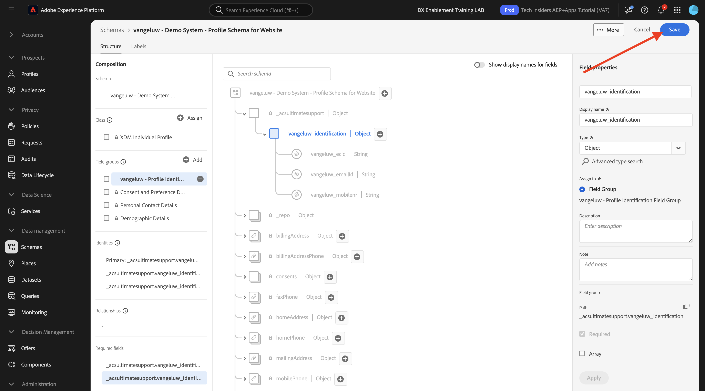
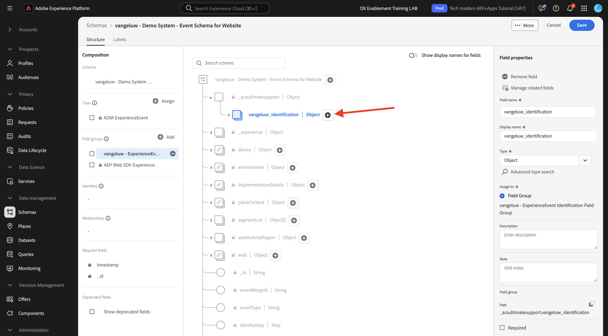
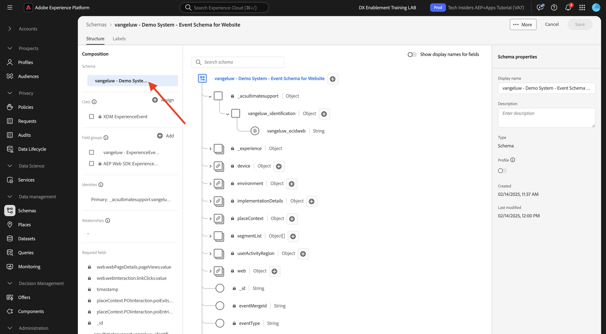

# 1.2.2 Schema&#39;s configureren en id&#39;s instellen

In deze oefening, zult u de configuratie van de vereiste XDM- schema&#39;s herzien om profielinformatie en klantengedrag te classificeren. In elk schema XDM, zult u ook zien dat een primair herkenningsteken wordt bepaald om alle op klant betrekking hebbende informatie aan te sluiten.

## Artikel

Voordat u begint met het configureren van XDM-schema&#39;s en het definiëren van id&#39;s, moet u nadenken over de zakelijke context van wat we proberen te doen:

- U wilt gegevens
- U wilt gegevens koppelen aan een klant
- U wilt een progressief, Real-time Profiel van de Klant bouwen

Er zijn twee soorten gegevens die we willen vastleggen:

- Wie is deze klant?
- Wat doet deze klant?

Nochtans, de vraag **Who is deze klant?** is een zeer open vraag die vele antwoorden heeft. Wanneer uw organisatie deze vraag beantwoord wil zien, zoekt u demografische informatie zoals Voornaam, Achternaam en Adres. Maar ook voor contactgegevens zoals een e-mailadres of een mobiel telefoonnummer. En ook voor informatie met betrekking tot Taal, OptIn/OptOut en misschien zelfs Profielbeelden. Tot slot, wat u echt moet weten, is hoe wij deze klant in de diverse systemen identificeren die uw organisatie gebruikt.

Het zelfde ding gaat voor de vraag **wat deze klant doet?**. Het is een zeer open vraag met veel antwoorden. Wanneer uw organisatie deze beantwoorde vraag wil zien, zoekt u om het even welke interactie een klant met om het even welk van uw online en off-line eigenschappen heeft gehad. Welke pagina&#39;s of producten zijn bezocht? Heeft deze klant een product aan zijn winkelwagen toegevoegd of zelfs een object gekocht? Welk apparaat en browser zijn gebruikt om door de website te bladeren? Welk soort informatie zoekt deze klant en hoe kunnen wij dat gebruiken om een heerlijke ervaring aan deze klant te vormen en te leveren? En tot slot, wat wij echt moeten weten, is hoe wij deze klant in de diverse systemen identificeren die uw organisatie zal gebruiken.

## Wie is deze klant?

Vang het antwoord aan **Who is deze klant?** voor uw organisatie wordt gedaan door Login/Registratie-pagina.

Van een perspectief van het Schema, bekijken wij dit als a **Klasse**. De vraag: **Wie is deze klant?** is iets dat we definiëren in de klasse **[!UICONTROL XDM Individual Profile]** .

Zo wanneer u een Schema XDM creeert om het antwoord aan **te vangen wie deze klant is?** , eerst, zult u 1 schema moeten creëren en bepalen dat verwijzingen de klasse **[!UICONTROL XDM Individual Profile]**.

Als u wilt opgeven welk soort antwoorden aan die vraag kan worden gegeven, moet u [!UICONTROL Field Groups] definiëren. [!UICONTROL Field Groups] zijn extensies van de klasse Profile en hebben zeer specifieke configuraties. Demografische informatie zoals Voornaam, Achternaam, Geslacht en Verjaardag maakt bijvoorbeeld deel uit van de instructie [!UICONTROL Field Group]: **[!UICONTROL Demographic Details]** .

Ten tweede, moet uw organisatie beslissen hoe te om deze klant te identificeren. In het geval van uw organisatie, zou het belangrijkste herkenningsteken voor een bekende klant identiteitskaart, zoals bijvoorbeeld een e-mailadres kunnen zijn. Maar technisch gezien zijn er andere manieren om een klant bij uw organisatie te identificeren, zoals het gebruiken van een mobiel telefoonaantal.
In dit laboratorium, zullen wij het e-mailadres als primair herkenningsteken en het telefoonaantal als secundair herkenningsteken bepalen.

Tot slot is het belangrijk om het kanaal te onderscheiden waarop de gegevens werden gevangen. In dit geval, zullen wij over Registraties van de Website en het schema spreken dat moet worden bepaald moet op **wijzen waar** de registratiegegevens werden gevangen. Het kanaal zal ook een belangrijke rol spelen bij het beïnvloeden van welke gegevens worden gevangen. Als dusdanig, is het beste praktijken om schema&#39;s voor elke combinatie kanaal, primaire herkenningsteken en type van verzamelde gegevens te bepalen.

Op basis van het bovenstaande zijn schema&#39;s gemaakt in Adobe Experience Platform.

Login aan Adobe Experience Platform door naar dit URL te gaan: [&#x200B; https://experience.adobe.com/platform &#x200B;](https://experience.adobe.com/platform).

Na het aanmelden landt je op de homepage van Adobe Experience Platform.

Alvorens u verdergaat, moet u a **zandbak** selecteren. De te selecteren sandbox krijgt de naam ``--aepSandboxName--`` . Na het selecteren van de aangewezen zandbak, zult u de het schermverandering zien en nu bent u in uw specifieke zandbak.

Klik in Adobe Experience Platform op **[!UICONTROL Schemas]** in het menu aan de linkerkant van het scherm. De lijst met beschikbare [!UICONTROL Schemas] wordt weergegeven. Maak een nieuw schema. Klik op **[!UICONTROL + Create Schema]** om een nieuw schema te maken.

Selecteer **Handboek** en klik **Uitgezocht**.

Daarna, selecteer **Individueel Profiel** en klik **daarna**.

Voer de naam van het schema als volgt in: `--aepUserLdap-- - Demo System - Profile Schema for Website` . Klik **Afwerking**.

Er wordt nu een nieuw schema gemaakt.

Nu moet u bepalen wat een antwoord op de vraag **is wie deze klant is?** moet er zo uitzien.
In de inleiding van dit laboratorium, merkten wij op de behoefte aan volgende attributen om een klant te bepalen:

- Demografische informatie zoals voornaam, achternaam en adres
- Contactgegevens zoals een adres, e-mailadres of telefoonnummer
- Andere informatie met betrekking tot Taal, OptIn/OptOut en misschien zelfs profielfoto&#39;s.
- Primaire id voor een klant

Als u die informatie wilt opnemen in uw schema, moet u het volgende [!UICONTROL Field Groups] toevoegen aan uw schema:

- Demografische gegevens (demografische informatie)
- Persoonlijke contactgegevens (contactgegevens)
- Toestemming en voorkeursgegevens (overige informatie)
- de aangepaste profielidentificatieveldgroep van uw organisatie (primaire en secundaire id&#39;s)

Klik **+ voeg** knoop onder **de groepen van het Gebied** toe.

Selecteer in het **[!UICONTROL Add Field Group]** -scherm de [!UICONTROL Field Group] **[!UICONTROL Demographic Details]** , **[!UICONTROL Personal Contact Details]** en **[!UICONTROL Consent and Preference Details]** .

Klik op de knop **[!UICONTROL Add Field Groups]** om de [!UICONTROL Field Group] aan het schema toe te voegen.

U hebt nu het volgende:

Vervolgens hebt u een nieuwe [!UICONTROL Field Group] nodig om de **[!UICONTROL Identifier]** vast te leggen die wordt gebruikt voor gegevensverzameling. Zoals je in de vorige oefening hebt gezien, is er een concept van Herkenningstekens. Een primaire id is de belangrijkste, aangezien alle verzamelde gegevens aan deze Identifier zullen worden gekoppeld.

U gaat nu uw eigen aangepaste [!UICONTROL Field Group] maken en daarom breidt u [!UICONTROL XDM Schema] uit om aan de vereisten van uw eigen organisatie te voldoen.

Klik **[!UICONTROL + Add]** onder **groepen van het Gebied** beginnen a [!UICONTROL Field Group] toe te voegen.

In plaats van een bestaande [!UICONTROL Field Group] opnieuw te gebruiken, maakt u nu uw eigen [!UICONTROL Field Group] . U kunt dat doen door **[!UICONTROL Create New Field Group]** te selecteren.

U moet nu een **[!UICONTROL Display Name]** en **[!UICONTROL Description]** opgeven voor uw nieuwe [!UICONTROL Field Group] .

Als naam voor ons schema, zullen wij dit gebruiken:
`--aepUserLdap-- - Profile Identification Field Group`

Klik op de knop **[!UICONTROL Add Field Groups]** om het zojuist gemaakte [!UICONTROL Field Group] aan het schema toe te voegen.

Deze schemastructuur is nu ingesteld.

Uw nieuwe [!UICONTROL Field Group] is nog steeds leeg, dus u moet nu velden aan die [!UICONTROL Field Group] toevoegen.
Klik in de lijst [!UICONTROL Field Group] op uw aangepaste [!UICONTROL Field Group] .

Er worden nu een aantal nieuwe knoppen weergegeven.

Klik op het bovenste niveau van het schema op de knop **[!UICONTROL + Add Field]** .

Nadat u op de knop **[!UICONTROL + Add Field]** hebt geklikt, ziet u nu een nieuw naamloos veld in uw schema.

Voer nu de gegevens van dit nieuwe veld in met behulp van de volgende objectdefinities:

- Veldnaam: **`--aepUserLdap--_identification`**
- Weergavenaam: **`--aepUserLdap--_identification`**
- Type: **[!UICONTROL Object]**
- Veldgroep: **`--aepUserLdap-- - Profile Identification Field Group`**

Klik **toepassen**.

U ziet nu een nieuw object in uw schema, dat een aangepast object **[!UICONTROL object]** in het schema vertegenwoordigt en dat naar uw Adobe Experience Platform Tenant-id is benoemd. De Adobe Experience Platform-huurder-id is `--aepTenantId--` en is uniek voor elke AEP-instantie.

U zult nu een 3 nieuw gebied onder die huurder, in het **identificatie** voorwerp toevoegen dat u enkel hebt gecreeerd. Om elk enkel op van deze 3 gebieden toe te voegen, klik **+-pictogram** onder **identificatie** voor elk gebied.

Gebruik de onderstaande informatie om deze drie nieuwe velden te maken onder het object **[!UICONTROL identification]** :

- ecid:
   - Veldnaam: **`--aepUserLdap--_ecid`**
   - Weergavenaam: **`--aepUserLdap--ecid`**
   - Type: **[!UICONTROL String]**
   - Veldgroep: **`--aepUserLdap-- - Profile Identification Field Group`**

- emailId
   - Veldnaam: **`--aepUserLdap--_emailId`**
   - Weergavenaam: **`--aepUserLdap--_emailId`**
   - Type: **[!UICONTROL String]**
   - Veldgroep: **`--aepUserLdap-- - Profile Identification Field Group`**

- mobilist
   - Veldnaam: **`--aepUserLdap--_mobilenr`**
   - Weergavenaam: **`--aepUserLdap--_mobilenr`**
   - Type: **[!UICONTROL String]**
   - Veldgroep: **`--aepUserLdap-- - Profile Identification Field Group`**

Dit is hoe elk gebied voor uw aanvankelijke gebiedsconfiguratie zou moeten kijken.

- `--aepUserLdap--_mobilenr`

Als u het veld wilt opslaan, schuift u omlaag in de **[!UICONTROL Field Properties]** totdat u de knop **[!UICONTROL Apply]** ziet. Klik op de knop **[!UICONTROL Apply]**.

- `--aepUserLdap--_ecid`

Vergeet niet neer te scrollen en **te klikken** van toepassing zijn.

- `--aepUserLdap--_emailId`

Vergeet niet neer te scrollen en **te klikken** van toepassing zijn.

Elk veld wordt gedefinieerd als type **[!UICONTROL String]** en u configureert deze velden nu als **[!UICONTROL Identities]** . Voor dit schema, veronderstellen wij dat een klant altijd door hun e-mailadres zal worden geïdentificeerd, wat betekent dat u het gebied **[!UICONTROL emailId]** als **[!UICONTROL primary]** herkenningsteken, en de andere gebieden als normale herkenningstekens moet vormen.

De drie velden moeten nu worden gedefinieerd als **[!UICONTROL Identity]** -velden.

Voer de volgende stappen uit om deze velden als **[!UICONTROL Identity]** -velden te definiëren:

- Selecteer het veld **`--aepUserLdap--_emailId`** .
- Schuif in de veldeigenschappen aan de rechterkant omlaag totdat u **[!UICONTROL Identity]** ziet. Schakel het selectievakje **[!UICONTROL Identity]** in.

- Schakel nu het selectievakje **[!UICONTROL Primary Identity]** in.

- Selecteer ten slotte de naamruimte **[!UICONTROL Email]** in de lijst met **[!UICONTROL Namespaces]** . Een naamruimte wordt gebruikt door de identiteitsgrafiek in Adobe Experience Platform om id&#39;s in naamruimten te classificeren en de relatie tussen die naamruimten te definiëren. Klik op **[!UICONTROL Apply]** om de wijzigingen op te slaan.

Vervolgens moet u de andere velden voor **`--aepUserLdap--_ecid`** en **`--aepUserLdap--_mobilenr`** definiëren als standaard-id&#39;s.

Selecteer het veld **`--aepUserLdap--_ecid`** . Schuif in de veldeigenschappen aan de rechterkant omlaag totdat u **[!UICONTROL Identity]** ziet. Schakel het selectievakje **[!UICONTROL Identity]** in.
Selecteer vervolgens de naamruimte **[!UICONTROL ECID]** in de lijst met **[!UICONTROL Namespaces]** .
Klik op **[!UICONTROL Apply]** om de wijzigingen op te slaan.

Selecteer het veld **`--aepUserLdap--_mobilenr`** . Schuif in de veldeigenschappen aan de rechterkant omlaag totdat u **[!UICONTROL Identity]** ziet. Schakel het selectievakje **[!UICONTROL Identity]** in.
Selecteer de naamruimte **[!UICONTROL Phone]** in de lijst van **[!UICONTROL Namespaces]** .
Klik op **[!UICONTROL Apply]** om de wijzigingen op te slaan.

Het **[!UICONTROL identification]** -object moet er nu als volgt uitzien, waarbij de drie id-velden nu ook een **[!UICONTROL fingerprint]** -pictogram tonen om aan te geven dat ze zijn gedefinieerd als id&#39;s.

Klik op **[!UICONTROL Save]** om de wijzigingen op te slaan.

Het laatste wat u hier moet doen, is het schema activeren en koppelen aan de **[!UICONTROL Profile]** .
Door uw schema voor Profiel toe te laten, zorgt u ervoor dat alle gegevens die naar Adobe Experience Platform op dit schema worden verzonden deel van het milieu van het Profiel van de Klant in real time zullen uitmaken, dat ervoor zorgt dat al die gegevens in real time voor het vragen, segmentatie en activering kunnen worden gebruikt.

Selecteer hiertoe de naam van uw schema.

Klik op het rechtertabblad van het schema op **[!UICONTROL Profile toggle]** , dat momenteel is gedeactiveerd.

Activeer [!UICONTROL Profile] - schakelaar door het te klikken.

Klik op **[!UICONTROL Enable]** om dit schema in te schakelen voor Profiel.

Uw schema is nu geconfigureerd als onderdeel van de [!UICONTROL Real-time Customer Profile] . Klik op **[!UICONTROL Save]** om het schema op te slaan.

## Wat doet deze klant?

Vang het antwoord op de vraag **wat deze klant doet?** voor uw organisatie wordt uitgevoerd via bijvoorbeeld een productweergave op een productpagina.

Vanuit schemaperspectief bekijken we dit als een **[!UICONTROL Class]** . De vraag: **wat doet deze klant?** is iets dat we in de klasse **[!UICONTROL ExperienceEvent]** hebben gedefinieerd.

Dus wanneer u [!UICONTROL XDM Schema] creeert om het antwoord aan **te vangen wat doet deze klant?** , eerst, zult u 1 schema moeten creëren en bepalen dat verwijzingen de klasse **[!UICONTROL ExperienceEvent]**.

Als u wilt opgeven welk soort antwoorden aan die vraag kan worden gegeven, moet u [!UICONTROL Field Group] definiëren. [!UICONTROL Field Groups] zijn extensies van de klasse [!UICONTROL ExperienceEvent] en hebben zeer specifieke configuraties. Bijvoorbeeld, maakt de informatie over welk soort producten een klant bekeken of toegevoegd aan hun kar deel uit van [!UICONTROL Field Group] **Commerce Details**.

Ten tweede, moet uw organisatie beslissen hoe u het gedrag van deze klant zult identificeren. Aangezien we het hebben over interacties op een website, is het mogelijk dat uw organisatie de klant kent, maar het is evenzeer mogelijk dat een onbekende, anonieme bezoeker actief is op de website. We kunnen dus geen id gebruiken zoals een e-mailadres. In dit geval zal uw organisatie waarschijnlijk besluiten [!UICONTROL Experience Cloud ID (ECID)] als primaire id te gebruiken.

Tot slot is het belangrijk om het kanaal te onderscheiden waarop de gegevens werden gevangen. In dit geval, zullen wij over de Interacties van de Website en het schema spreken dat moet worden bepaald moet op **wijzen waar** de interactiegegevens werden gevangen. Het kanaal zal ook een belangrijke rol spelen bij het beïnvloeden van welke gegevens worden gevangen. Als dusdanig, is het beste praktijken om schema&#39;s voor elke combinatie kanaal, primaire herkenningsteken en type van verzamelde gegevens te bepalen.

Gebaseerd op het bovenstaande, zult u een schema in Adobe Experience Platform moeten vormen.

Na het aanmelden landt je op de homepage van Adobe Experience Platform.

Selecteer een **[!UICONTROL sandbox]** voordat u verdergaat. De naam van [!UICONTROL sandbox] die moet worden geselecteerd, is ``--aepSandboxName--`` . Na het selecteren van de aangewezen zandbak, zult u de het schermverandering zien en nu bent u in uw specifieke zandbak.

In Adobe Experience Platform, klik op **[!UICONTROL Schemas]** in het menu op de linkerkant van uw scherm en ga **doorbladeren**. Maak een nieuw schema. Als u een nieuw schema wilt maken, klikt u op de knop **[!UICONTROL + Create Schema]** .

Selecteer **Handboek** en klik **Uitgezocht**.

Selecteer **Gebeurtenis van de Ervaring** en klik **daarna**.

Voer een naam in voor het schema, zoals in dit voorbeeld: `--aepUserLdap-- - Demo System - Event Schema for Website` . Klik **Afwerking**.

Een nieuw schema wordt gecreeerd en u kunt vormen welke gegevens tegen het zullen worden verzameld.

Nu moet u bepalen wat een antwoord op de vraag **wat deze klant doet?** moet er zo uitzien.
In de inleiding van dit laboratorium, merkten wij op de behoefte aan volgende attributen om te bepalen wat een klant doet:

- Welke pagina&#39;s of producten zijn bezocht?
- Heeft deze klant een product aan zijn winkelwagentje toegevoegd of zelfs een object gekocht?
- Welk apparaat en browser zijn gebruikt om door de website te bladeren?
- Welk soort informatie zoekt deze klant en hoe kunnen wij dat gebruiken om een heerlijke ervaring aan deze klant te vormen en te leveren?
- Primaire id voor een klant

Als u die informatie wilt opnemen in uw schema, moet u het volgende [!UICONTROL Field Group] toevoegen aan uw schema:

- AEP Web SDK ExperienceEvent
- de aangepaste profielidentificatie van uw organisatie [!UICONTROL Field Group]

Klik **+ voeg** onder **de groepen van het Gebied** toe.

Selecteer in het **[!UICONTROL Add Field Group]** -scherm de [!UICONTROL Field Group] **[!UICONTROL AEP Web SDK ExperienceEvent]** . Klik op **[!UICONTROL Add Field Groups]**.

Dan heb je het volgende:

Vervolgens moet u een nieuwe [!UICONTROL Field Group] maken om de **[!UICONTROL Identifier]** vast te leggen die wordt gebruikt voor gegevensverzameling.

U gaat nu uw eigen aangepaste [!UICONTROL Field Group] maken en daarom breidt u [!UICONTROL XDM Schema] uit om aan de vereisten van uw eigen organisatie te voldoen.

Een [!UICONTROL Field Group] is gekoppeld aan een [!UICONTROL Class] , zodat u het eerder gemaakte [!UICONTROL Field Group] niet gewoon opnieuw kunt gebruiken.

Klik op de knop **[!UICONTROL + Add]** om een [!UICONTROL Field Group] toe te voegen.

In plaats van een bestaande [!UICONTROL Field Group] opnieuw te gebruiken, maakt u nu uw eigen [!UICONTROL Field Group] . Selecteer **[!UICONTROL Create New Field Group]** en voer als volgt de naam voor uw veldgroep in: `--aepUserLdap-- - ExperienceEvent Identification Field Group` .
Klik **toevoegen gebiedsgroepen**

Deze [!UICONTROL Schema] -structuur moet nu zijn ingesteld.

Uw nieuwe [!UICONTROL Field Group] is nog steeds leeg, dus u moet nu velden toevoegen aan die veldgroep.
Klik in de lijst [!UICONTROL Field Group] op uw aangepaste [!UICONTROL Field Group] .

Er worden nu een aantal nieuwe knoppen weergegeven.

Klik op het bovenste niveau van het schema naast uw schema, naam, op de knop **[!UICONTROL +]** .

Nadat u op de knop **+** hebt geklikt, ziet u nu een nieuw naamloos veld in uw schema.

Hiermee definieert u het nieuwe veld:

- Veldnaam: **`--aepUserLdap--_identification`**
- Weergavenaam: **`--aepUserLdap--_identification`**
- Type: **[!UICONTROL Object]**
- Veldgroep: `--aepUserLdap-- - ExperienceEvent Identification Field Group`

Klik **toepassen**.

Je nieuwe veld wordt nu aangemaakt onder je Adobe Experience Platform Tenant ID. Je Adobe Experience Platform-huurder-id is `--aepTenantId--` .

U voegt nu 1 nieuw veld toe onder het object **[!UICONTROL identification]** .

Klik op de knop **[!UICONTROL +]** naast het **[!UICONTROL identification]** -object om een nieuw veld te maken.

Het ECID-veld wordt gedefinieerd als type **[!UICONTROL String]** en u configureert dit veld als een **[!UICONTROL Identity]** . Voor het Schema **[!UICONTROL Demo System - Event Schema for Website]**, veronderstellen wij dat een klant altijd door hun [!UICONTROL ECID] zal worden geïdentificeerd, zo betekent het dat u het gebied **[!UICONTROL ECID]** als a **primaire** herkenningsteken moet vormen

U hebt nu een leeg veld. U moet het bovenstaande veld configureren zoals aangegeven.

- ecid:

   - Veldnaam: **`--aepUserLdap--_ecidweb`**
   - Weergavenaam: **`--aepUserLdap--_ecidweb`**
   - Type: **[!UICONTROL String]**
   - Veldgroep: `--aepUserLdap-- - ExperienceEvent Identification Field Group`

Zo moet het veld `--aepUserLdap--_ecidweb` er voor zorgen dat de eerste veldconfiguratie wordt geactiveerd:

Schuif omlaag en klik op **[!UICONTROL Apply]** .

U hebt nu een nieuw veld, maar dit veld is nog niet gedefinieerd als een **[!UICONTROL Identity]** veld.

Als u deze velden wilt definiëren als **[!UICONTROL Identity]** -velden, selecteert u het veld **`--aepUserLdap--_ecidweb`** .
Schuif in de veldeigenschappen aan de rechterkant omlaag totdat u **[!UICONTROL Identity]** ziet. Schakel het selectievakje **[!UICONTROL Identity]** in en schakel het selectievakje **[!UICONTROL Primary Identity]** in.
Selecteer de naamruimte **[!UICONTROL ECID]** in de lijst van **[!UICONTROL Namespaces]** .

Klik op **[!UICONTROL Apply]** om de wijzigingen op te slaan.

Het **[!UICONTROL identification]** voorwerp zou nu als dit moeten kijken, met het ecid-gebied nu ook tonend a **vingerprint** pictogram om te tonen dat zij als herkenningstekens zijn bepaald.
Klik op **[!UICONTROL Save]** om de wijzigingen op te slaan.

Het is belangrijk om op te merken dat wanneer uiteindelijk het opnemen van gegevens tegen dit schema, dat sommige gebieden worden vereist.
De velden **[!UICONTROL _id]** en **[!UICONTROL timestamp]** zijn bijvoorbeeld verplichte velden. Dit is een vereiste die wordt opgelegd door de klasse ExperienceEvent.

- _id moet een unieke id bevatten voor een specifieke gegevensinvoer
- timestamp moet de tijdstempel van deze hit zijn, in de notatie **`"YYYY-MM-DDTHH:MM:SSSZ"`** , zoals bijvoorbeeld: **`"2024-11-18T07:20:000Z"`**

U hebt nu een schema gedefinieerd, bestaande en nieuwe gekoppelde [!UICONTROL Field Groups] en id&#39;s gedefinieerd.

Het laatste wat u hier moet doen, is het schema activeren en koppelen aan de **[!UICONTROL Profile]** .
Door uw schema voor [!UICONTROL Profile] toe te laten, zorgt u ervoor dat alle gegevens die naar Adobe Experience Platform op dit schema worden verzonden deel van het Profiel van de Klant in real time zullen uitmaken, die ervoor zorgt dat al die gegevens in real time voor het vragen, segmentatie en activering kunnen worden gebruikt.

Klik hiertoe op de naam van het schema.

In het juiste lusje van uw schema, zult u **[!UICONTROL Profile]knevel** zien, dat momenteel wordt gedeactiveerd. Klik op [!UICONTROL Profile] - switch om deze in te schakelen.

Dit bericht wordt weergegeven. Klik op **[!UICONTROL Enable]** om dit schema in te schakelen voor Profiel.

Uw schema wordt nu gevormd om deel van het Profiel van de Klant in real time te zijn.

Klik op **[!UICONTROL Save]** om het schema op te slaan.

U hebt nu bouwschema&#39;s klaar die worden geactiveerd om in het Profiel van de Klant in real time te worden gebruikt.

Laten we eens kijken naar datasets in de volgende oefening.

Volgende Stap: [&#x200B; 1.2.3 vormt Datasets &#x200B;](./ex3.md)

[Terug naar module 1.2](./data-ingestion.md)

[Terug naar alle modules](../../../overview.md)
