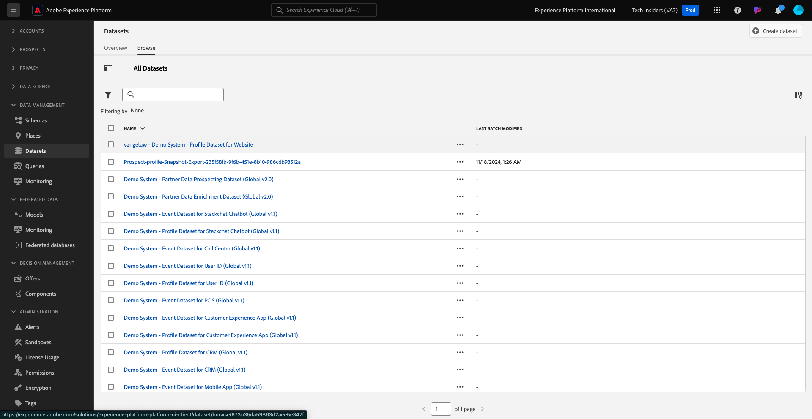
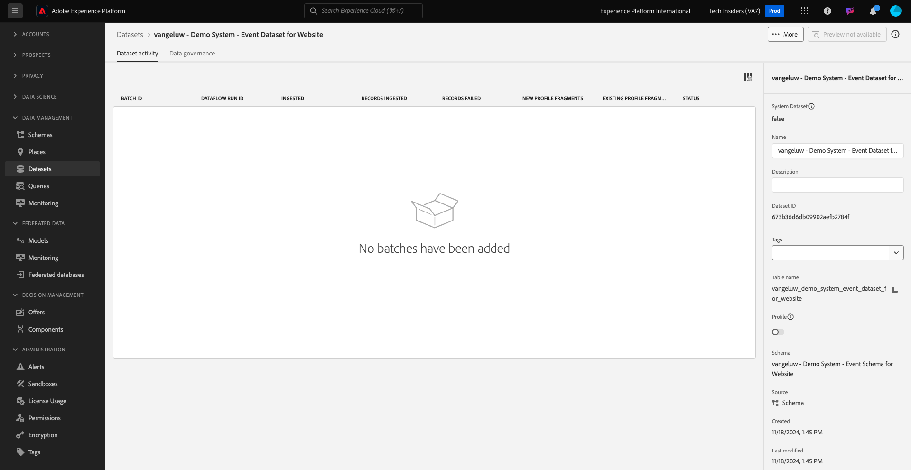

# 1.2.3 Gegevensbestanden configureren

In deze oefening, zult u datasets vormen om profielinformatie en klantengedrag te vangen en op te slaan. Elke dataset die u in dit creeert zal één van de schema&#39;s gebruiken die u in de vorige stap bouwde.

## Context

Na het bepalen van wat het antwoord op de vragen **Who deze klant is?** en **wat doet deze klant?** moet er als volgt uitzien: u moet nu een emmertje maken dat die informatie gebruikt om gegevens te ontvangen en te valideren die naar Adobe Experience Platform zijn verzonden.

## Datasets maken

U moet nu twee datasets tot stand brengen:

- 1 dataset om de informatie te vangen die **beantwoordt wie deze klant is?** - vraag.
- 1 dataset om de informatie te vangen die **beantwoordt wat deze klant doet?** - vraag.

Login aan Adobe Experience Platform door naar dit URL te gaan: [ https://experience.adobe.com/platform ](https://experience.adobe.com/platform).

Na het aanmelden landt je op de homepage van Adobe Experience Platform.

Selecteer een **[!UICONTROL sandbox]** voordat u verdergaat. De te selecteren sandbox krijgt de naam ``--module2sandbox--`` . U kunt dit doen door op de tekst **[!UICONTROL Production Prod]** in de blauwe lijn boven op het scherm te klikken. Nadat u de juiste [!UICONTROL sandbox] hebt geselecteerd, ziet u de schermwijziging en nu bevindt u zich in uw toegewezen [!UICONTROL sandbox] .

Klik in Adobe Experience Platform op **[!UICONTROL Datasets]** in het menu aan de linkerkant van het scherm.  U zult dan dit zien:

Laten we beginnen met het maken van de gegevensset om de registratiegegevens van de website vast te leggen.

U zou een nieuwe dataset moeten creëren. Als u een nieuwe gegevensset wilt maken, klikt u op de knop **[!UICONTROL + Create Dataset]** .

U moet een dataset van het schema bepalen dat u in de vorige stap bepaalde. Klik op de optie **[!UICONTROL Create Dataset from Schema]** -.

In het volgende scherm, moet u het schema selecteren dat u in 1 creeerde, `--aepUserLdap-- - Demo System - Profile Schema for Website`.

Klik **daarna**.

Geef een naam aan uw dataset.

Als naam voor uw dataset, gebruik dit:

`--aepUserLdap-- - Demo System - Profile Dataset for Website`

Klik **Afwerking**.

U ziet nu het volgende:

Ga terug naar het overzicht [!UICONTROL Datasets] . U zult nu de dataset zien u pop - omhoog in het overzicht creeerde.

Daarna, zult u een tweede dataset vormen om websiteinteractie te vangen.

Klik op **[!UICONTROL + Create Dataset]**.

U moet een dataset van het schema bepalen dat u in de vorige stap bepaalde. Klik op de optie **[!UICONTROL Create Dataset from Schema]** -.

In het volgende scherm moet u het schema selecteren dat u eerder hebt gemaakt, `--aepUserLdap-- - Demo System - Event Schema for Website` .

Klik **daarna**.

Geef een naam aan uw dataset.

Als naam voor onze dataset, gebruik dit:

`--aepUserLdap-- - Demo System - Event Dataset for Website`

Klik **Afwerking**.

U zult dan dit zien:

Ga terug naar het [!UICONTROL Datasets] overzichtsscherm.

U moet nu uw datasets toelaten om deel van Adobe Experience Platform in real time het Profiel van de Klant te maken.

Open uw dataset `--aepUserLdap-- - Demo System - Profile Dataset for Website` door het te klikken.

Zoek het schakelpictogram [!UICONTROL Profile] aan de rechterkant van het scherm.
Klik op de schakeloptie [!UICONTROL Profile] om deze gegevensset in te schakelen voor [!UICONTROL Profile] .

Klik op **[!UICONTROL Enable]**.

Uw gegevensset is nu ingeschakeld voor [!UICONTROL Profile] .

Ga terug naar het overzicht van datasets en open uw dataset `--aepUserLdap-- - Demo System - Event Dataset` voor Website door het te klikken.

Zoek het schakelpictogram [!UICONTROL Profile] aan de rechterkant van het scherm. Klik op de schakeloptie [!UICONTROL Profile] om [!UICONTROL Profile] in te schakelen.

Klik op **[!UICONTROL Enable]**.

Uw gegevensset is nu ingeschakeld voor [!UICONTROL Profile] .

Volgende Stap: [ 1.2.4 Ingestie van Gegevens van Off-line Bronnen ](./ex4.md)

[Terug naar module 1.2](./data-ingestion.md)

[Terug naar alle modules](../../../overview.md)
