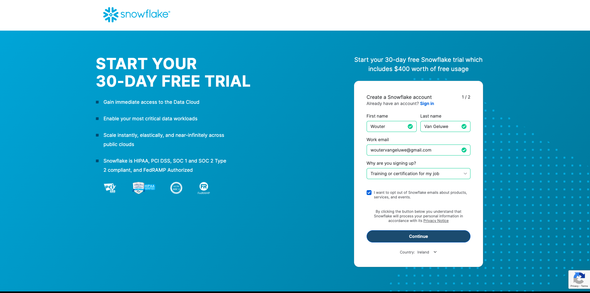
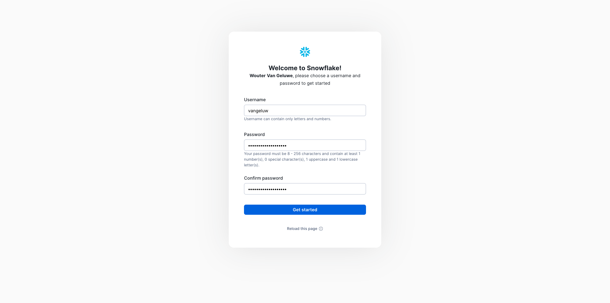
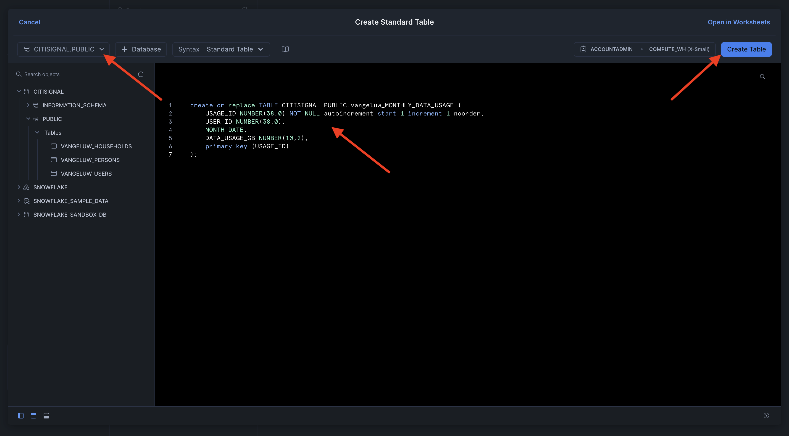
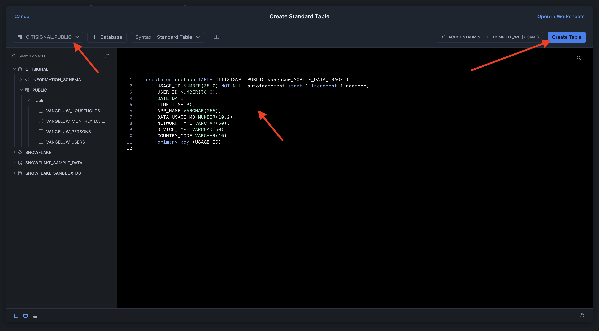

# 1.3.1 De Snowflake-omgeving instellen

## 1.3.1.1 Uw account maken

Ga naar [ https://snowflake.com ](https://snowflake.com). Klik **BEGINNEN VOOR VRIJ**.


Ga uw details in en klik **verdergaan**.



Ga uw details in, kies uw wolkenleverancier en klik **begonnen worden**.


Ga uw details in of klik **Overslaan** (x2).


Dan zie je dit. Controleer uw e-mail en klik op het bevestigingsbericht dat naar u is verzonden.


Klik op de koppeling in het bevestigingsbericht om uw account te activeren en geef uw gebruikersnaam en wachtwoord op. Klik **krijgen Begonnen**. U zult deze gebruikersnaam en wachtwoord in de volgende oefening moeten gebruiken.



U wordt dan aangemeld bij de Snowflake. Klik **Overslaan voor nu**.


## 1.3.1.2 Uw database maken

Ga naar **Gegevens > Gegevensbestanden**. Klik **+ Gegevensbestand**.


Gebruik de naam **CITISIGNAL** voor uw gegevensbestand. Klik **CREËREN**.


## 1.3.1.3 Tabellen maken

U kunt nu uw tabellen maken in Snowflake. Hieronder vindt u scripts waarmee u uw tabellen kunt maken.

### Tabel CK_PERSONS

Klik **+ creëren**, dan klik **Lijst** en klik dan **Standaard**.


Dan zie je dit. Kopieer de onderstaande query en plak deze in Snowflake. Zorg ervoor om het **CITISIGNAAL** gegevensbestand in de hoogste linkerhoek van uw scherm te selecteren alvorens uw lijst te creëren.

```sql
create or replace TABLE CITISIGNAL.PUBLIC.CK_PERSONS (
	PERSON_ID NUMBER(38,0) NOT NULL,
	NAME VARCHAR(255),
	AGE NUMBER(38,0),
	EMAIL VARCHAR(255),
	PHONE_NUMBER VARCHAR(20),
	GENDER VARCHAR(10),
	OCCUPATION VARCHAR(100),
	ISATTMOBILESUB BOOLEAN,
	primary key (PERSON_ID)
);
```

Klik **creëren Lijst**.


Zodra het manuscript in werking is gesteld, kunt u uw lijst onder **Gegevensbestanden > CITISIGNAL > PUBLIC** vinden.


### Tabel CK_HOUSEHOLDS

Klik **+ creëren**, dan klik **Lijst** en klik dan **Standaard**.


Dan zie je dit. Kopieer de onderstaande query en plak deze in Snowflake. Zorg ervoor om het **CITISIGNAAL** gegevensbestand in de hoogste linkerhoek van uw scherm te selecteren alvorens uw lijst te creëren.

```sql
create or replace TABLE CITISIGNAL.PUBLIC.CK_HOUSEHOLDS (
	HOUSEHOLD_ID NUMBER(38,0) NOT NULL,
	ADDRESS VARCHAR(255),
	CITY VARCHAR(100),
	STATE VARCHAR(50),
	POSTAL_CODE VARCHAR(20),
	COUNTRY VARCHAR(100),
	ISELIGIBLEFORFIBER BOOLEAN,
	PRIMARY_PERSON_ID NUMBER(38,0),
	ISFIBREENABLED BOOLEAN,
	primary key (HOUSEHOLD_ID)
);
```

Klik **creëren Lijst**.


Zodra het manuscript in werking is gesteld, kunt u uw lijst onder **Gegevensbestanden > CITISIGNAL > PUBLIC** vinden.


### Tabel CK_USERS

Klik **+ creëren**, dan klik **Lijst** en klik dan **Standaard**.


Dan zie je dit. Kopieer de onderstaande query en plak deze in Snowflake. Zorg ervoor om het **CITISIGNAAL** gegevensbestand in de hoogste linkerhoek van uw scherm te selecteren alvorens uw lijst te creëren.

```sql
create or replace TABLE CITISIGNAL.PUBLIC.CK_USERS (
	USER_ID NUMBER(38,0) NOT NULL,
	PERSON_ID NUMBER(38,0),
	HOUSEHOLD_ID NUMBER(38,0),
	primary key (USER_ID),
	foreign key (PERSON_ID) references CITISIGNAL.PUBLIC.CK_PERSONS(PERSON_ID),
	foreign key (HOUSEHOLD_ID) references CITISIGNAL.PUBLIC.CK_HOUSEHOLDS(HOUSEHOLD_ID)
);
```

Klik **creëren Lijst**.


Zodra het manuscript in werking is gesteld, kunt u uw lijst onder **Gegevensbestanden > CITISIGNAL > PUBLIC** vinden.


### Tabel CK_MONTHLY_DATA_USAGE

Klik **+ creëren**, dan klik **Lijst** en klik dan **Standaard**.


Dan zie je dit. Kopieer de onderstaande query en plak deze in Snowflake. Zorg ervoor om het **CITISIGNAAL** gegevensbestand in de hoogste linkerhoek van uw scherm te selecteren alvorens uw lijst te creëren.

```sql
create or replace TABLE CITISIGNAL.PUBLIC.CK_MONTHLY_DATA_USAGE (
	USAGE_ID NUMBER(38,0) NOT NULL autoincrement start 1 increment 1 noorder,
	USER_ID NUMBER(38,0),
	MONTH DATE,
	DATA_USAGE_GB NUMBER(10,2),
	primary key (USAGE_ID)
);
```

Klik **creëren Lijst**.



Zodra het manuscript in werking is gesteld, kunt u uw lijst onder **Gegevensbestanden > CITISIGNAL > PUBLIC** vinden.


### Tabel CK_MOBILE_DATA_USAGE

Klik **+ creëren**, dan klik **Lijst** en klik dan **Standaard**.


Dan zie je dit. Kopieer de onderstaande query en plak deze in Snowflake. Zorg ervoor om het **CITISIGNAAL** gegevensbestand in de hoogste linkerhoek van uw scherm te selecteren alvorens uw lijst te creëren.


```sql
create or replace TABLE CITISIGNAL.PUBLIC.CK_MOBILE_DATA_USAGE (
	USAGE_ID NUMBER(38,0) NOT NULL autoincrement start 1 increment 1 noorder,
	USER_ID NUMBER(38,0),
	DATE DATE,
	TIME TIME(9),
	APP_NAME VARCHAR(255),
	DATA_USAGE_MB NUMBER(10,2),
	NETWORK_TYPE VARCHAR(50),
	DEVICE_TYPE VARCHAR(50),
	COUNTRY_CODE VARCHAR(10),
	primary key (USAGE_ID)
);
```

Klik **creëren Lijst**.



Zodra het manuscript in werking is gesteld, kunt u uw lijst onder **Gegevensbestanden > CITISIGNAL > PUBLIC** vinden.


Alle tabellen worden nu gemaakt.


## 1.3.1.4 Gegevens van de steekproef

U kunt nu voorbeeldgegevens in uw database laden.

...

U hebt nu de opstelling in Snowflake gebeëindigd.


Volgende Stap: [ 1.3.2 leidt schema&#39;s, gegevensmodel en verbindingen ](./ex2.md)

[Terug naar module 1.3](./fac.md)

[Terug naar alle modules](../../../overview.md)
