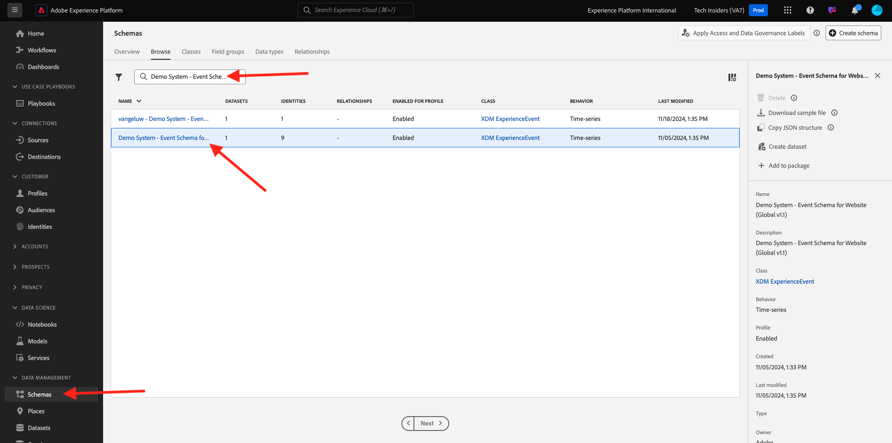

# 5.1.3 Het gebruiken van de Dienst van de Vraag

## Doelstelling

- Gegevensbestanden zoeken en verkennen
- Leer hoe te om de voorwerpen en de attributen van de Modellen van Gegevens van de Ervaring in uw vragen te richten

## Context

In dit zult u leren hoe te om PSQL te gebruiken om informatie over de beschikbare datasets terug te winnen, hoe te om vragen voor het Model van Gegevens van de Ervaring (XDM) te schrijven, en uw eerste eenvoudige rapporteringsvragen te schrijven gebruikend de Dienst van de Vraag en de Datasets van het Signaal van Citi.

## Standaardquery&#39;s

In dit zult u over de methodes leren om informatie over de beschikbare datasets terug te winnen en hoe te om gegevens met een vraag van een dataset behoorlijk terug te winnen XDM.

Alle datasets die wij via Adobe Experience Platform in het begin van 1 hebben onderzocht, zijn ook beschikbaar voor toegang via een SQL interface als lijsten. Om van die lijsten een lijst te maken kunt u **gebruiken toont lijsten;** bevel.

Voer `show tables;` in uw **bevel-lijn PSQL interface** uit. (vergeet niet uw opdracht te beëindigen met een puntkomma).

Kopieer de opdracht `show tables;` en plak deze bij de prompt:


Het volgende resultaat wordt weergegeven:

```text
tech-insiders:all=> show tables;
                               name                               |                                                  dataSetId                                                   |                                       dataSet                                        | description |        labels        
------------------------------------------------------------------+--------------------------------------------------------------------------------------------------------------+--------------------------------------------------------------------------------------+-------------+----------------------
 ajo_bcc_feedback_event_dataset                                   | 672a07cb7728e82aefa1ec56                                                                                     | AJO BCC Feedback Event Dataset                                                       |             | 
 ajo_classification_dataset                                       | 672a07cab55b0d2aef6f9626                                                                                     | AJO Classification Dataset                                                           |             | 
 ajo_consent_service_dataset                                      | 672a07c80fd5fd2aee4155ca                                                                                     | AJO Consent Service Dataset                                                          |             | 'PROFILE'
 ajo_email_tracking_experience_event_dataset                      | 672a07c926d57d2aef020230                                                                                     | AJO Email Tracking Experience Event Dataset                  :
                               name                               |                                                  dataSetId                                                   |                                       dataSet                                        | description |        labels        
------------------------------------------------------------------+--------------------------------------------------------------------------------------------------------------+--------------------------------------------------------------------------------------+-------------+----------------------
 ajo_bcc_feedback_event_dataset                                   | 672a07cb7728e82aefa1ec56                                                                                     | AJO BCC Feedback Event Dataset                                                       |             | 
 ajo_classification_dataset                                       | 672a07cab55b0d2aef6f9626                                                                                     | AJO Classification Dataset                                                           |             | 
 ajo_consent_service_dataset                                      | 672a07c80fd5fd2aee4155ca                                                                                     | AJO Consent Service Dataset                                                          |             | 'PROFILE'
 ajo_email_tracking_experience_event_dataset                      | 672a07c926d57d2aef020230                                                                                     | AJO Email Tracking Experience Event Dataset   
```

Druk op de dubbelepunten op de spatiebalk om de volgende pagina van de resultaatset te zien of voer `q` in om terug te keren naar de opdrachtprompt.

Elke dataset in AEP heeft zijn overeenkomstige lijst van de Dienst van de Vraag. U kunt de lijst van een dataset via Datasets UI vinden:


De tabel `demo_system_event_dataset_for_website_global_v1_1` is de tabel Query Service die overeenkomt met de gegevensset `Demo System - Event Schema for Website (Global v1.1)` .

Om sommige informatie over te vragen waar een product werd bekeken, zullen wij de **geo** informatie selecteren.

Kopieer hieronder de vraag en kleef het bij de herinnering in uw **bevel-lijn PSQL interface** en de slag gaat binnen:

```sql
select placecontext.geo
from   demo_system_event_dataset_for_website_global_v1_1
where  eventType = 'commerce.productViews'
and placecontext.geo.countryCode <> ''
limit 1;
```

In uw vraagresultaat, zult u opmerken dat de kolommen in het Model van de Gegevens van de Ervaring (XDM) complexe types en niet alleen scalaire types kunnen zijn. In de vraag hierboven zouden wij geografische plaatsen willen identificeren waar a **commerce.productViews** voorkwam. Om a **commerce.productViews** te identificeren moeten wij door het model navigeren XDM gebruikend **.** (punt) notatie.

```text
tech-insiders:all=> select placecontext.geo
from   demo_system_event_dataset_for_website_global_v1_1
where  eventType = 'commerce.productViews'
and placecontext.geo.countryCode <> ''
limit 1;
                 geo                  
--------------------------------------
 ("(51.59119,-1.407848)",Charlton,GB)
(1 row)
```

U ziet dat het resultaat een vlak object is in plaats van een enkele waarde? Het {**voorwerp 0} placecontext.geo bevat vier attributen: schema, land en stad.** Wanneer een object wordt gedeclareerd als een kolom, retourneert dit het gehele object als een tekenreeks. Het schema XDM kan complexer zijn dan wat u vertrouwd met bent maar het is zeer krachtig en is ontworpen om vele oplossingen, kanalen, en gebruiksgevallen te steunen.

Gebruik **om de afzonderlijke eigenschappen van een object te selecteren.** (punt) notatie.

Kopieer de verklaring hieronder en kleef het bij de herinnering in uw **bevel-lijn PSQL interface**:

```sql
select placecontext.geo._schema.longitude
      ,placecontext.geo._schema.latitude
      ,placecontext.geo.city
      ,placecontext.geo.countryCode
from   demo_system_event_dataset_for_website_global_v1_1
where  eventType = 'commerce.productViews'
and placecontext.geo.countryCode <> ''
limit 1;
```

Het resultaat van de bovenstaande query moet er als volgt uitzien.
Het resultaat is nu een set eenvoudige waarden:

```text
tech-insiders:all=> select placecontext.geo._schema.longitude
      ,placecontext.geo._schema.latitude
      ,placecontext.geo.city
      ,placecontext.geo.countryCode
from   demo_system_event_dataset_for_website_global_v1_1
where  eventType = 'commerce.productViews'
and placecontext.geo.countryCode <> ''
limit 1;
 longitude | latitude |   city   | countrycode 
-----------+----------+----------+-------------
 -1.407848 | 51.59119 | Charlton | GB
(1 row)
```

Maak u geen zorgen, er is een gemakkelijke manier om de weg naar een specifiek bezit te verkrijgen. In het volgende gedeelte leert u hoe u dit kunt doen.

U zult een vraag moeten uitgeven, zodat openen eerst een redacteur.

Op Vensters: gebruik **Blocnote**

In Mac: installeer een willekeurige Text Editor-app en open deze.

Kopieer de volgende instructie naar de teksteditor:

```sql
select your_attribute_path_here
from   demo_system_event_dataset_for_website_global_v1_1
where  eventType = 'commerce.productViews'
and placecontext.geo.countryCode <> ''
limit 1;
```

Ga terug naar uw Adobe Experience Platform UI (zou open in uw browser moeten zijn) of aan [ Adobe Experience Platform ](https://experience.adobe.com/platform) navigeren.

Selecteer **Schema&#39;s**, ga `Demo System - Event Schema for Website` op het **onderzoek** gebied in en klik om het schema `Demo System - Event Schema for Website (Global v1.1) Schema` te openen.



Onderzoek het model XDM voor **Systeem van de Demo - het Schema van de Gebeurtenis voor Website (Globale v1.1)**, door op een voorwerp te klikken. Breid de boom voor **placecontext**, **geo** en **schema** uit. Wanneer u de daadwerkelijke attributen **lengtegraad** selecteert, zult u de volledige weg in de benadrukte rode doos zien. Als u het pad van het kenmerk wilt kopiëren, klikt u op het pictogram van het kopieerpad.


De schakelaar aan uw notitieblok/steunen en verwijdert **your_attribute_path_here** uit de eerste lijn. Plaats uw curseur na **uitgezocht** op de eerste lijn en deeg (CTRL-V).


Kopieer de gewijzigde verklaring en kleef het bij de herinnering in uw **bevel-lijn PSQL interface** en de slag gaat binnen.

Het resultaat moet er als volgt uitzien:

```text
tech-insiders:all=> select placeContext.geo._schema.longitude
from   demo_system_event_dataset_for_website_global_v1_1
where  eventType = 'commerce.productViews'
and placecontext.geo.countryCode <> ''
limit 1;
 longitude 
-----------
 -1.407848
(1 row)
```

Volgende Stap: [ 5.1.4 Vragen, vragen, vragen... en koordanalyse ](./ex4.md)

[Ga terug naar module 5.1](./query-service.md)

[Terug naar alle modules](../../../overview.md)
