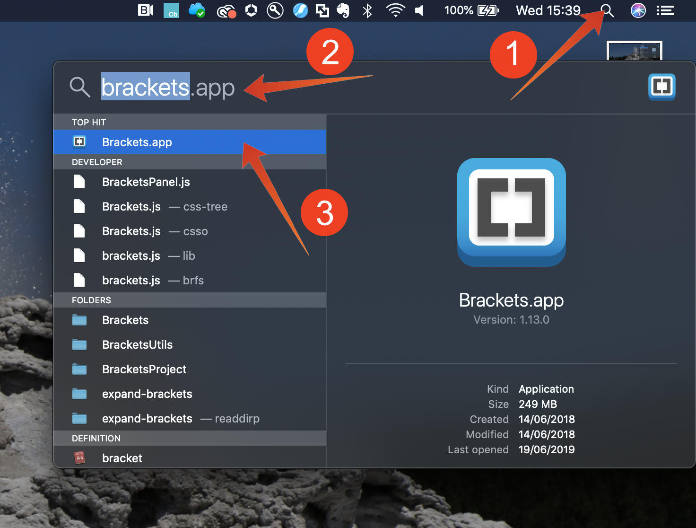

# 5.1.4 Vragen, query&#39;s, query&#39;s... en churn-analyse

## Doelstelling

- Vragen naar gegevensanalyses schrijven
- SQL-query&#39;s schrijven die online combineren, callcenter en loyaliteitsgegevens beschikbaar in Adobe Experience Platform
- Meer informatie over Adobe gedefinieerde functies

## Context

In deze oefeningen zult u vragen schrijven om productmeningen, producttrechters, kurn etc. te analyseren.

Alle vragen die in dit hoofdstuk worden vermeld zullen in uw **PSQL bevel-lijn interface** worden uitgevoerd. U zou (CTRL-c) de verklaringsblokken moeten kopiëren die met **worden vermeld SQL** en (CTRL-v) hen in **bevel-lijn PSQL interface** kleven. De **blokken van het Resultaat van de Vraag** tonen de geplakte SQL verklaring en het bijbehorende vraagresultaat.

## Basisquery&#39;s schrijven voor gegevensanalyse

### Tijdstempel

Gegevens die in Adobe Experience Platform zijn vastgelegd, krijgen een tijdstempel. Het **timestamp** attribuut staat u toe om gegevens in tijd te analyseren.

Hoeveel productweergaven hebben we dagelijks?

**SQL**

```sql
select date_format( timestamp , 'yyyy-MM-dd') AS Day,
       count(*) AS productViews
from   demo_system_event_dataset_for_website_global_v1_1
where  --aepTenantId--.demoEnvironment.brandName IN ('Citi Signal')
and eventType = 'commerce.productViews'
group by Day
limit 10;
```

Kopieer de verklaring hierboven en voer het in uw **bevel-lijn PSQL interface** uit.

**Resultaat van de Vraag**

```text
tech-insiders:all=> select date_format( timestamp , 'yyyy-MM-dd') AS Day,
       count(*) AS productViews
from   demo_system_event_dataset_for_website_global_v1_1
where  _experienceplatform.demoEnvironment.brandName IN ('Citi Signal')
and eventType = 'commerce.productViews'
group by Day
limit 10;
    Day     | productViews 
------------+--------------
 2024-12-04 |         2297
(1 row)
```

### Top 5 van bekeken producten

Wat zijn de vijf belangrijkste producten die worden weergegeven?

#### SQL

```sql
select productListItems.name, count(*)
from   demo_system_event_dataset_for_website_global_v1_1
where  --aepTenantId--.demoEnvironment.brandName IN ('Citi Signal')
and    eventType = 'commerce.productViews'
group  by productListItems.name
order  by 2 desc
limit 5;
```

Kopieer de verklaring hierboven en voer het in uw **bevel-lijn PSQL interface** uit.

**Resultaat van de Vraag**

```text
tech-insiders:all=> select productListItems.name, count(*)
from   demo_system_event_dataset_for_website_global_v1_1
where  _experienceplatform.demoEnvironment.brandName IN ('Citi Signal')
and    eventType = 'commerce.productViews'
group  by productListItems.name
order  by 2 desc
limit 5;
                  name                   | count(1) 
-----------------------------------------+----------
 {Google Pixel XL 32GB Black Smartphone} |      938
 {SIM Only}                              |      482
 {Samsung Galaxy S8}                     |      456
 {Samsung Galaxy S7 32GB Black}          |      421
(4 rows)
```

### Trechter met productinteracties, van weergave tot aankoop

**SQL**

```sql
select eventType, count(*)
from   demo_system_event_dataset_for_website_global_v1_1
where  --aepTenantId--.demoEnvironment.brandName IN ('Citi Signal')
and    eventType is not null
and    eventType <> ''
group  by eventType;
```

Kopieer de verklaring hierboven en voer het in uw **bevel-lijn PSQL interface** uit.

**Resultaat van de Vraag**

```text
tech-insiders:all=> select eventType, count(*)
from   demo_system_event_dataset_for_website_global_v1_1
where  _experienceplatform.demoEnvironment.brandName IN ('Citi Signal')
and    eventType is not null
and    eventType <> ''
group  by eventType;
        eventType         | count(1) 
--------------------------+----------
 commerce.productListAdds |      494
 commerce.purchases       |      246
 commerce.productViews    |     2297
(3 rows)
```

### bezoekers identificeren die risico lopen voor Churn (pagina bezoek => Service annuleren)

**SQL**

```sql
select distinct --aepTenantId--.identification.core.ecid
from   demo_system_event_dataset_for_website_global_v1_1
where  --aepTenantId--.demoEnvironment.brandName IN ('Citi Signal')
and    web.webPageDetails.name = 'Cancel Service'
group  by --aepTenantId--.identification.core.ecid
limit 10;
```

Kopieer de verklaring hierboven en voer het in uw **bevel-lijn PSQL interface** uit.

**Resultaat van de Vraag**

```text
tech-insiders:all=> select distinct _experienceplatform.identification.core.ecid
from   demo_system_event_dataset_for_website_global_v1_1
where  _experienceplatform.demoEnvironment.brandName IN ('Citi Signal')
and    web.webPageDetails.name = 'Cancel Service'
group  by _experienceplatform.identification.core.ecid
limit 10;
               ecid               
----------------------------------
 86069928882940477620713284798772
 75691756152042231410852704832434
 47381264398548915586824480724480
 51294194577949645447313762862726
 95873885060131472480685538836534
 71192995127345419624952514250737
 81469709164961922907426138040032
 53545252726821876244061095202780
 13294750130353985087337266864522
 58843891994459565443501421307174
(10 rows)
```

In de volgende reeks vragen zullen wij de bovengenoemde vraag uitbreiden, om een volledige mening op de klanten en hun gedrag te krijgen die de &quot;Cancel de pagina van de Dienst&quot;hebben bezocht. U leert hoe u de Adobe Gedefinieerde functie kunt gebruiken om informatie in te stellen, de volgorde en de timing van gebeurtenissen te identificeren. U gaat ook gegevenssets samenvoegen om de gegevens verder te verrijken en voor te bereiden voor analyse in Microsoft Power BI.

## Geavanceerde query&#39;s

Het grootste deel van de bedrijfslogica vereist het verzamelen van de aanrakingspunten voor een klant en het opdracht geven tot hen tegen tijd. Deze steun wordt verleend door SQL van de Vonk in de vorm van vensterfuncties. Vensterfuncties maken deel uit van standaard-SQL en worden ondersteund door vele andere SQL-engines.

### Door Adobe gedefinieerde functies

De Adobe heeft een reeks **Adobe bepaalde Functies** aan de standaardSQL syntaxis toegevoegd die u toestaat om uw ervaringsgegevens beter te begrijpen. In de volgende paar vragen zult u over deze functies ADF leren. U kunt meer informatie en de volledige lijst [ in de documentatie ](https://experienceleague.adobe.com/docs/experience-platform/query/sql/adobe-defined-functions.html) vinden.

### Wat doen mensen op de site voordat ze de pagina &quot;Service annuleren&quot; bereiken als derde pagina in een sessie?

Met deze vraag zult u de eerste twee Adobe bepaalde Functies **SESS_TIMEOUT** ontdekken en **VOLGENDE**

> **SESS_TIMEOUT ()** reproduceert de bezoekgroepen die met Adobe Analytics worden gevonden. Het voert een gelijkaardige op tijd-gebaseerde groepering uit, maar klantgerichte parameters.
>
> **VOLGENDE ()** en **VORIGE ()** hulp u om te begrijpen hoe de klanten uw plaats navigeren.

**SQL**

```sql
SELECT
  webPage,
  webPage_2,
  webPage_3,
  webPage_4,
  count(*) journeys
FROM
  (
      SELECT
        webPage,
        NEXT(webPage, 1, true)
          OVER(PARTITION BY ecid, session.num
                ORDER BY timestamp
                ROWS BETWEEN CURRENT ROW AND UNBOUNDED FOLLOWING).value
          AS webPage_2,
        NEXT(webPage, 2, true)
          OVER(PARTITION BY ecid, session.num
                ORDER BY timestamp
                ROWS BETWEEN CURRENT ROW AND UNBOUNDED FOLLOWING).value
          AS webPage_3,
        NEXT(webPage, 3, true)
           OVER(PARTITION BY ecid, session.num
                ORDER BY timestamp
                ROWS BETWEEN CURRENT ROW AND UNBOUNDED FOLLOWING).value
          AS webPage_4,
        session.depth AS SessionPageDepth
      FROM (
            select a.--aepTenantId--.identification.core.ecid as ecid,
                   a.timestamp,
                   web.webPageDetails.name as webPage,
                    SESS_TIMEOUT(timestamp, 60 * 30) 
                       OVER (PARTITION BY a.--aepTenantId--.identification.core.ecid 
                             ORDER BY timestamp 
                             ROWS BETWEEN UNBOUNDED PRECEDING AND CURRENT ROW) 
                  AS session
            from   demo_system_event_dataset_for_website_global_v1_1 a
            where  a.--aepTenantId--.identification.core.ecid in ( 
                select b.--aepTenantId--.identification.core.ecid
                from   demo_system_event_dataset_for_website_global_v1_1 b
                where  b.--aepTenantId--.demoEnvironment.brandName IN ('Citi Signal')
                and    b.web.webPageDetails.name = 'Cancel Service'
            )
        )
)
WHERE SessionPageDepth=1
and   webpage_3 = 'Cancel Service'
GROUP BY webPage, webPage_2, webPage_3, webPage_4
ORDER BY journeys DESC
LIMIT 10;
```

Kopieer de verklaring hierboven en voer het in uw **bevel-lijn PSQL interface** uit.

**Resultaat van de Vraag**

```text
                webPage                |               webPage_2               |   webPage_3    | webPage_4  | journeys 
---------------------------------------+---------------------------------------+----------------+------------+----------
 Telco Home                            | Citi Signal Sport                     | Cancel Service | Call Start |        2
 Citi Signal Sport                     | Google Pixel XL 32GB Black Smartphone | Cancel Service | Call Start |        2
 Broadband Deals                       | Samsung Galaxy S7 32GB Black          | Cancel Service |            |        2
 TV & Broadband Deals                  | Samsung Galaxy S7 32GB Black          | Cancel Service |            |        2
 SIM Only                              | Citi Signal Shop                      | Cancel Service |            |        2
 Google Pixel XL 32GB Black Smartphone | Broadband Deals                       | Cancel Service |            |        2
 SIM Only                              | Telco Home                            | Cancel Service |            |        2
 Citi Signal Shop                      | Samsung Galaxy S7 32GB Black          | Cancel Service | Call Start |        1
 Google Pixel XL 32GB Black Smartphone | Citi Signal Sport                     | Cancel Service | Call Start |        1
 Google Pixel XL 32GB Black Smartphone | Citi Signal Shop                      | Cancel Service | Call Start |        1
(10 rows)
```

### Hoeveel tijd hebben wij alvorens een bezoeker het vraagcentrum na het bezoeken van de &quot;Cancel Pagina van de Dienst&quot;roept?

Om dit soort vraag te beantwoorden zullen wij **TIME_BETWEEN_NEXT_MATCH () gebruiken** Adobe bepaalde Functie.

> De tijd-tussen vorige of volgende gelijke functies verstrekken een nieuwe dimensie, die de tijd meet die sinds een bepaald incident is verstreken.

**SQL**

```sql
select * from (
       select --aepTenantId--.identification.core.ecid as ecid,
              web.webPageDetails.name as webPage,
              TIME_BETWEEN_NEXT_MATCH(timestamp, web.webPageDetails.name='Call Start', 'seconds')
              OVER(PARTITION BY --aepTenantId--.identification.core.ecid
                  ORDER BY timestamp
                  ROWS BETWEEN CURRENT ROW AND UNBOUNDED FOLLOWING)
              AS contact_callcenter_after_seconds
       from   demo_system_event_dataset_for_website_global_v1_1
       where  --aepTenantId--.demoEnvironment.brandName IN ('Citi Signal')
       and    web.webPageDetails.name in ('Cancel Service', 'Call Start')
) r
where r.webPage = 'Cancel Service'
limit 15;
```

Kopieer de verklaring hierboven en voer het in uw **bevel-lijn PSQL interface** uit.

**Resultaat van de Vraag**

```text
               ecid               |    webPage     | contact_callcenter_after_seconds 
----------------------------------+----------------+----------------------------------
 00331886620679939148047665693117 | Cancel Service |                                 
 00626561600197295782131349716866 | Cancel Service |                                 
 00630470663554417679969244202779 | Cancel Service |                             -797
 00720875344152796154458668700428 | Cancel Service |                             -519
 00746064605049656090779523644276 | Cancel Service |                              -62
 00762093837616944422322357210965 | Cancel Service |                                 
 00767875779073091876070699689209 | Cancel Service |                                 
 00798691264980137616449378075855 | Cancel Service |                                 
 00869613691740150556826953447162 | Cancel Service |                             -129
 00943638725078228957873279219207 | Cancel Service |                             -750
 01167540466536077846425644389346 | Cancel Service |                                 
 01412448537869549016063764484810 | Cancel Service |                                 
 01419076946514450291741574452702 | Cancel Service |                             -482
 01533124771963987423015507880755 | Cancel Service |                                 
 01710651086750904478559809475925 | Cancel Service |                                 
(15 rows)
```

### En wat is het resultaat van dat contact?

In deze vraag, zult u zich bij datasets samen aansluiten. In dit geval zult u zich bij de dataset `demo_system_event_dataset_for_website_global_v1_1` met de dataset `demo_system_event_dataset_for_call_center_global_v1_1` aansluiten. Dit wordt gedaan om het resultaat van de interactie van het vraagcentrum te begrijpen.

**SQL**

```sql
select distinct r.*,
       c.--aepTenantId--.interactionDetails.core.callCenterAgent.callFeeling,
       c.--aepTenantId--.interactionDetails.core.callCenterAgent.callTopic,
       c.--aepTenantId--.interactionDetails.core.callCenterAgent.callContractCancelled
from (
       select --aepTenantId--.identification.core.ecid ecid,
              web.webPageDetails.name as webPage,
              TIME_BETWEEN_NEXT_MATCH(timestamp, web.webPageDetails.name='Call Start', 'seconds')
              OVER(PARTITION BY --aepTenantId--.identification.core.ecid
                  ORDER BY timestamp
                  ROWS BETWEEN CURRENT ROW AND UNBOUNDED FOLLOWING)
              AS contact_callcenter_after_seconds
       from   demo_system_event_dataset_for_website_global_v1_1
       where  --aepTenantId--.demoEnvironment.brandName IN ('Citi Signal')
       and    web.webPageDetails.name in ('Cancel Service', 'Call Start')
) r
, demo_system_event_dataset_for_call_center_global_v1_1 c
where r.ecid = c.--aepTenantId--.identification.core.ecid
and r.webPage = 'Cancel Service'
and c.--aepTenantId--.interactionDetails.core.callCenterAgent.callContractCancelled IN (true,false)
and c.--aepTenantId--.interactionDetails.core.callCenterAgent.callTopic IN ('contract', 'invoice','complaint','wifi')
limit 15;
```

Kopieer de verklaring hierboven en voer het in uw **bevel-lijn PSQL interface** uit.

**Resultaat van de Vraag**

```text
               ecid               |    webPage     | contact_callcenter_after_seconds | callfeeling | calltopic | callcontractcancelled 
----------------------------------+----------------+----------------------------------+-------------+-----------+-----------------------
 00630470663554417679969244202779 | Cancel Service |                             -797 | negative    | contract  | f
 00720875344152796154458668700428 | Cancel Service |                             -519 | positive    | contract  | f
 00746064605049656090779523644276 | Cancel Service |                              -62 | positive    | contract  | t
 00869613691740150556826953447162 | Cancel Service |                             -129 | negative    | contract  | t
 00943638725078228957873279219207 | Cancel Service |                             -750 | positive    | contract  | f
 01419076946514450291741574452702 | Cancel Service |                             -482 | neutral     | contract  | f
 01738842540109643781526526573341 | Cancel Service |                             -562 | neutral     | contract  | f
 02052460258994877317679083617975 | Cancel Service |                             -545 | neutral     | contract  | f
 02156496759733199802585567179589 | Cancel Service |                              -83 | neutral     | contract  | t
 02666934104296797891818818456669 | Cancel Service |                             -297 | positive    | contract  | t
 03059764265715537001416957172652 | Cancel Service |                             -243 | negative    | contract  | t
 03347899869945278660479273416679 | Cancel Service |                             -229 | positive    | contract  | t
 04258863338643046907489131372300 | Cancel Service |                             -588 | positive    | contract  | f
 04733864373954008966920919247566 | Cancel Service |                             -795 | neutral     | contract  | f
 05199871096822598772351169572451 | Cancel Service |                             -236 | positive    | contract  | t
(15 rows)
```

### Wat is het loyaliteitsprofiel van deze klanten?

In deze vraag voegen wij zich bij de gegevens van CRM aan die in Adobe Experience Platform werden ingezien. Dit maakt het mogelijk om de kinneanalyse te verrijken met CRM-gegevens.

**SQL**

```sql
select r.*,
       c.--aepTenantId--.interactionDetails.core.callCenterAgent.callFeeling,
       c.--aepTenantId--.interactionDetails.core.callCenterAgent.callTopic,
       l.--aepTenantId--.loyaltyDetails.level,
       l.--aepTenantId--.identification.core.crmId
from (
       select --aepTenantId--.identification.core.ecid ecid,
              web.webPageDetails.name as webPage,
              TIME_BETWEEN_NEXT_MATCH(timestamp, web.webPageDetails.name='Call Start', 'seconds')
              OVER(PARTITION BY --aepTenantId--.identification.core.ecid
                  ORDER BY timestamp
                  ROWS BETWEEN CURRENT ROW AND UNBOUNDED FOLLOWING)
              AS contact_callcenter_after_seconds
       from   demo_system_event_dataset_for_website_global_v1_1
       where  --aepTenantId--.demoEnvironment.brandName IN ('Citi Signal')
       and    web.webPageDetails.name in ('Cancel Service', 'Call Start')
) r
, demo_system_event_dataset_for_call_center_global_v1_1 c
, demo_system_profile_dataset_for_crm_global_v1_1 l
where r.ecid = c.--aepTenantId--.identification.core.ecid
and r.webPage = 'Cancel Service'
and l.--aepTenantId--.identification.core.ecid = r.ecid
and c.--aepTenantId--.interactionDetails.core.callCenterAgent.callTopic IN ('contract', 'invoice','complaint','wifi','promo')
limit 15;
```

Kopieer de verklaring hierboven en voer het in uw **bevel-lijn PSQL interface** uit.

**Resultaat van de Vraag**

```text
               ecid               |    webPage     | contact_callcenter_after_seconds | callfeeling | calltopic | level  |   crmid   
----------------------------------+----------------+----------------------------------+-------------+-----------+--------+-----------
 00630470663554417679969244202779 | Cancel Service |                             -797 | negative    | contract  | Bronze | 524483285
 00720875344152796154458668700428 | Cancel Service |                             -519 | positive    | contract  | Silver | 860696333
 00746064605049656090779523644276 | Cancel Service |                              -62 | positive    | contract  | Bronze | 072387270
 00869613691740150556826953447162 | Cancel Service |                             -129 | negative    | contract  | Bronze | 789347684
 00943638725078228957873279219207 | Cancel Service |                             -750 | positive    | contract  | Gold   | 033926162
 01419076946514450291741574452702 | Cancel Service |                             -482 | neutral     | contract  | Bronze | 105063634
 01738842540109643781526526573341 | Cancel Service |                             -562 | neutral     | contract  | Gold   | 791324509
 02052460258994877317679083617975 | Cancel Service |                             -545 | neutral     | contract  | Gold   | 443477555
 02156496759733199802585567179589 | Cancel Service |                              -83 | neutral     | contract  | Silver | 305085589
 02666934104296797891818818456669 | Cancel Service |                             -297 | positive    | contract  | Silver | 104266570
 03059764265715537001416957172652 | Cancel Service |                             -243 | negative    | contract  | Silver | 814175245
 03347899869945278660479273416679 | Cancel Service |                             -229 | positive    | contract  | Gold   | 377699708
 04258863338643046907489131372300 | Cancel Service |                             -588 | positive    | contract  | Silver | 298321657
 04733864373954008966920919247566 | Cancel Service |                             -795 | neutral     | contract  | Gold   | 655070958
 05199871096822598772351169572451 | Cancel Service |                             -236 | positive    | contract  | Gold   | 425688874
(15 rows)
```

### Uit welke regio komen ze ons bezoeken?

Hier volgen de geografische gegevens, zoals lengte, houding, stad en landcode, die door de Adobe Experience Platform zijn vastgelegd om geografische inzichten te krijgen over het koesteren van klanten.

**SQL**

```sql
       select distinct r.ecid,
              r.city,
              r.countrycode,
              r.lat as latitude,
              r.lon as longitude,
              r.contact_callcenter_after_seconds as seconds_to_contact_callcenter,
              c.--aepTenantId--.interactionDetails.core.callCenterAgent.callFeeling,
              c.--aepTenantId--.interactionDetails.core.callCenterAgent.callTopic,
              c.--aepTenantId--.interactionDetails.core.callCenterAgent.callContractCancelled,
              l.--aepTenantId--.loyaltyDetails.level,
              l.--aepTenantId--.identification.core.crmId
       from (
              select --aepTenantId--.identification.core.ecid ecid,
                     placeContext.geo._schema.latitude lat,
                     placeContext.geo._schema.longitude lon,
                     placeContext.geo.city,
                     placeContext.geo.countryCode,
                     web.webPageDetails.name as webPage,
                     TIME_BETWEEN_NEXT_MATCH(timestamp, web.webPageDetails.name='Call Start', 'seconds')
                     OVER(PARTITION BY --aepTenantId--.identification.core.ecid
                         ORDER BY timestamp
                         ROWS BETWEEN CURRENT ROW AND UNBOUNDED FOLLOWING)
                     AS contact_callcenter_after_seconds
              from   demo_system_event_dataset_for_website_global_v1_1
              where  --aepTenantId--.demoEnvironment.brandName IN ('Citi Signal')
              and    web.webPageDetails.name in ('Cancel Service', 'Call Start')
       ) r
       , demo_system_event_dataset_for_call_center_global_v1_1 c
       , demo_system_profile_dataset_for_crm_global_v1_1 l
       where r.ecid = c.--aepTenantId--.identification.core.ecid
       and r.webPage = 'Cancel Service'
       and l.--aepTenantId--.identification.core.ecid = r.ecid
       and c.--aepTenantId--.interactionDetails.core.callCenterAgent.callTopic IN ('contract', 'invoice','complaint','wifi','promo')
       limit 15;
```

Kopieer de verklaring hierboven en voer het in uw **bevel-lijn PSQL interface** uit.

**Resultaat van de Vraag**

```text
               ecid               |    city    | countrycode |  latitude  | longitude  | seconds_to_contact_callcenter | callfeeling | calltopic | callcontractcancelled | level  |   crmid   
----------------------------------+------------+-------------+------------+------------+-------------------------------+-------------+-----------+-----------------------+--------+-----------
 00630470663554417679969244202779 | Charlton   | GB          |   51.59119 |  -1.407848 |                          -797 | negative    | contract  | f                     | Bronze | 524483285
 00720875344152796154458668700428 | Ashley     | GB          | 51.4139633 | -2.2685462 |                          -519 | positive    | contract  | f                     | Silver | 860696333
 00746064605049656090779523644276 | Liverpool  | GB          | 53.4913801 |  -2.867264 |                           -62 | positive    | contract  | t                     | Bronze | 072387270
 00869613691740150556826953447162 | Langley    | GB          |  51.888151 |   -0.23924 |                          -129 | negative    | contract  | t                     | Bronze | 789347684
 00943638725078228957873279219207 | Eaton      | GB          | 53.2945961 | -0.9335791 |                          -750 | positive    | contract  | f                     | Gold   | 033926162
 01419076946514450291741574452702 | Tullich    | GB          | 57.4694803 | -3.1269422 |                          -482 | neutral     | contract  | f                     | Bronze | 105063634
 01738842540109643781526526573341 | Whitwell   | GB          | 54.3886617 |  -1.555363 |                          -562 | neutral     | contract  | f                     | Gold   | 791324509
 02052460258994877317679083617975 | Edinburgh  | GB          | 55.9309486 | -3.1859102 |                          -545 | neutral     | contract  | f                     | Gold   | 443477555
 02156496759733199802585567179589 | West End   | GB          |   53.46464 |    0.04134 |                           -83 | neutral     | contract  | t                     | Silver | 305085589
 02666934104296797891818818456669 | Newtown    | GB          | 51.3684218 | -1.3218754 |                          -297 | positive    | contract  | t                     | Silver | 104266570
 03059764265715537001416957172652 | Edinburgh  | GB          | 55.9309486 | -3.1859102 |                          -243 | negative    | contract  | t                     | Silver | 814175245
 03347899869945278660479273416679 | Liverpool  | GB          | 53.4913801 |  -2.867264 |                          -229 | positive    | contract  | t                     | Gold   | 377699708
 04258863338643046907489131372300 | Norton     | GB          | 52.2679288 | -1.1202549 |                          -588 | positive    | contract  | f                     | Silver | 298321657
 04733864373954008966920919247566 | Whitchurch | GB          | 51.4057505 | -2.5573746 |                          -795 | neutral     | contract  | f                     | Gold   | 655070958
 05199871096822598772351169572451 | Stapleford | GB          |   53.10672 |  -0.687802 |                          -236 | positive    | contract  | t                     | Gold   | 425688874
(15 rows)
```

## Interactieanalyse van callcenter

In de vragen hierboven bekeken wij slechts de bezoekers die omhoog contacteerden het callcenter in het geval van de dienstannulering. Wij willen dit een beetje breder nemen en rekening houden met alle interactie van het callcenter met inbegrip van (wifi, promo, factuur, klacht en contract).

U moet een query bewerken, dus laten we eerst de notebooks of vierkante haakjes openen.

Op Vensters klik &quot;onderzoek&quot;- pictogram (1) in de vensterswerkbalk, type **notepad** in &quot;onderzoek&quot;- gebied (2), klik (3) het &quot;notebookpad&quot;resultaat:


Op Mac



Kopieer de volgende instructie naar de aantekeningen/haakjes:

```sql
select /* enter your name */
       e.--aepTenantId--.identification.core.ecid as ecid,
       e.placeContext.geo.city as city,
       e.placeContext.geo._schema.latitude latitude,
       e.placeContext.geo._schema.longitude longitude,
       e.placeContext.geo.countryCode as countrycode,
       c.--aepTenantId--.interactionDetails.core.callCenterAgent.callFeeling as callFeeling,
       c.--aepTenantId--.interactionDetails.core.callCenterAgent.callTopic as callTopic,
       c.--aepTenantId--.interactionDetails.core.callCenterAgent.callContractCancelled as contractCancelled,
       l.--aepTenantId--.loyaltyDetails.level as loyaltystatus,
       l.--aepTenantId--.loyaltyDetails.points as loyaltypoints,
       l.--aepTenantId--.identification.core.crmId as crmid
from   demo_system_event_dataset_for_website_global_v1_1 e
      ,demo_system_event_dataset_for_call_center_global_v1_1 c
      ,demo_system_profile_dataset_for_crm_global_v1_1 l
where  e.--aepTenantId--.demoEnvironment.brandName IN ('Citi Signal')
and    e.web.webPageDetails.name in ('Cancel Service', 'Call Start')
and    e.--aepTenantId--.identification.core.ecid = c.--aepTenantId--.identification.core.ecid
and    l.--aepTenantId--.identification.core.ecid = e.--aepTenantId--.identification.core.ecid;
```

en vervangen

```text
enter your name
```

Verwijder `/\*` en `\*/` niet. De aangepaste instructie in de laptop moet er als volgt uitzien:


Kopieer uw gewijzigde verklaring van **notepad** in het **PSQL venster van de bevellijn** en de slag gaat binnen. U zou het volgende resultaat in het de bevellijnvenster van PSQL moeten zien:

```text
tech-insiders:all=> select /* vangeluw */
       e._experienceplatform.identification.core.ecid as ecid,
       e.placeContext.geo.city as city,
       e.placeContext.geo._schema.latitude latitude,
       e.placeContext.geo._schema.longitude longitude,
       e.placeContext.geo.countryCode as countrycode,
       c._experienceplatform.interactionDetails.core.callCenterAgent.callFeeling as callFeeling,
       c._experienceplatform.interactionDetails.core.callCenterAgent.callTopic as callTopic,
       c._experienceplatform.interactionDetails.core.callCenterAgent.callContractCancelled as contractCancelled,
       l._experienceplatform.loyaltyDetails.level as loyaltystatus,
       l._experienceplatform.loyaltyDetails.points as loyaltypoints,
       l._experienceplatform.identification.core.crmId as crmid
from   demo_system_event_dataset_for_website_global_v1_1 e
      ,demo_system_event_dataset_for_call_center_global_v1_1 c
      ,demo_system_profile_dataset_for_crm_global_v1_1 l
where  e._experienceplatform.demoEnvironment.brandName IN ('Citi Signal')
and    e.web.webPageDetails.name in ('Cancel Service', 'Call Start')
and    e._experienceplatform.identification.core.ecid = c._experienceplatform.identification.core.ecid
and    l._experienceplatform.identification.core.ecid = e._experienceplatform.identification.core.ecid;
               ecid               |    city    |  latitude  | longitude  | countrycode | callFeeling | callTopic | contractCancelled | loyaltystatus | loyaltypoints |   crmid   
----------------------------------+------------+------------+------------+-------------+-------------+-----------+-------------------+---------------+---------------+-----------
 60082543727227001177187726544992 | Normanton  |  52.643749 |  -0.622129 | GB          | neutral     | contract  | f                 | Bronze        |         430.0 | 117969439
 03250145103029549687906576330844 | Charlton   |   51.59119 |  -1.407848 | GB          | none        | none      | f                 | Silver        |         585.0 | 271570836
 87322786414150971711720565798532 | Whitwell   | 54.3886617 |  -1.555363 | GB          | none        | none      | f                 | Bronze        |         872.0 | 570762160
 46736059905281823751180777497223 | Edinburgh  | 55.9309486 | -3.1859102 | GB          | none        | none      | f                 | Gold          |         482.0 | 980678773
 81958524709959359235057647680790 | Linton     | 54.0542238 | -2.0215836 | GB          | none        | none      | f                 | Bronze        |         666.0 | 341873673
 24854602977644353049269284436324 | Tullich    | 57.4694803 | -3.1269422 | GB          | negative    | contract  | f                 | Bronze        |         418.0 | 831581327
 24854602977644353049269284436324 | Tullich    | 57.4694803 | -3.1269422 | GB          | negative    | contract  | f                 | Bronze        |         418.0 | 831581327
```

In volgende zult u uw vraag (die ook als **wordt bekend creeert lijst zoals uitgezocht** of **CTAS**) als nieuwe dataset voortzetten die u in de Power BI van Microsoft zult gebruiken.

Volgende Stap: [ 5.1.5 produceert een dataset van een vraag ](./ex5.md)

[Ga terug naar module 5.1](./query-service.md)

[Terug naar alle modules](../../../overview.md)
