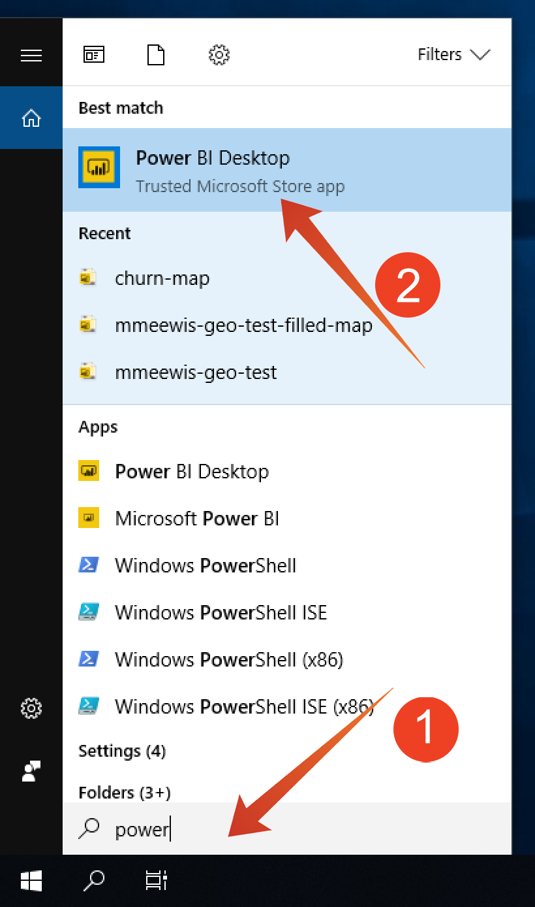

# 5.1.6 Query-service en -Power BI

Open Microsoft Power BI Desktop.

Klik **krijgen Gegevens**.

Onderzoek naar **postgres** (1), uitgezochte **Postgres** (2) van de lijst en **verbindt** (3).

Ga naar Adobe Experience Platform, aan **Vragen** en aan **Geloofsbrieven**.

Van de **pagina van Referenties** in Adobe Experience Platform, kopieer de **Gastheer** en kleef het op het **gebied van de Server**, en kopieer het **Gegevensbestand** en kleef het in het **Gegevensbestand** gebied in PowerBI, dan klik O.K. (2).

>[!IMPORTANT]
>
>Zorg ervoor om haven **te omvatten:80** aan het eind van de waarde van de Server omdat de Dienst van de Vraag momenteel niet de standaard haven PostgreSQL van 5432 gebruikt.

In de volgende dialoog bevolkt de naam en het Wachtwoord van de Gebruiker met uw Gebruikersnaam en Wachtwoord dat in **wordt gevonden Referenties** van Vragen in Adobe Experience Platform.

In de dialoog van de Navigator, zet uw **LDAP** op het onderzoeksgebied (1) om van uw datasets CTAS de plaats te bepalen en de doos naast elk (2) te controleren. Klik vervolgens op Laden (3).

Zorg ervoor het **lusje van het 0&rbrace; Rapport** (1) wordt geselecteerd.

Selecteer de kaart (1) en vergroot de kaart (2) nadat deze aan het rapportcanvas is toegevoegd.

Daarna moeten wij de maatregelen en de afmetingen bepalen, doet u dit door gebieden van de **gebieden** sectie op de overeenkomstige placeholders (die onder **worden gevestigd visualisaties**) te slepen zoals hieronder vermeld:

Als maatregel zullen wij een telling van **customerId** gebruiken. Sleep het **midden** gebied van de **gebieden** sectie in **placeholder van de Grootte**:

Tot slot om wat **callTopic** analyse te doen, versleep het **callTopic** gebied op **de filters van het paginaniveau** placeholder (u zou in de **visualisaties** sectie kunnen moeten scrollen);

Selecteer/unselect **callTopics** om te onderzoeken:

Je hebt deze oefening nu afgerond.

Volgende Stap: [&#x200B; 5.1.8 de Dienst API van de Vraag &#x200B;](./ex8.md)

[Ga terug naar module 5.1](./query-service.md)

[Terug naar alle modules](../../../overview.md)
