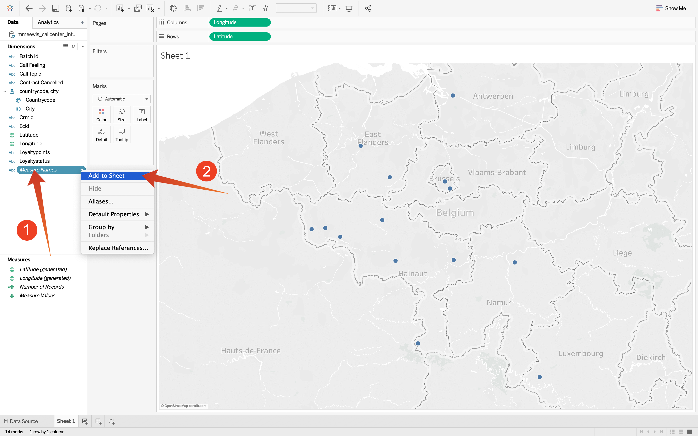

# 5.1.7 Query-service en Tableau

Open Tabel.

In **verbind met een Server** uitgezocht **PostgreSQL**:

Ga naar Adobe Experience Platform, aan **Vragen** en aan **Geloofsbrieven**.

Van de **Credentials** pagina in Adobe Experience Platform, kopieer de **Gastheer** en kleef het in het **gebied van de Server**, kopieer het **Gegevensbestand** en kleef het in het **Gegevensbestand** gebied in Tableau, kopieer de **Haven** en kleef het op het gebied **in Tableau, doe het zelfde voor** Gebruikersnaam **en** Wachtwoord **.** Daarna, klik **Teken binnen**.

Aanmelden:

Klik onderzoek (1) en ga uw **ldap** in het onderzoeksgebied in, identificeer u lijst van de resultaatreeks en sleep (3) het op de plaats genoemd **hier van de Belemmering lijsten**. Wanneer gebeëindigd, klik op **Blad 1** (3).

Om onze gegevens op de kaart zichtbaar te maken, moeten we lengte en breedte in dimensies omzetten. In **Maatregelen** selecteer **Breedte** (1) en open dropdown van het gebied en selecteer **Bekeerling in Dimension** (2). Doe het zelfde voor de **maatregel van de Lengte 0} {.**

Sleep de **maatregel van de Lengte** {aan de **Kolommen** en de **5} maatregel van de Breedte {aan** Rijen **.** Automatisch zal de kaart van **België** met weinig punten verschijnen die de steden in uit gegevensreeks vertegenwoordigen.

Selecteer **Namen van de Maatregel** (1), open dropdown en selecteer **toevoegen aan Blad** (2):

Nu heb je een kaart met puntjes van verschillende grootten. De grootte wijst op het aantal interactie van het vraagcentrum voor die specifieke stad. Om de grootte van de punten te variëren, navigeer aan het juiste paneel en open **Waarden van de Maatregel** (gebruikend het drop-down pictogram). Van de drop-down lijst uitgezocht **geeft Grootte** uit. Speel rond met verschillende grootten.

Om de gegevens per **Onderwerp van de Vraag** verder te tonen, sleep (1) de **3} dimensie van het Onderwerp van de Vraag {op** Pagina&#39;s **.** Navigeer door de verschillende **onderwerpen van de Vraag** gebruikend het **Onderwerp van de Vraag** (2) op de rechterkant van het scherm:

Je hebt deze oefening nu afgerond.

Volgende Stap: [ 5.1.8 de Dienst API van de Vraag ](./ex8.md)

[Ga terug naar module 5.1](./query-service.md)

[Terug naar alle modules](../../../overview.md)
