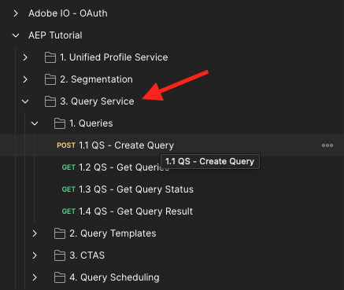
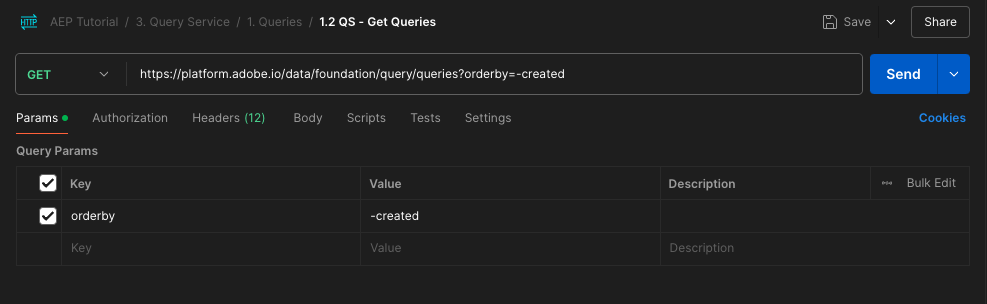

# 5.1.7 API voor Query Service

## Doelstelling

- Gebruik de API van de Dienst van de Vraag om vraagmalplaatjes en vraagprogramma&#39;s te beheren

## Context

In deze oefening zult u API vraag uitvoeren om vraagmalplaatjes en vraagprogramma&#39;s te beheren gebruikend een inzameling van Postman. U zult vraagmalplaatjes bepalen, regelmatige vragen en vragen CTAS uitvoeren. A **CTAS** vraag (creeer lijst als uitgezochte vraag) slaat zijn resultaatreeks in een expliciete dataset op. Terwijl de regelmatige vragen in een impliciete (of systeem geproduceerde) dataset worden opgeslagen, die typisch in parketdossierformaat wordt uitgevoerd.

## Documentatie

- [ Hulp van de Dienst van de Vraag van Adobe Experience Platform ](https://experienceleague.adobe.com/docs/experience-platform/query/api/getting-started.html)
- [ de Dienst API van de Vraag ](https://www.adobe.io/apis/experienceplatform/home/api-reference.html#!acpdr/swagger-specs/qs-api.yaml)

## 5.1.7.1 API voor query-service

Met de API voor zoekdiensten kunt u niet-interactieve query&#39;s beheren op het Adobe Experience Platform-datumpeer.

Niet-interactief betekent dat een verzoek om een query uit te voeren niet resulteert in een directe reactie. De vraag zal worden verwerkt en zijn resultaatreeks zal in een impliciete of expliciete (CTAS: creeer lijst zoals uitgezochte) dataset worden opgeslagen.

## 5.1.7.2 Voorbeeldquery

Als steekproefvraag zult u de eerste vraag gebruiken die in [ wordt vermeld 4.3 - Vragen, vragen, vragen... en koordanalyse ](./ex3.md):

Hoeveel productweergaven hebben we dagelijks?

**SQL**

```sql
select date_format( timestamp , 'yyyy-MM-dd') AS Day,
       count(*) AS productViews
from   demo_system_event_dataset_for_website_global_v1_1
where  --aepTenantId--.demoEnvironment.brandName IN ('Luma Telco', 'Citi Signal')
and eventType = 'commerce.productViews'
group by Day
limit 10;
```

## 5.1.7.3 Vragen

Open Postman op uw computer. Als deel van Module 3, creeerde u een milieu van Postman en importeerde een inzameling van Postman. Volg de instructies in [ Uitoefening 2.1.3 ](./../../../modules/rtcdp-b2c/module2.1/ex3.md) voor het geval u dat nog niet hebt gedaan.

Als deel van de inzameling van Postman u invoerde, zult u een omslag **zien. De Dienst van de vraag**. Als u deze omslag niet ziet, gelieve de [ inzameling van Postman ](./../../../assets/postman/postman_profile.zip) opnieuw te downloaden en die inzameling in Postman opnieuw in te voeren zoals die in [ oefening 2.1.3 ](./../../../modules/rtcdp-b2c/module2.1/ex3.md) wordt geïnstrueerd.



>[!NOTE]
>
>Op dit ogenblik, slechts de omslag **1. De vragen** bevatten verzoeken. Andere verzoeken worden in een laagstadium toegevoegd.

Open die map en ken de API-aanroepen van Query Service om de query-resultset uit te voeren, te controleren en te downloaden.

Een vraag van de POST aan [/query/query ] met de volgende nuttige lading zal de uitvoering van onze vraag teweegbrengen;

### 5.1.7.3.1 Query maken

Klik op het verzoek genoemd **1.1 QS - creeer Vraag** en ga naar **Kopballen**. U zult dan dit zien:


Laten we ons richten op dit headerveld:

| Sleutel | Waarde |
| ----------- | ----------- |
| x-sandbox-name | `--module7sandbox--` |

>[!NOTE]
>
>U moet de naam opgeven van de Adobe Experience Platform-sandbox die u gebruikt. Het kopbalgebied **x-zandbak-naam** zou moeten zijn `--module7sandbox--`.

Ga de **sectie van het Lichaam** van dit verzoek. In het **Lichaam** van dit verzoek, zult u het volgende zien:


```sql
{
    "name" : "ldap - QS API demo - Citi Signal - Product Views Per Day",
	"description": "ldap - QS API demo - Citi Signal - Product Views Per Day",
	"dbName": "module7:all",
	"sql": "select date_format( timestamp , 'yyyy-MM-dd') AS Day, count(*) AS productViews from demo_system_event_dataset_for_website_global_v1_1 where _experienceplatform.demoEnvironment.brandName IN ('Luma Telco', 'Citi Signal') and eventType = 'commerce.productViews' group by Day limit 10"
}
```

Aandacht: te werk gelieve veranderlijke **naam** in het hieronder verzoek bij door **ldap** met uw specifieke **ldap** te vervangen.

Na het toevoegen van uw specifieke **ldap**, zou het Lichaam aan dit gelijkaardig moeten kijken:

```json
{
    "name" : "vangeluw - QS API demo - Citi Signal - Product Views Per Day",
	"description": "vangeluw - QS API demo - Citi Signal - Product Views Per Day",
	"dbName": "module7:all",
	"sql": "select date_format( timestamp , 'yyyy-MM-dd') AS Day, count(*) AS productViews from demo_system_event_dataset_for_website_global_v1_1 where _experienceplatform.demoEnvironment.brandName IN ('Luma Telco', 'Citi Signal') and eventType = 'commerce.productViews' group by Day limit 10"
}
```

>[!NOTE]
>
>De sleutel **dbName** in het bovengenoemde lichaam JSON verwijst naar de zandbak die in uw instantie van Adobe Experience Platform wordt gebruikt. Als u de PROD zandbak gebruikt, zou dbName **prod moeten zijn:al**, als u een andere zandbak zoals bijvoorbeeld **module7** gebruikt, zou dbName aan **module7 moeten gelijk zijn:allen**.

Daarna, klik het blauwe **verzenden** knoop om het segment tot stand te brengen en de resultaten van dat te bekijken.


Wanneer de POST is geslaagd, retourneert de aanvraag het volgende antwoord:

```json
{
    "isInsertInto": false,
    "request": {
        "dbName": "module7:all",
        "sql": "select date_format( timestamp , 'yyyy-MM-dd') AS Day, count(*) AS productViews from demo_system_event_dataset_for_website_global_v1_1 where _experienceplatform.demoEnvironment.brandName IN ('Luma Telco', 'Citi Signal') and eventType = 'commerce.productViews' group by Day limit 10",
        "name": "vangeluw - QS API demo - Citi Signal - Product Views Per Day",
        "description": "vangeluw - QS API demo - Citi Signal - Product Views Per Day"
    },
    "clientId": "5a143b5ae4aa4631a1f3b09cd051333f",
    "state": "SUBMITTED",
    "rowCount": 0,
    "errors": [],
    "isCTAS": false,
    "version": 1,
    "id": "8f0d7f25-f7aa-493b-9792-290f884a7e5b",
    "elapsedTime": 0,
    "updated": "2021-01-20T13:23:13.951Z",
    "client": "API",
    "userId": "A3392DB95FFF08EE0A495E87@techacct.adobe.com",
    "created": "2021-01-20T13:23:13.951Z",
    "_links": {
        "self": {
            "href": "https://platform-va7.adobe.io/data/foundation/query/queries/8f0d7f25-f7aa-493b-9792-290f884a7e5b",
            "method": "GET"
        },
        "soft_delete": {
            "href": "https://platform-va7.adobe.io/data/foundation/query/queries/8f0d7f25-f7aa-493b-9792-290f884a7e5b",
            "method": "PATCH",
            "body": "{ \"op\": \"soft_delete\"}"
        },
        "cancel": {
            "href": "https://platform-va7.adobe.io/data/foundation/query/queries/8f0d7f25-f7aa-493b-9792-290f884a7e5b",
            "method": "PATCH",
            "body": "{ \"op\": \"cancel\"}"
        }
    }
}
```

De huidige **staat** van de vraag wordt **VERZONDEN**, zodra uitgevoerd zal zijn staat **SUCCESS** worden.

U kunt voorgelegde vragen via Adobe Experience Platform UI ook zoeken, [ Adobe Experience Platform ](https://experience.adobe.com/#/@experienceplatform/platform/home) openen, aan **Vragen** navigeren, aan **Logboek** en uw vraag selecteren:


### 5.1.7.3.2 Vraag ophalen

Klik op het verzoek genoemd **1.2 QS - krijg Vragen** en ga naar **Kopballen**. U zult dan dit zien:


Laten we ons richten op dit headerveld:

| Sleutel | Waarde |
| ----------- | ----------- |
| x-sandbox-name | `--module7sandbox--` |

>[!NOTE]
>
>U moet de naam opgeven van de Adobe Experience Platform-sandbox die u gebruikt. Het kopbalgebied **x-zandbak-naam** zou moeten zijn `--module7sandbox--`.

Ga naar **Params**. U zult dan dit zien:



De **orde** parameter staat u toe om een soortorde te specificeren die op het **wordt gebaseerd gecreeerd** bezit. Merk **&quot;-** teken vóór gecreeerd, zo betekent het dat de orde waarin de lijst van vragen is teruggekeerd hun gecreeerde datum in **dalende** orde zal gebruiken. De query moet boven aan de lijst staan.

Daarna, klik het blauwe **verzenden** knoop om het segment tot stand te brengen en de resultaten van dat te bekijken.


Wanneer de aanvraag succesvol is, wordt een vergelijkbare reactie als hieronder gegeven. De **staat** van de reactie kan ****, **IN_PROGRESS** of **SUCCESS** worden VERZONDEN. Het kan verscheidene notulen nemen alvorens de vraag a **SUCCESS** staat heeft. U kunt het verzenden van dit verzoek verscheidene tijden herhalen, tot u de **SUCCESS** staat ziet.

```json
{
    "queries": [
        {
            "isInsertInto": false,
            "request": {
                "dbName": "module7:all",
                "sql": "select date_format( timestamp , 'yyyy-MM-dd') AS Day, count(*) AS productViews from demo_system_event_dataset_for_website_global_v1_1 where _experienceplatform.demoEnvironment.brandName IN ('Luma Telco', 'Citi Signal') and eventType = 'commerce.productViews' group by Day limit 10",
                "name": "vangeluw - QS API demo - Citi Signal - Product Views Per Day",
                "description": "vangeluw - QS API demo - Citi Signal - Product Views Per Day"
            },
            "clientId": "5a143b5ae4aa4631a1f3b09cd051333f",
            "state": "SUCCESS",
            "rowCount": 1,
            "errors": [],
            "isCTAS": false,
            "version": 1,
            "id": "8f0d7f25-f7aa-493b-9792-290f884a7e5b",
            "elapsedTime": 217481,
            "updated": "2021-01-20T13:26:51.432Z",
            "client": "API",
            "userId": "A3392DB95FFF08EE0A495E87@techacct.adobe.com",
            "created": "2021-01-20T13:23:13.951Z",
            "_links": {
                "self": {
                    "href": "https://platform-va7.adobe.io/data/foundation/query/queries/8f0d7f25-f7aa-493b-9792-290f884a7e5b",
                    "method": "GET"
                },
                "soft_delete": {
                    "href": "https://platform-va7.adobe.io/data/foundation/query/queries/8f0d7f25-f7aa-493b-9792-290f884a7e5b",
                    "method": "PATCH",
                    "body": "{ \"op\": \"soft_delete\"}"
                },
                "referenced_datasets": [
                    {
                        "id": "60080ace62c49a19490c5870",
                        "href": "https://platform-va7.adobe.io/data/foundation/catalog/dataSets/60080ace62c49a19490c5870"
                    }
                ]
            }
        }
     ]
    },
    "version": 1
}
```

Wanneer de staat **SUCCESS** is, gelieve met het volgende verzoek verder te gaan.

### 5.1.7.3.3 Vraag de Status van de Vraag

Klik op het verzoek genoemd **1.3 QS - krijg de Status van de Vraag** en ga naar **Kopballen**. U zult dan dit zien:


Laten we ons richten op dit headerveld:

| Sleutel | Waarde |
| ----------- | ----------- |
| x-sandbox-name | `--module7sandbox--` |

>[!NOTE]
>
>U moet de naam opgeven van de Adobe Experience Platform-sandbox die u gebruikt. Het kopbalgebied **x-zandbak-naam** zou moeten zijn `--module7sandbox--`.

Daarna, klik het blauwe **verzenden** knoop om het segment tot stand te brengen en de resultaten van dat te bekijken.


Wanneer de aanvraag succesvol is, wordt een vergelijkbare reactie als hieronder gegeven.

```json
{
    "isInsertInto": false,
    "request": {
        "dbName": "module7:all",
        "sql": "select date_format( timestamp , 'yyyy-MM-dd') AS Day, count(*) AS productViews from demo_system_event_dataset_for_website_global_v1_1 where _experienceplatform.demoEnvironment.brandName IN ('Luma Telco', 'Citi Signal') and eventType = 'commerce.productViews' group by Day limit 10",
        "name": "vangeluw - QS API demo - Citi Signal - Product Views Per Day",
        "description": "vangeluw - QS API demo - Citi Signal - Product Views Per Day"
    },
    "clientId": "5a143b5ae4aa4631a1f3b09cd051333f",
    "state": "SUCCESS",
    "rowCount": 1,
    "errors": [],
    "isCTAS": false,
    "version": 1,
    "id": "8f0d7f25-f7aa-493b-9792-290f884a7e5b",
    "elapsedTime": 217481,
    "updated": "2021-01-20T13:26:51.432Z",
    "client": "API",
    "userId": "A3392DB95FFF08EE0A495E87@techacct.adobe.com",
    "created": "2021-01-20T13:23:13.951Z",
    "_links": {
        "self": {
            "href": "https://platform-va7.adobe.io/data/foundation/query/queries/8f0d7f25-f7aa-493b-9792-290f884a7e5b",
            "method": "GET"
        },
        "soft_delete": {
            "href": "https://platform-va7.adobe.io/data/foundation/query/queries/8f0d7f25-f7aa-493b-9792-290f884a7e5b",
            "method": "PATCH",
            "body": "{ \"op\": \"soft_delete\"}"
        },
        "referenced_datasets": [
            {
                "id": "60080ace62c49a19490c5870",
                "href": "https://platform-va7.adobe.io/data/foundation/catalog/dataSets/60080ace62c49a19490c5870"
            }
        ]
    }
}
```

Wanneer een vraag de staat van **SUCCESS** bereikt, zal de reactie ook op het aantal rijen wijzen die door de vraag via het **worden teruggewonnen rowCount** bezit. In ons voorbeeld worden 10 rijen geretourneerd door de query. Laten we in de volgende sectie zien hoe we de 10 rijen kunnen ophalen.

### 5.1.7.3.4 Zoekresultaat ophalen

De **SUCCESS** reactie hierboven omvat a **referenced_datasets** bezit, dat aan de impliciete dataset richt die het vraagresultaat opslaat. Om toegang tot het resultaat te krijgen, gebruiken wij zijn **href** of **identiteitskaart** bezit.

Klik op het verzoek genoemd **1.4 QS - krijg het Resultaat van de Vraag** en ga naar **Kopballen**. U zult dan dit zien:


Laten we ons richten op dit headerveld:

| Sleutel | Waarde |
| ----------- | ----------- |
| x-sandbox-name | `--module7sandbox--` |

>[!NOTE]
>
>U moet de naam opgeven van de Adobe Experience Platform-sandbox die u gebruikt. Het kopbalgebied **x-zandbak-naam** zou moeten zijn `--module7sandbox--`.

Daarna, klik het blauwe **verzenden** knoop om het segment tot stand te brengen en de resultaten van dat te bekijken.


Het antwoord op dit verzoek zal naar de datasetdossiers richten:

```json
{
    "60080ace62c49a19490c5870": {
        "name": "Demo System - Event Dataset for Website (Global v1.1)",
        "description": "Demo System - Event Dataset for Website (Global v1.1)",
        "enableErrorDiagnostics": false,
        "tags": {
            "adobe/siphon/partition/definition": [
                "day(timestamp, _ACP_DATE)",
                "identity(_ACP_BATCHID)"
            ],
            "aep/siphon/partitions": [
                "_ACP_DATE",
                "_ACP_BATCHID"
            ],
            "acp_granular_plugin_validation_flags": [
                "identity:enabled",
                "profile:enabled"
            ],
            "adobe/siphon/buffered-promotion-recency": [
                "live"
            ],
            "adobe/siphon/use-buffered-promotion": [
                "true"
            ],
            "adobe/pqs/table": [
                "demo_system_event_dataset_for_website_global_v1_1"
            ],
            "aep/siphon/expire-snapshot-timestamp": [
                "1611141272703"
            ],
            "acp_granular_validation_flags": [
                "requiredFieldCheck:enabled"
            ],
            "acp_validationContext": [
                "enabled"
            ],
            "adobe/siphon/table/format": [
                "iceberg"
            ],
            "unifiedProfile": [
                "enabled:true",
                "enabledAt:2021-01-20 10:49:51"
            ],
            "unifiedIdentity": [
                "enabled:true"
            ]
        },
        "namespace": "ACP",
        "state": "DRAFT",
        "imsOrg": "907075E95BF479EC0A495C73@AdobeOrg",
        "sandboxId": "62cd9f38-8529-4b05-8d9f-388529db0540",
        "lastBatchId": "01EWFQZ15XRNNB1FPKPW5ETRVP",
        "lastBatchStatus": "success",
        "lastSuccessfulBatch": "01EWFQZ15XRNNB1FPKPW5ETRVP",
        "version": "1.0.6",
        "created": 1611139790698,
        "updated": 1611149266031,
        "createdClient": "750e24ee855b4ac18ccc4f4817f96ee1",
        "createdUser": "3A260B485E909A170A495E76@techacct.adobe.com",
        "updatedUser": "acp_foundation_dataTracker@AdobeID",
        "viewId": "60080ace62c49a19490c5871",
        "fileDescription": {
            "persisted": true,
            "containerFormat": "parquet",
            "format": "parquet"
        },
        "files": "@/dataSets/60080ace62c49a19490c5870/views/60080ace62c49a19490c5871/files",
        "schemaMetadata": {
            "delta": [],
            "gdpr": []
        },
        "schemaRef": {
            "id": "https://ns.adobe.com/experienceplatform/schemas/d9b88a044ad96154637965a97ed63c7b20bdf2ab3b4f642e",
            "contentType": "application/vnd.adobe.xed-full+json;version=1"
        }
    }
}
```

>[!NOTE]
>
>Binnenkort worden meer oefeningen toegevoegd om u te helpen met de API voor zoekdiensten te communiceren.

Volgende Stap: [ Samenvatting en voordelen ](./summary.md)

[Ga terug naar module 5.1](./query-service.md)

[Terug naar alle modules](../../../overview.md)
