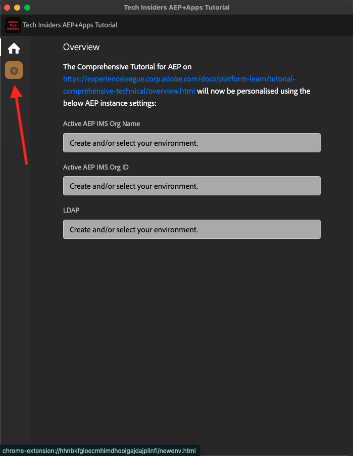

# 0.1 De Chrome-extensie installeren voor de documentatie bij het Experience League

## 0.1.1 Waarom hebben we een Chrome-extensie gemaakt?

De documentatie is generiek gemaakt zodat het gemakkelijk door iedereen kan worden hergebruikt, gebruikend om het even welke instantie van Adobe Experience Platform.
Door de documentatie herbruikbaar te maken, **Variabelen van het Milieu** werden geïntroduceerd in de documentatie, zo betekent het dat u de hieronder **sleutels** in de documentatie zult vinden. Elke sleutel is een specifieke variabele voor een specifiek milieu, en de uitbreiding van Chrome zal die variabele voor u veranderen en als dusdanig het voor u gemakkelijk maken om code en tekst van de leerzame pagina&#39;s te kopiëren en het te kleven in de diverse Gebruikersinterfaces die u als deel van het leerprogramma zult gebruiken.

Hieronder vindt u een voorbeeld van dergelijke waarden. Deze waarden kunnen momenteel nog niet worden gebruikt, maar zodra u de Chrome-extensie installeert en activeert, worden deze variabelen gewijzigd in &#39;normale&#39; tekst die u kunt kopiëren en opnieuw kunt gebruiken.

| Naam | Sleutel |
|:-------------:| :---------------:|
| AEP IMS Org ID | `--aepImsOrgId--` |
| AEP-huurnummer | `--aepTenantId--` |
| Naam AEP-sandbox | `--aepSandboxName--` |
| Leerlingprofiel LDAP | `--aepUserLdap--` |

In de onderstaande schermafbeelding ziet u bijvoorbeeld een verwijzing naar `--aepTenantId--` .

Nadat de extensie is geïnstalleerd, wordt dezelfde tekst automatisch gewijzigd om de instantiespecifieke waarden weer te geven.

Met deze uitbreiding kunt u ook:

- Aanmelden voor zelfstudie

## 0.1.2 De Chrome-extensie installeren

Om die uitbreiding van Chrome te installeren, open uw browser van Chrome en ga naar: [ https://chrome.google.com/webstore/detail/platform-learn-configurat/hhnbkfgioecmhimdhooigajdajplinfi/related?hl=en&amp;authuser=0 ](https://chrome.google.com/webstore/detail/platform-learn-configurat/hhnbkfgioecmhimdhooigajdajplinfi/related?hl=en&amp;authuser=0). Dan zie je dit.

Klik **toevoegen aan Chrome**.

Dan zie je dit. Klik **toevoegen uitbreiding**.

De extensie wordt dan geïnstalleerd en u ziet een vergelijkbare melding.

In het **menu van uitbreidingen**, klik het **puzzelstuk** pictogram en speld het **Platform Leren - de uitbreiding van de Configuratie** aan het uitbreidingsmenu.

## 0.1.2 De Chrome-extensie configureren

Ga naar [ https://experienceleague.adobe.com/docs/platform-learn/comprehensive-technical-tutorial-v22/overview.html?lang=en ](https://experienceleague.adobe.com/docs/platform-learn/comprehensive-technical-tutorial-v22/overview.html?lang=en) en klik dan het uitbreidingspictogram om het te openen.

Dan zie je deze popup. Klik op het pictogram **+** .

Voer uw naam en configuratie-id in die voor uw Adobe Experience Platform-omgeving zijn gemaakt. Klik **creëren Nieuw**.

>[!IMPORTANT]
>
>Als u een medewerker van de Adobe bent: u kunt configuratiedentiteitskaart vinden om op de interne repo van Github (https://git.corp.adobe.com/vangeluw/platformenablement) te gebruiken.
>
>Als u een Partner van de Oplossing van de Adobe bent, gelieve uw contact of e-mail van de Partner van de Oplossing **spphelp@adobe.com** te contacteren.

In het linkermenu van de extensie ziet u nu een pictogram met uw initialen. Klik erop. U zult dan de afbeelding tussen de **Variabelen van het Milieu** en uw specifieke de instantieswaarden van Adobe Experience Platform zien. Klik **activeren Configuratie**.

Nadat u de configuratie hebt geactiveerd, ziet u een groene stip naast uw initialen. Dit betekent dat uw identiteitskaart van de Configuratie nu actief is. Er wordt ook een aantal aanvullende menuopties weergegeven.

U hebt nu twee opties:

- Als u een bestaande gebruiker van enablement met een bestaande opstelling bent, ga naar **0.1.3 Bestaande gebruiker - Login**
- Als u een volledig nieuwe gebruiker bent die dit leerprogramma voor het eerst begint, ga **0.1.4 Signup** en overslaan **0.1.3 Bestaande gebruiker - Login**

## 0.1.3 Bestaande gebruiker - Aanmelden

>[!IMPORTANT]
>
>De oefening **0.1.3 Bestaande gebruiker - Login** zal slechts werken als u een bestaande gebruiker bent die eerder voor dit leerprogramma heeft ondertekend.

Als u een bestaande gebruiker bent die deze Chrome-extensie voor het eerst instelt, klikt u op het paarse pictogram in het linkermenu. Dan zie je dit.

Vul de waarden naar wens in.

>[!IMPORTANT]
>
>**LDAP** is het belangrijkste gebied: u zou zelfde LDAP moeten gebruiken die u toen u eerst omhoog voor het leerprogramma ondertekende. Zo wordt de voortgang geladen. Kijk naar je e-mailadres als je niet zeker weet wat je LDAP is. Gebruik de tekst vóór het @-symbool in uw e-mailadres als LDAP. Als uw e-mailadres **techinsiders@adobe.com** is, zou LDAP u hier binnengaan **vangeluw** moeten zijn.

Klik **OK**.

Na 30sec-1 minuut, zal uw scherm veranderen en u zult terug naar **Huis** worden teruggedraaid, waar u dit zult zien:

Uw Chrome-extensie is nu geconfigureerd en u kunt nu controleren of alles goed werkt.

## 0.1.4 Nieuwe gebruiker - Aanmelden

>[!IMPORTANT]
>
>Oefening **0.1.4 Nieuwe gebruiker - de Registratie** is voorgenomen voor nieuwe gebruikers die dit leerprogramma voor het eerst beginnen.

Als u een nieuwe gebruiker bent die zich de eerste keer aanmeldt voor deze zelfstudie, klikt u op het gele pictogram in het menu. Dan zie je dit.

Vul de velden naar wens in. Klik **sparen**.

>[!IMPORTANT]
>
>**LDAP** is het belangrijkste gebied. Kijk naar je e-mailadres als je niet zeker weet wat je LDAP is. Gebruik de tekst vóór het @-symbool in uw e-mailadres als LDAP. Als uw e-mailadres **techinsiders@adobe.com** is, zou LDAP u hier binnengaan **vangeluw** moeten zijn.

Na 30sec-1 minuut, zal uw scherm veranderen en u zult terug naar **Huis** worden teruggedraaid, waar u dit zult zien:

Uw Chrome-extensie is nu geconfigureerd en u kunt nu controleren of alles goed werkt.

## 0.1.5 De inhoud van de zelfstudie controleren

Als test, ga [ deze pagina ](https://experienceleague.adobe.com/docs/platform-learn/comprehensive-technical-tutorial-v22/module4/ex3.html?lang=en).

U zou nu moeten zien dat alle **Variabelen van het Milieu** door hun ware waarden zijn vervangen, die op identiteitskaart van de Configuratie in de chroomuitbreiding worden gebaseerd.

U zou nu een gelijkaardige mening aan hieronder moeten hebben, waar de milieuvariabelen `--aepTenantId--` door uw echte huurdersidentiteitskaart zijn vervangen, die in dit geval **_ervaringsplatform** is.

Volgende Stap: [ 0.2 het Systeem van de Demo van het Gebruik naast opstelling uw de cliëntbezit van de Inzameling van Gegevens van Adobe Experience Platform ](./ex2.md)

[Ga terug naar module 0](./getting-started.md)

[Terug naar alle modules](./../../../overview.md)
