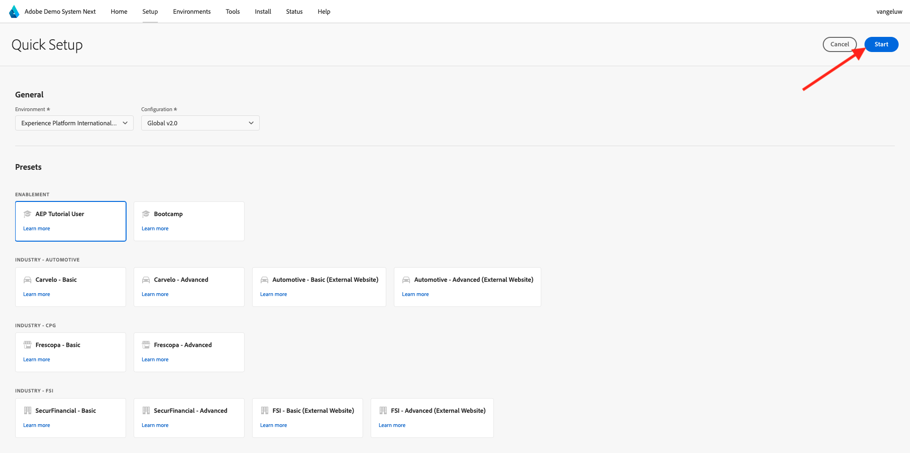

# Demosysteem gebruiken naast het instellen van de client-eigenschap voor Adobe Experience Platform-gegevensverzameling

Om de lessen in dit leerprogramma te visualiseren en het voor u mogelijk te maken om uw configuratie in een veilige milieu te testen, gebruikt dit leerprogramma de hulpmiddelen van het Systeem van de Demo van de Adobe Volgende. Om het grootste deel van dit leerprogramma te krijgen, moet uw instantie van Adobe Experience Platform worden gevormd om met het Systeem van de Demo daarna te worden geïntegreerd.

Zodra u toegang tot het Systeem van de Demo daarna hebt, ga met de onderstaande stappen te werk.

Ga naar [&#x200B; https://dsn.adobe.com/ &#x200B;](https://dsn.adobe.com/) en navigeer aan **Opstelling**.

In **Milieu** dropdown, selecteer uw instantie van Adobe Experience Platform en zandbak.

Daarna, selecteer de vooraf ingestelde **Gebruiker van het Leerprogramma AEP**.

Daarna, klik **Begin**.

In popup, ga een naam voor uw eigenschappen van de Inzameling van Gegevens en de projecten van de Bouwer van de Ervaring in. Gelieve te gebruiken deze noemende overeenkomst: **Systeem van de Demo (DD/MM/JJJJ)**. FYI: de LDAP wordt automatisch toegevoegd, u hoeft deze niet zelf toe te voegen.

Klik **Begin**.

Deze pop-up toont u de voortgang tijdens het maken van uw website en mobiele app-projecten en de eigenschappen van uw gegevensverzameling.

Zodra het snelle opstellingsproces heeft voltooid, zult u hebben:

- 1 webproject dat het mogelijk maakt een demo-website te gebruiken met een merk telco demo
- 1 mobiel app-project, dat het mogelijk maakt een mobiele demo-app met een merk telco demo te gebruiken
- 1 CX App-project, waardoor het mogelijk wordt een callcenter-app te gebruiken met een telco-demo-merk
- 1 eigenschap Gegevensverzameling voor web, dat u gaat gebruiken om gegevens van de website te verzamelen
- 1 eigenschap voor gegevensverzameling voor mobiele apparaten, die u gebruikt om gegevens te verzamelen van de mobiele app

Zorg dat dit scherm open blijft, zoals u het in de volgende stappen nodig hebt.

Volgende Stap: [&#x200B; creeer uw DataStream &#x200B;](./ex3.md)

[Terug naar Aan de slag](./getting-started.md)

[Terug naar alle modules](./../../../overview.md)
