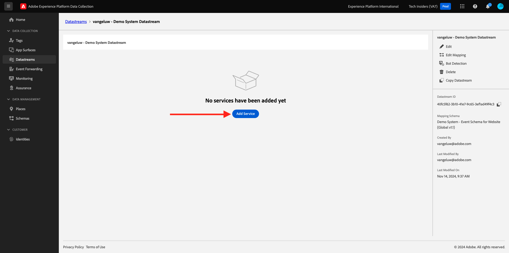
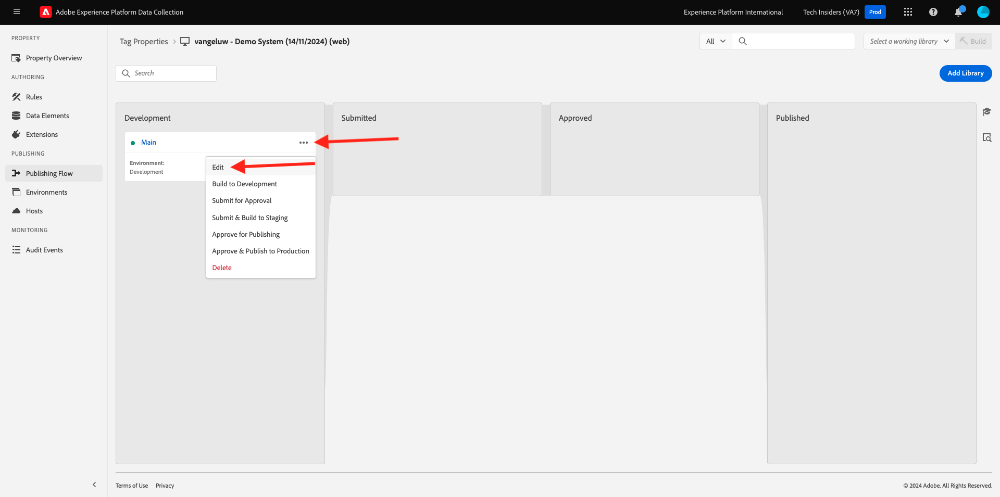
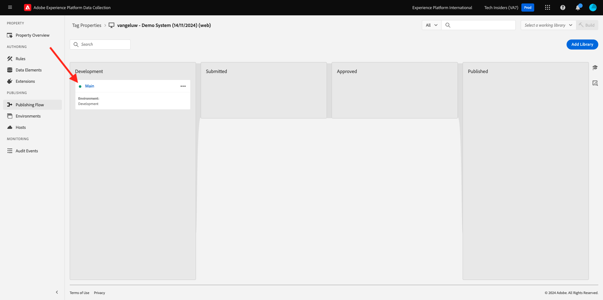
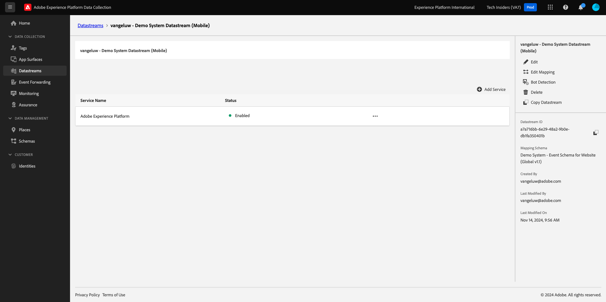

# Uw gegevensstroom maken

Ga naar [ https://experience.adobe.com/#/data-collection/ ](https://experience.adobe.com/#/data-collection/).

Klik in het linkermenu op **[!UICONTROL Tags]** . Na de vorige oefening, hebt u nu twee eigenschappen van de Inzameling van Gegevens: voor Web en voor mobiel.

Deze eigenschappen zijn bijna klaar om te worden gebruikt, maar alvorens u gegevens kunt beginnen te verzamelen gebruikend deze eigenschappen moet u opstelling een gegevensstroom. U zult meer informatie rond het concept krijgen wat een gegevensstroom is en wat het in een recentere oefening in de module van de Inzameling van Gegevens betekent.

Voer voorlopig deze stappen uit.

## Maak uw gegevensstroom voor het web

Klik op **[!UICONTROL Datastreams]**.

Selecteer in de rechterbovenhoek van het scherm de naam van de sandbox, die `--aepSandboxName--` moet zijn.

Klik op **[!UICONTROL New Datastream]**.

Voer `--aepUserLdap-- - Demo System Datastream` in voor de **[!UICONTROL Name]** en voor de optionele beschrijving. Voor **het Schema van de Toewijzing**, uitgezochte **Systeem van de Demo - het Schema van de Gebeurtenis voor Website (Globale v1.1)**. Klik **sparen**.

Dan zie je dit. Klik **toevoegen de Dienst**.

Selecteer de service **[!UICONTROL Adobe Experience Platform]** , waarmee extra velden worden weergegeven. Dan zie je dit.

Voor de Dataset van de Gebeurtenis, uitgezochte **Systeem van de Demo - de Dataset van de Gebeurtenis voor Website (Globale v1.1)** en voor de Dataset van de Dataset van het Profiel, uitgezochte **demosysteem - de Dataset van het Profiel voor Website (Globale v1.1)**. Klik **sparen**.

Dit zie je nu.

Dat is het voor nu. In [ Module 1.1 ](./../../../modules/datacollection/module1.1/data-ingestion-launch-web-sdk.md) zult u meer over Web SDK leren en hoe te om elk van zijn mogelijkheden te vormen.

Klik in het linkermenu op **[!UICONTROL Tags]** .

Filter de onderzoeksresultaten om uw twee eigenschappen van de Inzameling van Gegevens te zien. Open het bezit voor **Web** door het te klikken.

Dan zie je dit. Klik **Uitbreidingen**.

Eerst, klik de uitbreiding van SDK van het Web van Adobe Experience Platform en klik dan **vormen**.

Dan zie je dit. Heb een blik bij het **menu van Gegevensstromen** en zorg ervoor de juiste zandbak wordt geselecteerd, die in u geval `--aepSandboxName--` zou moeten zijn.

Open **Datastreams** dropdown, en selecteer de Datasstream u vroeger creeerde.

Zorg ervoor om uw **Datastream** in alle drie verschillende milieu&#39;s te hebben geselecteerd. Dan, klik **sparen**.

Ga naar **het Publiceren Stroom**.

Klik **...** voor **Hoofd**, dan klik **uitgeven**.

Klik **toevoegen Alle Gewijzigde Middelen** en klik dan **sparen &amp; bouwt voor Ontwikkeling**.

Uw veranderingen worden nu gepubliceerd en zullen in een paar notulen klaar zijn, waarna zult u de groene punt naast **Hoofd** zien.

## Maak uw gegevensstroom voor mobiele apparaten

Ga naar [ https://experience.adobe.com/#/data-collection/ ](https://experience.adobe.com/#/data-collection/).

Klik op **[!UICONTROL Datastreams]**.

Selecteer in de rechterbovenhoek van het scherm de naam van de sandbox, die `--aepSandboxName--` moet zijn.

Klik op **[!UICONTROL New Datastream]**.

Voer `--aepUserLdap-- - Demo System Datastream (Mobile)` in voor de **[!UICONTROL Friendly Name]** en voor de optionele beschrijving. Voor **het Schema van de Toewijzing**, uitgezochte **Systeem van de Demo - het Schema van de Gebeurtenis voor Mobiele Toepassing (Globale v1.1)**. Klik **sparen**.

Klik op **[!UICONTROL Save]**.

Dan zie je dit. Klik **toevoegen de Dienst**.

Selecteer de service **[!UICONTROL Adobe Experience Platform]** , waarmee extra velden worden weergegeven. Dan zie je dit.

Voor de Dataset van de Gebeurtenis, uitgezochte **Systeem van de Demo - de Dataset van de Gebeurtenis voor Mobiele App (Globale v1.1)** en voor de Dataset van de Dataset van het Profiel, uitgezochte **Systeem van de Demo - de Dataset van het Profiel voor Mobiele App (Globale v1.1)**. Klik **sparen**.

Dan zie je dit.

Uw datastream kan nu worden gebruikt in uw Adobe Experience Platform Data Collection Client-eigenschap voor mobiele apparatuur.

Ga naar **Markeringen** en filter de onderzoeksresultaten om uw twee eigenschappen van de Inzameling van Gegevens te zien. Open het bezit voor **Mobiel** door het te klikken.

Dan zie je dit. Klik **Uitbreidingen**.

Klik de **Edge Network van Adobe Experience Platform** uitbreiding en klik dan **vormen**.

Dan zie je dit. U moet nu de juiste sandbox en datastream selecteren die u net hebt geconfigureerd. De sandbox die moet worden gebruikt, is `--aepSandboxName--` en de datastream wordt `--aepUserLdap-- - Demo System Datastream (Mobile)` genoemd.

Voor het **domein van de Edge Network**, gelieve het standaarddomein te gebruiken.

Klik **sparen** om uw veranderingen te bewaren.

Ga naar **het Publiceren Stroom**.

Klik **...** naast **Hoofd**, dan klik **uitgeven**.

Klik **toevoegen Alle Gewijzigde Middelen**, dan klik **sparen &amp; bouwt voor Ontwikkeling**.

Uw veranderingen worden nu gepubliceerd en zullen in een paar notulen klaar zijn, waarna zult u de groene punt naast **Hoofd** zien.

Volgende Stap: [ gebruik de website ](./ex4.md)

[Terug naar Aan de slag](./getting-started.md)

[Terug naar alle modules](./../../../overview.md)
