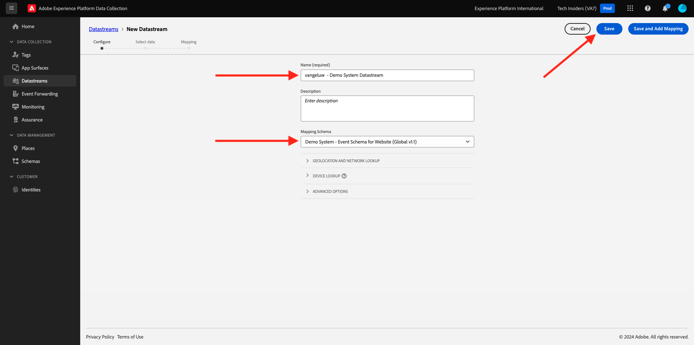
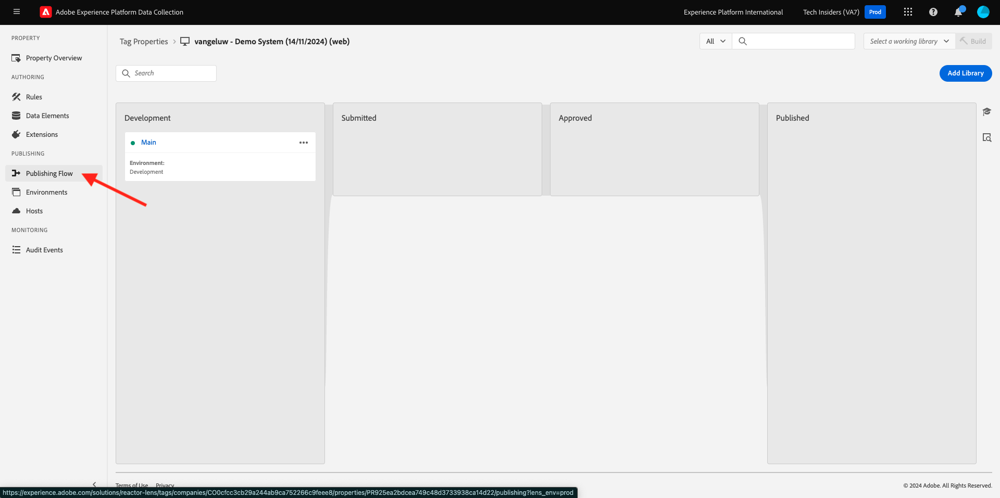
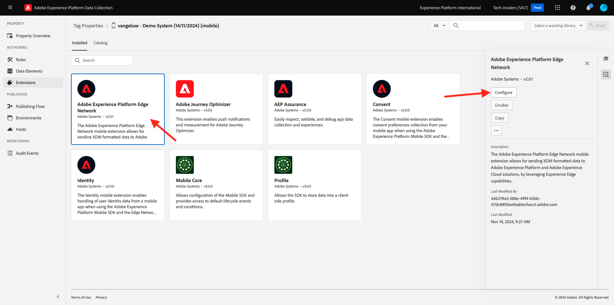

# 0.3 Maak uw gegevensstroom

Ga naar [ https://experience.adobe.com/#/data-collection/ ](https://experience.adobe.com/#/data-collection/). Na de vorige oefening, hebt u nu twee eigenschappen van de Inzameling van Gegevens: voor Web en voor mobiel.

Deze eigenschappen zijn bijna klaar om te worden gebruikt, maar alvorens u gegevens kunt beginnen te verzamelen gebruikend deze eigenschappen moet u opstelling een gegevensstroom. U zult meer informatie over het concept krijgen wat een gegevensstroom is en wat het in Uitoefening 1.2 betekent.

Voer voorlopig deze stappen uit.

## 0.3.1 Maak uw DataStream voor het Web

Klik op **[!UICONTROL Datastreams]** of **[!UICONTROL Datastreams (Beta)]** .

Selecteer in de rechterbovenhoek van het scherm de naam van de sandbox, die `--aepSandboxId--` moet zijn.

Klik op **[!UICONTROL New Datastream]**.

Voer `--demoProfileLdap-- - Demo System Datastream` in voor de **[!UICONTROL Friendly Name]** en voor de optionele beschrijving. Voor het Schema van de Gebeurtenis, uitgezochte **Systeem van de Demo - het Schema van de Gebeurtenis voor Website (Globale v1.1)**. Klik **sparen**.

Dan zie je dit. Klik **toevoegen de Dienst**.

Selecteer de service **[!UICONTROL Adobe Experience Platform]** , waarmee extra velden worden weergegeven. Dan zie je dit.

Voor de Dataset van de Gebeurtenis, uitgezochte **Systeem van de Demo - de Dataset van de Gebeurtenis voor Website (Globale v1.1)** en voor de Dataset van de Dataset van het Profiel, uitgezochte **demosysteem - de Dataset van het Profiel voor Website (Globale v1.1)**. Klik **sparen**.

Dit zie je nu.

Dat is het voor nu. In [ Module 1.1 ](./../../../modules/datacollection/module1.1/data-ingestion-launch-web-sdk.md) zult u meer over Web SDK leren en hoe te om elk van zijn mogelijkheden te vormen.

Klik in het linkermenu op **[!UICONTROL Tags]** .

Filter de onderzoeksresultaten om uw twee eigenschappen van de Inzameling van Gegevens te zien. Open het bezit voor **Web** door het te klikken.

Dan zie je dit. Klik **Uitbreidingen**.

Voor de uitbreiding van SDK van het Web van Adobe Experience Platform, vormt de klik ****.

Dan zie je dit. Voor **Datastreams**, zult u momenteel een dummywaarde zien die aan 1 wordt geplaatst. U moet nu **klikken kiest van lijst** radio-knoop. Selecteer in de vervolgkeuzelijst de DataStream die u eerder hebt gemaakt.

Zorg ervoor om uw **Datastream** te hebben geselecteerd. TIP: U kunt de resultaten in het vervolgkeuzemenu eenvoudig filteren door uw `--demoProfileLdap--` te typen.

De rol neer tot u **Inzameling van Gegevens** ziet. Gelieve te zorgen ervoor dat checkbox voor **toelaten klik gegevensinzameling** niet wordt toegelaten. Klik **sparen** om uw veranderingen te bewaren.

Ga naar **het Publiceren Stroom**.

Klik **...** voor **Hoofd**, dan klik **uitgeven**.

Klik **toevoegen Alle Gewijzigde Middelen** en klik dan **sparen &amp; bouwt voor Ontwikkeling**.

Uw wijzigingen worden nu gepubliceerd en zijn over een paar minuten klaar.

## 0.3.2 Maak uw gegevensstroom voor mobiele apparaten

Ga naar [ https://experience.adobe.com/#/data-collection/ ](https://experience.adobe.com/#/data-collection/).

Klik op **[!UICONTROL Datastreams]** of **[!UICONTROL Datastreams (Beta)]** .

Selecteer in de rechterbovenhoek van het scherm de naam van de sandbox, die `--aepSandboxId--` moet zijn.

Klik op **[!UICONTROL New Datastream]**.

Voer `--demoProfileLdap-- - Demo System Datastream (Mobile)` in voor de **[!UICONTROL Friendly Name]** en voor de optionele beschrijving. Voor het Schema van de Gebeurtenis, uitgezochte **Systeem van de Demo - het Schema van de Gebeurtenis voor Mobiele App (Globale v1.1)**. Klik **sparen**.

Klik op **[!UICONTROL Save]**.

Dan zie je dit. Klik **toevoegen de Dienst**.

Selecteer de service **[!UICONTROL Adobe Experience Platform]** , waarmee extra velden worden weergegeven. Dan zie je dit.

Voor de Dataset van de Gebeurtenis, uitgezochte **Systeem van de Demo - de Dataset van de Gebeurtenis voor Mobiele App (Globale v1.1)** en voor de Dataset van de Dataset van het Profiel, uitgezochte **Systeem van de Demo - de Dataset van het Profiel voor Mobiele App (Globale v1.1)**. Klik **sparen**.

Dan zie je dit.

Uw DataStream is nu klaar om in uw bezit van de Cliënt van de Inzameling van Gegevens van Adobe Experience Platform voor Mobiel te worden gebruikt.

Ga naar **Markeringen** en filter de onderzoeksresultaten om uw twee eigenschappen van de Inzameling van Gegevens te zien. Open het bezit voor **Mobiel** door het te klikken.

Dan zie je dit. Klik **Uitbreidingen**.

Voor de **Edge Network van Adobe Experience Platform** uitbreiding, klik **vormen**.

Dan zie je dit. U moet nu de juiste sandbox en datastream selecteren die u net hebt geconfigureerd. De sandbox die moet worden gebruikt, is `--aepSandboxId--` en de datastream wordt `--demoProfileLdap-- - Demo System Datastream (Mobile)` genoemd.

Voor het **domein van de Edge Network**, gelieve het standaarddomein te gebruiken dat **edge.adobedc.net** is.

Klik **sparen** om uw veranderingen te bewaren.

Ga naar **het Publiceren Stroom**.

Klik **...** naast **Hoofd**, dan klik **uitgeven**.

Klik **toevoegen Alle Gewijzigde Middelen**, dan klik **sparen &amp; bouwt voor Ontwikkeling**.

Uw wijzigingen worden nu gepubliceerd en zijn over een paar minuten klaar.

Volgende Stap: [ 0.4 Gebruik de website ](./ex4.md)

[Ga terug naar module 0](./getting-started.md)

[Terug naar alle modules](./../../../overview.md)