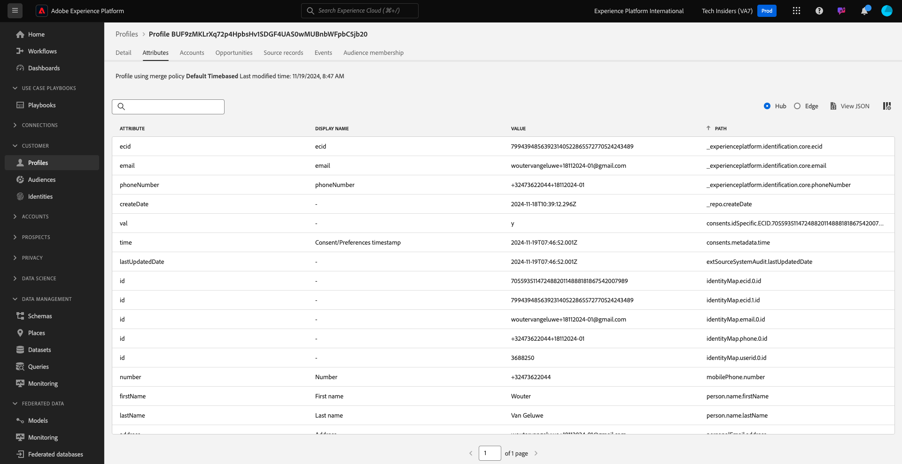

# 2.1.2 Visualiseer uw eigen Real-time profiel van de Klant - UI

In deze oefening, zult u login aan Adobe Experience Platform en uw eigen Profiel van de Klant in real time in UI bekijken.

## Context

In het profiel van de Klant in real time, worden alle profielgegevens getoond naast gebeurtenisgegevens, evenals bestaande segmentlidmaatschap. De getoonde gegevens kunnen van overal, van de toepassingen van de Adobe en externe oplossingen komen. Dit is de krachtigste weergave in Adobe Experience Platform, het echte ervaringssysteem van record.

## De weergave Klantprofiel in Adobe Experience Platform gebruiken

Ga naar [ Adobe Experience Platform ](https://experience.adobe.com/platform). Na het aanmelden landt je op de homepage van Adobe Experience Platform.

Alvorens u verdergaat, moet u a **zandbak** selecteren. De te selecteren sandbox krijgt de naam ``--aepSandboxName--`` . Nadat u de juiste [!UICONTROL sandbox] hebt geselecteerd, ziet u de schermwijziging en nu bevindt u zich in uw toegewezen [!UICONTROL sandbox] .

In het linkermenu, ga naar **Profielen** en **doorbladeren**.

In het deelvenster Profielviewer op uw website kunt u meerdere identiteiten vinden. Elke identiteit is gekoppeld aan een naamruimte.

In het deelvenster Profielviewer kunt u de volgende combinaties van id&#39;s en naamruimten zien:

| Identiteit | Naamruimte |
|:-------------:| :---------------:|
| Experience Cloud-id (ECID) | 79943948563923140522865572770524243489 |
| Experience Cloud-id (ECID) | 70559351147248820114888181867542007989 |
| E-mailid | woutervangeluwe+18112024-01@gmail.com |
| Mobiel nummer-id | +32473622044+18112024-01 |

In Adobe Experience Platform zijn alle id&#39;s even belangrijk. Eerder was de ECID de belangrijkste id in de context van de Adobe en alle andere id&#39;s waren hiërarchisch gekoppeld aan de ECID. In Adobe Experience Platform is dit niet langer het geval en kan elke id als een primaire id worden beschouwd.

De primaire id is doorgaans afhankelijk van de context. Als u uw Centrum van de Vraag vraagt, **wat belangrijkste identiteitskaart is?** zij zullen waarschijnlijk antwoorden, **het telefoonaantal!** Maar als u uw team van CRM vraagt, zullen zij, **het e-mailadres beantwoorden!** Adobe Experience Platform begrijpt deze complexiteit en beheert deze voor u. Elke toepassing, of een toepassing van de Adobe of niet-Adobe, zal met Adobe Experience Platform spreken door te verwijzen naar identiteitskaart zij primair beschouwen. Het werkt gewoon.

Voor het gebied **Identiteit namespace**, uitgezochte **E-mail** en voor de waarde van de 4} Identiteit van het gebied **gaat het e-mailadres in u gebruikte om in de vorige oefening te registreren.** Klik **Mening**. Vervolgens ziet u uw profiel in de lijst. Klik **identiteitskaart van het Profiel** om uw profiel te openen.

U ziet nu een overzicht van een paar belangrijke **Attributen van het Profiel** van uw klantenprofiel. Om alle beschikbare profielattributen voor uw profiel te zien, klik **Attributen**.

Vervolgens wordt een volledige lijst met alle kenmerken weergegeven.

Ga naar **Gebeurtenissen**, waar u ingangen voor elke ervaringsgebeurtenis kunt zien die met uw Profiel wordt verbonden.

Tot slot ga naar het lidmaatschap van het Publiek van de menuoptie ****. Hier vindt u alle in aanmerking komende doelgroepen voor deze klant. De lijst kan momenteel leeg zijn, maar dat zal in de volgende modules veranderen.

Nu u hebt geleerd hoe u het real-time profiel van een klant kunt bekijken door gebruik te maken van de Adobe Experience Platform-gebruikersinterface, doen we hetzelfde via de API&#39;s door gebruik te maken van Postman en Adobe I/O om query&#39;s uit te voeren tegen Adobe Experience Platform-API&#39;s.

Volgende Stap: [ 2.1.3 visualiseer uw eigen real-time klantenprofiel - API ](./ex3.md)

[Terug naar module 2.1](./real-time-customer-profile.md)

[Terug naar alle modules](../../../overview.md)
